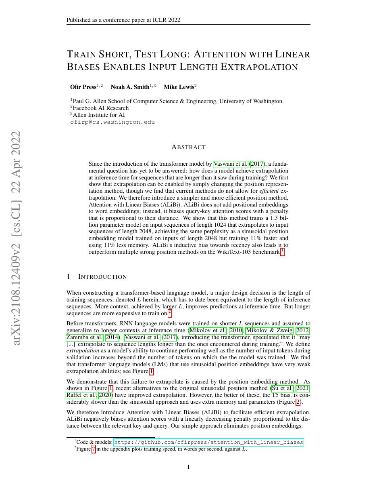
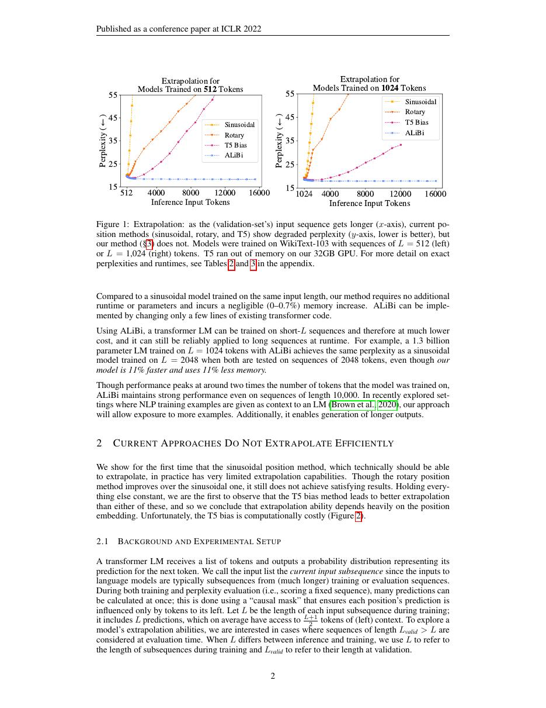
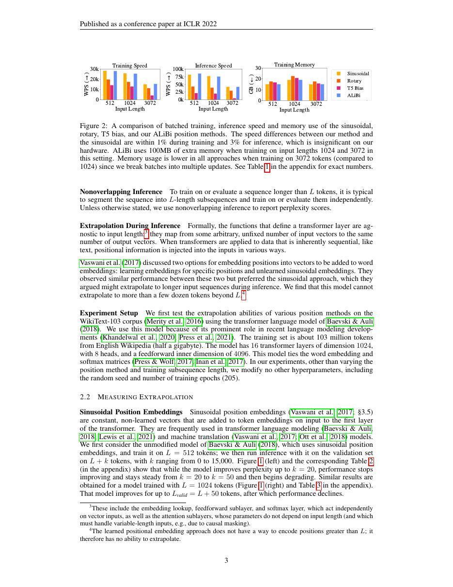
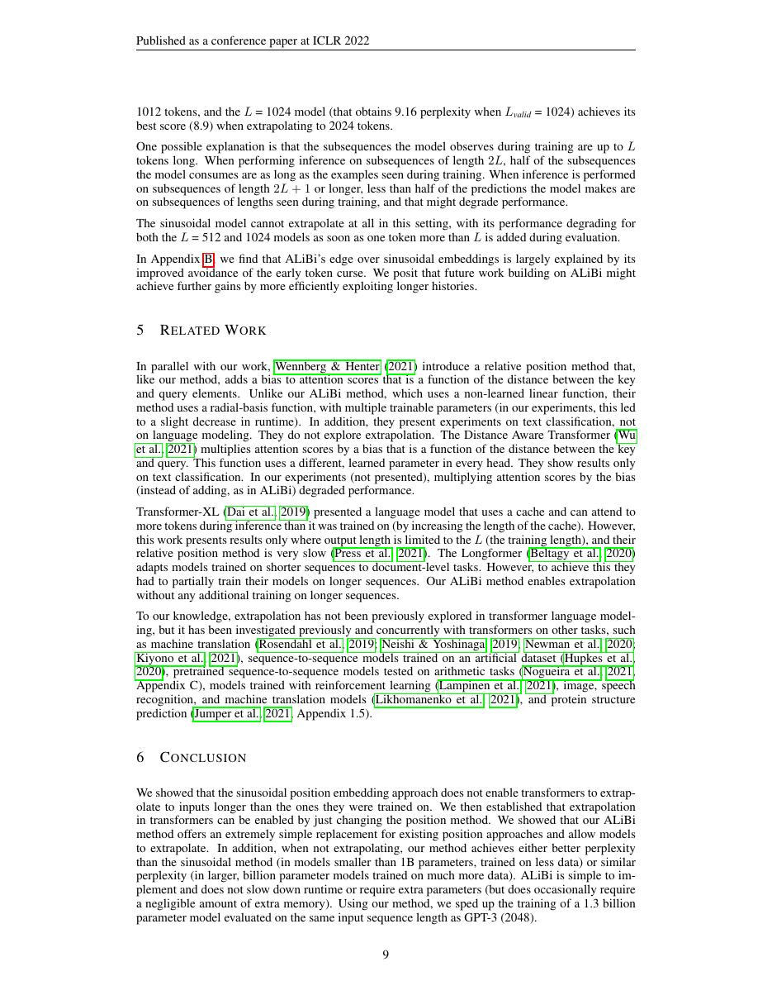

# 论文中文解读：《Train Short, Test Long: Attention with Linear Biases Enables Input Length Extrapolation》

## 一、它解决了什么

ALiBi 不添加位置向量，而是在 attention logits 中加入按距离线性衰减、各 head 斜率不同的偏置。

## 二、核心机制

对 causal attention，距离越远 bias 越负；不同 slopes 让一些 head 偏局部、另一些保留较长跨度。无需额外位置 embedding，也不改变 KV cache 表示。

## 三、为什么成为主线

它展示“位置编码”可作为 attention bias 实现，并在训练短、测试长的语言建模中提供实用外推。

## 四、证据应该怎样读

速度、显存、精度或 benchmark 数字只在论文给定的模型、数据、硬件、kernel 版本和评测预算下成立。跨论文比较前要统一训练 tokens、输入长度、batch、精度、采样/思考预算与是否使用工具。

## 五、局限与易误读点

长度外推不等于长上下文推理可靠；训练分布、任务和模型尺度改变时优势未必保持。强线性距离先验可能不适合需要远距精确召回的模式。

## 六、放进十年演进史

与 RoPE 并列看两类相对位置信号；现代模型更多采用 RoPE 及其 scaling，但 ALiBi 仍是干净基线。

## 七、原文入口

[官方论文/页面](https://arxiv.org/abs/2108.12409)

## 八、原文论证链

ALiBi 针对长度外推：模型若依赖学习的绝对位置 embedding，测试长度超过训练范围时没有见过这些位置。作者完全不向 token 表示加入位置向量，而是在 attention logits 上按 query–key 距离加入线性负偏置。不同 head 使用不同斜率，使部分头强烈偏好近邻，部分头保留较长视野。

论文在较短序列训练、较长序列评估，比较正弦、学习式位置和其他方案，以困惑度及训练效率支持外推主张。其核心优势还包括不增加位置 embedding 参数，并能用短序列训练节省计算。

> 原文定位：[PDF 文件第 1 页](paper.pdf#page=1) · [对应截图](rendered_figures/page-1.jpg)

## 九、公式与直觉

对因果 attention，head $h$ 的 logit 可写成
$$
a_{ij}^{(h)}
=\frac{q_i^\top k_j}{\sqrt d}-m_h(i-j),\qquad j\le i.
$$
softmax 后，若内容分数相同，距离每增加一步就按固定倍率衰减。斜率 $m_h$ 采用几何级数式分布，不是训练参数。由于偏置只依赖相对距离，任何新长度都可计算。

线性 bias 不代表权重本身线性；经过 softmax 后是指数式先验。内容项仍可克服距离惩罚，远处 token 并非完全不可见。

> 原文定位：[PDF 文件第 2 页](paper.pdf#page=2) · [对应截图](rendered_figures/page-2.jpg)

## 十、实验怎样读

关键实验是 train short, test long 的 perplexity 曲线，而非训练长度内单点。还应看短训练带来的时间/内存节省。外推效果取决于语料、模型规模和推理位置处理；能比绝对 embedding 稳定，不等于无限长度不退化。

> 原文定位：[PDF 文件第 3 页](paper.pdf#page=3) · [对应截图](rendered_figures/page-3.jpg)

## 十一、复现检查

- 因果距离方向必须正确，未来位置仍需独立 mask。
- head 数不是二的幂时，斜率生成规则要按原实现处理。
- 使用 KV cache 时 query 的绝对偏移要纳入距离。
- 对比外推时固定训练 token 总量，避免短序列模型看到更多 batch 而混淆结论。

## 十二、常见误读

ALiBi 不是稀疏 attention，也不降低每步读取 KV 的成本。它提供的是距离先验和外推接口；对需要精确远程检索的任务，线性惩罚可能成为不利偏置。

> 原文定位：[PDF 文件第 9 页](paper.pdf#page=9) · [对应截图](rendered_figures/page-9.jpg)

## 原文证据导航

以下页码按仓库内 PDF 的**文件页码**计，不等同于论文印刷页码。建议先读本节所指原文，再回看上面的中文解释。

- [打开原始 PDF](paper.pdf)
- [打开可检索文本](paper.txt)

| 中文笔记中的证据 | 原文位置 | 复核重点 |
|---|---|---|
| 原文首页、摘要与问题定义 | [PDF 文件第 1 页](paper.pdf#page=1) · [截图](rendered_figures/page-1.jpg) | 回到该页上下文，复核定义、图表或实验论证 |
| 核心方法、架构或算法定义所在关键页 | [PDF 文件第 2 页](paper.pdf#page=2) · [截图](rendered_figures/page-2.jpg) | 回到该页上下文，复核定义、图表或实验论证 |
| 实验、结果或关键分析所在原文页 | [PDF 文件第 3 页](paper.pdf#page=3) · [截图](rendered_figures/page-3.jpg) | 回到该页上下文，复核定义、图表或实验论证 |
| 讨论、结论或补充分析所在原文页 | [PDF 文件第 9 页](paper.pdf#page=9) · [截图](rendered_figures/page-9.jpg) | 回到该页上下文，复核定义、图表或实验论证 |
