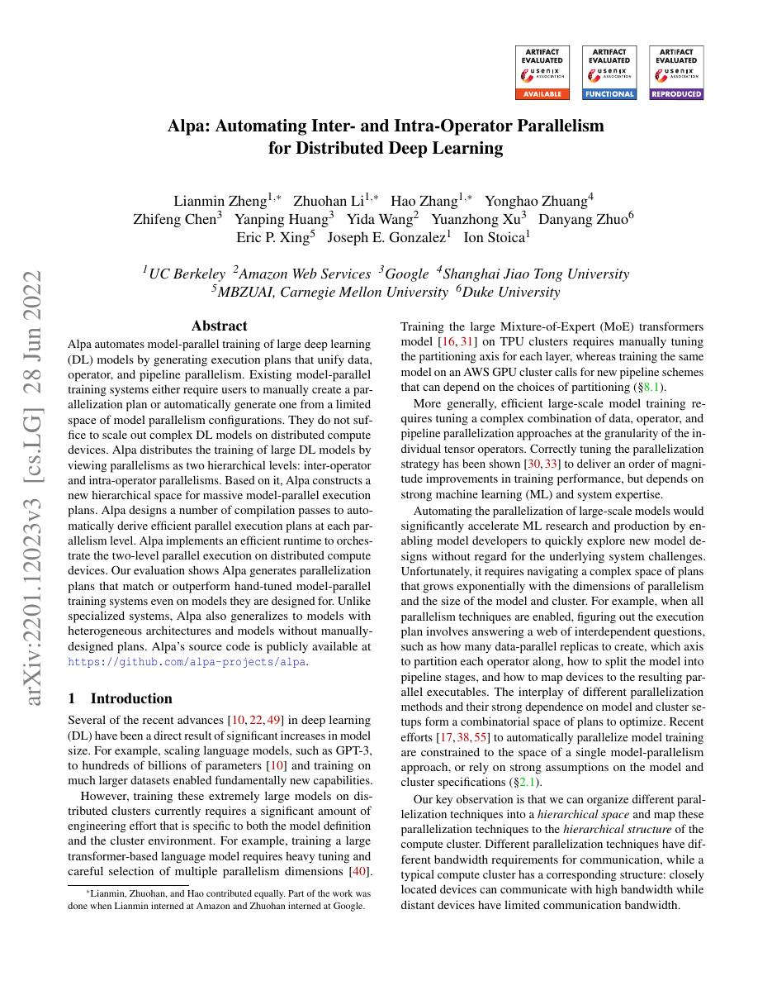
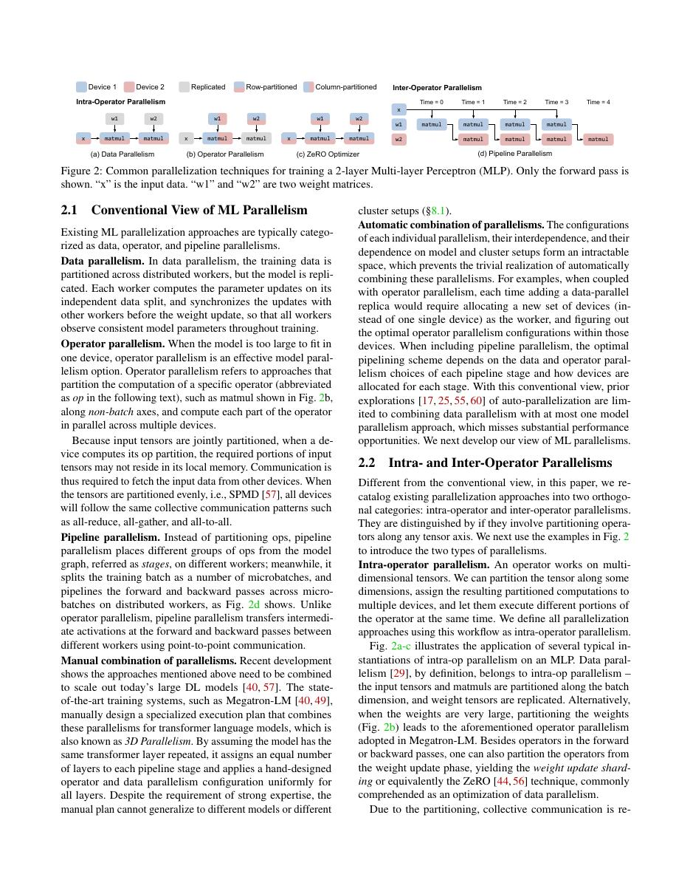
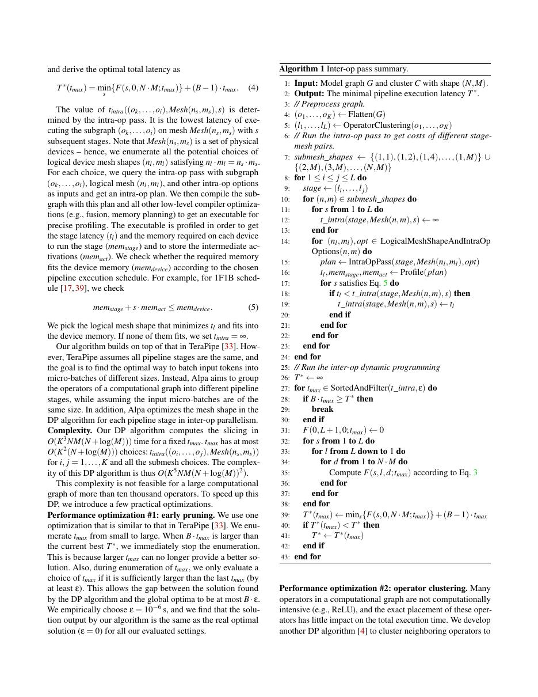
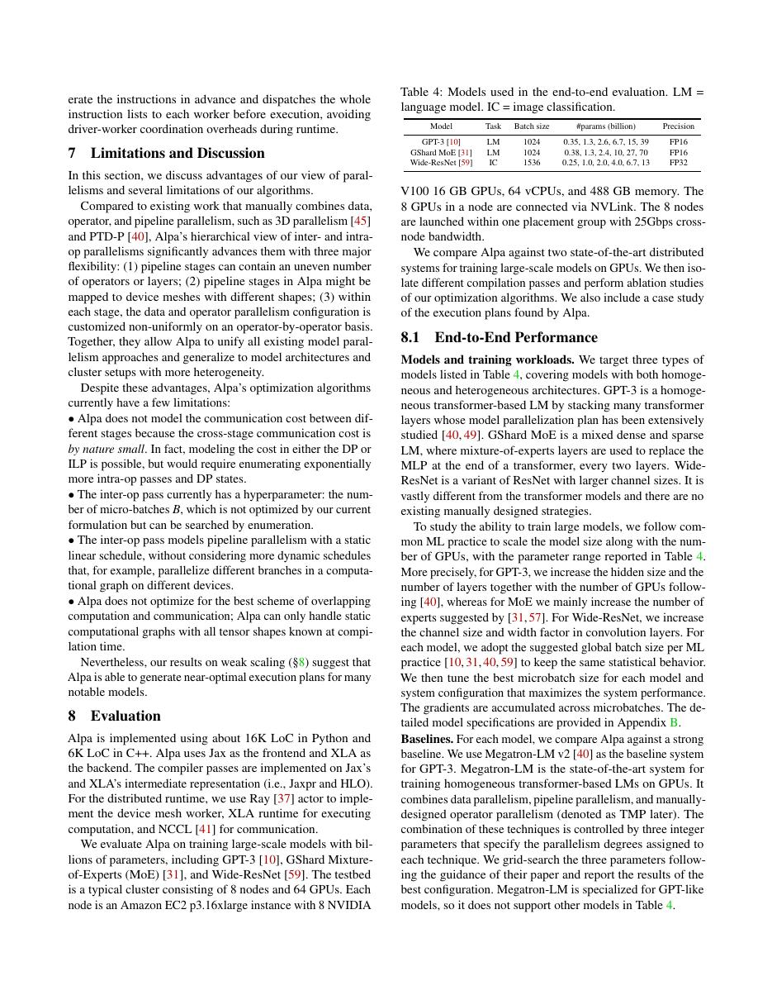

# 论文中文解读：《Alpa: Automating Inter- and Intra-Operator Parallelism for Distributed Deep Learning》

## 一、它解决了什么

Alpa 把大模型并行分成算子内 sharding 与算子间 pipeline 两级，并自动搜索组合执行计划。

## 二、核心机制

intra-op pass 用 auto-sharding 优化 tensor partition/collective；inter-op pass 把计算图切成 pipeline stages、分配 device meshes 并调度 microbatches。分层搜索避免直接枚举巨大联合空间，runtime 负责执行生成计划。

## 三、为什么成为重要节点

它把 distributed parallelism 纳入编译器优化问题，连接图划分、整数规划、拓扑成本和 pipeline scheduling。

## 四、证据怎样读

结果只在论文的数据、模型版本、硬件和评测协议下成立。闭源模型要把能力报告与可复现架构分开；系统论文要同时记录通信拓扑、编译预算和 runtime；科学模型要把预测精度与实验验证边界分开。

## 五、局限与易误读点

搜索依赖 cost model 与相对静态图，动态 workload/故障/共享网络会偏离估计；大型 plan 的编译和 profiling 成本也高。自动结果仍受允许策略空间限制。

## 六、放进十年演进史

GSPMD 提供通用 SPMD partition；Alpa增加跨 operator/pipeline 自动化；CloudMatrix/DeepSeek 展示生产系统如何加入 MoE、P/D 解耦等专用约束。

## 七、原文入口

[官方论文/页面](https://arxiv.org/abs/2201.12023)

## 八、原文论证链

Alpa 认为大模型并行有两种互相耦合的尺度：算子内并行把单个 matmul/tensor 分片到设备；算子间并行把不同 layer/stage 放到不同 device mesh 并流水执行 microbatches。直接联合枚举巨大，因此系统分层求解：先用 auto-sharding 为候选子图/mesh 找 intra-op 计划，再用 dynamic programming 等方法选择 pipeline stage、mesh 分配和执行 schedule。

> 原文定位：[PDF 文件第 1 页](paper.pdf#page=1) · [对应截图](rendered_figures/page-1.jpg)

## 九、两层优化各自处理什么

intra-op pass 为 HLO tensor 决定 sharding，并以计算与 collective cost 优化，底层可借助 GSPMD 生成 SPMD program。inter-op pass 切分 jaxpr/计算图，使 stage 计算均衡、跨 stage activation 通信较小，并选择 microbatch 数控制 pipeline bubble。

流水效率可粗略看作
$$
\eta\approx\frac{m}{m+s-1},
$$
其中 $m$ 是 microbatch 数、$s$ 是 stage 数；增加 $m$ 降低 bubble，却改变 activation 内存和优化器语义。设备 mesh 划分还要服从物理拓扑。

> 原文定位：[PDF 文件第 3 页](paper.pdf#page=3) · [对应截图](rendered_figures/page-3.jpg)

## 十、实验怎样读

论文在 Transformer、MoE 等大模型上与数据并行、Megatron/手工计划比较。应同时看可训练最大模型、吞吐、plan search/compile 时间和每设备内存。自动计划胜出只在允许策略空间和 cost model 范围内成立；熟练专家方案仍是重要 baseline。

> 原文定位：[PDF 文件第 8 页](paper.pdf#page=8) · [对应截图](rendered_figures/page-8.jpg)

## 十一、复现检查

- 保存 stage 边界、每 stage mesh、sharding、microbatch 与 schedule。
- cost model 用真实 profile 校准 collective 和 compute。
- 区分 plan 生成时间、XLA 编译时间和 steady-state 训练。
- 核对梯度累积、随机数和 optimizer update 与未切分语义一致。

## 十二、常见误读

Alpa 不是只做 pipeline，也不是 GSPMD 的替代：它在更高层搜索 inter/intra-op 组合，GSPMD 可执行其中的分片 lowering。自动化仍受动态 shape、网络抖动与搜索空间限制。

> 原文定位：[PDF 文件第 10 页](paper.pdf#page=10) · [对应截图](rendered_figures/page-10.jpg)

## 原文证据导航

以下页码按仓库内 PDF 的**文件页码**计，不等同于论文印刷页码。建议先读本节所指原文，再回看上面的中文解释。

- [打开原始 PDF](paper.pdf)
- [打开可检索文本](paper.txt)

| 中文笔记中的证据 | 原文位置 | 复核重点 |
|---|---|---|
| 原文首页、摘要与问题定义 | [PDF 文件第 1 页](paper.pdf#page=1) · [截图](rendered_figures/page-1.jpg) | 回到该页上下文，复核定义、图表或实验论证 |
| 核心架构、算法或编译方法所在关键页 | [PDF 文件第 3 页](paper.pdf#page=3) · [截图](rendered_figures/page-3.jpg) | 回到该页上下文，复核定义、图表或实验论证 |
| 实验、结果或关键分析所在原文页 | [PDF 文件第 8 页](paper.pdf#page=8) · [截图](rendered_figures/page-8.jpg) | 回到该页上下文，复核定义、图表或实验论证 |
| 讨论、结论或补充分析所在原文页 | [PDF 文件第 10 页](paper.pdf#page=10) · [截图](rendered_figures/page-10.jpg) | 回到该页上下文，复核定义、图表或实验论证 |
