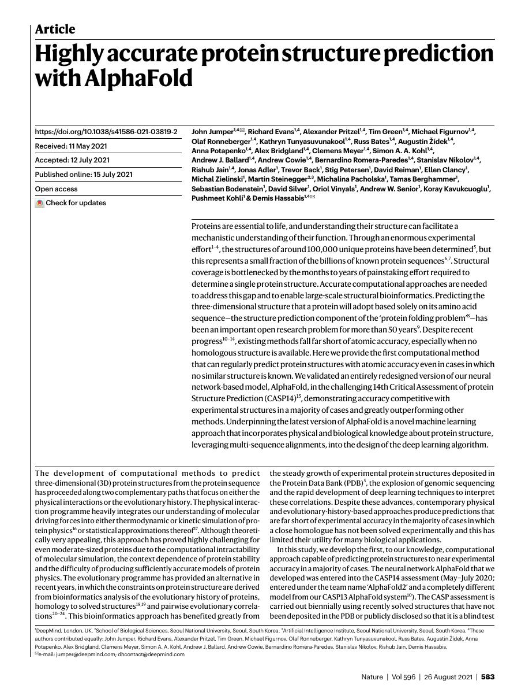
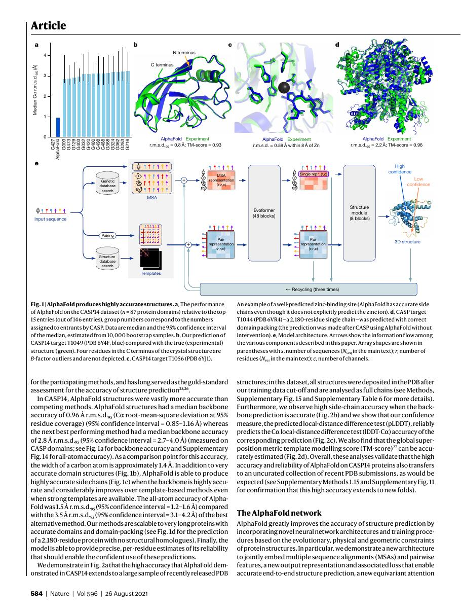
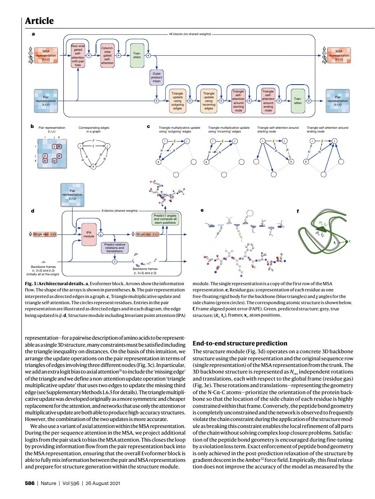
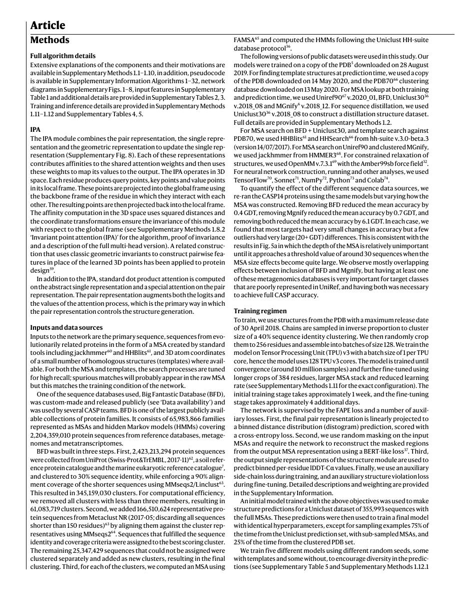

# 论文中文解读：《Highly accurate protein structure prediction with AlphaFold》

## 一、它解决了什么

AlphaFold2 用端到端神经架构联合推理多序列比对、残基对关系与三维结构，在 CASP14 将蛋白结构预测推进到许多目标接近实验精度。

## 二、核心机制

Evoformer 在 MSA representation 与 pair representation 间反复交换信息，包含三角乘法/attention 以建模残基几何一致性；Structure Module 用 invariant point attention 产生三维坐标。recycling 把预测重新送回网络迭代精化，并输出 pLDDT/PAE 等置信度。

## 三、为什么成为重要节点

它是科学 AI 的里程碑，展示 attention、等变几何、领域数据库和端到端训练可以共同解决长期结构生物学难题。

## 四、证据怎样读

结果只在论文的数据、模型版本、硬件和评测协议下成立。闭源模型要把能力报告与可复现架构分开；系统论文要同时记录通信拓扑、编译预算和 runtime；科学模型要把预测精度与实验验证边界分开。

## 五、局限与易误读点

高度依赖 MSA/template 数据与昂贵数据库搜索；预测的是静态结构及置信度，不直接给动力学、结合自由能或实验真值。低 MSA、无序区域和复合物仍有边界。

## 六、放进十年演进史

把它放在 Transformer 之后但不要当语言模型：attention 在这里服务 MSA、pair geometry 与 SE(3) 结构推理，体现架构迁移到科学领域。

## 七、原文入口

[官方论文/页面](https://doi.org/10.1038/s41586-021-03819-2)

## 八、原文论证链

AlphaFold2 把蛋白结构预测组织为端到端可微系统：从多序列比对（MSA）、模板和残基对表示出发，Evoformer 反复交换序列与 pair 信息；structure module 再用 invariant point attention 在三维中生成主链框架和原子位置；预测结构被 recycling 回网络继续精化。作者避免把距离预测、势能优化和后处理割裂成多套系统。

CASP14 的盲测结果证明在许多目标上接近实验精度，但论文也明确讨论低置信区域、孤儿蛋白、复合物和构象多样性等边界。

> 原文定位：[PDF 文件第 1 页](paper.pdf#page=1) · [对应截图](rendered_figures/page-1.jpg)

## 九、Evoformer 与几何模块

MSA 表示形状近似为“序列数 × 残基数 × 通道”，pair 表示为“残基 × 残基 × 通道”。Evoformer 的 row/column attention 在 MSA 中传播共进化信息，outer-product mean 把 MSA 更新到 pair；triangle multiplicative update/triangle attention 让 pair 表示满足几何三角关系。

structure module 为每个残基维护局部刚体 frame。IPA 的注意力分数同时使用标量特征和在三维中变换后的点距离，因此对全局旋转/平移保持适当不变性。FAPE 在局部 frame 中测量预测与真值误差，避免依赖任意全局坐标系。

> 原文定位：[PDF 文件第 2 页](paper.pdf#page=2) · [对应截图](rendered_figures/page-2.jpg)

## 十、实验怎样读

CASP14 是隐藏结构的独立评测，GDT_TS/IDDT 等比训练集随机切分更可信。pLDDT 估计逐残基局部可信度，PAE 估计残基对相对位置误差；高 pLDDT 不必然表示不同结构域相对朝向可靠。消融显示 recycling、templates/MSA、结构损失等贡献。

> 原文定位：[PDF 文件第 4 页](paper.pdf#page=4) · [对应截图](rendered_figures/page-4.jpg)

## 十一、复现检查

- 数据库版本、MSA 搜索、模板截止日期决定可复现性与泄漏风险。
- 区分模型推理、recycling、ensemble 和 Amber relaxation 的成本/作用。
- 结构比较先做正确指标与链映射，不能只看肉眼叠图。
- 置信度应随预测坐标一起交付，低置信区不可当作实验事实。

## 十二、常见误读

AlphaFold2 预测静态结构，不直接给出折叠动力学、结合自由能或所有构象。高精度也不表示实验验证不再必要；输入数据库覆盖和生物状态会限制结论。

> 原文定位：[PDF 文件第 8 页](paper.pdf#page=8) · [对应截图](rendered_figures/page-8.jpg)

## 原文证据导航

以下页码按仓库内 PDF 的**文件页码**计，不等同于论文印刷页码。建议先读本节所指原文，再回看上面的中文解释。

- [打开原始 PDF](paper.pdf)
- [打开可检索文本](paper.txt)

| 中文笔记中的证据 | 原文位置 | 复核重点 |
|---|---|---|
| 原文首页、摘要与问题定义 | [PDF 文件第 1 页](paper.pdf#page=1) · [截图](rendered_figures/page-1.jpg) | 回到该页上下文，复核定义、图表或实验论证 |
| 核心架构、算法或编译方法所在关键页 | [PDF 文件第 2 页](paper.pdf#page=2) · [截图](rendered_figures/page-2.jpg) | 回到该页上下文，复核定义、图表或实验论证 |
| 实验、结果或关键分析所在原文页 | [PDF 文件第 4 页](paper.pdf#page=4) · [截图](rendered_figures/page-4.jpg) | 回到该页上下文，复核定义、图表或实验论证 |
| 讨论、结论或补充分析所在原文页 | [PDF 文件第 8 页](paper.pdf#page=8) · [截图](rendered_figures/page-8.jpg) | 回到该页上下文，复核定义、图表或实验论证 |
