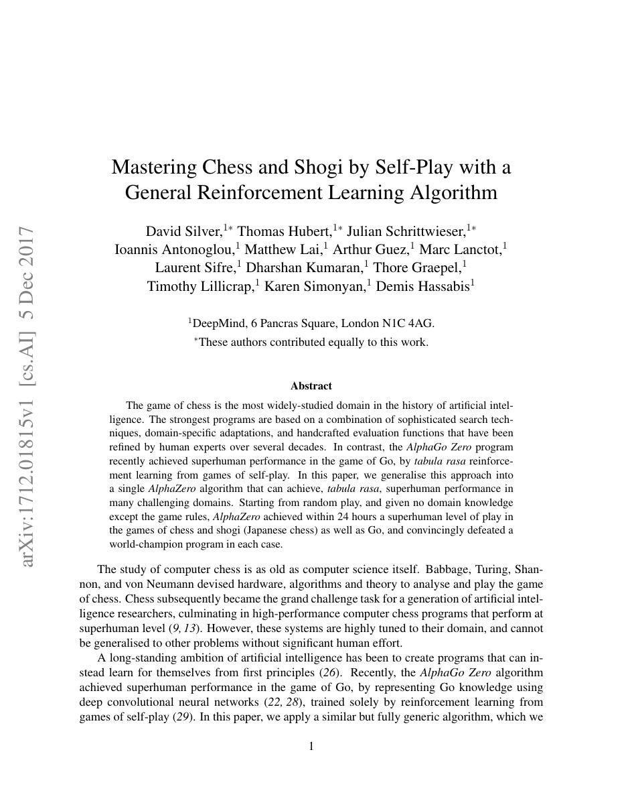
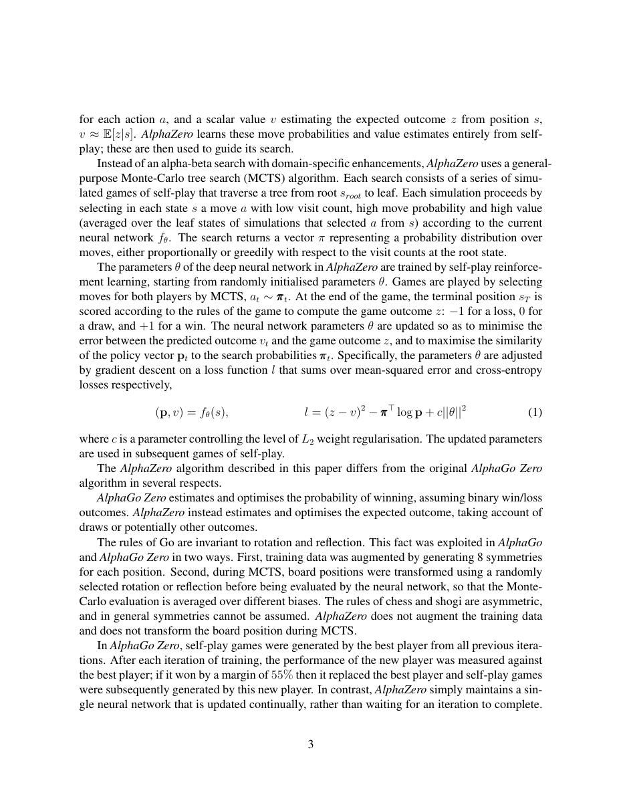
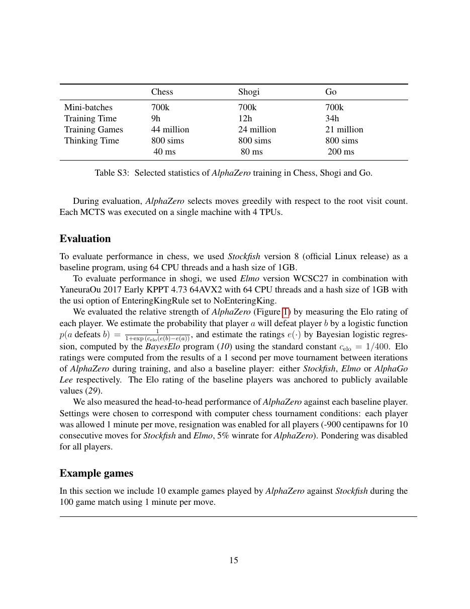
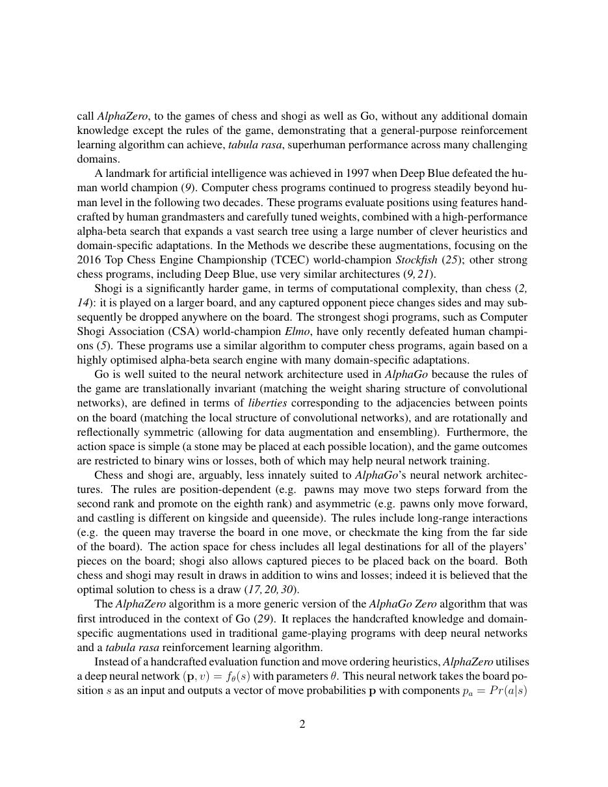

# 论文中文解读：《Mastering Chess and Shogi by Self-Play with a General Reinforcement Learning Algorithm》

## 一、它解决了什么

AlphaZero 用同一套自博弈算法学习围棋、国际象棋和将棋，不依赖人类棋谱或手写评估函数。

## 二、核心机制

神经网络同时输出 policy 与 value；MCTS 用 policy 作先验、value 替代大量随机 rollout。搜索得到的访问次数分布监督 policy，最终胜负监督 value，迭代形成 policy improvement。

## 三、为什么成为主线

它把深度网络、规划和自博弈闭环结合，影响 MuZero、博弈智能和后来的搜索增强推理。

## 四、应该怎样读证据

论文里的结果首先证明方法在当时数据、模型规模、硬件和评测协议下成立。跨年代比较时要统一参数量、训练 tokens、数据质量、上下文长度、推理预算与系统实现，不能只横比单个最佳分数。

## 五、局限与易误读点

环境规则完整、可精确模拟、奖励明确；大量自博弈计算和 MCTS 使方法难直接迁移到开放世界语言任务。论文比较还受硬件与搜索预算影响。

## 六、放进十年演进史

继续读仓库已有 MuZero：后者学习用于规划的动力学，不再要求搜索时访问真实环境规则。

## 七、原文入口

[官方论文/页面](https://arxiv.org/abs/1712.01815)

## 八、原文论证链

AlphaZero 只给游戏规则，不用人类棋谱、开局库或手工评估器，通过自我博弈学习国际象棋、将棋和围棋。神经网络给 MCTS 提供动作先验与叶节点价值；搜索访问次数形成更强策略；自我博弈生成 $(s,\pi,z)$；网络再拟合搜索策略与最终胜负。搜索与网络构成改进闭环。

> 原文定位：[PDF 文件第 1 页](paper.pdf#page=1) · [对应截图](rendered_figures/page-1.jpg)

## 九、网络目标与搜索

网络输出
$$
f_\theta(s)=(p,v).
$$
MCTS 结合先验、访问次数和平均价值选择边；根节点访问次数定义
$$
\pi_a\propto N(s,a)^{1/\tau}.
$$
训练损失为
$$
l=(z-v)^2-\pi^\top\log p+c\|\theta\|^2.
$$
价值头回归最终结果 $z$，策略头蒸馏搜索后的 $\pi$。搜索通常比一次网络前向更强，网络又让下一轮搜索更聚焦。

> 原文定位：[PDF 文件第 3 页](paper.pdf#page=3) · [对应截图](rendered_figures/page-3.jpg)

## 十、实验怎样读

Elo 曲线与对 Stockfish、Elmo、AlphaGo Zero 的比赛要连同硬件、每步搜索预算、时间控制和对手配置阅读。系统强度不等于裸网络强度，自我博弈局数也不能直接与人类棋谱样本量比较。

> 原文定位：[PDF 文件第 15 页](paper.pdf#page=15) · [对应截图](rendered_figures/page-15.jpg)

## 十一、复现检查

- 区分训练探索温度与评估选择。
- 根节点噪声、并行搜索、resign 规则会改变数据。
- 保存访问分布而不只是最终动作。
- 固定每步计算预算并给出足够对局和置信区间。

## 十二、常见误读

“zero”指不用人类棋谱和领域评估知识，不代表零搜索、零计算或零规则。系统并没有给出函数逼近下严格的策略迭代收敛证明。

> 原文定位：[PDF 文件第 2 页](paper.pdf#page=2) · [对应截图](rendered_figures/page-2.jpg)

## 原文证据导航

以下页码按仓库内 PDF 的**文件页码**计，不等同于论文印刷页码。建议先读本节所指原文，再回看上面的中文解释。

- [打开原始 PDF](paper.pdf)
- [打开可检索文本](paper.txt)

| 中文笔记中的证据 | 原文位置 | 复核重点 |
|---|---|---|
| 原文首页、摘要与问题定义 | [PDF 文件第 1 页](paper.pdf#page=1) · [截图](rendered_figures/page-1.jpg) | 回到该页上下文，复核定义、图表或实验论证 |
| 核心方法、架构或算法定义所在关键页 | [PDF 文件第 3 页](paper.pdf#page=3) · [截图](rendered_figures/page-3.jpg) | 回到该页上下文，复核定义、图表或实验论证 |
| 实验、结果或关键分析所在原文页 | [PDF 文件第 15 页](paper.pdf#page=15) · [截图](rendered_figures/page-15.jpg) | 回到该页上下文，复核定义、图表或实验论证 |
| 讨论、结论或补充分析所在原文页 | [PDF 文件第 2 页](paper.pdf#page=2) · [截图](rendered_figures/page-2.jpg) | 回到该页上下文，复核定义、图表或实验论证 |
