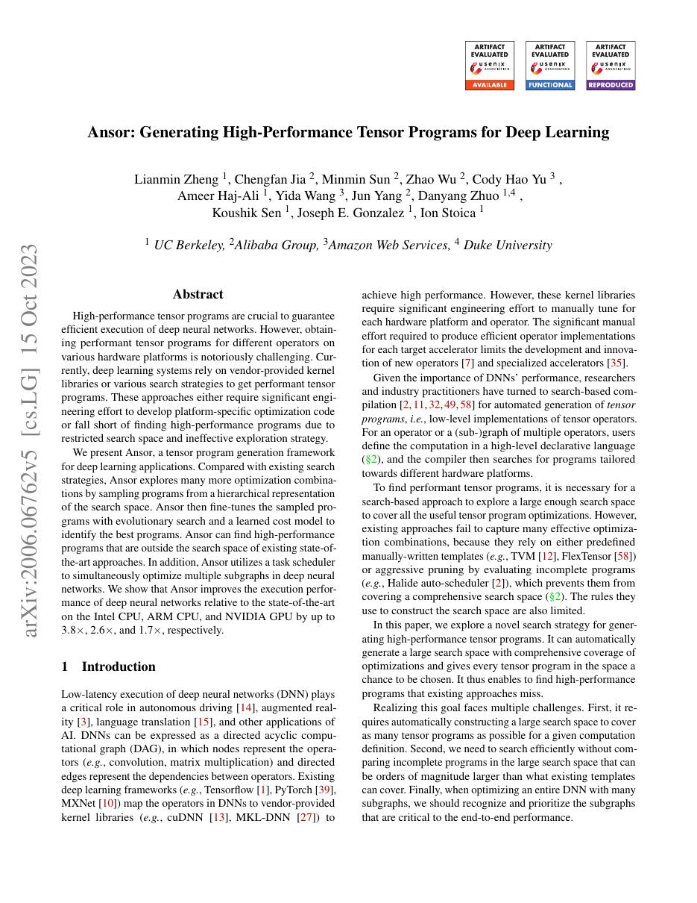
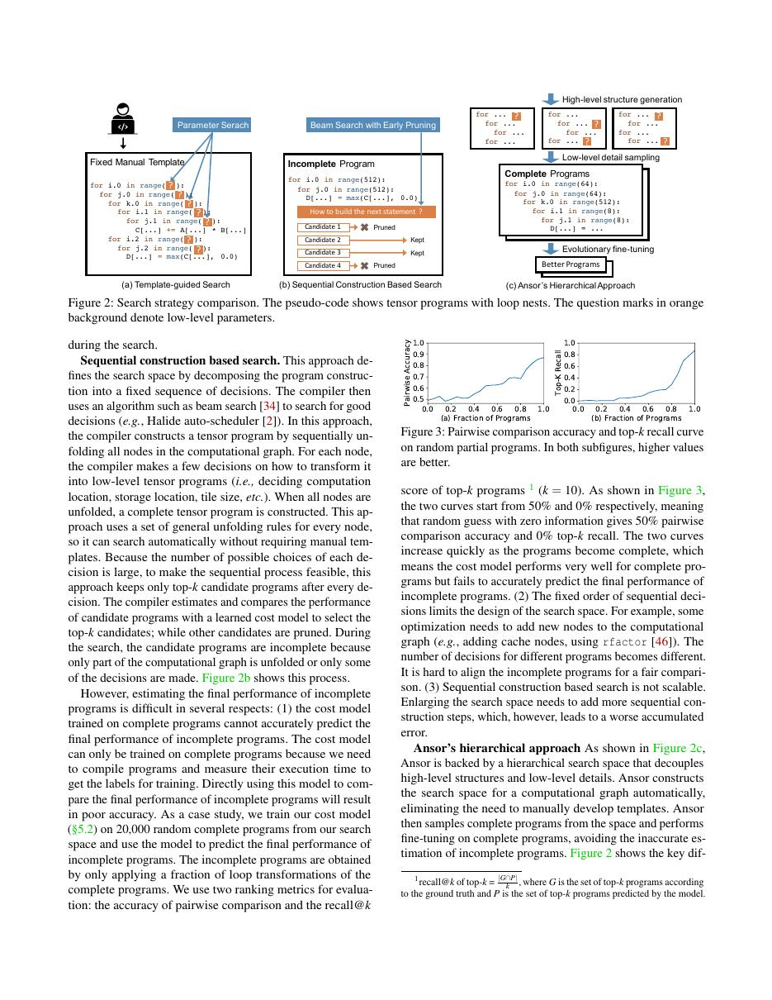
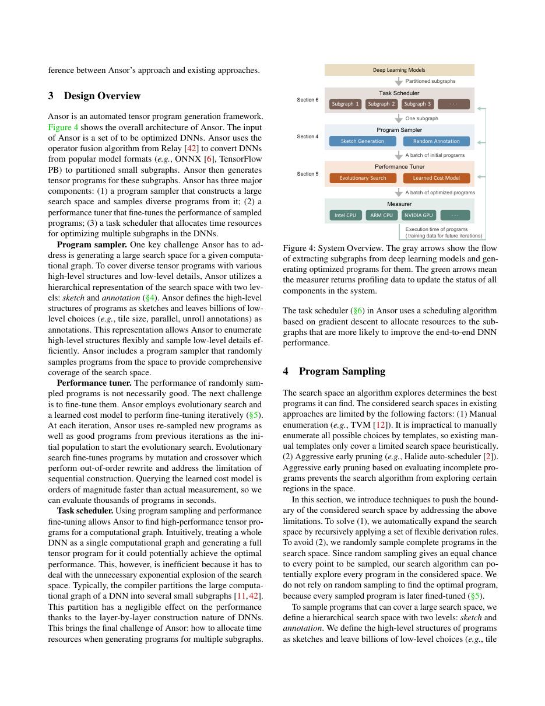
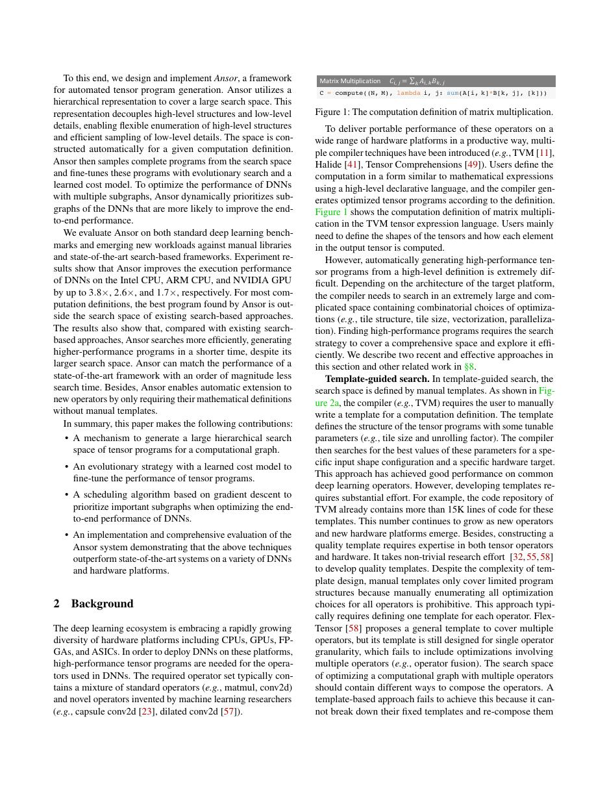

# 中文精读：《Ansor: Generating High-Performance Tensor Programs for Deep Learning》

## 一、它解决了什么

Ansor 通过自动构造大搜索空间和分层 evolutionary search，减少 AutoTVM 对人工 schedule template 的依赖。

## 二、编译抽象与优化路径

从计算 DAG 生成 schedule sketches，再随机填充细节形成程序；learned cost model 筛选候选，真实设备测量校准。task scheduler 在模型各子图间分配 tuning budget，兼顾潜在收益与不确定性。

## 三、为什么影响后续系统

它把 tensor program autotuning 从“专家先写模板”推进到更自动的搜索，并成为 TVM auto-scheduler 的代表。

## 四、怎样读性能结果

编译器结果必须同时记录 frontend、shape、batch、精度、目标硬件、vendor library、调优预算和编译时间。单算子加速不等于端到端同倍加速，首次编译延迟也不能与缓存命中后的 steady-state 混为一谈。

## 五、局限与工程边界

搜索仍昂贵且依真实测量；cost model 会受硬件、shape 和历史数据分布影响。搜索到的单 shape 程序对动态 shape/新架构未必泛化。

## 六、放进十年编译器演进史

MetaSchedule 把搜索空间写成概率程序便于扩展；TensorIR 提供更适合 tensorization 的 IR；Bolt 则回到硬件原生模板。

## 七、原文入口

[论文/官方页面](https://arxiv.org/abs/2006.06762)

## 八、原文论证链

AutoTVM 需要专家先为每类算子写 schedule template，自动化只搜索模板参数。Ansor 试图连高层 schedule structure 也自动生成：从计算 DAG 产生若干 schedule sketches，再随机/规则化填充 tile、并行、缓存等细节；学习成本模型筛候选，真实设备测量更新模型。模型级 task scheduler 决定有限测量预算分给哪些子图。

> 原文定位：[PDF 文件第 1 页](paper.pdf#page=1) · [对应截图](rendered_figures/page-1.jpg)

## 九、分层搜索为何必要

完整循环变换空间组合爆炸。sketch 先确定“是否 cache、在哪 compute_at、怎样做 reduction”等骨架，annotation 再确定具体因子。evolutionary search 对候选做 mutation；cost model 只预测相对快慢，让少量高分候选上机测量。

task scheduler 不应平均分预算：调用频繁或潜在收益大的 task 更值得调优，已收敛 task 可少测。端到端目标近似为各 task latency 乘调用次数之和。

> 原文定位：[PDF 文件第 3 页](paper.pdf#page=3) · [对应截图](rendered_figures/page-3.jpg)

## 十、实验怎样读

论文比较 Ansor、AutoTVM、vendor libraries 在 CPU/GPU 算子与模型上的性能，并报告 tuning 时间。若 Ansor 胜出，要看是否给各方法相同测量 budget，以及 baseline template 质量。自动发现新 schedule 支持减少人工模板，但搜索成本仍是真实系统成本。

> 原文定位：[PDF 文件第 4 页](paper.pdf#page=4) · [对应截图](rendered_figures/page-4.jpg)

## 十一、复现检查

- 保存 workload key、sketch、测量记录、cost-model 特征与随机 seed。
- runner 隔离编译失败、超时、设备热状态和计时噪声。
- 模型级结果必须包含 layout transform 和未调优算子。
- 新硬件/shape 上测试历史 cost model 是否迁移，而非默认可泛化。

## 十二、常见误读

Ansor 不是无先验黑盒：sketch rules 和变换合法性编码了大量编译知识。它减少手写每算子模板，并未消除搜索或真实设备测量。

> 原文定位：[PDF 文件第 2 页](paper.pdf#page=2) · [对应截图](rendered_figures/page-2.jpg)

## 原文证据导航

以下页码按仓库内 PDF 的**文件页码**计，不等同于论文印刷页码。建议先读本节所指原文，再回看上面的中文解释。

- [打开原始 PDF](paper.pdf)
- [打开可检索文本](paper.txt)

| 中文笔记中的证据 | 原文位置 | 复核重点 |
|---|---|---|
| 原文首页、摘要或官方架构概览 | [PDF 文件第 1 页](paper.pdf#page=1) · [截图](rendered_figures/page-1.jpg) | 回到该页上下文，复核定义、图表或实验论证 |
| IR、架构、搜索空间或执行模型关键页 | [PDF 文件第 3 页](paper.pdf#page=3) · [截图](rendered_figures/page-3.jpg) | 回到该页上下文，复核定义、图表或实验论证 |
| 实验、性能或设计分析所在原文页 | [PDF 文件第 4 页](paper.pdf#page=4) · [截图](rendered_figures/page-4.jpg) | 回到该页上下文，复核定义、图表或实验论证 |
| 讨论、结论或补充设计所在原文页 | [PDF 文件第 2 页](paper.pdf#page=2) · [截图](rendered_figures/page-2.jpg) | 回到该页上下文，复核定义、图表或实验论证 |
