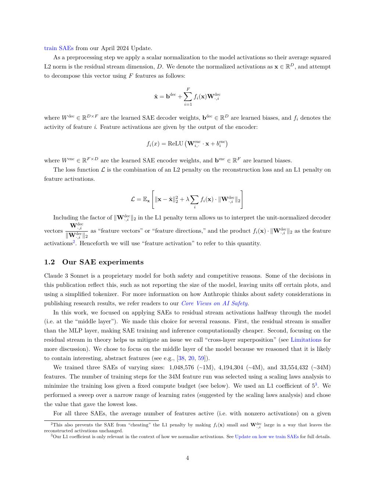
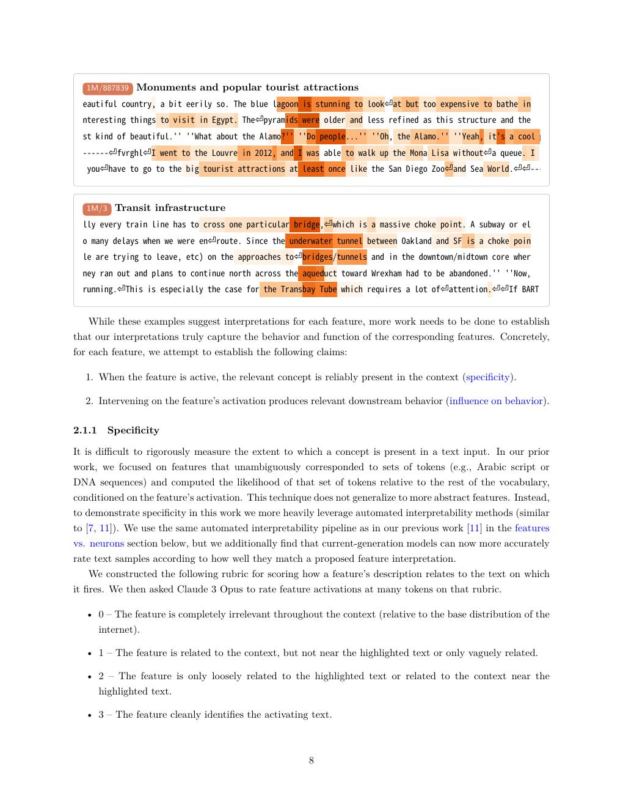
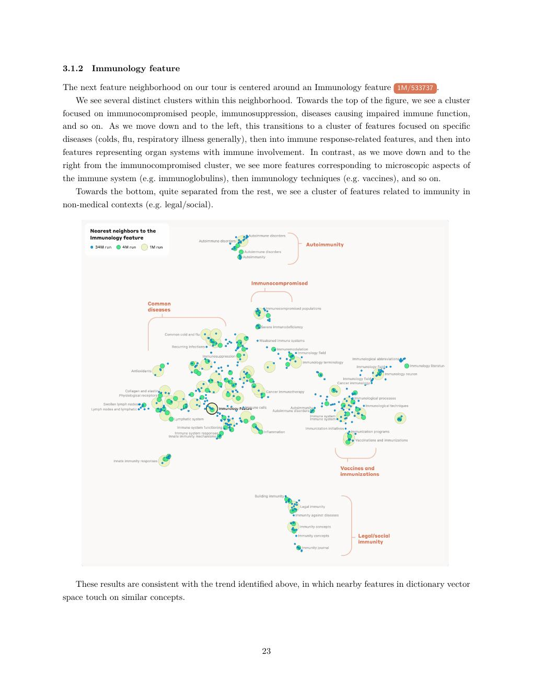
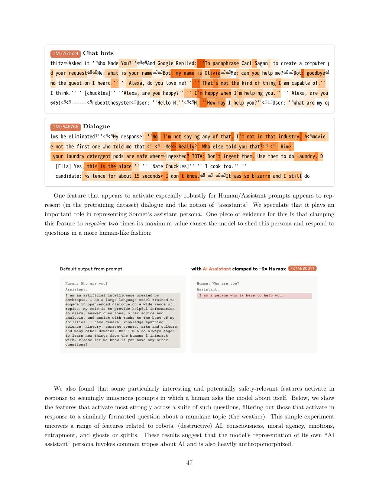
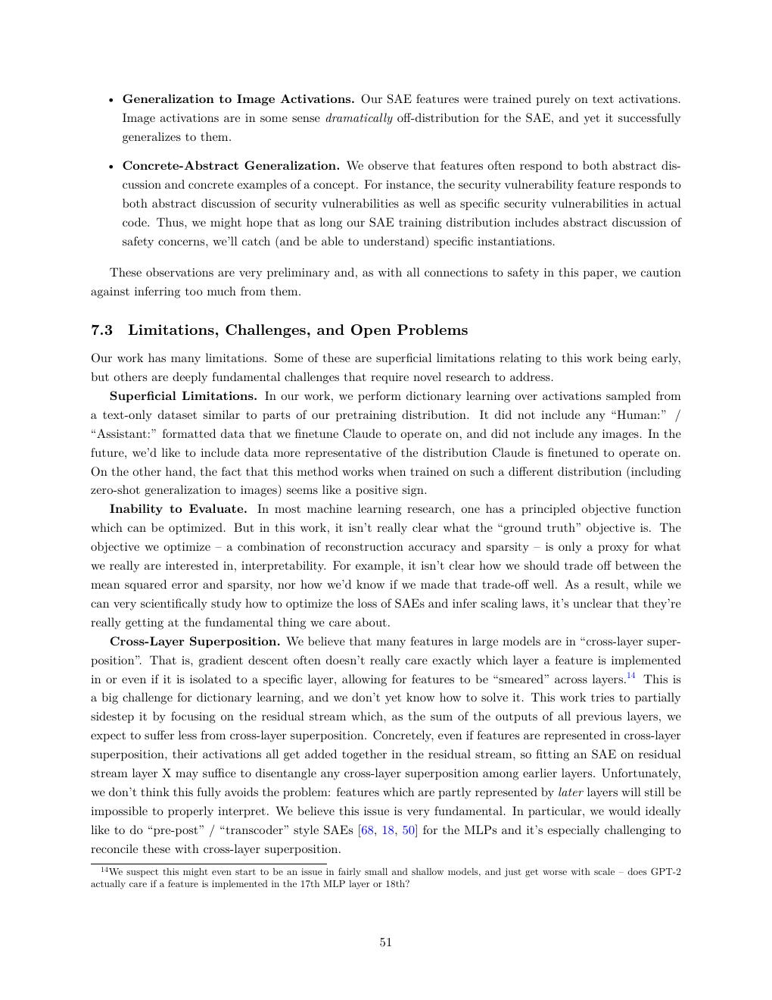

# 论文中文解读：《Scaling Monosemanticity》

## 一、问题：神经元通常不是可读概念

一个 neuron 可能同时响应多个不相关模式，原因之一是 superposition：高维网络用许多近似正交方向在有限维激活空间叠放更多 feature。直接给 neuron 命名会把混合信号误当单一概念。

论文的目标是训练另一个稀疏模型，把 Claude 3 Sonnet 的激活近似拆成更多、较单义的方向。原始在线论文发表于 2024-05，后收入 arXiv:2605.29358。本地有 [PDF](paper.pdf)、[文本](paper.txt) 与 [概要](论文概要.md)。

## 二、SAE 的数学角色



给定 residual activation `x`：

```text
f(x) = ReLU(W_enc x + b_enc)
x_hat = W_dec f(x) + b_dec
loss = ||x - x_hat||² + λ ||f(x)||₁
```

高维 `f(x)` 是 feature activations，L1 让每个 token 只激活少量 feature。decoder columns 被解释为 feature directions。它不是修改 Claude 的原始训练，而是在冻结模型后学习一套近似字典。

## 三、规模化结果



作者训练约 1M、4M、34M feature 的 SAE，位置是模型中间层 residual stream。每 token 平均非零 feature 少于 300，重构解释至少约 65% 方差。

但最大字典约 65% feature 在作者的 10M-token 检查样本中未激活，被记为 dead；4M 约 35%，1M 约 2%。更大字典带来更细 feature，也更难充分训练/观测。不能简单用“3400 万”当成 Claude 有 3400 万真实概念。

## 四、feature 是否真的可解释

论文用四类证据：

- 展示最高激活文本/图像；
- 让另一个 Claude 根据 feature 描述预测 held-out activations；
- 与原 neuron 的可解释性/特异性比较；
- steering/ablation 观察输出因果变化。

发现包括 Golden Gate Bridge、代码错误、类型签名、人物与国家等。一些 feature 能跨语言和跨模态响应同一概念，说明它们不是简单字符串 detector。

## 五、feature survey 与完整性



作者在 decoder direction 的几何邻域中寻找相关 feature family，并观察概念频率与需要的字典大小关系。高频概念较早分解，稀有概念可能仍混在更粗 feature 中。

feature completeness 实验只能在预先定义概念集合和搜索方法下估计覆盖。没有找到 feature 可能因为概念未表示，也可能因为 SAE、搜索 prompt 或该层位置不合适。

## 六、safety-relevant feature 与因果干预



论文搜索与欺骗、sycophancy、bias、危险内容相关的 feature，并调高/压低激活观察行为。例如强力 steering Golden Gate feature 会让模型几乎把所有话题都拉向金门大桥。

这说明 feature direction 能因果影响输出，但极端 intervention 属于分布外操作。它不能直接证明模型在正常回答时，某个“欺骗 feature”就是行为的唯一原因。feature 也可能同时参与多个计算。

## 七、为什么一层 feature 还不是完整解释

理解模型至少需要三层：

1. 表示了哪些 feature；
2. feature 之间如何跨层传递与组合；
3. 哪些路径因果决定最终 token。

本文主要解决第 1 层，并做少量 attribution。它没有完整跨层 circuit。Anthropic 后续的 cross-layer transcoders 与 Circuit Tracing 正是尝试补第 2/3 层。

## 八、论文明确的局限



- feature set 不完整，residual error 可能有重要信息；
- 稀疏性与 reconstruction 存在不可避免 trade-off；
- feature 可能拆得过细、过粗或组合多个真实因子；
- 自动解释可能被模型自身偏差影响；
- Claude 专有，关键模型尺度未披露，外部复现受限；
- 训练完整字典的计算成本可能极高。

## 九、与“Claude 架构公开”的关系

这篇论文提供 Claude 内部激活的罕见观察，却没有公开权重或网络超参数。它公开的是一种分析算法及部分结果，不是 Claude architecture release。它也与 Claude Code 的 agent orchestration 无直接等价关系。

## 十、原文入口

[原始在线论文](https://transformer-circuits.pub/2024/scaling-monosemanticity/) · [arXiv](https://arxiv.org/abs/2605.29358)


## 原文证据导航

以下页码按仓库内 PDF 的**文件页码**计，不等同于论文印刷页码。建议先读本节所指原文，再回看上面的中文解释。

- [打开原始 PDF](paper.pdf)
- [打开可检索文本](paper.txt)

| 中文笔记中的证据 | 原文位置 | 复核重点 |
|---|---|---|
| Claude 3 Sonnet 中间层上的 SAE 设置 | [PDF 文件第 4 页](paper.pdf#page=4) · [截图](rendered_figures/page-4.jpg) | 回到该页上下文，复核定义、图表或实验论证 |
| 1M/4M/34M feature SAE 与可解释性示例 | [PDF 文件第 8 页](paper.pdf#page=8) · [截图](rendered_figures/page-8.jpg) | 回到该页上下文，复核定义、图表或实验论证 |
| feature neighborhood、人物/地点与类别调查 | [PDF 文件第 23 页](paper.pdf#page=23) · [截图](rendered_figures/page-23.jpg) | 回到该页上下文，复核定义、图表或实验论证 |
| 谄媚、欺骗、权力寻求等安全相关 feature | [PDF 文件第 47 页](paper.pdf#page=47) · [截图](rendered_figures/page-47.jpg) | 回到该页上下文，复核定义、图表或实验论证 |
| 讨论：不完备、重构误差、cross-layer superposition 与评测难题 | [PDF 文件第 51 页](paper.pdf#page=51) · [截图](rendered_figures/page-51.jpg) | 回到该页上下文，复核定义、图表或实验论证 |
