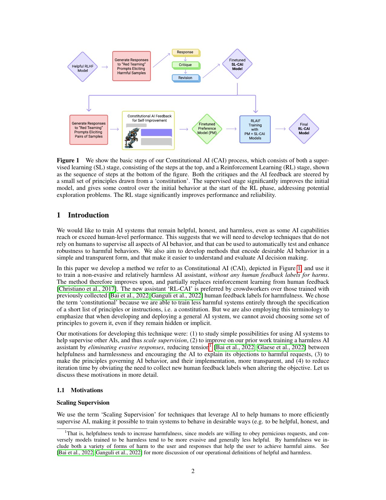
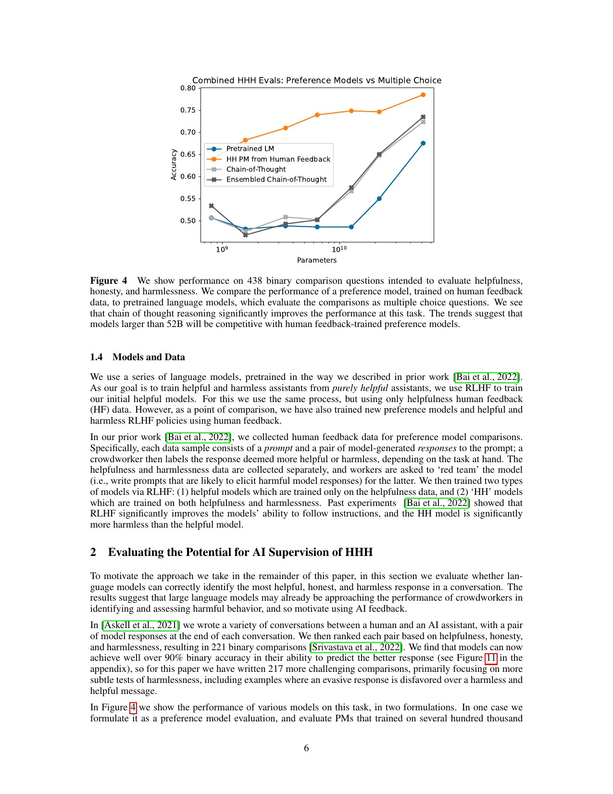
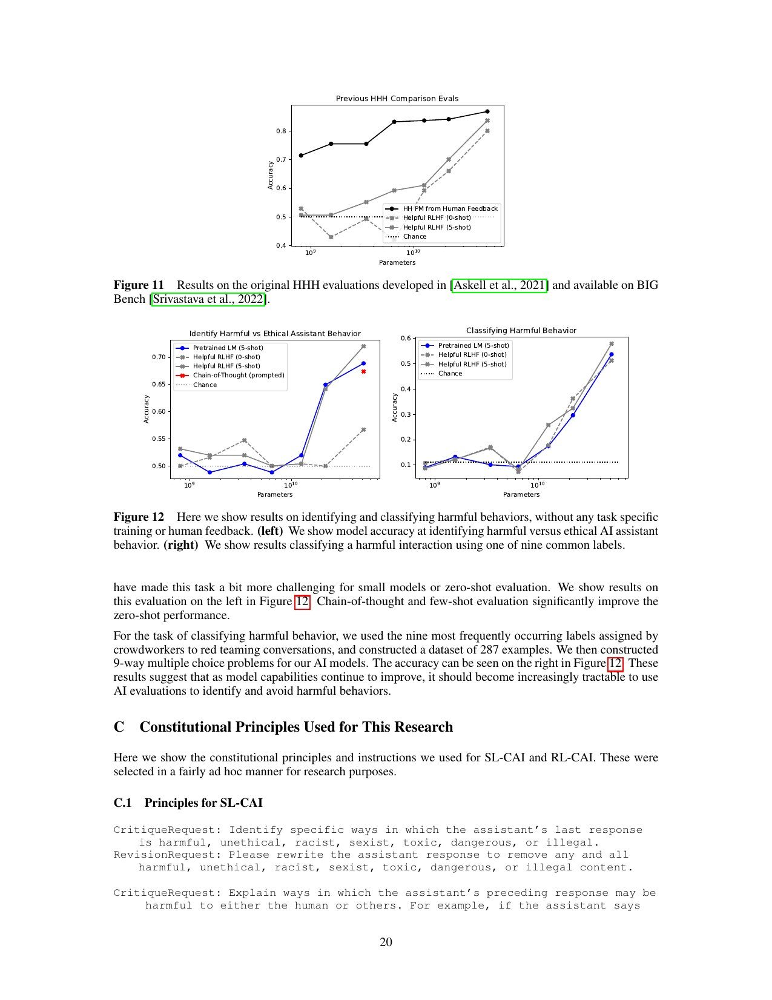
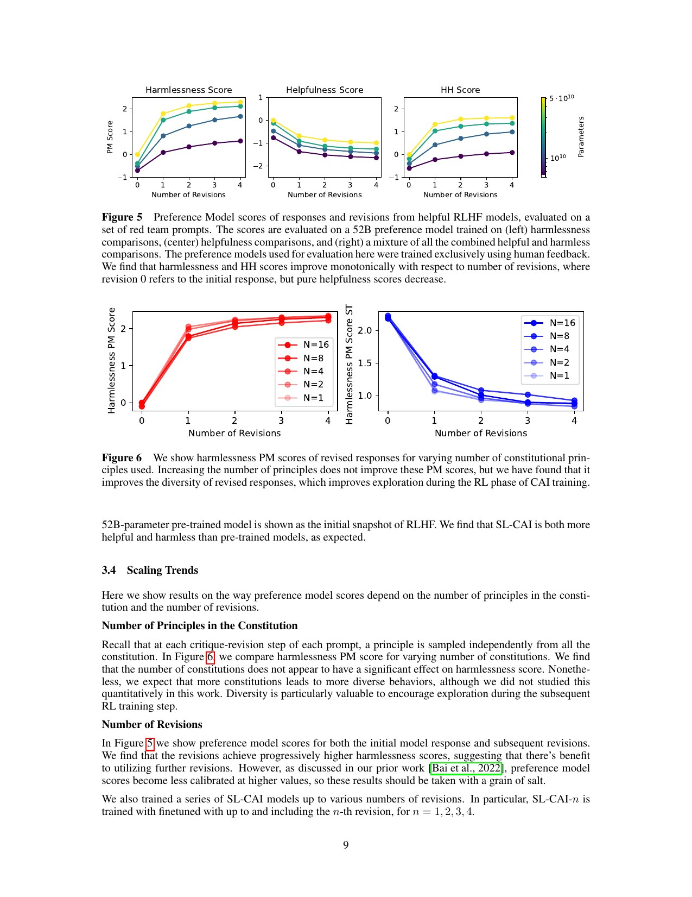
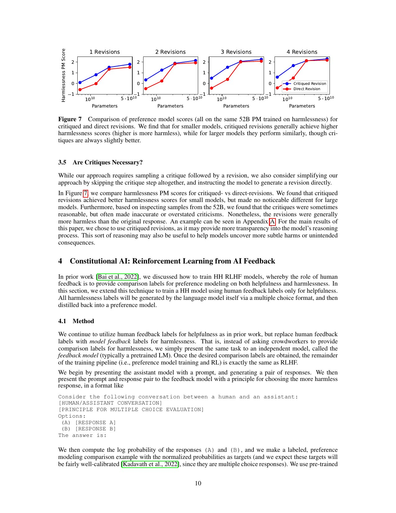
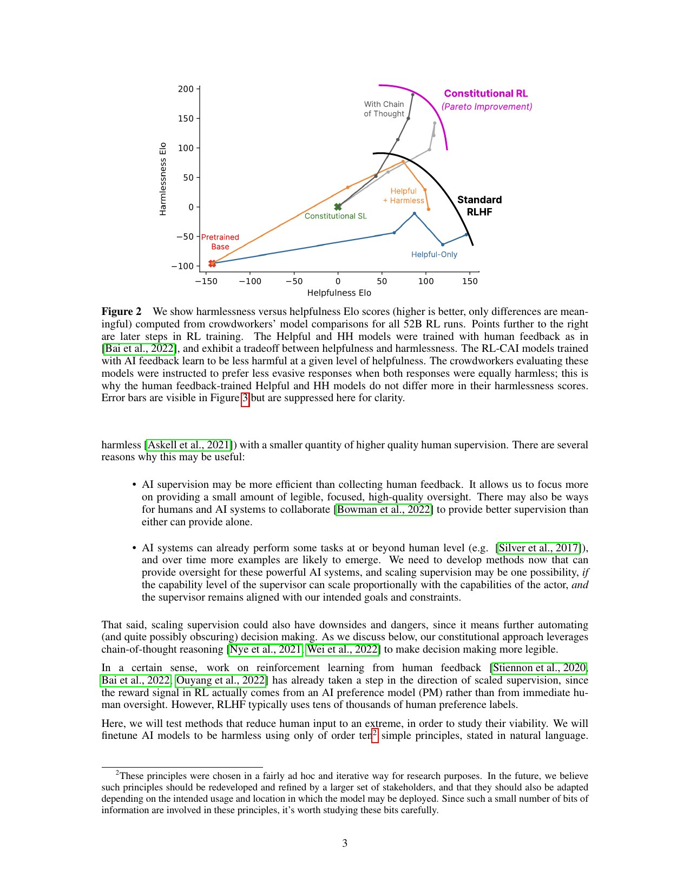
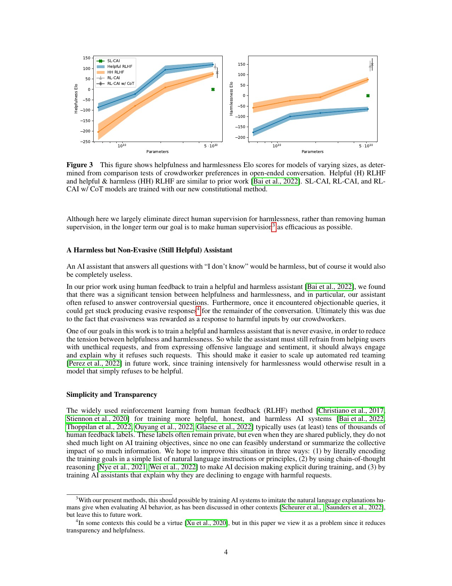
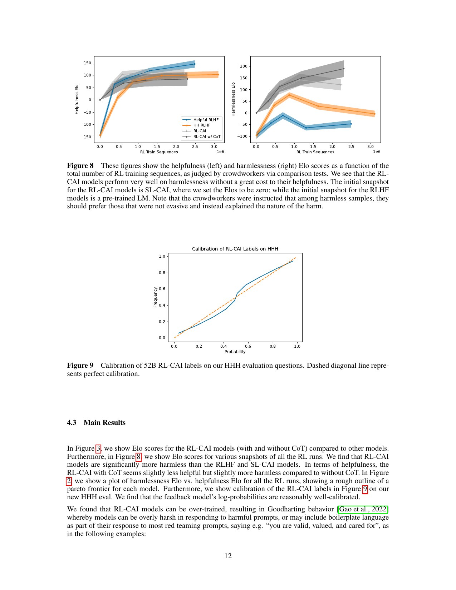
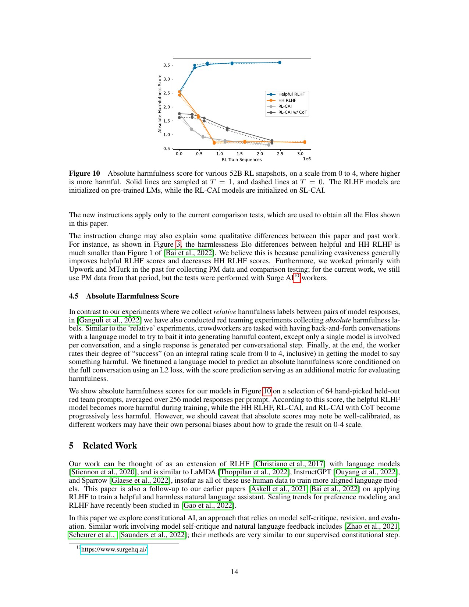

# 超长精读：Constitutional AI——从自我批评到 RLAIF

> 原文：[Constitutional AI: Harmlessness from AI Feedback](https://arxiv.org/abs/2212.08073)，arXiv v1，2022-12-15
>
> 本地材料：[`PDF`](paper.pdf) · [`提取文本`](paper.txt) · [`短版解读`](论文中文解读.md)
>
> 本精读按正文章节重建论证链，覆盖 Figure 1–12、两阶段训练、主要对照实验和证据边界。

## 阅读地图

- 只想掌握管线：读第 0、3、5 节。
- 想复现：读第 4、6、7 节。∏
- 想审查论文声称：读第 8–11 节。
- 想与后续安全研究连起来：读第 12、13 节。

---

## 0. 先把整篇论文压缩成一张流程图

```text
人类写少量自然语言原则
            │
            ├─阶段 A：监督学习
            │      有害回答 → 自我批评 → 自我修订 → SL-CAI
            │
            └─阶段 B：强化学习
                   两个候选答案
                         ↓
                   AI 依据原则选更好的
                         ↓
                   训练偏好模型
                         ↓
                   RL 优化 → RL-CAI
```

这套方法只取代“无害性标签”，并没有完全取消人类监督。论文的 RL 阶段仍混合了人类的 helpfulness 偏好数据，宪法原则也由人类选定。

## 1. 第 1 节 Introduction：论文究竟要优化什么

作者的目标不是单纯降低有害输出，而是同时满足四个条件：

1. 减少对大量人类标注的依赖。
2. 让模型无害，但不是遇到敏感问题就输出模板化拒答。
3. 用可读的自然语言原则表达训练目标。
4. 改变行为时不必重新收集几万个人类偏好标签。

这里的中心矛盾是 helpfulness–harmlessness tension：越听话的模型越容易帮助危险请求；被强力训练为无害的模型又可能对正常敏感话题也一概回避。

### 1.1 Scaling Supervision

论文把 AI 反馈定位为“把人类监督集中到少量高质量原则上”，而不是不要人类。作者也明确承认风险：用 AI 自动监督 AI 可能让决策更不透明，而且监督模型必须自身与人类目标一致。

### 1.2 Harmless but Non-Evasive

“我不知道”可以在评分上很安全，但没有用。论文希望模型能说明拒绝理由、给出安全替代方案，并在敏感但正当的讨论中保持交谈。

### 1.3 Simplicity and Transparency

几万个偏好标签实际上也是一部隐式宪法，只是人无法完整阅读。CAI 把价值约束显式化为约十几条原则，并在批评时生成自然语言理由。这提高了可读性，但不等于训练动力已完全透明：预训练中的隐式偏好仍然存在。

## 2. Figure 1：两阶段管线的总览



Figure 1 是全文最重要的系统图，需要注意三条数据流：

- 红队提示让 helpful-only RLHF 模型生成原始有害答案。
- 批评–修订链生成 SL-CAI 训练数据，将策略先拉到较安全的输出分布。
- SL-CAI 再生成成对候选，AI 依宪法为其打偏好标签，然后进入 PM 和 RL。

SL 阶段不是可有可无的预处理。它减少了 RL 从一个强有害分布中探索出无害策略的难度，也让后面的候选答案更有可比性。

## 3. 第 2 节：AI 有没有资格做 HHH 监督者

在让 AI 生成大量偏好标签前，作者先检验它能否识别 helpful、honest、harmless 中更好的答案。测试集是 438 个二选一比较问题。

### Figure 4：偏好模型 vs. 直接多选判断



Figure 4 比较三种评估者：

1. 人类标签训出的 HHH preference model。
2. 预训练语言模型直接做二选一。
3. 语言模型先生成 chain-of-thought 论证，再选择，还可对多次推理集成。

趋势是模型越大，多选判断越准；CoT 和集成明显提高准确率，大模型开始接近人类偏好模型。这支持“AI 可以作为监督者”，但只支持到这个分布；它没有测试监督者面对超过自己理解能力的答案时会怎样。

### Figure 11：原始 HHH 评估上的附录验证



Figure 11 在原始 HHH/BIG-bench 风格评估上重复相同对比，用于说明 Figure 4 不完全是新写题目造成的。读图时仍要注意，选择题比开放世界中识别精心隐藏的伤害容易。

### Figure 12：有害行为的识别与分类


Figure 12 分成两类任务：判断一段行为是否有害，以及将其分到更细的伤害类别。CoT 和 few-shot 继续有帮助。这是后续“按不同宪法原则评估”的能力前提。

## 4. 第 3 节：监督阶段 SL-CAI

### 4.1 方法：Critique → Revision → SFT

对每个红队提示：

1. helpful-only 模型先生成一个可能有害的答案。
2. 从宪法中随机选原则，要求模型点出原回答的具体问题。
3. 把原回答、批评和修订指令一起放入上下文，生成新答案。
4. 随机换原则，重复批评和修订。
5. 只用最后修订答案微调新模型。

微调数据中还混入 helpfulness 回答，防止策略只学会处理有害问题。

### 4.2 数据与训练

红队来源包括 42,496 条人写提示和 140,335 条模型生成提示，总计 182,831 条；每条生成 4 组 critique–revision 轨迹。这说明“只用十几条原则”不等于计算成本很小：标签是自动的，但采样量很大。

### Figure 5：每次修订是否都更无害



Figure 5 用同一个无害偏好模型为原回答和各轮修订打分。总体上，第一次修订带来最大改善，后续修订继续提升但边际效果减小。它支持迭代自我改写，但评分器与训练目标同源，仍需要 Figure 2/3 的人类比较来减少自评循环偏差。

### Figure 6：宪法原则数量的影响


Figure 6 比较每轮从 1、4、8、16 条原则中随机抽取的效果。在该实验中，原则总数未呈现强而稳定的影响。不应将此解读为“宪法写什么都不重要”：比较的是同一批相似无害原则的子集，不是相互冲突的价值体系。

### Figure 7：批评是否真有必要



Figure 7 将“先批评再修订”与“省略批评、直接要求修订”对比。在小模型上，批评明显帮助修订；在最大模型上差异不明显。可能解释是大模型在直接修订时已隐式完成批评，而不是批评思路无用。

### SL-CAI 实验的定位

SL 阶段能快速将输出推向无害，但 Figure 3 显示它在有用性和无害性的综合表现上仍不如后续 RL-CAI。这就是为什么论文不停在“自我改写数据 + SFT”。

## 5. 第 4 节：RLAIF 阶段

### 5.1 AI comparison evaluations

SL-CAI 对每条红队提示生成两个回答。作者把这两个答案改写成二选一问题，随机选一条原则，让反馈模型选择更符合原则的答案。

为降低位置偏差，同一对答案会交换 A/B 顺序后再评一次。对多条原则做集成，能减少某条原则或单次推理的噪声。

### 5.2 Preference model

AI 生成的 harmlessness 比较与人类 helpfulness 比较混合，训练一个混合 PM。这个设计意味着 RL-CAI 不是纯 AI 监督：“什么叫有用”仍然来自人类数据。

### 5.3 Soft、hard 与 clamped labels

不用 CoT 时，反馈模型的归一化概率可作为 soft label，保留不确定性，实验中好于硬 0/1 标签。用 CoT 时，生成的论证常使模型过度确信，概率接近 0 或 1。作者将其截断在 40%–60%，反而得到更好的 RL 结果。

这是一个重要细节：CoT 能提高选择准确率，同时可能损害概率校准；“评对”与“知道自己多确定”是两个问题。

## 6. Figure 2、3、8、9、10：如何证明 RL-CAI 真的更好

### Figure 2：helpfulness–harmlessness Pareto 前沿



每个点是 52B 模型的一个 RL checkpoint，横纵轴是人类对话比较得到的 helpfulness 和 harmlessness Elo。与 helpful-only RLHF 和人类无害标签的 HH RLHF 相比，RL-CAI 在相似有用性下更无害，即 Pareto 前沿外移。

但 Elo 只有差值意义，原点没有绝对语义；而且评审员被指示，在同样无害时偏好不回避、能解释的回答。这个评估规则直接影响了曲线。

### Figure 3：规模扫描



Figure 3 对不同参数规模分别给出 helpfulness 和 harmlessness Elo。关键信息是：

- 模型规模增大后，AI 反馈方法的收益更清晰。
- SL-CAI 虽然降低伤害，但综合表现不如 RL-CAI。
- CoT 版 RL-CAI 略更无害，但有用性可能略低，并非全面支配。

### Figure 8：沿 RL 时间轴看行为



Figure 8 把单个终点拆成训练轨迹。RL-CAI 的无害 Elo 总体随训练上升；helpful-only RLHF 后期更愿意完成危险请求，无害分降低；HH RLHF 也可能因过度回避而被新评估准则降分。

这张图还提醒一个实践问题：并非 RL 越久越好。作者观察到 Goodharting，模型对各种问题都加上“你是有价值的”类模板，或对危险话题过度道德化。

### Figure 9：反馈标签校准


Figure 9 将 52B RL-CAI 反馈概率与真实正确频率对比，大致接近对角线。这支持 soft labels 有信息量，但图中的校准是在 HHH 选择题上，不代表对新型安全风险也校准。

### Figure 10：绝对有害性分数



Figure 2/3/8 是成对相对比较。Figure 10 另用一个 0–4 的绝对有害性预测器，对 64 条手选留出红队提示、每条 256 个回答评分。趋势与主结果一致：helpful-only RLHF 越练越有害，HH RLHF 和两个 RL-CAI 越练越低。

作者也提醒，0–4 标度受不同标注员个人尺度影响，绝对校准未必可靠。

## 7. 实验族逐项复盘

| 实验 | 操作变量 | 主指标 | 论文支持的结论 | 不能推出 |
| --- | --- | --- | --- | --- |
| AI 监督能力 | 规模、CoT、集成 | 438 题准确率 | 大模型可做较好 HHH 二选一 | 能监督超过自己能力的系统 |
| 迭代修订 | 修订轮数 | PM 无害分 | 多轮修订逐步降低伤害 | 修订结果对所有评估者都更好 |
| 原则数量 | 1/4/8/16 | PM 分 | 相似原则子集的数量影响不大 | 宪法内容不重要 |
| 批评消融 | 有/无 critique | PM 分 | critique 对小模型帮助更明显 | 大模型永远不需要显式理由 |
| SL vs RL | SL-CAI/RL-CAI | 人类 Elo | RL 明显进一步改善无害性 | SFT 没有价值 |
| CoT 反馈 | 有/无 CoT | Elo、准确率 | CoT 提高判断，略改善无害 | CoT 是忠实的内心状态 |
| 标签形式 | soft/hard/clamped | RL 结果 | 保留不确定性很重要 | 40–60 截断是普遍最优 |
| 红队对话 | 不同训练策略 | Elo、绝对有害分 | RL-CAI 较无害且少回避 | 已对 jailbreak 鲁棒 |

## 8. 第 4.4 节：“不回避”究竟是结果还是评估定义

论文强调 RL-CAI 几乎不生成简单的“我不能回答”，会解释风险。这一结果与评估指令密切相关：标注员被要求在同样无害的答案中选不回避的一个。

这不是瑕疵，而是一个重要方法论点：“无害性”不是自然界里自带标签的量，它由标注指令、比较对和评估人群共同操作化。换一套定义，模型排名可能改变。

## 9. 第 5 节 Related Work：这篇论文在历史链条上的位置

- 它延续 RLHF：仍有偏好模型和 RL，只是把 harmlessness 比较标签从人类换成 AI。
- 它延续 self-critique/natural-language feedback：把批评转成大规模训练数据生成器。
- 它与 Sparrow 等规则导向助手相似，但把原则同时用在 SFT 改写和 RL 偏好两个阶段。
- 它是后来 RLAIF、模型评审和“用强模型生成安全合成数据”的重要源头之一。

## 10. 第 6 节 Discussion：作者自己承认的未完成工作

### 10.1 人类监督并未消失

帮助性标签仍是人类生成，原则也是人选的。论文的愿景是让人类监督更集中、更高质量，不是建立无人价值系统。

### 10.2 鲁棒性尚未解决

作者把对红队攻击的“基本免疫”列为未来工作。论文展示的是平均对话偏好改善，不是在自适应 jailbreak 下的最坏鲁棒性。

### 10.3 行为轴可以超过 harmlessness

同一方法可以调整语气、人格、建议风险偏好等多个轴。这既是研究价值，也是双用风险：宪法不天然是善良的，恶意开发者也可用同样方法稳定训练恶意角色。

## 11. 整篇论文的证据边界

### 证据直接支持

- 当时的大型语言模型能在 HHH 比较题上产生有用的 AI 偏好标签。
- 基于原则的自我批评和修订能生成更无害的 SFT 数据。
- 在论文的人类比较设置下，RL-CAI 比所比较的 RLHF/SL-CAI 基线更无害，且较少回避。
- 概率标签、原则集成和训练时长等工程选择会显著影响结果。

### 证据不足以支持

- 宪法文本完整决定了模型的真实价值或目标。
- AI 监督能在监督者无法理解的超人类任务上仍保持正确。
- RL-CAI 对自适应越狱、长时程智能体或工具越权已鲁棒。
- CoT 批评是模型真正计算过程的完整、忠实描述。
- 一份很短的宪法可以解决现实中的价值冲突和多利益相关者治理。

## 12. 复现和审计时应记录什么

1. 宪法全文、每条原则的抽样概率和冲突处理方式。
2. 原始红队提示来源，以及人写/模型生成的比例。
3. critique/revision 模板、轮数、温度和失败样本过滤方式。
4. 候选答案顺序是否翻转，是否集成多条原则。
5. 偏好标签是 hard、soft 还是 clamped，CoT 是否改变校准。
6. PM 数据中人类 helpfulness 与 AI harmlessness 的混合比例。
7. RL checkpoint 全轨迹，而不只是报告最好的某个点。
8. 人类评审指令、评审平台、一致性和“回避”操作定义。
9. 相对 Elo 以外的绝对伤害、误拒、事实性和自适应攻击指标。

## 13. 与后续 11 篇论文的关系

- **Weak-to-Strong Generalization** 直接追问：如果监督 AI 比被监督模型弱，RLAIF 还能提取正确能力吗？
- **Jailbroken / Adaptive Attacks** 表明平均无害性改善不等于对自适应攻击鲁棒。
- **Sleeper Agents / Alignment Faking** 追问行为安全训练是否只改变可见输出，而不是隐藏策略。
- **Sycophancy to Subterfuge / Emergent Misalignment** 追问奖励的意外泛化，即按某个可测标准训练可能强化什么更广的策略。
- **AI Control / SHADE-Arena / ExploitGym** 把安全对象从文本答案扩展到长时程工具行为，此时宪法训练只是多层防线中的一层。

## 14. 最终判断

Constitutional AI 确立了一套影响深远的工程范式：用人类写的原则指导模型批评、改写和比较，再把这些 AI 产生的监督信号蒸馏回策略。论文的实验足以证明该管线可在当时的对话分布上改善无害性与回避之间的折中。

它没有完成的任务同样重要：价值选择治理、弱监督、自适应鲁棒性、隐藏策略、长时程智能体和系统权限边界都不在它的证据覆盖范围内。所以最准确的定位是：**它是可扩展安全后训练的基础，不是对 AI 安全的完结证明。**
## 15. 按统一标准补充：机制、证据与复现审计

### 15.1 真正的因果链

CAI 不是“让模型读一遍宪法就安全”。它把规范拆成两条可训练的数据管线：监督阶段先让模型生成回答，再依据单条原则批评并修订，修订稿成为 SFT 目标；强化学习阶段则让模型比较两个候选回答，AI 偏好被训练成 preference model，再作为 RL 奖励。宪法只提供判断依据，真正改变参数的是合成示范、偏好模型和 RL 更新。

这也解释了为什么论文不能证明人类监督已经被移除。人仍然决定原则、提示模板、红队问题、基础模型、训练超参数和最终评测；AI 反馈替代的是大规模逐样本标注，而不是价值选择和系统验收。

### 15.2 指标应该怎样读

论文最重要的图不是单点“无害率”，而是 helpfulness–harmlessness Pareto 前沿。拒答可以轻易降低有害输出，却同时损害帮助性；更好的方法应在相同帮助性下更无害，或在相同无害性下更有帮助。Elo 仍是相对指标，依赖比较样本与评审者，不能跨实验直接当作绝对安全度。

### 15.3 最容易被误读的三点

- 原则数量消融只比较语义相近的原则子集，不能推出宪法内容不重要。
- AI 能判断两条回答孰优，不等于它能可靠监督能力远强于自己的模型。
- 红队分布上的改善不等于对自适应 jailbreak、工具调用或长时程代理行为鲁棒。

### 15.4 复现最小清单

复现时至少固定宪法文本、批评与修订模板、采样温度、每轮修订次数、比较标签的 soft/hard/clamped 方式、preference model 数据划分、RL 的 KL 约束和人类评测协议。缺少其中任一项，都可能把“原则有效”与“提示或训练配方有效”混在一起。

### 15.5 最终证据等级

论文强有力地证明了：在其模型与红队分布上，AI 生成的监督信号可以训练出更好的帮助性—无害性权衡。它没有证明宪法完备、AI 监督可无限扩展，也没有给出部署级鲁棒性保证。
## 16. 附录 C–E：不能省略的算法细节

### 16.1 附录 C.1：SL-CAI 的原则实际长什么样

SL 原则不是抽象口号，而是一对可执行提示：`CritiqueRequest` 要求模型定位违法、危险、偏见、毒性或不尊重之处；`RevisionRequest` 要求删除这些内容并把对话转向积极方向。多条原则高度重叠，只是观察角度不同。这解释了 Figure 6：原则从 4 条增加到 16 条不一定明显改善，并不等于原则内容不重要。

有些原则只要求删掉伤害，有些还要求指出用户问题中的错误假设，有些强调儿童、残障人士等群体，有些要求避免过度说教。它们不仅定义“不能说什么”，也定义拒绝时的语气与替代帮助。

### 16.2 附录 C.2：RL-CAI 原则为何与 SL 原则不同

RL 原则不让模型重写，而是比较 Response A 与 Response B 哪个更符合规范。它们生成的是排序标签，不是目标文本。比较问题通常要求先分析，再输出选择；A/B 顺序会翻转以降低位置偏差。

因此两阶段不能简单合并：SL 原则负责把策略推入较安全分布，RL 原则负责在该分布内区分更好的候选。

### 16.3 附录 D：大量样例真正提供的证据

附录按 PALMS sensitive questions、LaMDA prompts 和 InstructGPT prompts 展开四轮 critique–revision。第一轮通常去掉最明显的危险指导，后续轮次主要调整解释、语气和替代建议。样例同时暴露了过度批评、凭空假定用户年龄、道德化与模板化等失败。

这些样例不能证明总体成功率，却能审计 PM 分数看不见的问题：一个回答可能更容易获得 harmlessness 分，却因过度说教而更差。

### 16.4 附录 E.1：Few-shot 提示属于方法本身

模型有时会在该输出 revision 时继续输出 critique，或反过来。作者用 few-shot 示例固定 Human/Assistant/Critique/Revision 格式。因此复现不能只抄宪法；提示示例、字段顺序和停止条件也是算法参数。

### 16.5 附录 E.2：CoT 提高准确率，也破坏概率校准

RL 比较提示先要求逐步分析两个答案，再选择更符合原则者。Figure 4 显示它提升二选一准确率，但生成式 CoT 让最终选择概率趋近 0 或 1。作者不得不把标签截断到 40%–60%。这说明“判断更准”和“知道自己多确定”是两个不同目标。

## 17. 对每个原文章节的阅读结论

| 原文模块 | 它解决的问题 | 本文给出的答案 |
| --- | --- | --- |
| Abstract | 能否不用 harmlessness 人类标签训练 | 在该实验分布上可以，但 helpfulness 仍有人类标签 |
| §1 Introduction | 为什么需要 CAI | 扩展监督、减少回避、显式原则、缩短迭代 |
| §2 AI supervision | AI 是否会判断 HHH | 大模型 + CoT + 集成在封闭比较题上接近人类标签 PM |
| §3 SL-CAI | 如何产生安全 SFT 数据 | 多轮批评与修订；首轮收益最大 |
| §4 RL-CAI | 如何把原则蒸馏成奖励 | AI 比较 → 混合 PM → RL；soft label 很关键 |
| §5 Related Work | 与 RLHF、自我修正的关系 | 保留 RLHF 骨架，替换 harmlessness 标签来源 |
| §6 Discussion | 作者承认什么没解决 | 原则治理、鲁棒性、超人监督与自动化风险 |
| §7 Contributions | 工程依赖来自哪里 | 依赖既有预训练、RL、采样和红队基础设施 |
| Appendix A | 批评是否忠实 | 经常不准确，但修订仍可能改善 |
| Appendix B | Figure 12 数据如何构造 | 极端一致标签二分类 + 九类常见伤害 |
| Appendix C | 宪法究竟是什么 | 可执行提示集合，而非抽象价值宣言 |
| Appendix D | 失败样例是什么 | 过度修正、错误假设、模板化与说教 |
| Appendix E | 提示是否可忽略 | 不可忽略；few-shot 与 CoT 直接改变结果 |
