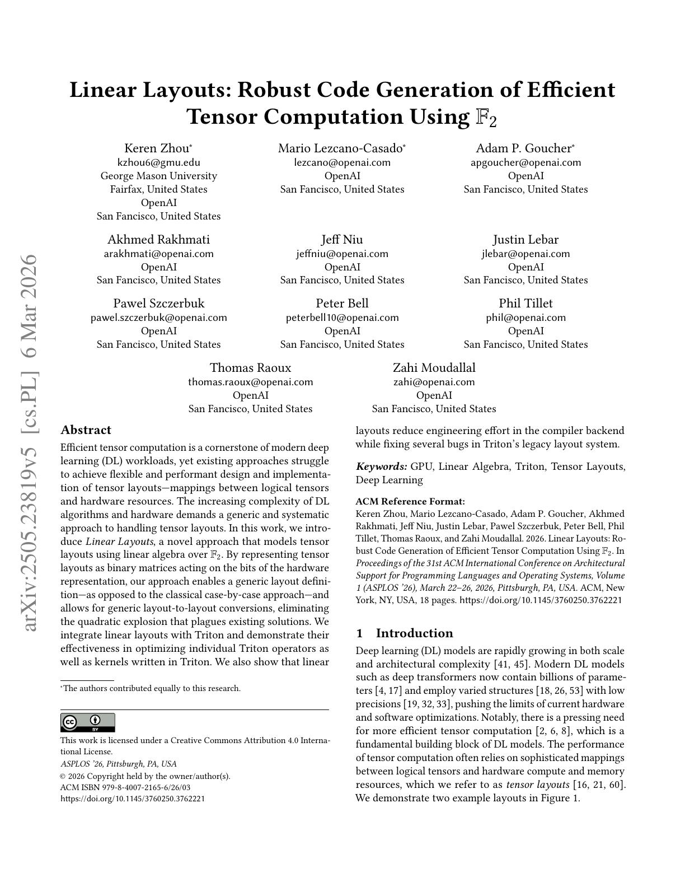
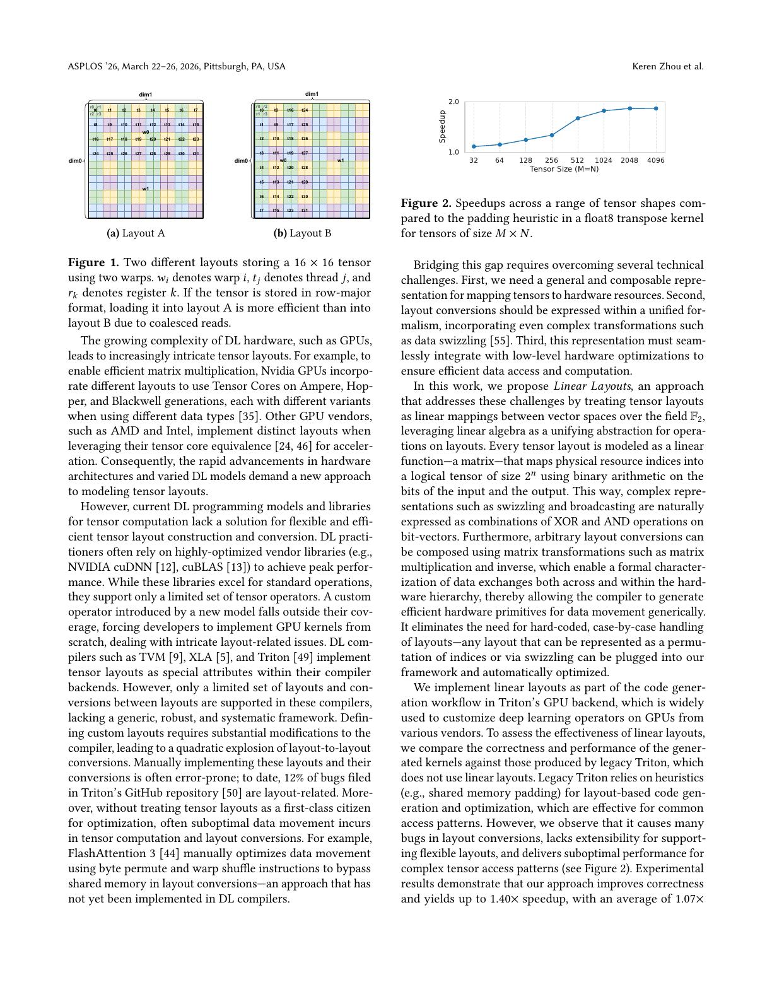
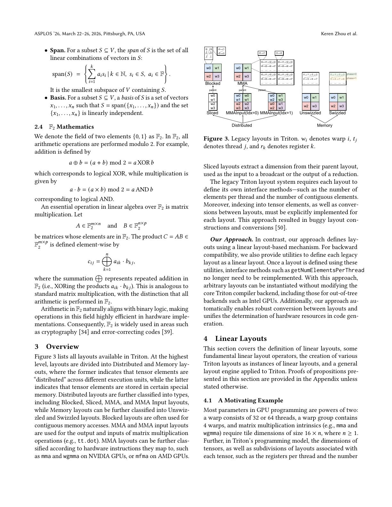
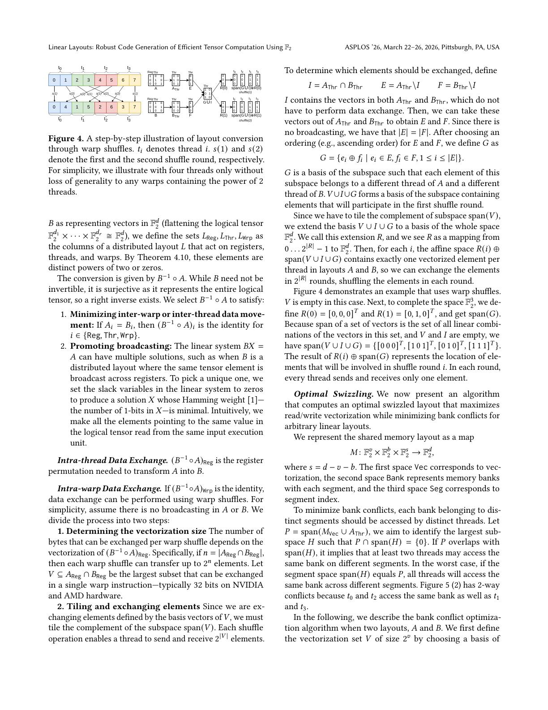
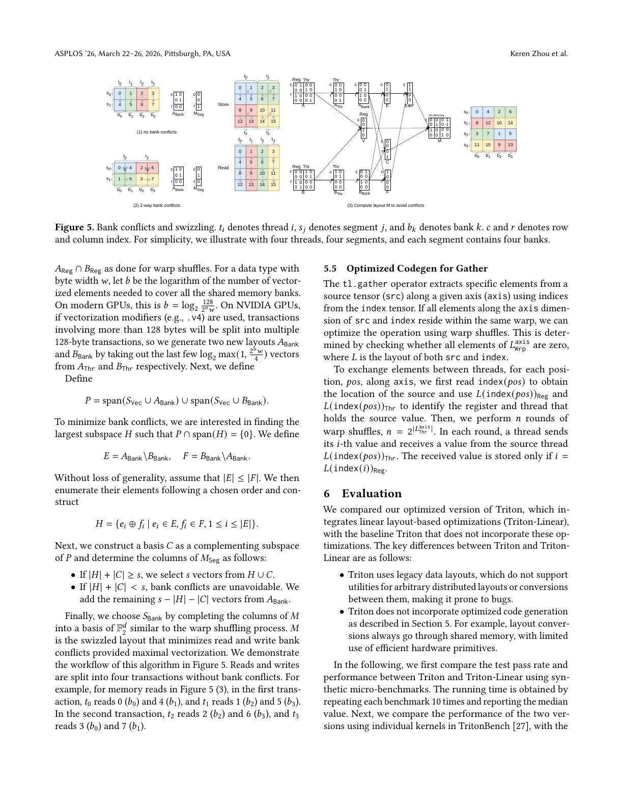
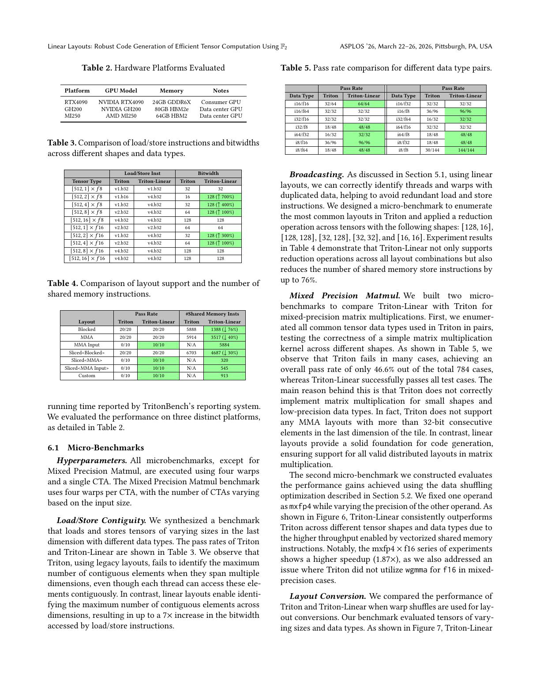
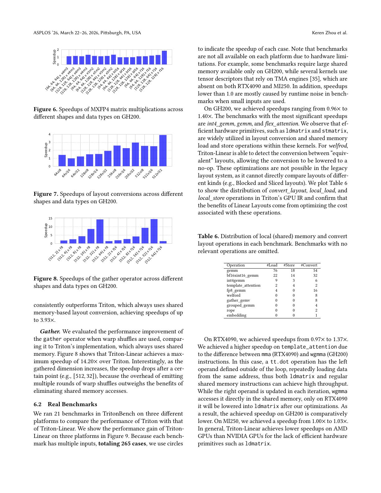
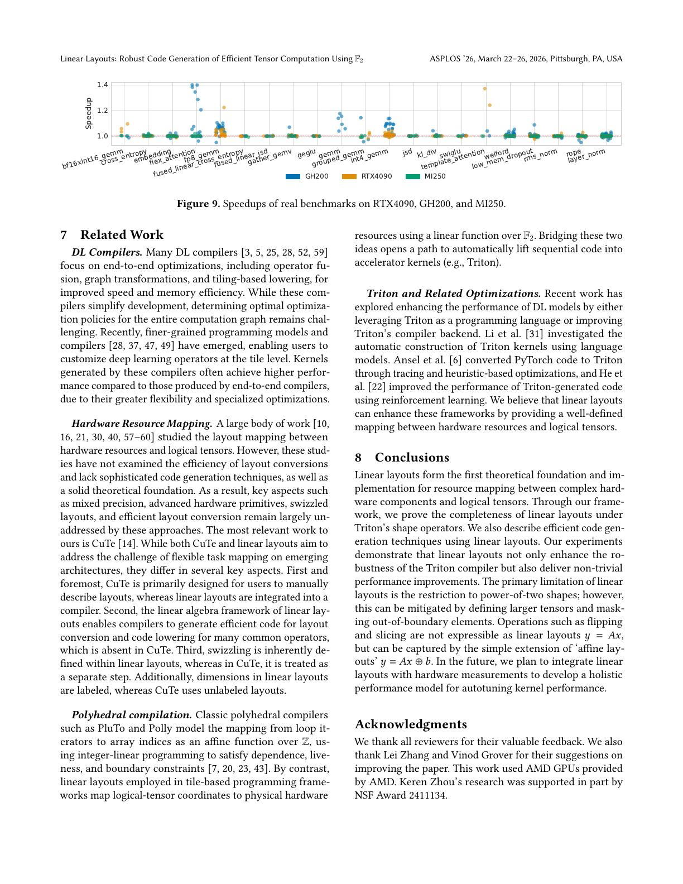

# 论文中文解读：《Linear Layouts: Robust Code Generation of Efficient Tensor Computation Using F2》

## 一、先给结论

Linear Layouts 解决的不是“用户怎样写一个 Triton kernel”，而是 Triton 后端更深的一层问题：一个逻辑 tensor 的每个元素，到底落在哪个 CTA、warp、lane、register 或 shared-memory offset 上？当两个 operator 要求不同布局时，怎样正确且低成本地搬数据？

论文把这些关系编码为有限域 GF(2) 上的线性映射：

```text
逻辑坐标 bits = A × 物理资源索引 bits
```

矩阵加法/点积中的“加”是 XOR，“乘”是 AND。这样 blocked、MMA、slice、broadcast、swizzle 和 layout conversion 不再是互不相干的特殊类，而可用 composition、product、inverse、subspace 等统一操作推导。

这项工作的主要收益依次是：语义统一、正确性和覆盖率、编译器可维护性，最后才是性能。265 个真实用例平均加速 1.07×、最高 1.40×；论文中 14.20× 来自特定 gather 微基准，不能替代端到端数字。

论文由 Keren Zhou、Mario Lezcano-Casado、Adam P. Goucher 等人完成，2025-05-28 首次上 arXiv，正式发表于 ASPLOS 2026，DOI `10.1145/3760250.3762221`，并获 ASPLOS 2026 Best Paper Honorable Mention。本地有 [PDF](paper.pdf)、[提取文本](paper.txt) 与 [概要](论文概要.md)。

## 二、先建立 tensor layout 的直觉



设有一个 `16×16` 逻辑 tensor，由两个 warp 保存。一个元素的“物理地址”不只是内存地址，也可由以下资源坐标描述：

- 它位于哪个 warp；
- warp 中哪个 thread/lane；
- 该 thread 的哪个 register；
- 若暂存在 shared memory，又对应哪个 bank/segment/offset。

layout 就是这些物理坐标与逻辑 `(row, col)` 坐标之间的映射。

同一个 tensor 可以有多种 layout。若输入在 row-major global memory 中，某种 layout 让相邻 lane 读取相邻列，就能 coalesced load；另一种 layout 若让 lane 跨大 stride 读取，会产生更多 transaction。矩阵指令又规定 operand 必须按特定 lane/register 形式排布。

所以 layout 同时影响：

- global-memory coalescing 与 vectorization；
- shared-memory bank conflict；
- MMA/WGMMA/MFMA 等 intrinsic 是否可用；
- reduction/broadcast 中哪些 lane 持有重复数据；
- operator 之间是否需要寄存器 shuffle 或 shared-memory round trip。

## 三、Figure 1–2：为什么旧办法开始失控



### 3.1 硬件 layout 越来越多

NVIDIA Ampere、Hopper、Blackwell 的 tensor core 指令有不同 operand/output layout，不同 dtype 又引入变体；AMD 和 Intel 有各自矩阵 intrinsic。Triton 还需要 blocked、sliced、MMA input/output、swizzled memory 等布局。

若每种布局用一个独立 class/attribute，再为每对源/目标手写 conversion，新增第 N 种 layout 可能要求增加 O(N) 个 pairwise 路径，总体接近 O(N²)。规则散落后，transpose、slice、broadcast 和新 dtype 很容易漏处理。

论文统计当时 Triton GitHub 已提交 bug 中约 12% 与 layout 有关。这个数字是研究快照，不应解释为当前仓库永久比例，但足以说明问题不是纯理论洁癖。

### 3.2 旧 heuristic 看得到名字，看不清语义

旧后端可能知道某值标成 `Blocked` 或 `MMA`，却难以回答：

- 两个不同种类的 layout 是否其实等价？
- 哪些 bits 对逻辑坐标没有影响，意味着 broadcast/duplicate？
- 最多可 vectorize 几个连续元素？
- 某转换能否只做 register rename？
- 能否用 warp shuffle，而不经过 shared memory？
- 怎样选择同时服务读写双方的无冲突 swizzle？

当 layout 没有统一代数语义，这些问题只能靠针对已知类型写 pattern。Linear Layouts 的目标就是把“类型名判断”变成“矩阵/子空间计算”。

## 四、为什么选择 GF(2)

GF(2) 是只有 `{0,1}` 的有限域：

```text
0 + 0 = 0
0 + 1 = 1
1 + 0 = 1
1 + 1 = 0     即 XOR

1 × 1 = 1
其余乘积 = 0  即 AND
```

GPU 的许多规模是 2 的幂：warp 有 32 或 64 个 lane，warp group 常含 4 个 warp，矩阵 tile 和每线程元素数也常按 2 的幂组织。索引可自然展开成 bits。

例如一个物理元素索引可写为：

```text
x = [reg bits | thread bits | warp bits]
```

一个二维逻辑坐标可写为：

```text
y = [column bits | row bits]
```

矩阵 `A` 的每一列说明：某个物理 bit 翻转时，哪些逻辑坐标 bit 会 XOR 翻转。因此：

```text
y = A x   over GF(2)
```

能把资源层级到 tensor 坐标的映射完整表示出来。

选择 GF(2) 不只是因为矩阵紧凑。XOR swizzle 本来就是 shared-memory 优化常用形式，broadcast 对应零列，bit permutation 对应置换列；这些操作在线性代数中有直接语义。

## 五、第 4.1 节：从一个 layout 具体构造矩阵



论文 Figure 1 的 Layout A 用：

- 2 bits 表示每线程 register；
- 5 bits 表示 warp 内 thread；
- 1 bit 表示两个 warp。

输入共有 8 bits。输出 `16×16` tensor 的 row/column 各需要 4 bits，也是 8 bits，因此 layout 可写成 `8×8` binary matrix。

论文举例：warp 0、thread 9、register 1。把这些整数按最低有效位优先拆成 bit vector，乘 layout matrix 后得到 column bits `0011` 和 row bits `0010`，即逻辑坐标 `(2,3)`。

传统描述可能写成多层“register tile + threads per warp + warps per CTA”的参数；线性描述把它们合成一张矩阵，同时保留 `Reg`、`Thr`、`Wrp` 标签。标签很重要：同一个向量空间里的 bit 在硬件成本上并不等价，跨 register、lane 与 warp 的移动成本完全不同。

## 六、第 4.2 节：基本代数构件

### 6.1 定义

论文把 Linear Layout 定义为 GF(2) 上两个带标签向量空间之间的线性映射。例如：

```text
L : Reg × Thr × Wrp → Dim0 × Dim1
```

### 6.2 Composition

若 `L1: U→V`，`L2: V→W`，则：

```text
L2 ∘ L1 : U → W
matrix(L2 ∘ L1) = M2 M1
```

可用来先重排物理 bits，再映射到 tensor；也可表示 shape operation 或 layout conversion 的连续作用。

### 6.3 Product

两个独立布局的 product 是 block-diagonal matrix。它可把 register、thread、warp 的局部映射逐层组合成完整 layout，也可把独立 tensor 维度拼接。

### 6.4 Left division

若大 layout 的矩阵包含一个已知 block，可“除掉”该 block，识别剩余映射。论文把它用于判断 layout 是否能分解出某个硬件 intrinsic 需要的小 tile，例如 `ldmatrix`。

### 6.5 Right inverse

从物理资源到逻辑 tensor 的 distributed layout 通常要求 surjective：每个逻辑元素至少有物理承载者，但 broadcast 时多个物理位置可指向同一元素，所以未必 injective。

对 surjective `L`，可求 right inverse，把逻辑坐标映回某个物理位置。解可能不唯一；论文通过 GF(2) Gaussian elimination 和额外选择原则，偏向更少移动、更少 Hamming weight 的解。

## 七、第 4.3 节：“完备性”到底指什么

论文证明 Triton 原有主要 layout 家族都可表达成 linear layout：

- Blocked layout；
- NVIDIA `mma`/`wgmma` 与 AMD/Intel 对应的 MMA input/output；
- reduction 后的 Sliced layout；
- unswizzled 与 MMA swizzled memory layout。

随后给出更精确分类。

### 7.1 Distributed layout

论文定义的 Triton distributed layout 是：

- 从 `Reg × Thr × Wrp` 到逻辑 tensor 的 surjective linear map；
- 矩阵每列最多一个非零 bit；
- 非零列不重复。

直观上，它类似可插入零列的 permutation matrix。零列表示某个物理资源 bit 改变时逻辑坐标不变，即出现 replicated/broadcast 数据。

### 7.2 Memory layout

Memory layout 从 offset bits 映射到逻辑 tensor，需要 invertible。论文所涵盖的列含一个或两个非零 bit：单个非零 bit 表示普通排列，两个非零 bit 可表达 XOR swizzle。

### 7.3 不要把“完备”扩大

论文的完备性是相对于规定的 Triton distributed/memory layout 家族与 shape operators，并不是“任何整数 shape、任何非线性索引都能用 `Ax` 表示”。最明显限制是各维 2 的幂；最后一节也明确承认 flipping、某些 slicing/offset 需要仿射扩展 `y = Ax ⊕ b`。

## 八、第 4.4 节：Layout Engine 与 shape closure

Triton 的 shape operation 包括：

- `tt.trans`；
- `tt.reshape`；
- `tt.join` / `tt.split`；
- `tt.expand_dims`；
- `tt.broadcast`。

论文证明，对定义的 distributed layout 家族，这些操作具有前向/后向 closure：给定输入 layout，可以找到同一家族中的输出 layout，使 shape operation 在物理分布上成为 no-op；反向也类似。

这带来一个重要优化：transpose 不一定需要搬数据。它可能只需改变“哪些输出 bits 叫 row、哪些叫 column”的解释。旧系统若无法表达 transpose 后的 MMA layout，只能插入不必要的 conversion。

Layout Engine 大致做：

1. 给 global load/store 与 `mma/wgmma` 等 operation 设 anchor layout；
2. 沿 use chain 前向传播候选 layout；
3. 多输入冲突时用 heuristic 选择；
4. 插入必要 conversion；
5. 反向 rematerialize 廉价 operation，尝试消除 conversion。

线性代数没有自动解决全局最优布局选择问题；它提供统一表示和合法变换，heuristic/cost model 仍负责“选哪个更快”。

## 九、第 5.1 节：两个看似简单、旧系统却易错的问题

### 9.1 连续元素与 vectorization

旧 heuristic 常把 fastest-varying dimension 当作连续维。若 shape 是 `[128,1]`，最后一维大小为 1，它可能错误地认为无法跨前一维 vectorize。

Linear Layouts 直接检查 inverse layout 中，register bits 有多大连续前缀按 identity 映射到逻辑连续 bits。问题从“枚举布局类型”变成“检查矩阵列”。

微基准中，某些 `f8`/`f16` 形状的 load/store bitwidth 从 16/32 bits 提到 128 bits，最高是 7× bitwidth，而不是所有 kernel 都 7× latency speedup。

### 9.2 Broadcast duplication

若 tensor 小于物理 tile，多个 register/thread/warp 可能保存同一逻辑元素。reduction 时必须知道哪些副本是重复的，否则会重复累加或做多余 shared-memory store。

在线性矩阵里，某个 `Thr` 或 `Wrp` 输入列为零，表示改变该 bit 不改变逻辑坐标；重复者可直接从 kernel/null space 结构识别。论文的 broadcast 微基准因此支持旧系统失败的 sliced MMA 等组合，并最多减少 76% shared-memory store 指令。

## 十、混合精度矩阵乘

混合精度会让两个 operand 的打包、连续 bits 和矩阵 intrinsic 所需 layout 不一致。例如低比特元素可能在 register/shared memory 中以更宽 transaction 打包。

旧 Triton 对大量小 shape/低精度组合缺支持，尤其连续维超过既定 MMA 规则时。Linear Layouts 可：

- 代数化判断当前 layout 是否包含 intrinsic 所需 tile；
- 用 shape operations 做 pre-shuffle；
- 统一生成 vectorized shared-memory 读写；
- 把输出 layout 继续传播到后续 operation。

784 个 mixed-precision matmul case 中：

- Legacy Triton 通过约 46.6%；
- Triton-Linear 通过 100%。

这是 correctness/coverage 结果，不能与速度直接混同。性能微基准中 `mxfp4 × f16` 最高约 1.87×，一部分还来自修复旧实现没有使用 `wgmma` 的问题。

## 十一、第 5.3–5.4 节：Layout conversion 怎样分层降低



设源 layout 为 `A`，目标为 `B`。概念上的转换是：

```text
C = B⁻¹ ∘ A
```

因为 `B` 可有 broadcast，right inverse 不唯一。论文选择转换时优先：

1. 若 `A`、`B` 在 Reg/Thr/Wrp 的部分相同，让对应转换保持 identity，减少跨层移动；
2. 多个物理位置持有同值时，选择 Hamming weight 较小的解，尽量从统一来源读取。

然后按硬件层级决定数据交换：

```text
同一 thread 内     → register permutation / reinterpretation
同一 warp 跨 lane  → warp shuffle
跨 warp/更一般情况 → shared memory + synchronization
```

旧系统常把 layout conversion 一律经 shared memory。Linear Layouts 能证明何时 warp bits 保持不变，从而生成 shuffle；若两个 layout 实质等价，甚至把 conversion 降成 no-op。

### 11.1 自动生成 warp shuffle

算法先找源/目标 register subspace 的交集，决定每次 shuffle 可向量搬多少元素；再对补空间选基，分轮交换。目标是每轮每个 thread 只发送/接收一个向量化单元，并用尽可共享 register bits。

layout-conversion 微基准在 GH200 上最高 3.93×。这是 shared-memory round trip 被 warp shuffle 替代的理想场景，收益随 shape/dtype 变化。

### 11.2 Shared-memory swizzle



必须经 shared memory 时，仍要同时满足两个目标：

- 尽量做宽 vector read/write；
- 同一 transaction 中不同 thread 尽量落到不同 bank，避免 conflict。

论文把 memory layout 标记为 `Vec × Bank × Seg → TensorDims`。它从源/目标 thread mappings 和 vectorization subspace 出发，寻找与冲突空间交集最小的 segment subspace，再补成完整基，构造 XOR swizzle。

这比固定 padding heuristic 更通用：swizzle 同时为读方和写方服务，并可对任意可表示 distributed layout 求解。

## 十二、第 5.5 节：Gather 为什么能出现 14.20×

若 gather 的被索引轴完全位于同一个 warp，源元素所在 thread/register 可由 linear layout 直接求出。编译器可以按 index 用 warp shuffle 从对应 lane 取值，而不必把整个 tile 写进 shared memory再读出。

特定 GH200 微基准最高 14.20×。随 gathered dimension 增长，多轮 shuffle 的开销上升，收益会回落。

因此正确口径是：Linear Layouts 让编译器自动发现一个此前 legacy 后端没有使用的寄存器通信路径；14.20× 是这一特定路径相对“总走 shared memory”的局部上限，不是 Triton-Linear 的总体加速。

## 十三、第 6 节：实验设计



平台：

| 平台 | GPU | 显存 | 角色 |
|---|---|---|---|
| RTX 4090 | NVIDIA RTX 4090 | 24 GB GDDR6X | 消费级 NVIDIA |
| GH200 | NVIDIA GH200 | 80 GB HBM2e | 数据中心 NVIDIA |
| MI250 | AMD MI250 | 64 GB HBM2 | 数据中心 AMD |

微基准通常用 4 warps、1 CTA；mixed-precision matmul 的 CTA 数随输入变化。每项重复 10 次，报告 median。

对照是 legacy Triton 与集成 linear-layout optimizations 的 Triton-Linear。因为后者不仅替换表示，还包含新的 shuffle/swizzle/gather/codegen 优化，所以性能差不能完全归因于数据结构本身。

## 十四、第 6.1 节：微基准逐项阅读

### 14.1 Load/store contiguity

Table 3 报告的是 generated instruction 与访问 bitwidth。最突出案例：`[512,2]×f8` 从 `v1.b16` 的 16-bit 提到 `v4.b32` 的 128-bit，标成 700% increase。

这是访问宽度增加 7 倍（从 16 到 128），不等于 kernel time 加速 7 倍。实际延迟还受 transaction、occupancy、其他计算和缓存影响。

### 14.2 Broadcasting/reduction

Triton-Linear 在 Blocked、MMA、MMA Input、Sliced 与 Custom 等布局组合上全部通过。Legacy Triton 对一些 MMA Input/Sliced/Custom 组合为 0/10。

在双方都通过的布局上，shared-memory 指令最多下降 76%；新增通过的 case 则更主要体现覆盖率。

### 14.3 Mixed precision



Table 5 将不同 integer/floating dtype 配对展开。旧系统的总体通过率 46.6%，新系统 100%。速度图中一些组合约 1.87×，但既包含 vectorized shared-memory 优化，也包含选择正确硬件 intrinsic 的修复。

### 14.4 Layout conversion

warp shuffle 路径最高 3.93×，说明 shared memory 并非 layout conversion 的必经之路。收益最大的 shape 通常是数据完全在 warp 内、shuffle 轮数少且 shared-memory overhead 相对高的情况。

### 14.5 Gather

最高 14.20×，随轴长度增大后回落。这个趋势反而增强结果可信度：算法不是凭空“总加速”，而是在 shuffle 成本超过 shared memory 后自然失去优势。

## 十五、第 6.2 节：真实 benchmark 才是总体结论



作者从 TritonBench 选 21 个 kernel，每个有多个输入，总计 265 个 case。包括 GEMM、attention、Welford、gather/GEMV、RoPE、normalization 等。

整体摘要数字：

- 平均 1.07×；
- 最高 1.40×。

分平台范围：

- GH200：0.96–1.40×；
- RTX 4090：0.97–1.37×；
- MI250：1.00–1.03×。

GH200 上 `int4_gemm`、`gemm`、`flex_attention` 等受益于 `ldmatrix/stmatrix` 和 layout conversion 优化；Welford 的某些 conversion 被识别为等价 layout，降成 no-op。

AMD MI250 收益明显较小。论文解释为缺少与 NVIDIA `ldmatrix` 类似的高效原语。这个结果说明统一表示具有跨平台正确性价值，但性能优化仍受到 ISA/backend 能力约束，不能自动实现完全 performance portability。

个别低于 1 的结果约 0.96/0.97，论文认为主要是小输入运行噪声。由于只重复 10 次报 median，最好还应提供误差条/显著性分析来支撑这个判断。

## 十六、怎样正确理解三类数字

| 数字 | 含义 | 不能推出 |
|---|---|---|
| 784 case：46.6% → 100% | mixed-precision 功能/测试覆盖 | 所有 matmul 都更快一倍 |
| 微基准最高 14.20× | gather 特定 shape 用 shuffle 替代 shared memory | 真实模型普遍 14× |
| 265 case 平均 1.07×、最高 1.40× | 所选真实 kernel 输入的总体性能 | 任意 GPU/任意 Triton 程序都至少不退化 |

论文真正强的证据是三者互补：形式统一带来更多合法 case；局部机制微基准解释为何能快；真实 benchmark 则约束整体收益幅度。

## 十七、局限与开放问题

### 17.1 2 的幂

Linear Layouts 依赖 bit-vector，tensor/layout extent 主要要求 2 的幂。论文建议把非 2 的幂扩大到更大 tile，再用 mask 去掉越界元素。这样可保语义，但会浪费 register、lane 或 memory transaction，尤其是离下一个 2 的幂很远时。

### 17.2 线性而非任意仿射/非线性映射

`y=Ax` 不含常量项。flip 或带 offset 的 slice 可用 `y=Ax⊕b` 扩成 affine layout，但不是论文当前核心实现。更一般的 modulo、非 2 幂或数据依赖 index 也不属于线性 layout 本身。

### 17.3 表示能力不等于 cost model

代数能列出正确 layout 和 conversion，不自动知道哪个最快。占用率、寄存器压力、指令 latency、cache、pipeline 与跨 CTA 行为仍需硬件模型或 autotuning。论文未来工作也提出结合测量建立整体性能模型。

### 17.4 对照包含多项同时变化

Triton-Linear 同时引入新表示和多种 codegen 优化。若要严格归因，应分别消融：只替换表示、开启 vectorization、开启 shuffle、开启 swizzle、开启 gather lowering 等。论文现有结果更像“完整重构包”对 legacy。

### 17.5 真实 kernel 数量有限

21 个 kernel、265 个输入比纯微基准强，但不足以覆盖所有 attention、MoE、scan、persistent kernel 与新硬件。平均值也可能受多输入重复权重影响，应查看按 kernel 和按 case 两种聚合。

### 17.6 平台优化不均衡

MI250 只有 1.00–1.03×，显示算法对 NVIDIA shuffle/矩阵加载原语利用更成熟。统一 IR 是支持多厂商的必要条件，但不是充分条件。

## 十八、与 CuTe 和 polyhedral layout 的差异

论文把 CuTe 视为最接近工作之一：

- CuTe 主要让用户手工描述 layout；Linear Layouts 集成在编译器中，由 engine 传播/转换；
- Linear Layouts 的 GF(2) 框架直接支持转换、lowering 和 XOR swizzle 推理；
- layout 维度带 `Reg/Thr/Wrp/Dim` 标签，而非只靠无标签坐标结构。

与经典 polyhedral compiler 相比，后者通常在整数域上用仿射映射表达 loop iteration 到数组 index；Linear Layouts 关注的是 bit-level 资源到 tensor 坐标映射，尤其适合 XOR swizzle 与 2 的幂硬件结构。两者解决层级不同，不是简单替代关系。

## 十九、这篇论文对 Triton 用户有什么影响

普通用户不一定直接写 GF(2) 矩阵。它更像 backend 基础设施，理想效果是：

- 更多合法 shape/dtype/layout 能编译正确；
- transpose/broadcast 等操作少插无谓 conversion；
- 编译器自动使用 vector load、shuffle、swizzle 和 intrinsic；
- 新 GPU layout 接入时少写成对转换规则。

对 compiler 开发者，矩阵本身则成为调试接口。遇到错误时可以问：

- 哪个输入 bit 映射到哪个逻辑 bit？
- 哪些列为零，造成 replication？
- 源/目标 subspace 的交集是什么？
- conversion 在 Reg/Thr/Wrp 哪一层首次不同？
- 是否存在 right inverse，选择了哪组 free variables？

这些问题比“Blocked 转 MMA 的某个 case 为什么坏了”更局部、更可验证。

## 二十、与前三篇论文的时间线关系

```text
2019 Triton
  定义 tile-level 抽象，把线程映射交给编译器
        ↓
2024 PyTorch 2
  上层编译器大规模自动生成 Triton kernel
        ↓
2025 TritonBench
  测量人类/LLM 写对、跑快 Triton 的现实难度
        ↓
2025/2026 Linear Layouts
  重构 Triton 后端最复杂的 tile→hardware 映射语义
```

Triton 2019 把 layout 决策交给 backend，Linear Layouts 则是在硬件复杂度增长后，为这一承诺补上系统化数学基础。

## 二十一、最终评价

Linear Layouts 是一篇典型的编译器基础设施论文：平均 7% 的真实性能提升不如微基准最高值吸睛，但 100% mixed-precision case 通过率、shape closure、统一 conversion 和删除特殊规则才是更持久的贡献。

它也诚实暴露了抽象的边界：2 的幂、线性映射、仍需 heuristic/cost model，以及不同硬件原语造成的平台收益差异。最准确的概括不是“用线性代数让 Triton 快 40%”，而是“用 GF(2) 给 Triton layout 一个可组合、可证明、可生成高效数据移动的共同语言，并在此基础上获得温和但真实的整体加速”。

## 二十二、原文与关联阅读

- [arXiv 摘要页](https://arxiv.org/abs/2505.23819)
- [arXiv PDF](https://arxiv.org/pdf/2505.23819)
- [ASPLOS 2026 论文奖项页](https://www.asplos-conference.org/asplos2026/awards/)
- [ASPLOS 2026 正式日程](https://www.asplos-conference.org/asplos2026/program/index.html)
- [本目录 Triton 时间线](../Triton论文阅读索引.md)
- 上一篇：[TritonBench 中文解读](../arxiv_2502.14752/论文中文解读.md)
