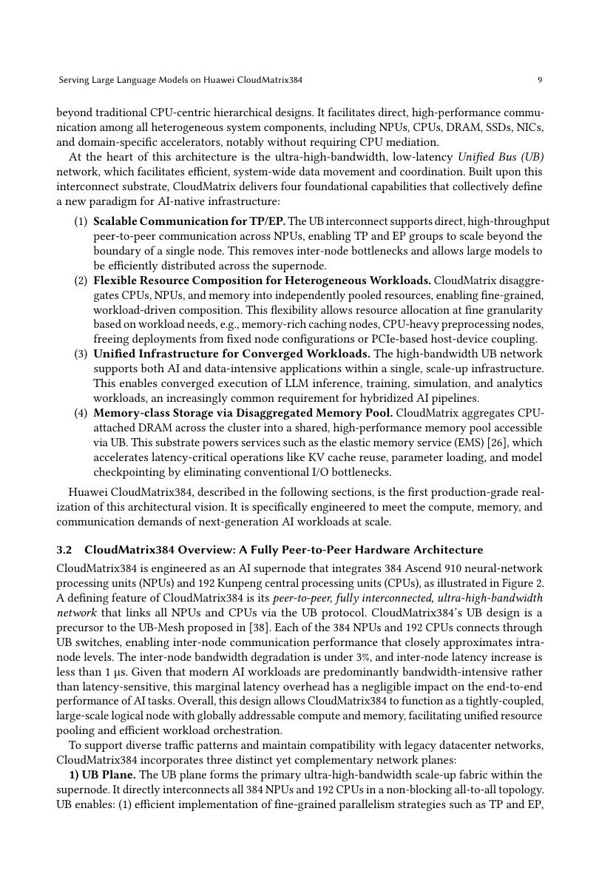
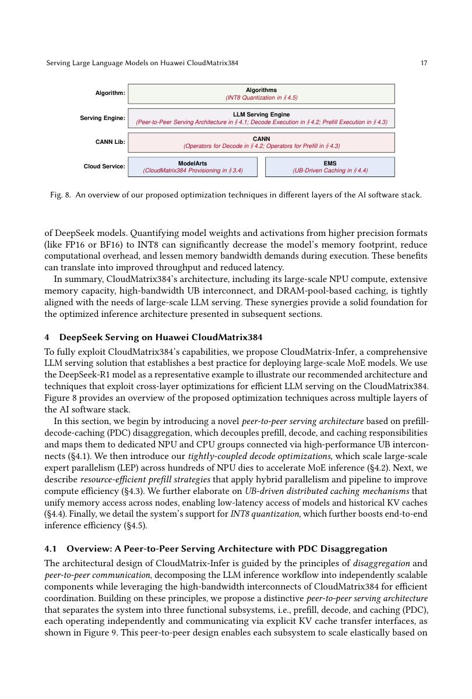
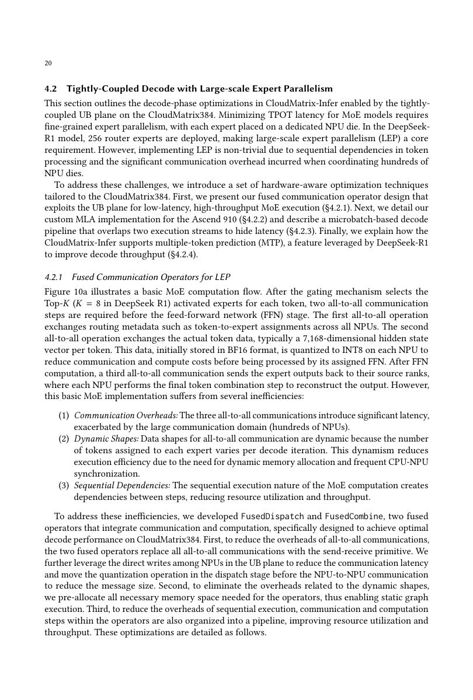
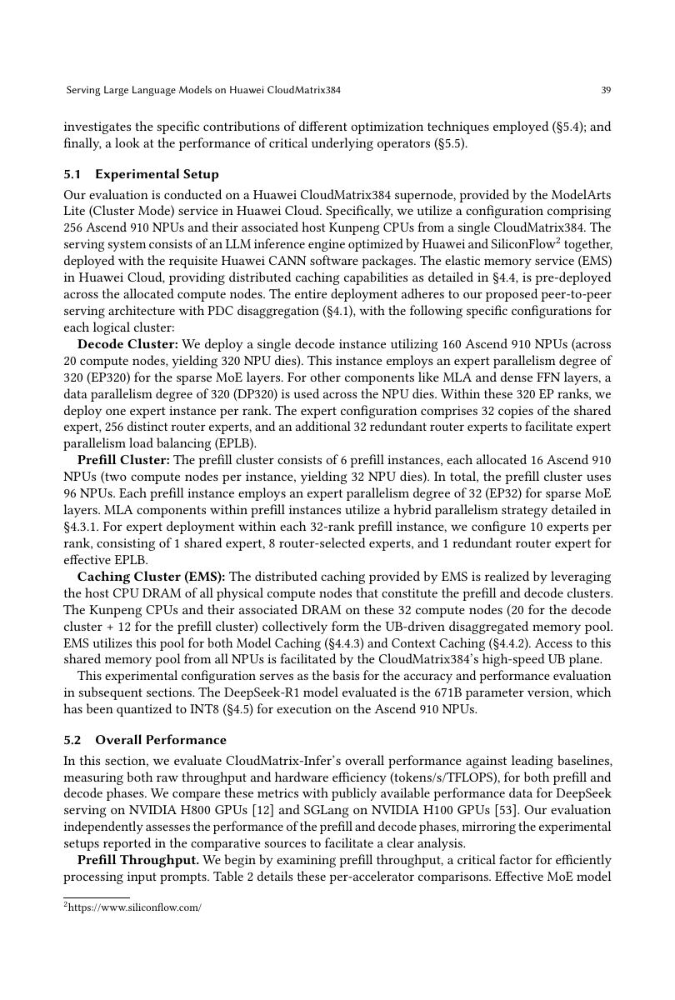
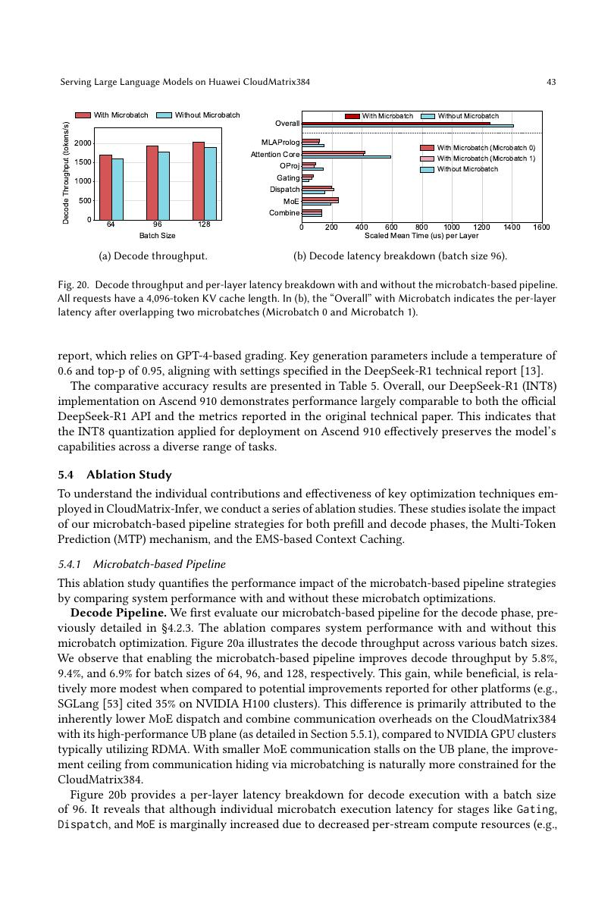

# 论文中文解读：《Serving Large Language Models on Huawei CloudMatrix384》

## 一、先给结论

这篇论文提供了目前理解“Ascend 与 DeepSeek 为什么会形成一套共同设计”的最好主线。DeepSeek-V3/R1 的关键并不是 671B 这个总参数数字本身，而是四类系统压力同时出现：MoE 的 all-to-all、MLA 的特殊 KV/attention 路径、prefill 与 decode 的资源差异、以及 MTP 的候选验证。CloudMatrix384 用统一总线超节点承接通信与资源池化，CloudMatrix-Infer 再把模型结构翻译成 EP320、P/D/C 解耦、微批流水和专用算子。

论文首次公开于 2025 年 6 月，arXiv:2506.12708。这里保存了 [PDF](paper.pdf)、[可检索文本](paper.txt) 和 [概要](论文概要.md)。

## 二、不要把 Ascend 与 DeepSeek 的关系理解成简单“适配”

普通适配通常意味着补齐 operator、转换 checkpoint、能正确生成文本。论文做的是更深一层的协同：

| DeepSeek 特性 | 系统瓶颈 | CloudMatrix-Infer 对应设计 |
|---|---|---|
| DeepSeekMoE，671B 总参/37B 激活 | token dispatch/combine、专家负载与跨机 all-to-all | UB + 大规模 EP，典型 EP320；融合通信算子 |
| MLA | KV cache 变小，但 decode attention 形状特殊、算子更碎 | MLA 专用融合与 AIC/AIV 协同 |
| 长上下文 | prefill 计算重，cache 容量与迁移压力大 | prefill/decode/cache 独立池化，分布式 context cache |
| MTP | 多候选生成与验证，容易产生多次 graph/host 调度 | pipelined MTP execution |
| 在线 SLO | TTFT 与 TPOT 对资源需求不同 | PDC disaggregation、按阶段独立扩缩 |

所以，“DeepSeek 能在 Ascend 上运行”和“DeepSeek 能充分利用 CloudMatrix384”是两个完全不同的命题。

## 三、CloudMatrix384：把一组机器变成一个超节点

CloudMatrix384 含 384 颗 Ascend 910 NPU 与 192 颗 Kunpeng CPU。核心是 UB 网络提供的 peer-to-peer 连接：设备不再只能沿服务器内总线、服务器间 RDMA 的传统层级访问资源。

这对 MoE 很重要。若一个 token 的 top-k experts 分散在大量设备上，dispatch/combine 的消息小、参与方多、时延敏感。只提高单 NPU 算力无法解决它；网络拓扑、端点数量、传输启动开销和同步方式往往决定 decode 延迟。

论文仍保留 VPC 与 RDMA 等平面，并在未来工作中讨论进一步统一。因此“统一总线”不等于所有网络和内存已经完全物理统一；它首先是一种可直接访问、可池化的系统基础。

## 四、P/D/C 解耦为何比简单 P/D 解耦更进一步

推理有三个不同工作集：

- prefill：大量输入 token 可并行处理，通常更 compute-bound；
- decode：每个序列每轮只产生少量 token，更受内存带宽、通信和批大小影响；
- cache：KV/context/model 权重需要容量、复用和迁移带宽。

传统 P/D disaggregation 把前两者拆开，但 cache 仍常附属于某个实例。CloudMatrix-Infer 把 caching 也作为独立资源池，调度器可在统一访问网络上选择 prefill、decode 和 cache 位置。好处是三个池可以按工作负载独立伸缩，也更容易复用长前缀；代价是系统调度、远程访问和一致性复杂度上升。

## 五、EP320：为什么 decode 敢用这么大的专家并行度

DeepSeek-R1 沿用 V3 的 256 routed experts 加 shared experts。CloudMatrix decode 方案使用大规模 EP，使专家权重分散到更多 NPU，单设备承担更少专家，从而降低内存占用并提高小 batch 下的有效并行度。

但 EP 越大，通信参与者越多。论文用四类优化抵消代价：

1. AIV-direct：尽量避免传统 SDMA 路径的启动开销；
2. early quantization：在发送前降低通信数据量；
3. 静态 shared-memory buffer：避免动态分配和不确定执行路径；
4. data-sending pipeline：把 offset 计算、数据搬运和网络发送流水起来。

这里的本质不是“EP 越大越好”，而是在 UB 域内找到计算、权重驻留与 all-to-all 的新平衡点。换成普通以太网/RoCE 集群，EP320 可能被通信时延完全吞没。

## 六、MLA、微批与 MTP 的落地

MLA 通过低秩 latent 表示降低每 token KV cache，但 decode 仍要完成 latent cache 读取、projection、RoPE 分支与 attention。论文将若干步骤融合，并在 AIC（矩阵）与 AIV（向量）资源间划分工作。

微批流水的作用是填补不同 operator 的资源空洞：当一个 microbatch 的 attention 使用一类单元时，另一 microbatch 可执行 MoE/向量路径。它提升利用率，但不是免费收益——batch 太小不能填满流水，太大又会伤害 TPOT。

MTP 的关键也不是“多预测几个 token”这么简单。候选生成后仍需主模型验证；若每个候选触发独立图和 CPU 调度，收益会被 launch/同步抵消。论文把各阶段流水化，报告单个 speculative token 配置的消融收益。

## 七、结果应该怎样读

论文报告 prefill 6,688 tokens/s/NPU，decode 在 TPOT < 50 ms 时为 1,943 tokens/s/NPU，在 TPOT < 15 ms 时为 538 tokens/s/NPU。读这些数字必须同时锁定：

- DeepSeek-R1 的 INT8 格式与精度校准；
- prefill/decode 使用的 NPU 数和 EP/DP 组合；
- prompt、output 长度；
- TPOT SLO；
- 是峰值、离线吞吐还是满足 SLO 的 online goodput；
- 基线是否启用同等级的量化、专家负载均衡和 speculative decoding。

论文把 per-accelerator 吞吐再除以理论 TFLOPS，试图说明系统效率。但不同芯片的矩阵数据类型、稀疏性、网络和软件 kernel 不完全等价；这个归一化是有用参考，不是绝对公平的“架构优胜”证明。

## 八、消融比排行榜更值得读

消融把端到端数字拆成微批流水、MTP 和 context caching 三组因素。尤其 context cache 的收益强依赖复用率：没有公共前缀时，缓存池只增加管理成本；前缀复用高时，省下的 prefill 计算直接改善 TTFT。

这提醒实践者先看流量分布。对短 prompt、低复用、低并发业务，复杂 PDC 系统可能没有优势；对长上下文、MoE、大规模在线服务，它才有足够收益覆盖系统复杂度。

## 九、论文没有回答什么

- 没有给出可独立复现的完整 CloudMatrix-Infer 源码与所有 kernel。
- 没有同一机房、同模型位宽、同请求 trace 的 H800/H100 端到端受控对照。
- 没有完整披露超节点 TCO、功耗和故障域。
- INT8 的 16 项 benchmark 相近不等于所有领域、长上下文和生成分布完全等价。
- 单一 DeepSeek-R1 workload 不能代表 dense、小模型或多模态模型。

## 十、与本专题其他论文怎么连读

1. 先读 [DeepSeek-V2](../deepseek_v2/论文中文解读.md)，理解 MLA 为什么减少 KV cache。
2. 再读 [DeepSeek-V3](../deepseek_v3/论文中文解读.md)，理解 auxiliary-loss-free balancing、MTP、DualPipe 与 FP8。
3. 读 [DeepSeek-R1](../deepseek_r1/论文中文解读.md)，区分模型架构与后训练算法。
4. 最后回到本文，看这些算法特性如何变成 NPU 网络、算子、cache 和调度问题。

一句话概括：DeepSeek 给出高稀疏 MoE + MLA + MTP 的 workload，CloudMatrix384 则给出为这种 workload 重新组织计算、网络与内存的一种答案。

## 十一、原文入口

[arXiv 摘要页](https://arxiv.org/abs/2506.12708) · [arXiv PDF](https://arxiv.org/pdf/2506.12708)

## 原文证据导航

以下页码按仓库内 PDF 的**文件页码**计，不等同于论文印刷页码。建议先读本节所指原文，再回看上面的中文解释。

- [打开原始 PDF](paper.pdf)
- [打开可检索文本](paper.txt)

| 中文笔记中的证据 | 原文位置 | 复核重点 |
|---|---|---|
| CloudMatrix384 的硬件组织与统一总线 | [PDF 文件第 9 页](paper.pdf#page=9) · [截图](rendered_figures/page-9.jpg) | 回到该页上下文，复核定义、图表或实验论证 |
| DeepSeek Serving 的 PDC 解耦总体架构 | [PDF 文件第 17 页](paper.pdf#page=17) · [截图](rendered_figures/page-17.jpg) | 回到该页上下文，复核定义、图表或实验论证 |
| 面向 DeepSeek MoE 的大规模 expert parallelism 与通信融合 | [PDF 文件第 20 页](paper.pdf#page=20) · [截图](rendered_figures/page-20.jpg) | 回到该页上下文，复核定义、图表或实验论证 |
| DeepSeek-R1 在 CloudMatrix-Infer 上的总体吞吐比较 | [PDF 文件第 39 页](paper.pdf#page=39) · [截图](rendered_figures/page-39.jpg) | 回到该页上下文，复核定义、图表或实验论证 |
| 微批流水等优化的消融与逐层时延 | [PDF 文件第 43 页](paper.pdf#page=43) · [截图](rendered_figures/page-43.jpg) | 回到该页上下文，复核定义、图表或实验论证 |
