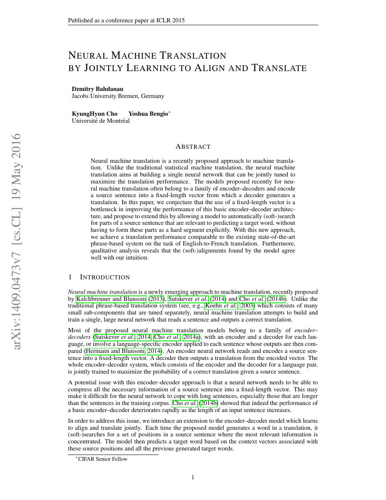
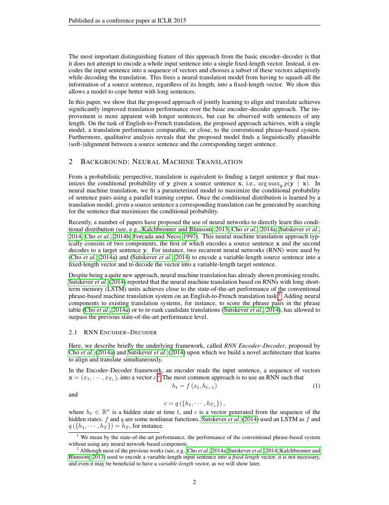
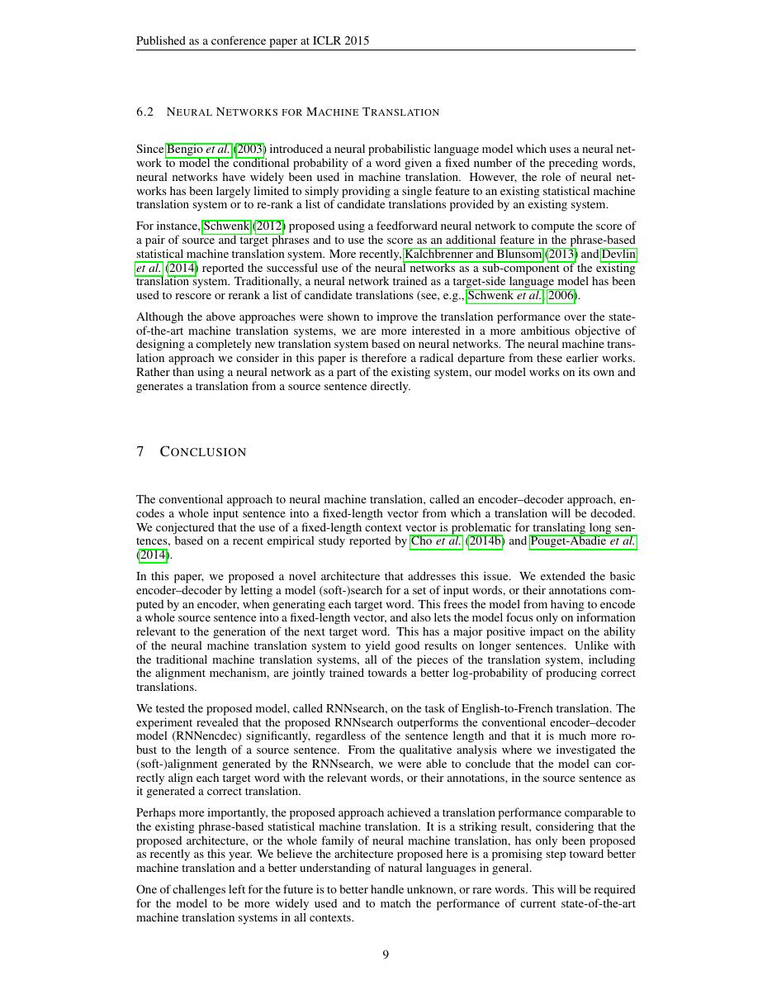
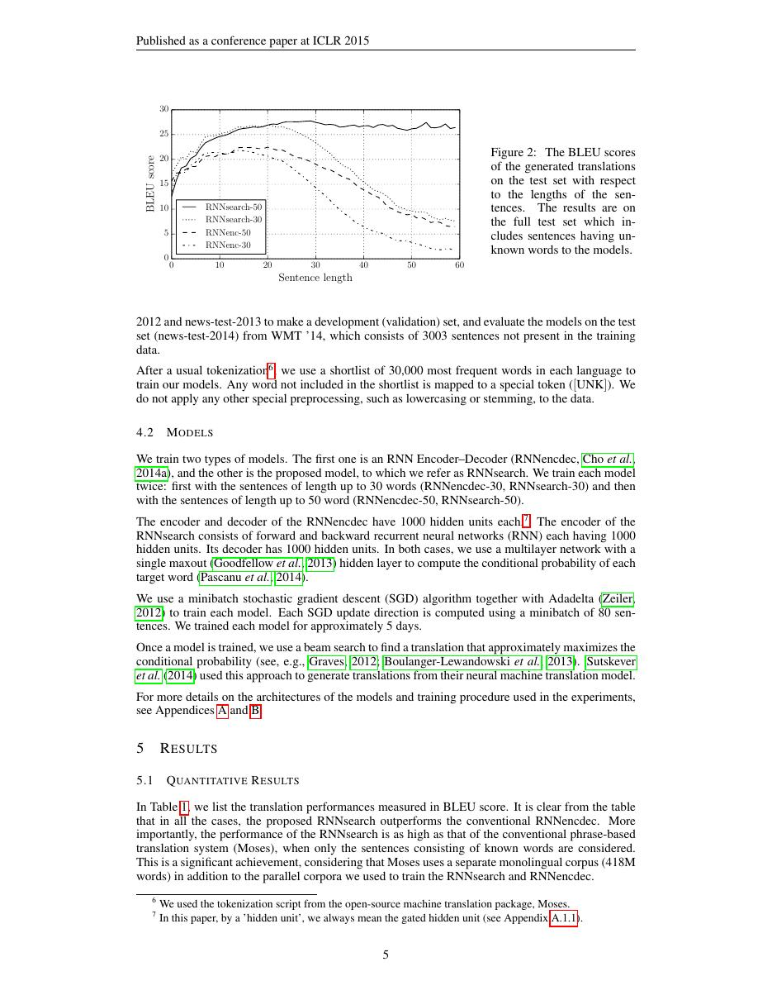

# 论文中文解读：《Neural Machine Translation by Jointly Learning to Align and Translate》

## 一、它解决了什么

Bahdanau Attention 让解码器在每一步从全部编码器状态动态计算上下文，不再把整句强压进一个向量。

## 二、核心机制

加性 attention 用小型前馈网络计算 query 与每个 key 的兼容度，经 softmax 得到软对齐权重，再对 value 加权求和。双向 RNN 为每个源位置提供左右文信息；对齐与翻译联合学习，无需外部词对齐标注。

## 三、为什么成为主线

这篇论文把 attention 从辅助技巧变成神经序列模型的核心可微寻址机制，为 self-attention 与 Transformer 铺路。

## 四、应该怎样读证据

论文里的结果首先证明方法在当时数据、模型规模、硬件和评测协议下成立。跨年代比较时要统一参数量、训练 tokens、数据质量、上下文长度、推理预算与系统实现，不能只横比单个最佳分数。

## 五、局限与易误读点

编码和解码仍依赖 RNN 串行；每个解码步扫描全部源位置，复杂度随源长线性增长。attention 权重可视化不自动等于因果解释。

## 六、放进十年演进史

与 Transformer 对照：Bahdanau 是 decoder-to-encoder 的 cross-attention；Transformer 同时使用 self-attention 与 cross-attention，并把序列内循环完全去掉。

## 七、原文入口

[官方论文/页面](https://arxiv.org/abs/1409.0473)

## 八、原文论证链

固定向量 encoder–decoder 要把整句压成一个表示，长句容易退化。论文让双向编码器保留每个源位置的 annotation $h_i$，解码器每一步学习软对齐，再按权重求上下文 $c_t$。翻译和对齐只用翻译似然端到端联合训练，不需要人工词对齐标签。

> 原文定位：[PDF 文件第 1 页](paper.pdf#page=1) · [对应截图](rendered_figures/page-1.jpg)

## 九、加性注意力公式

$$
e_{ti}=v_a^\top\tanh(W_as_{t-1}+U_ah_i),
$$
$$
\alpha_{ti}
=\frac{\exp(e_{ti})}{\sum_j\exp(e_{tj})},
\qquad
c_t=\sum_i\alpha_{ti}h_i.
$$
$e_{ti}$ 衡量当前解码状态与源位置的匹配；softmax 使权重和为一；$c_t$ 是本步的可微软检索。query 来自 decoder，key/value 来自 encoder，打分是前馈网络，这与 Transformer multi-head self-attention 不同。

> 原文定位：[PDF 文件第 2 页](paper.pdf#page=2) · [对应截图](rendered_figures/page-2.jpg)

## 十、实验怎样读

按源句长度比较最直接：固定向量模型随长度退化更明显，attention 模型更稳定。对齐热图展示重排和词对应，但只是内部权重，不等同人工标注的语言学对齐，也不证明高权重位置是唯一因果来源。

> 原文定位：[PDF 文件第 9 页](paper.pdf#page=9) · [对应截图](rendered_figures/page-9.jpg)

## 十一、复现检查

- padding 必须在 softmax 前 mask。
- 检查 $\sum_i\alpha_{ti}=1$，并观察不同句长的权重熵。
- 双向 encoder 与 attention 同时变化，严格归因需独立消融。
- 固定分词、BLEU 脚本、beam 和未知词处理。

## 十二、常见误读

该方法不是“为每个词选一个硬位置”，而是对所有源表示加权。attention 缓解固定向量瓶颈，但计算仍随源/目标长度乘积增长。

> 原文定位：[PDF 文件第 5 页](paper.pdf#page=5) · [对应截图](rendered_figures/page-5.jpg)

## 原文证据导航

以下页码按仓库内 PDF 的**文件页码**计，不等同于论文印刷页码。建议先读本节所指原文，再回看上面的中文解释。

- [打开原始 PDF](paper.pdf)
- [打开可检索文本](paper.txt)

| 中文笔记中的证据 | 原文位置 | 复核重点 |
|---|---|---|
| 原文首页、摘要与问题定义 | [PDF 文件第 1 页](paper.pdf#page=1) · [截图](rendered_figures/page-1.jpg) | 回到该页上下文，复核定义、图表或实验论证 |
| 核心方法、架构或算法定义所在关键页 | [PDF 文件第 2 页](paper.pdf#page=2) · [截图](rendered_figures/page-2.jpg) | 回到该页上下文，复核定义、图表或实验论证 |
| 实验、结果或关键分析所在原文页 | [PDF 文件第 9 页](paper.pdf#page=9) · [截图](rendered_figures/page-9.jpg) | 回到该页上下文，复核定义、图表或实验论证 |
| 讨论、结论或补充分析所在原文页 | [PDF 文件第 5 页](paper.pdf#page=5) · [截图](rendered_figures/page-5.jpg) | 回到该页上下文，复核定义、图表或实验论证 |
