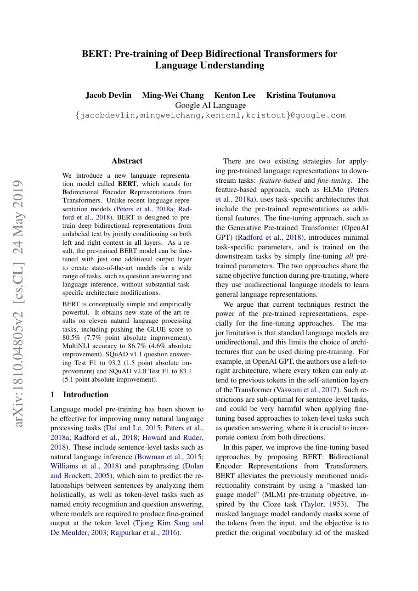
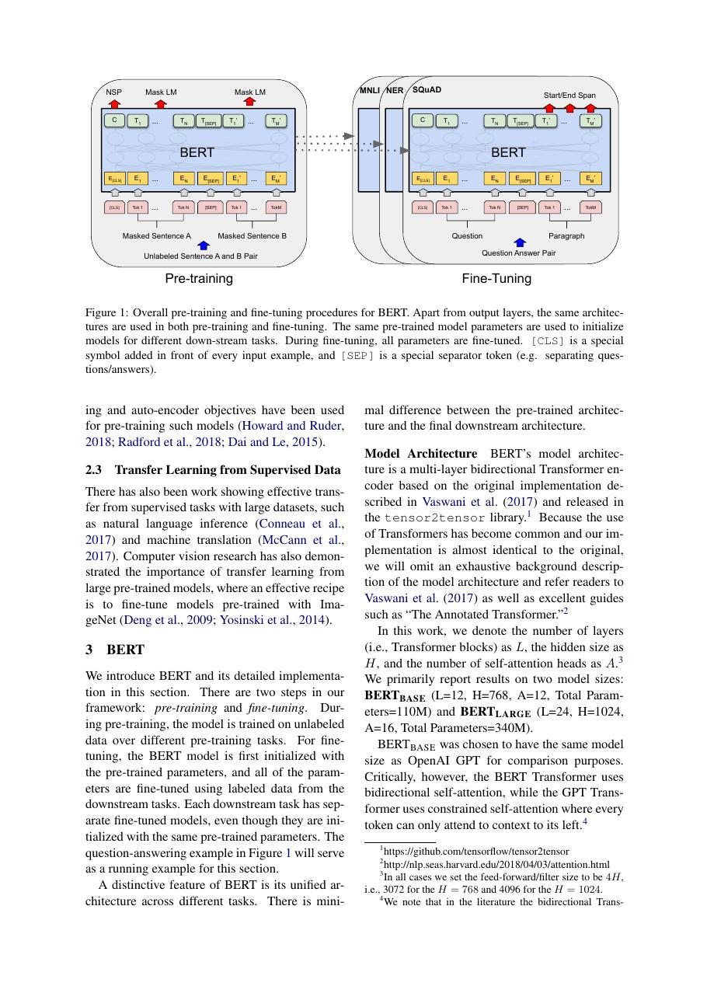
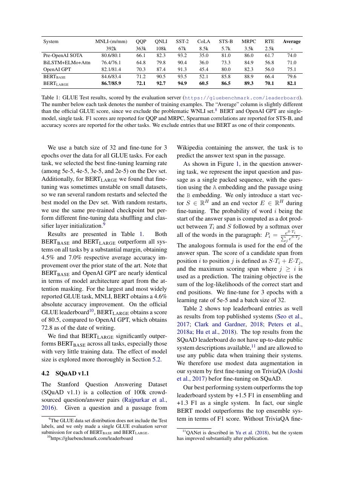
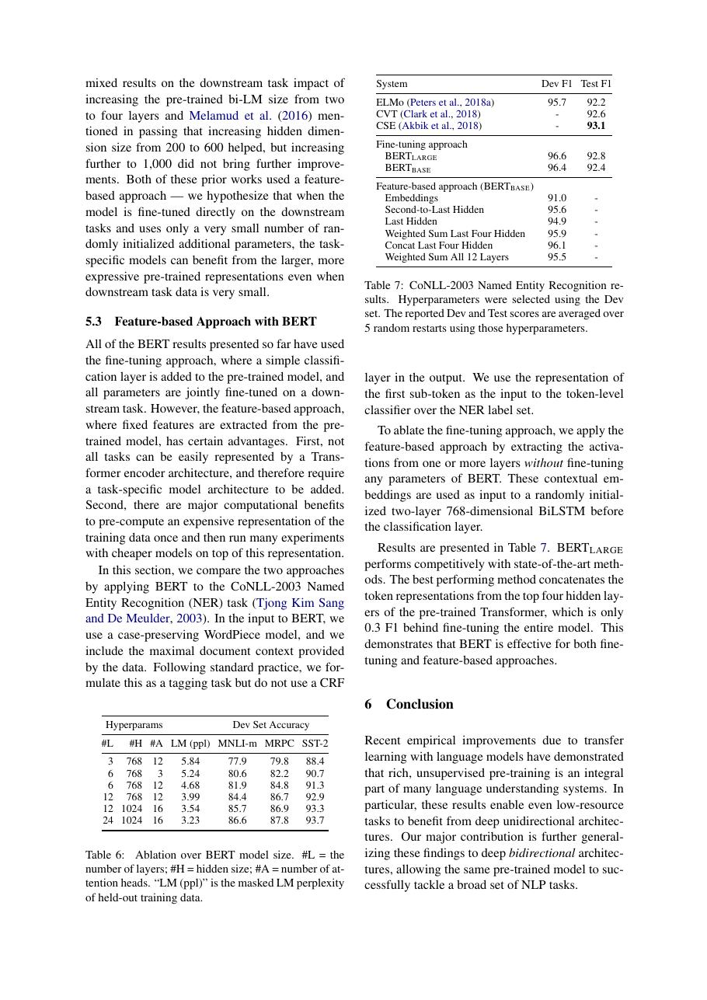

# 论文中文解读：《BERT: Pre-training of Deep Bidirectional Transformers for Language Understanding》

## 一、它解决了什么

BERT 用 masked language modeling 构造深层双向 Transformer encoder，并以统一 checkpoint 微调多种理解任务。

## 二、核心机制

随机遮盖部分 token 后预测原词，使每个位置同时利用左右文；Next Sentence Prediction 试图学习句间关系。下游只添加很小任务头。MLM 的 80/10/10 替换策略缓解 mask token 与微调输入不一致。

## 三、为什么成为主线

BERT 奠定 encoder-only 预训练模型生态，推动搜索、分类、抽取、问答和领域模型。

## 四、应该怎样读证据

论文里的结果首先证明方法在当时数据、模型规模、硬件和评测协议下成立。跨年代比较时要统一参数量、训练 tokens、数据质量、上下文长度、推理预算与系统实现，不能只横比单个最佳分数。

## 五、局限与易误读点

MLM 训练算力利用率低且存在预训练—推理不匹配；NSP 后来被多项工作发现并非必要。encoder 不天然适合长文本生成，长度仍受 O(n²) attention 限制。

## 六、放进十年演进史

与 GPT 比较双向理解和自回归生成；与 T5 比较 encoder-only 和 encoder–decoder 的统一任务接口。

## 七、原文入口

[官方论文/页面](https://arxiv.org/abs/1810.04805)

## 八、原文论证链

作者认为单向语言模型限制了下游表示，因为每个 token 只能利用左侧或右侧上下文；直接做双向语言模型又会让模型在预测时看到自身。解决办法是遮住一部分输入 token，再从双向上下文恢复它们，即 masked language modeling（MLM）。同时加入 next sentence prediction（NSP），让预训练显式接触句对关系。预训练后的同一个 encoder 只加很薄的任务头即可微调多类任务。

> 原文定位：[PDF 文件第 1 页](paper.pdf#page=1) · [对应截图](rendered_figures/page-1.jpg)

## 九、两个预训练目标

MLM 随机选择 15% 位置，其中大部分替换为 [MASK]，少部分替换成随机词或保持不变。这个 80/10/10 处理缓解预训练出现 [MASK]、微调不出现的差异。损失只计算被选中位置，不是重建整句：
$$
L_{\rm MLM}=-\sum_{i\in M}\log p(x_i\mid x_{\setminus M}).
$$
NSP 给定句对 $(A,B)$，一半是真实后继，一半是随机句，使用 [CLS] 表示作二分类。输入还叠加 token、segment、position 三类 embedding。

> 原文定位：[PDF 文件第 3 页](paper.pdf#page=3) · [对应截图](rendered_figures/page-3.jpg)

## 十、实验怎样支持主张

GLUE、SQuAD、SWAG 等覆盖句级分类、token 级抽取和句对推理，目的在于证明表示可统一迁移。消融比较单向、无 NSP、不同模型规模和训练步数。大模型优于 base 支持扩容有效；双向 MLM 优于严格单向模型支持上下文主张。NSP 的必要性后来受到 RoBERTa 等工作挑战，所以应把它视为本文配方中的经验结论，不是双向预训练的永恒组成。

> 原文定位：[PDF 文件第 6 页](paper.pdf#page=6) · [对应截图](rendered_figures/page-6.jpg)

## 十一、复现检查

- SQuAD 的输出是 start/end token 分布；分类任务通常使用 [CLS]，不要混淆任务头。
- 预训练 batch、序列长度日程和 WordPiece 词表影响很大。
- 微调对学习率、epoch 和随机种子敏感，应报告多次运行。
- “BERT 结果”常包含额外数据或 ensemble，比较时要核对表格脚注。

## 十二、常见误读

BERT 的“双向”是每层 self-attention 同时利用左右可见 token，不等于把两个单向模型简单拼接。MLM 也不是普通去噪自编码器的连续重构，而是离散 token 的条件分类。BERT encoder 本身不天然适合自由自回归生成。

> 原文定位：[PDF 文件第 9 页](paper.pdf#page=9) · [对应截图](rendered_figures/page-9.jpg)

## 原文证据导航

以下页码按仓库内 PDF 的**文件页码**计，不等同于论文印刷页码。建议先读本节所指原文，再回看上面的中文解释。

- [打开原始 PDF](paper.pdf)
- [打开可检索文本](paper.txt)

| 中文笔记中的证据 | 原文位置 | 复核重点 |
|---|---|---|
| 原文首页、摘要与问题定义 | [PDF 文件第 1 页](paper.pdf#page=1) · [截图](rendered_figures/page-1.jpg) | 回到该页上下文，复核定义、图表或实验论证 |
| 核心方法、架构或算法定义所在关键页 | [PDF 文件第 3 页](paper.pdf#page=3) · [截图](rendered_figures/page-3.jpg) | 回到该页上下文，复核定义、图表或实验论证 |
| 实验、结果或关键分析所在原文页 | [PDF 文件第 6 页](paper.pdf#page=6) · [截图](rendered_figures/page-6.jpg) | 回到该页上下文，复核定义、图表或实验论证 |
| 讨论、结论或补充分析所在原文页 | [PDF 文件第 9 页](paper.pdf#page=9) · [截图](rendered_figures/page-9.jpg) | 回到该页上下文，复核定义、图表或实验论证 |
