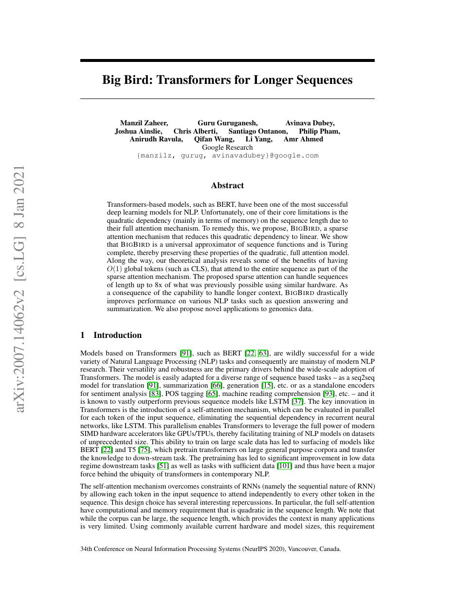
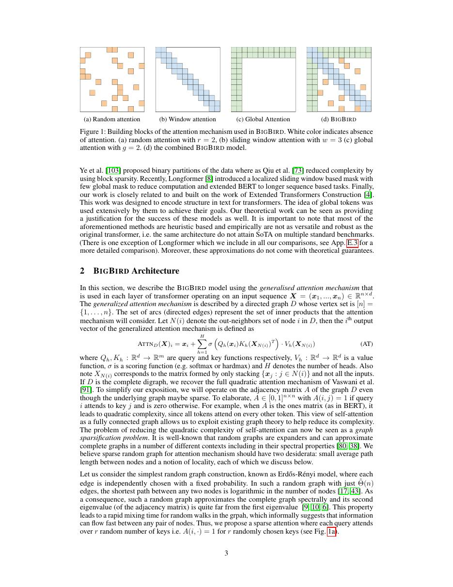
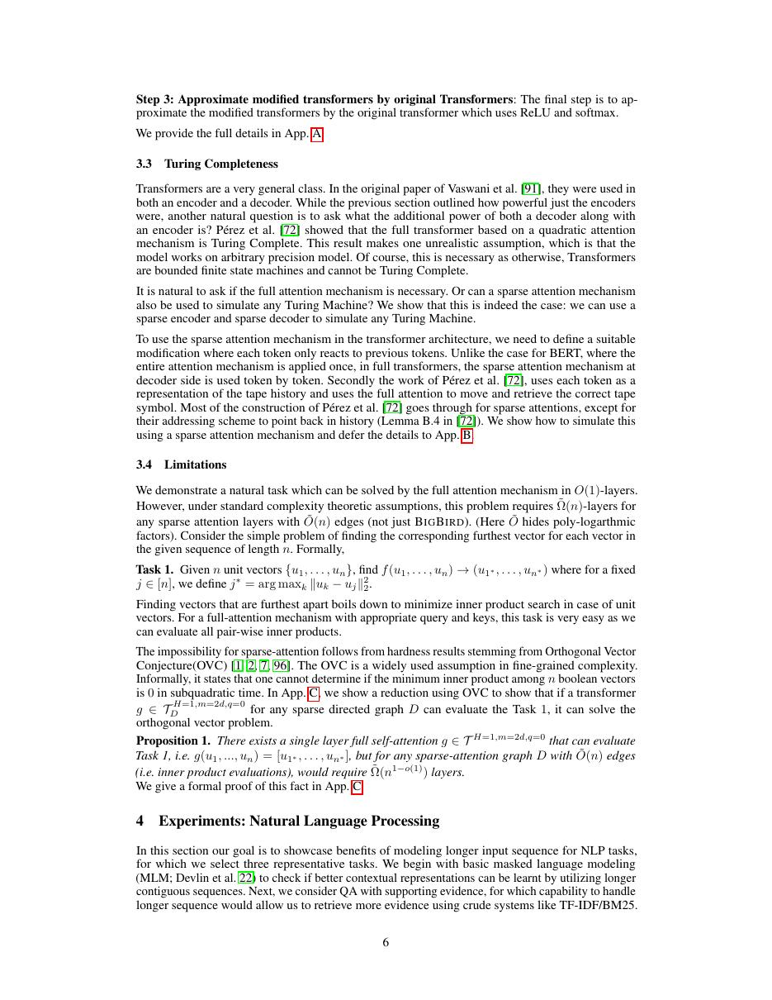
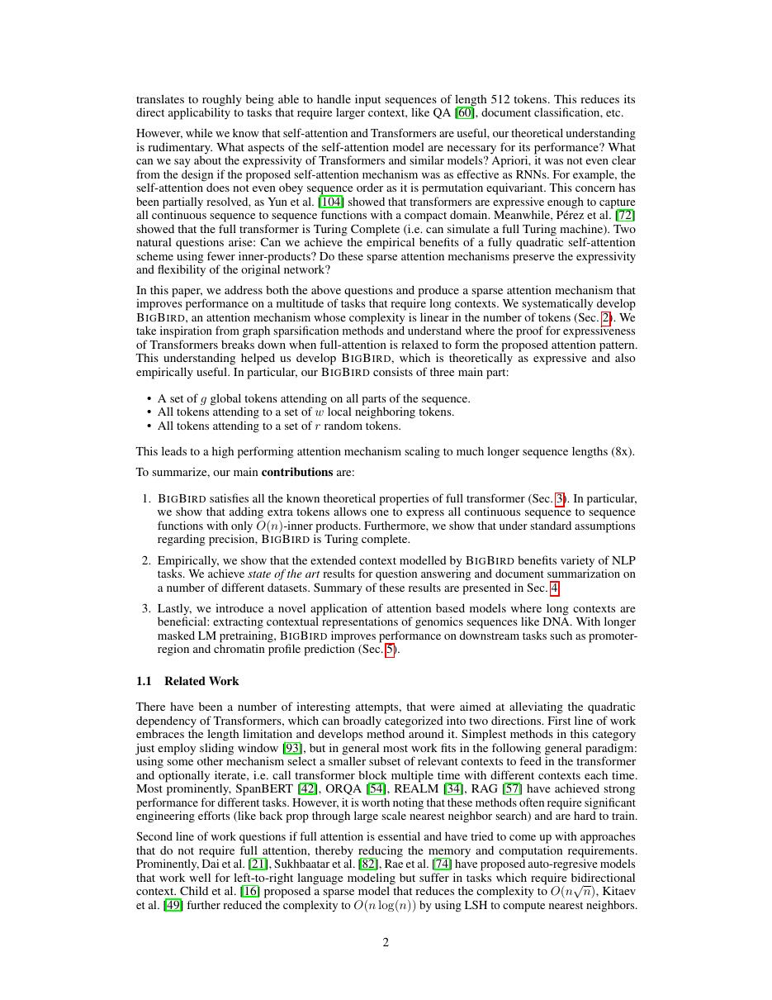

# 论文中文解读：《Big Bird: Transformers for Longer Sequences》

## 一、它解决了什么

BigBird 组合局部、随机和全局边，把 self-attention 稀疏到线性复杂度，同时给出表达能力理论。

## 二、核心机制

local edges 保留邻域，random edges 缩短图直径，global tokens 提供全局读写。论文证明特定稀疏图可保留通用逼近和 Turing completeness，并在长文问答/摘要与基因组任务验证。

## 三、为什么成为主线

它把 sparse attention 的工程 pattern 与图论性质连接，说明并非所有 O(n) 稀疏化都等价。

## 四、应该怎样读证据

论文里的结果首先证明方法在当时数据、模型规模、硬件和评测协议下成立。跨年代比较时要统一参数量、训练 tokens、数据质量、上下文长度、推理预算与系统实现，不能只横比单个最佳分数。

## 五、局限与易误读点

随机 pattern、block size 和 global token 决定实际质量；理论性质不等于有限深度模型易训练。通用框架若没有块稀疏 kernel，墙钟收益会小于 FLOPs 估算。

## 六、放进十年演进史

与 Longformer 比较是否需要随机边；与 FlashAttention 比较近似/稀疏算法和精确 dense kernel 的不同目标。

## 七、原文入口

[官方论文/页面](https://arxiv.org/abs/2007.14062)

## 八、原文论证链

BigBird 组合三类连接：局部窗口捕获邻近结构，随机边让稀疏图快速混合，全局 token 提供任意位置到核心节点的短路径。作者希望说明稀疏 attention 不只是工程近似，还能在特定条件下保持全 attention 的表达能力。理论部分讨论 universal approximation 和图灵完备性；实践部分将上下文扩到数千 token 做长文档任务和基因组数据。

三类边各有分工，不能把 BigBird 简化成“随机 attention”。没有局部边会损失语言先验，没有全局节点会削弱任务聚合，只有固定局部窗口则跨远距离传播需要很多层。

> 原文定位：[PDF 文件第 1 页](paper.pdf#page=1) · [对应截图](rendered_figures/page-1.jpg)

## 九、复杂度与图结构

每个普通 token 关注 $w$ 个局部、$r$ 个随机和 $g$ 个全局节点，总边数约
$$
O(n(w+r+g)),
$$
在超参数固定时对 $n$ 线性。随机边提高图的扩张性质，全局节点使直径缩短。理论结论依赖特定稀疏图、足够层数/宽度和精确构造；它不意味着有限模型在任意任务上与 dense attention 精度完全相同。

> 原文定位：[PDF 文件第 3 页](paper.pdf#page=3) · [对应截图](rendered_figures/page-3.jpg)

## 十、实验怎样读

长文档问答、分类、摘要以及 DNA/基因组任务展示跨领域效果。阅读表格时要区分：更长输入带来的信息增益、稀疏模式本身的归纳偏置、以及预训练规模差异。理论表达能力回答“能否表示”，实验才回答“有限优化能否学到”。

> 原文定位：[PDF 文件第 6 页](paper.pdf#page=6) · [对应截图](rendered_figures/page-6.jpg)

## 十一、复现检查

- 固定并记录随机连接生成规则和 seed；训练/推理图是否一致要说明。
- padding 后的块稀疏布局必须屏蔽无效 token。
- global token 的数量和选择应作为消融变量。
- 报告稀疏 kernel 的真实吞吐；理论非零数不自动等于硬件加速。

## 十二、常见误读

图灵完备或通用逼近不是质量保证，也不代表训练容易。BigBird 的 $O(n)$ 依赖窗口、随机边和全局节点数不随 $n$ 增长；若这些超参数扩大，实际复杂度会改变。

> 原文定位：[PDF 文件第 2 页](paper.pdf#page=2) · [对应截图](rendered_figures/page-2.jpg)

## 原文证据导航

以下页码按仓库内 PDF 的**文件页码**计，不等同于论文印刷页码。建议先读本节所指原文，再回看上面的中文解释。

- [打开原始 PDF](paper.pdf)
- [打开可检索文本](paper.txt)

| 中文笔记中的证据 | 原文位置 | 复核重点 |
|---|---|---|
| 原文首页、摘要与问题定义 | [PDF 文件第 1 页](paper.pdf#page=1) · [截图](rendered_figures/page-1.jpg) | 回到该页上下文，复核定义、图表或实验论证 |
| 核心方法、架构或算法定义所在关键页 | [PDF 文件第 3 页](paper.pdf#page=3) · [截图](rendered_figures/page-3.jpg) | 回到该页上下文，复核定义、图表或实验论证 |
| 实验、结果或关键分析所在原文页 | [PDF 文件第 6 页](paper.pdf#page=6) · [截图](rendered_figures/page-6.jpg) | 回到该页上下文，复核定义、图表或实验论证 |
| 讨论、结论或补充分析所在原文页 | [PDF 文件第 2 页](paper.pdf#page=2) · [截图](rendered_figures/page-2.jpg) | 回到该页上下文，复核定义、图表或实验论证 |
