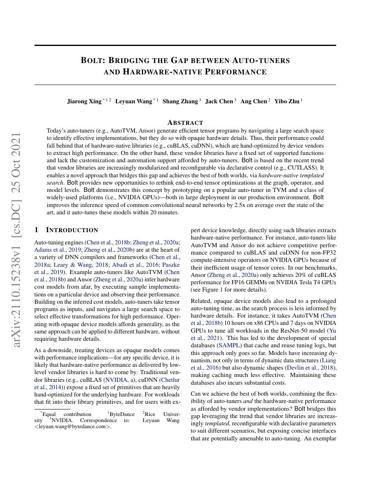
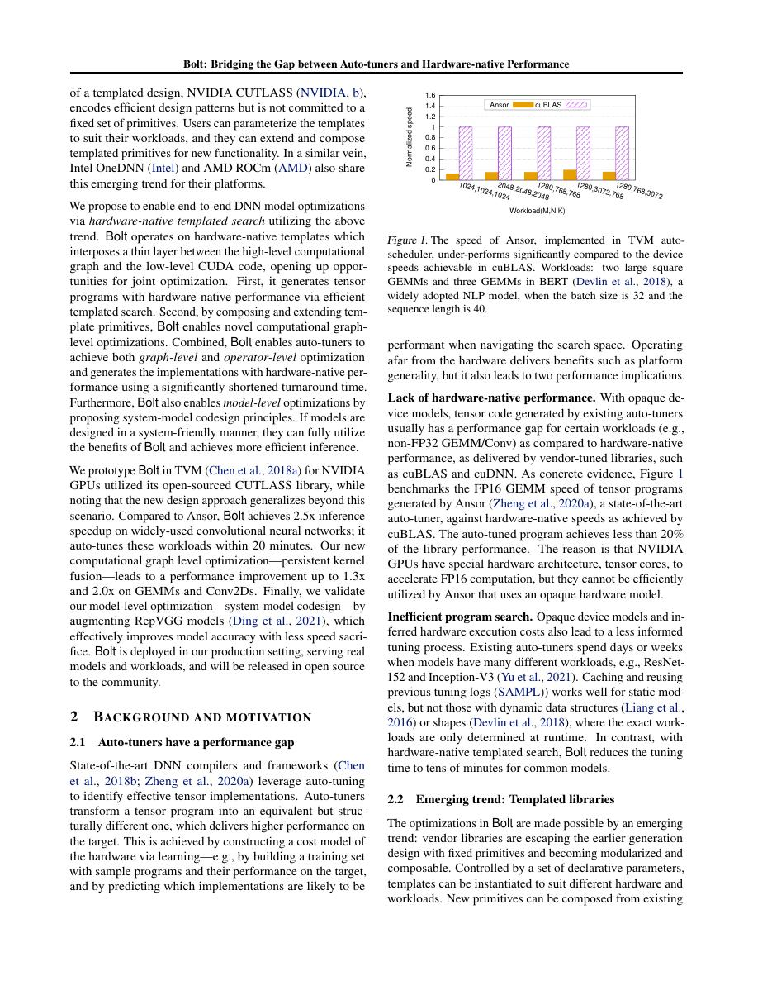
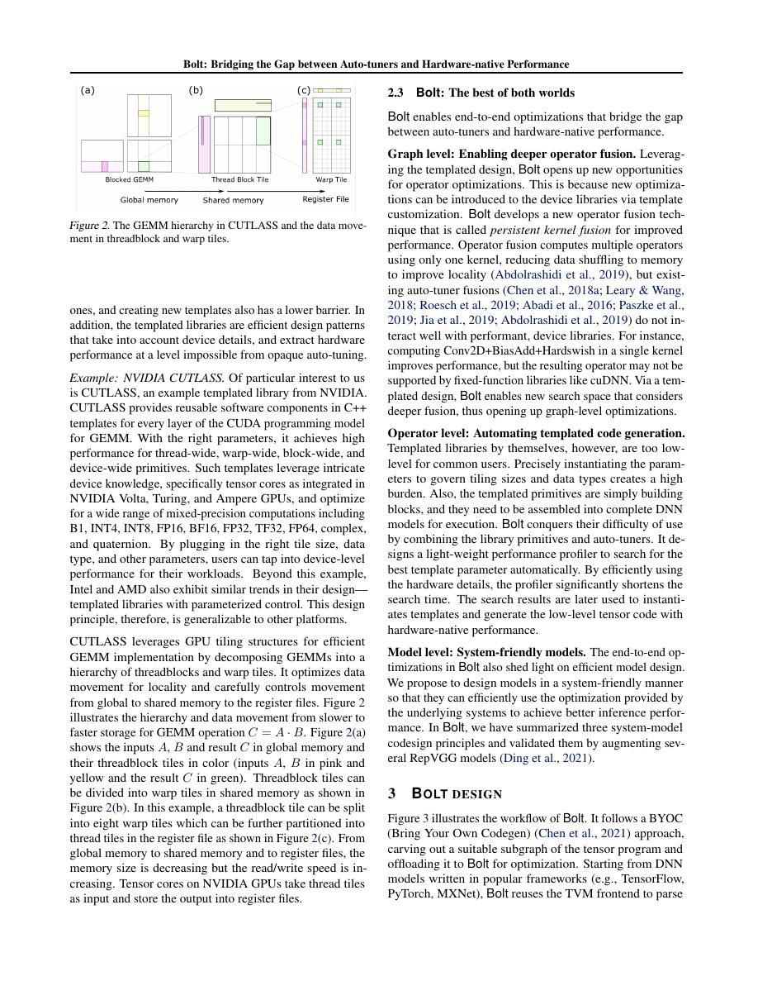
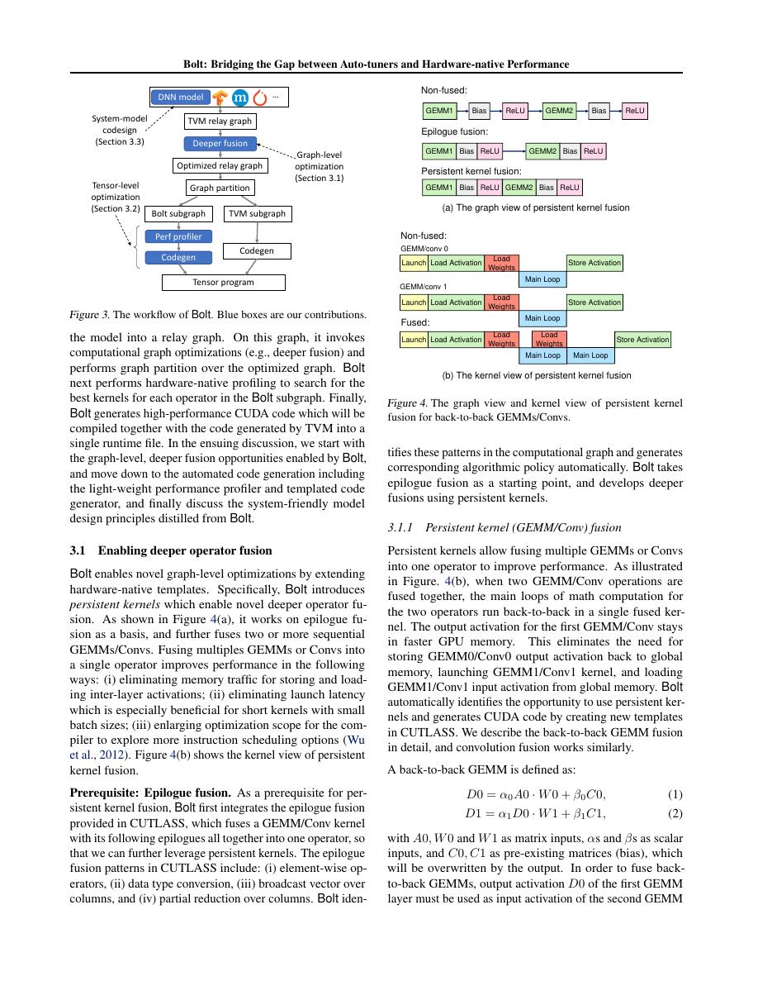

# 中文精读：《Bolt: Bridging the Gap between Auto-tuners and Hardware-native Performance》

## 一、它解决了什么

Bolt 不从任意循环程序盲搜，而是在 CUTLASS 等硬件原生模板上调参，结合自动化与厂商级 tensor-core 性能。

## 二、编译抽象与优化路径

模板显式编码 threadblock/warp/thread tile、pipeline 和 tensor-core knowledge；搜索尺寸、layout 与融合配置，可把 tuning 从天级降到分钟级。它承认 vendor template 是宝贵先验，而非把硬件当黑盒。

## 三、为什么影响后续系统

Bolt 标志 autotuning 从完全通用搜索转向“高质量参数化实现+有限搜索”，与现代 CuTe/Triton/TileLang 的趋势一致。

## 四、怎样读性能结果

编译器结果必须同时记录 frontend、shape、batch、精度、目标硬件、vendor library、调优预算和编译时间。单算子加速不等于端到端同倍加速，首次编译延迟也不能与缓存命中后的 steady-state 混为一谈。

## 五、局限与工程边界

依赖模板覆盖和特定厂商库；新算子或新硬件仍需专家扩展模板。CNN 结果不能直接外推到 attention、MoE 和动态生成。

## 六、放进十年编译器演进史

与 Ansor 对比黑盒通用性和硬件先验；与 FlashAttention/CuTeDSL 看专家算法如何封装为可调 kernel。

## 七、原文入口

[论文/官方页面](https://arxiv.org/abs/2110.15238)

## 八、原文论证链

Bolt 观察到通用 auto-tuner 的搜索空间大，而厂商 CUTLASS 模板已编码 tensor core、warp tile、pipeline 和 layout 的高质量硬件知识。与其从任意循环程序盲搜，Bolt 把这些 hardware-native template 参数化，在较小空间搜索 threadblock/warp tile、stage、数据布局和融合配置，从而把调优时间从天级压到分钟级，同时接近手写库性能。

这是一种“承认专家先验并自动组合”的路线。自动化程度较低但候选质量高，适合模板已覆盖的 dense tensor workloads。

> 原文定位：[PDF 文件第 1 页](paper.pdf#page=1) · [对应截图](rendered_figures/page-1.jpg)

## 九、模板为何能缩小空间

矩阵乘性能取决于层级 tile：
$$
C_{M\times N} += A_{M\times K}B_{K\times N}.
$$
threadblock tile 决定 CTA 工作与 shared memory，warp tile 决定 tensor-core 指令分配，pipeline stage 重叠 global-memory copy 与 MMA。任意组合会违反 shared-memory/register/occupancy 约束；模板先保证代码结构合法，搜索只在可行参数上测量。

epilogue/fusion 可让 bias、activation 等直接消费 accumulator，避免中间写回。

> 原文定位：[PDF 文件第 2 页](paper.pdf#page=2) · [对应截图](rendered_figures/page-2.jpg)

## 十、实验怎样读

论文主要在 CNN/operator workload 与 NVIDIA GPU 上比较 Ansor、cuDNN/CUTLASS 等。应分别看 tuning 时间和最终 latency；“快找到好结果”与“搜索最终上限”是两个指标。模板覆盖外的新算子没有被实验自动解决。

> 原文定位：[PDF 文件第 3 页](paper.pdf#page=3) · [对应截图](rendered_figures/page-3.jpg)

## 十一、复现检查

- 固定 CUTLASS、CUDA、SM 架构与可用模板版本。
- 记录候选约束、测量预算和失败配置。
- 将 layout conversion、epilogue 和 workspace 纳入端到端计时。
- 对不同 shape 做覆盖率统计，不能只选模板友好尺寸。

## 十二、常见误读

Bolt 不是证明通用搜索无用，而是展示在硬件成熟原语上，强模板先验能显著提高搜索效率。新硬件指令或 attention/MoE 仍需专家新增模板。

> 原文定位：[PDF 文件第 4 页](paper.pdf#page=4) · [对应截图](rendered_figures/page-4.jpg)

## 原文证据导航

以下页码按仓库内 PDF 的**文件页码**计，不等同于论文印刷页码。建议先读本节所指原文，再回看上面的中文解释。

- [打开原始 PDF](paper.pdf)
- [打开可检索文本](paper.txt)

| 中文笔记中的证据 | 原文位置 | 复核重点 |
|---|---|---|
| 原文首页、摘要或官方架构概览 | [PDF 文件第 1 页](paper.pdf#page=1) · [截图](rendered_figures/page-1.jpg) | 回到该页上下文，复核定义、图表或实验论证 |
| IR、架构、搜索空间或执行模型关键页 | [PDF 文件第 2 页](paper.pdf#page=2) · [截图](rendered_figures/page-2.jpg) | 回到该页上下文，复核定义、图表或实验论证 |
| 实验、性能或设计分析所在原文页 | [PDF 文件第 3 页](paper.pdf#page=3) · [截图](rendered_figures/page-3.jpg) | 回到该页上下文，复核定义、图表或实验论证 |
| 讨论、结论或补充设计所在原文页 | [PDF 文件第 4 页](paper.pdf#page=4) · [截图](rendered_figures/page-4.jpg) | 回到该页上下文，复核定义、图表或实验论证 |
