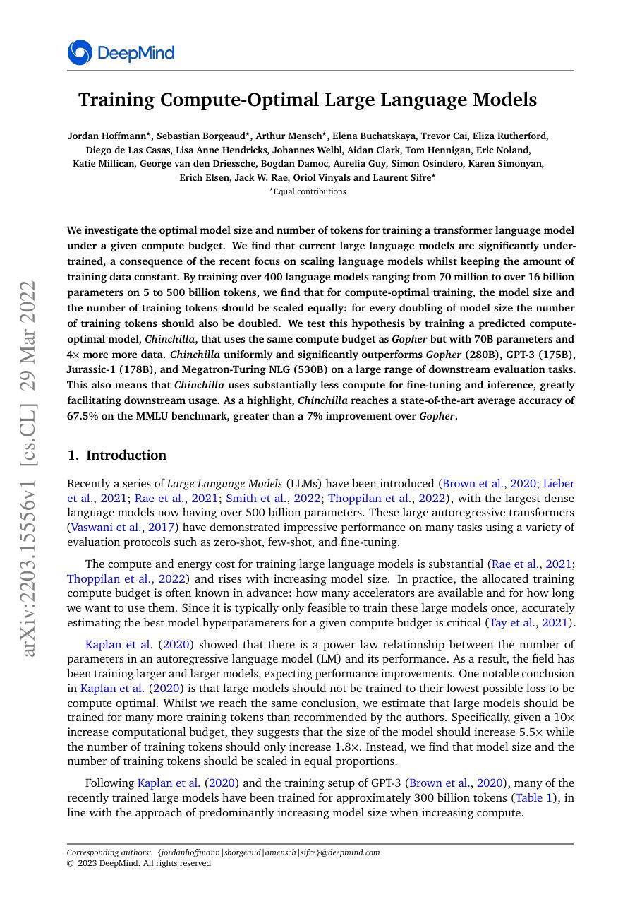
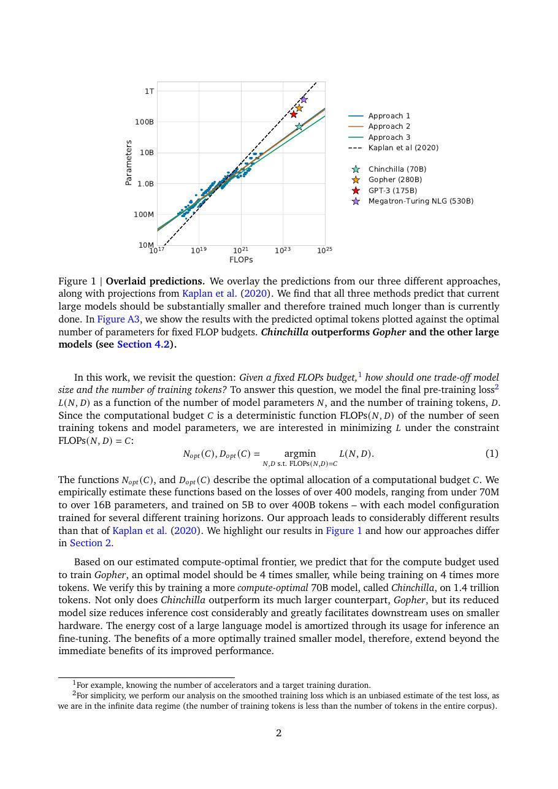
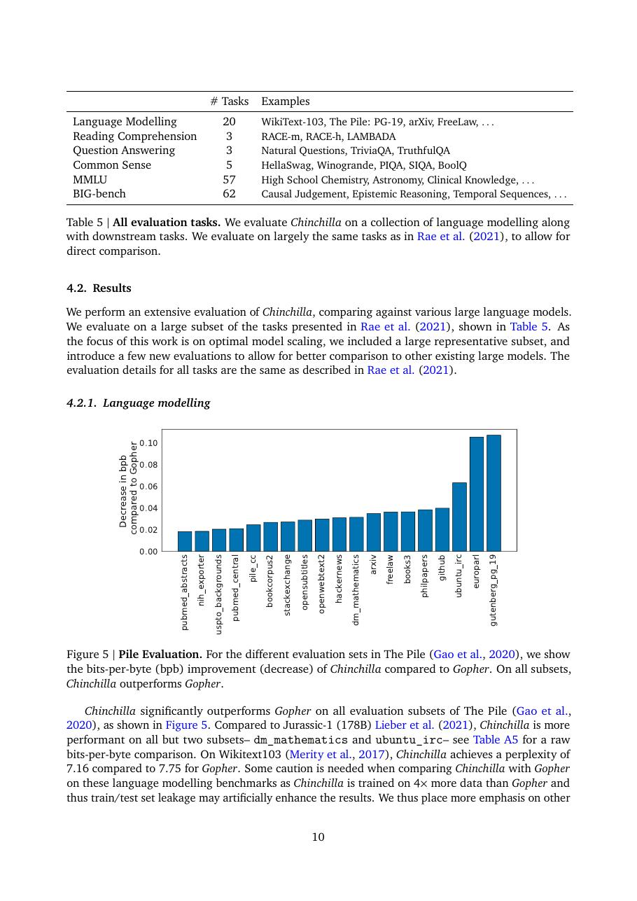
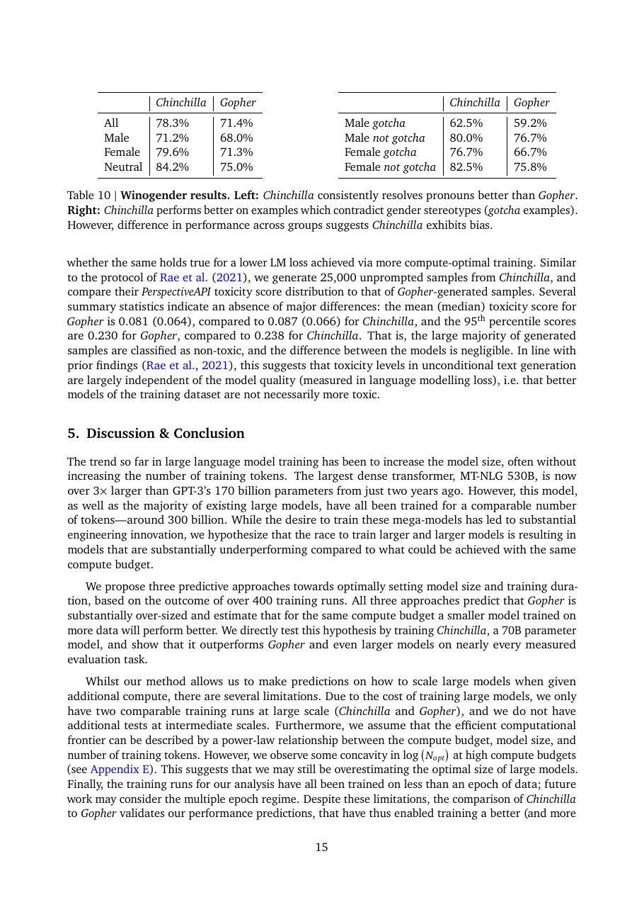

# 论文中文解读：《Training Compute-Optimal Large Language Models》

## 一、它解决了什么

Chinchilla 修正早期 scaling 配方：固定训练 compute 时，参数量与训练 tokens 应大致同比增长，许多大模型实际上训练不足。

## 二、核心机制

团队在更广 N/D 组合上拟合 loss，得到约 70B 参数、1.4T tokens 的 Chinchilla，并在相近 compute 下超过 280B Gopher。结论针对训练最优，不自动等于推理成本最优。

## 三、为什么成为主线

它推动行业从“只堆参数”转向更高 token/parameter 比，深刻影响 LLaMA、DeepSeek 和开放模型训练。

## 四、证据应该怎样读

速度、显存、精度或 benchmark 数字只在论文给定的模型、数据、硬件、kernel 版本和评测预算下成立。跨论文比较前要统一训练 tokens、输入长度、batch、精度、采样/思考预算与是否使用工具。

## 五、局限与易误读点

数据质量、重复、域混合和优化超参被压成 token 数；拟合区间外可能变化。若考虑 serving、蒸馏和多次推理，最优参数量会不同。

## 六、放进十年演进史

先读 Scaling Laws，再用 Chinchilla 理解 compute-optimal 配方为何变化；LLaMA 进一步选择对推理友好的较小模型并训练更久。

## 七、原文入口

[官方论文/页面](https://arxiv.org/abs/2203.15556)

## 八、原文论证链

Chinchilla 重新审视固定训练 FLOPs 下的模型大小和 token 数配比。此前规模律倾向训练非常大的模型但 token 相对较少；作者通过三种互相验证的实验方法——固定模型扫描 token、等 FLOPs iso-curve、参数化损失拟合——发现许多大模型训练不足。近似结论是 compute-optimal 时参数量与训练 token 应随计算量大致等比例增长。

为验证配比，作者训练 70B 参数、1.4T token 的 Chinchilla，在与 280B Gopher 相近计算下取得更好结果。这里的因果主张是“重新分配同一计算”，不是“70B 永远优于 280B”。

> 原文定位：[PDF 文件第 1 页](paper.pdf#page=1) · [对应截图](rendered_figures/page-1.jpg)

## 九、拟合目标怎样理解

损失拟合形式可概括为
$$
L(N,D)=E+\frac{A}{N^\alpha}+\frac{B}{D^\beta},
$$
其中 $E$ 是不可约项，后两项分别表示有限参数和有限数据带来的损失。训练计算近似
$$
C\approx 6ND.
$$
在给定 $C$ 下最小化拟合损失，得到最优 $N,D$ 的增长关系。经验口号“约 20 tokens/parameter”只是在论文范围内的近似，不是脱离数据质量、架构和重复 epoch 的普适常数。

> 原文定位：[PDF 文件第 2 页](paper.pdf#page=2) · [对应截图](rendered_figures/page-2.jpg)

## 十、实验怎样读

先看三种估计方法是否给出相近前沿，再看 Chinchilla/Gopher 的受控验证，最后看 MMLU、BIG-bench、阅读理解等下游结果。下游提升支持更低预训练 loss 的迁移价值，但不同任务的增益并不相同。数据集组成和去重同样影响“有效 token”。

> 原文定位：[PDF 文件第 10 页](paper.pdf#page=10) · [对应截图](rendered_figures/page-10.jpg)

## 十一、复现检查

- 记录唯一 token、重复采样和 epoch 数，名义 token 不等于独立信息量。
- FLOPs 口径应包含 forward/backward 并统一 embedding/softmax 处理。
- sweep 要覆盖真正的数据受限和参数受限两侧，才能稳定拟合最优点。
- 给出拟合不确定性，不要只报告一个比例。

## 十二、常见误读

Chinchilla 没有证明模型越小越好；它说在固定训练计算下，过大的欠训练模型可能不如更充分训练的较小模型。部署推理成本、延迟和可用数据上限是另一个优化问题。

> 原文定位：[PDF 文件第 15 页](paper.pdf#page=15) · [对应截图](rendered_figures/page-15.jpg)

## 原文证据导航

以下页码按仓库内 PDF 的**文件页码**计，不等同于论文印刷页码。建议先读本节所指原文，再回看上面的中文解释。

- [打开原始 PDF](paper.pdf)
- [打开可检索文本](paper.txt)

| 中文笔记中的证据 | 原文位置 | 复核重点 |
|---|---|---|
| 原文首页、摘要与问题定义 | [PDF 文件第 1 页](paper.pdf#page=1) · [截图](rendered_figures/page-1.jpg) | 回到该页上下文，复核定义、图表或实验论证 |
| 核心方法、架构或算法定义所在关键页 | [PDF 文件第 2 页](paper.pdf#page=2) · [截图](rendered_figures/page-2.jpg) | 回到该页上下文，复核定义、图表或实验论证 |
| 实验、结果或关键分析所在原文页 | [PDF 文件第 10 页](paper.pdf#page=10) · [截图](rendered_figures/page-10.jpg) | 回到该页上下文，复核定义、图表或实验论证 |
| 讨论、结论或补充分析所在原文页 | [PDF 文件第 15 页](paper.pdf#page=15) · [截图](rendered_figures/page-15.jpg) | 回到该页上下文，复核定义、图表或实验论证 |
