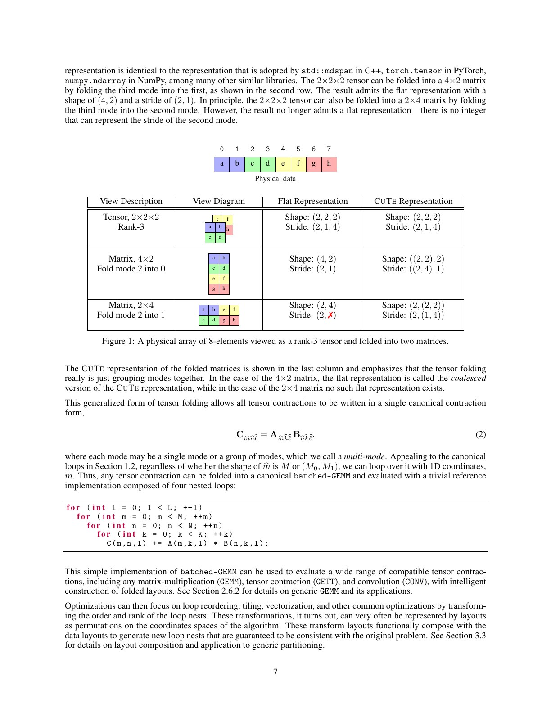
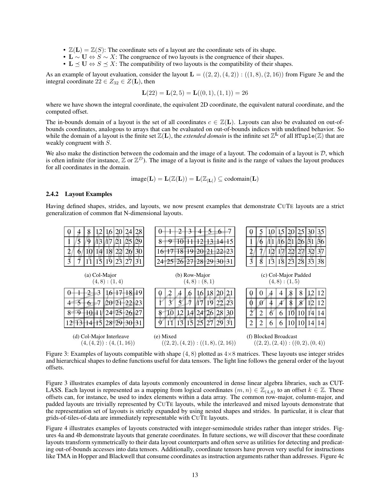
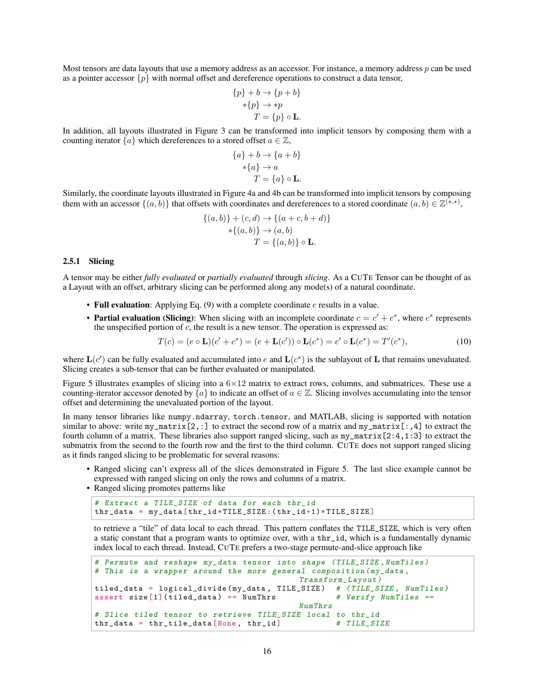
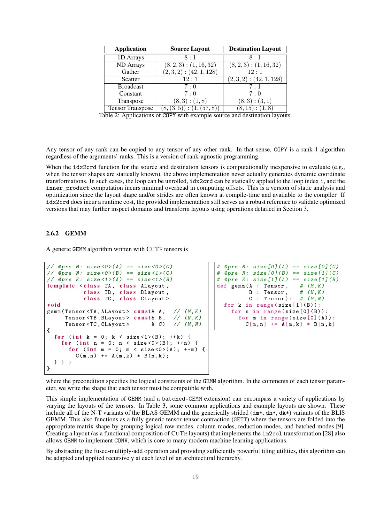
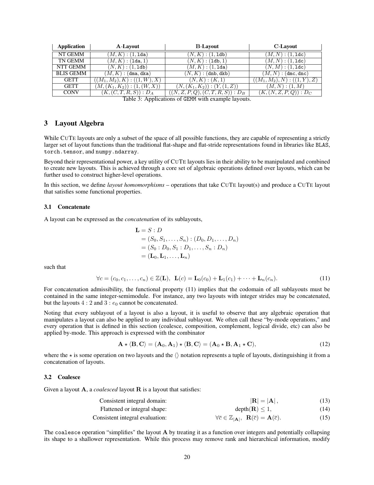
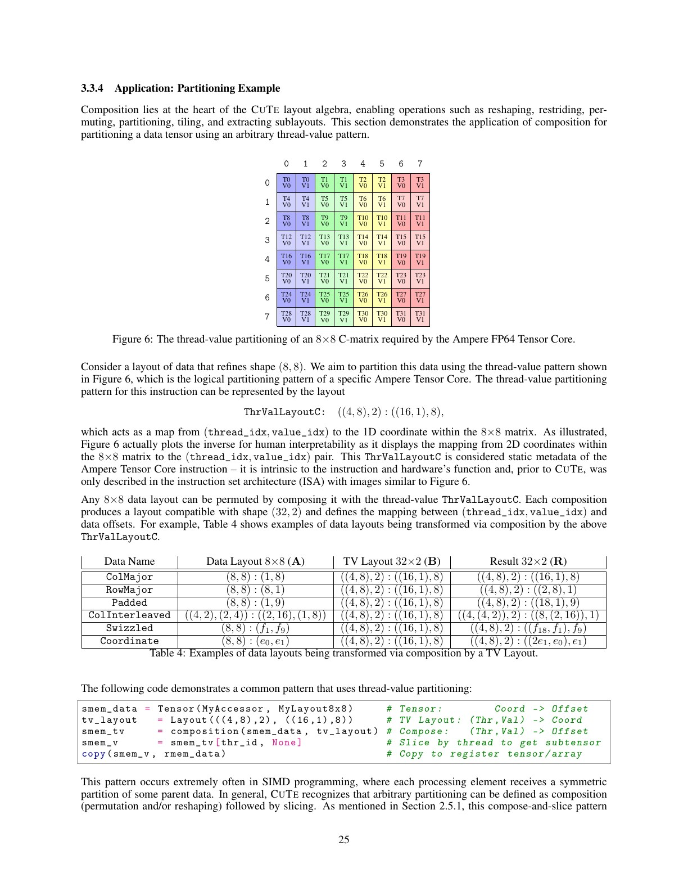
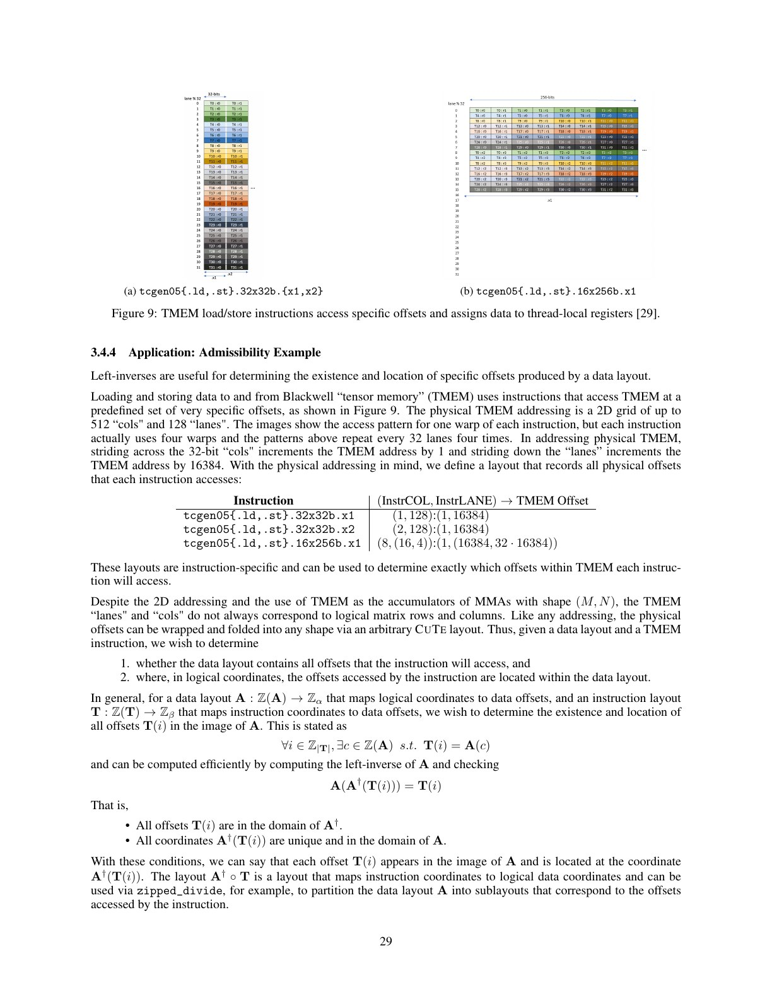
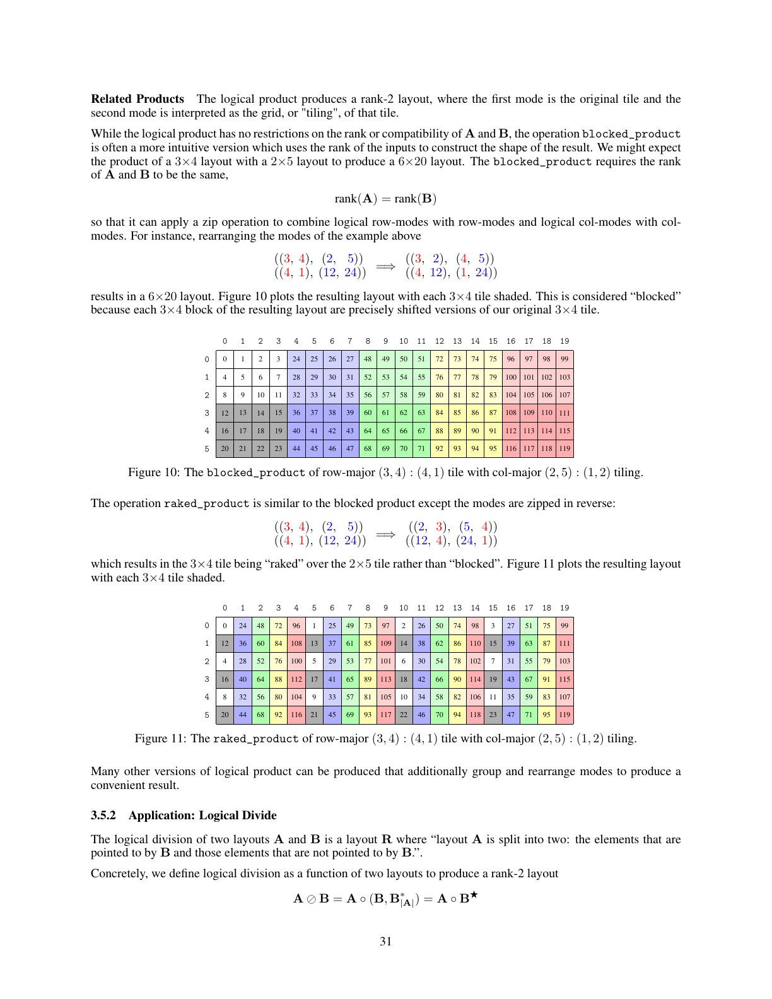

# CuTe Layout Representation and Algebra 中文精读

## 1. 先区分 CuTe 与 CuTe DSL

- CuTe：本论文定义的 layout 表示与代数。
- C++ CuTe：CUTLASS 中的模板实现。
- PyCuTe：论文附带的纯 Python 参考实现，用于验证定义。
- CuTe DSL：用 Python 编写并 JIT 编译 CUDA kernel 的工程 DSL，以 CuTe 抽象为基础。

本论文不是 CuTe DSL compiler 的完整说明，也没有直接证明 CuTe DSL 总比 Triton 快。

## 2. 为什么 layout 变成正确性问题

早期 layout 主要影响 coalescing 与性能；Tensor Core、TMA、TMEM 指令对 operand 的 thread/value arrangement 有严格要求。错误布局不仅慢，甚至无法正确调用指令。

CuTe 希望把三类映射统一：

- logical tensor coordinate → memory address；
- thread id → thread-owned values；
- hardware instruction fragment → registers/shared memory。

## 3. 从 tensor folding 建立直觉

同一物理 8-element array 可按不同层次 shape 解释为 rank-3 tensor 或矩阵。CuTe 的 shape 可以嵌套，保留“哪些维度属于一个逻辑 mode”的结构，而不是只有扁平 extents。

## 4. Layout 是函数

Layout (L=S:D) 定义从 coordinate domain 到 codomain 的映射。传统 row-major 可写为 shape 与整数 strides；CuTe 允许 stride 本身是坐标或更一般的 integer-semimodule 元素。

把 layout 当函数的好处是：索引变换可用函数 composition 表示，而不需在 kernel 中散布整除、取模和位运算。

## 5. Tensor、slice、copy 与 GEMM

Tensor 是 storage engine 与 layout 的组合。Slice 不是复制数据，而是限制坐标域并生成新 layout。

COPY 可以统一表示 global→shared、shared→register、vectorized load 等；关键是源与目标 layout 的共同连续子向量。

GEMM 的 M/N/K 与 thread/value partition 可用 layout 参数化，使同一算法模板适配不同 memory arrangement 和 MMA atom。

## 6. Composition 与 tiling

若 (L) 描述数据布局，(T) 描述 tile/partition，则 (L\circ T) 描述该 tile 在物理存储中的布局。Composition 让“算法坐标”和“存储坐标”分离。

硬件文档常用图描述某 MMA instruction 的 thread-value partition；CuTe 可以把它编码成 layout，并在编译期组合到输入/输出 tensor。

## 7. Inverse、vectorization 与 admissibility

右逆用于从物理位置恢复可代表的逻辑 coordinate，左逆用于检查映射是否可逆/合法。实践中可用于：

- 求 source/destination 最大共同 vector width；
- 验证 copy/MMA fragment 是否满足指令布局；
- 推导 thread ownership；
- 构造 bank-conflict avoiding swizzle。

这些操作的价值不是运行时求逆，而是编译期推理。

## 8. Complement 与 logical product

Complement 补出一个 layout 未覆盖的坐标空间；logical product/divide 用它构造 blocked/raked tiling。

这类代数让 tile hierarchy 成为可组合对象：小 MMA atom、warp tile、CTA tile、cluster tile 可以逐层组合。

## 9. 与 Triton/Linear Layouts 的对照

| 维度 | CuTe | Triton/Linear Layouts |
| --- | --- | --- |
| 用户抽象 | 显式 layout、thread/value、硬件 atom | tile/block program，编译器分配 threads |
| 数学基础 | 层次 shape/stride、integer-semimodule 与 layout algebra | 现代 Triton 使用 $\mathbb{F}_2$ 线性映射描述 layout |
| 硬件控制 | 细，可直接表达 warp、cluster、MMA/TMA/TMEM | 更自动化，常由编译器选 lowering |
| 典型优势 | 最新 NVIDIA GEMM/attention、特殊 layout | pointwise/reduction、快速开发、较高层 portability |
| 典型代价 | 学习与模板/配置空间复杂 | 某些最新硬件细节控制较弱 |

论文指出 $\mathbb{F}_2$ 表示对 power-of-two shape/stride 很自然，但某些非二次幂应用不方便。仓库已有 [Linear Layouts](../linear_layouts/论文中文解读.md) 可作为另一方原始材料。

## 10. 常见误读

### “CuTe 是一种新 tensor 存储格式”

它首先是映射/表示。相同物理存储可被不同 CuTe layouts 解释。

### “Layout algebra 会在 runtime 做很多数学”

目标是模板/JIT 编译期化简，最终 kernel 应只保留必要索引与指令。

### “论文证明 CuTeDSL 性能优于 Triton”

没有。它证明/阐述 CuTe abstraction；性能要看 [PyTorch CuTeDSL 报告](../cutedsl_torchinductor/论文中文解读.md) 等具体实现证据。

## 11. 学习顺序

1. shape、coordinate、stride；
2. layout evaluation；
3. composition 与 coalesce；
4. tensor slice；
5. copy/GEMM layouts；
6. inverse/complement；
7. 最后再看 MMA/TMA/TMEM atoms。

直接从复杂 FlashAttention CuTe code 反推概念，通常会被嵌套 tuple 与 mode notation 淹没。

## 12. 最终判断

CuTe 的长处是把 GPU kernel 最棘手的 layout/thread mapping 变成可组合、可验证的代数对象。它比 Triton 暴露更多硬件细节，也把更多责任交给开发者或模板库；两者是控制力—自动化连续谱上的不同位置，不是简单胜负关系。
