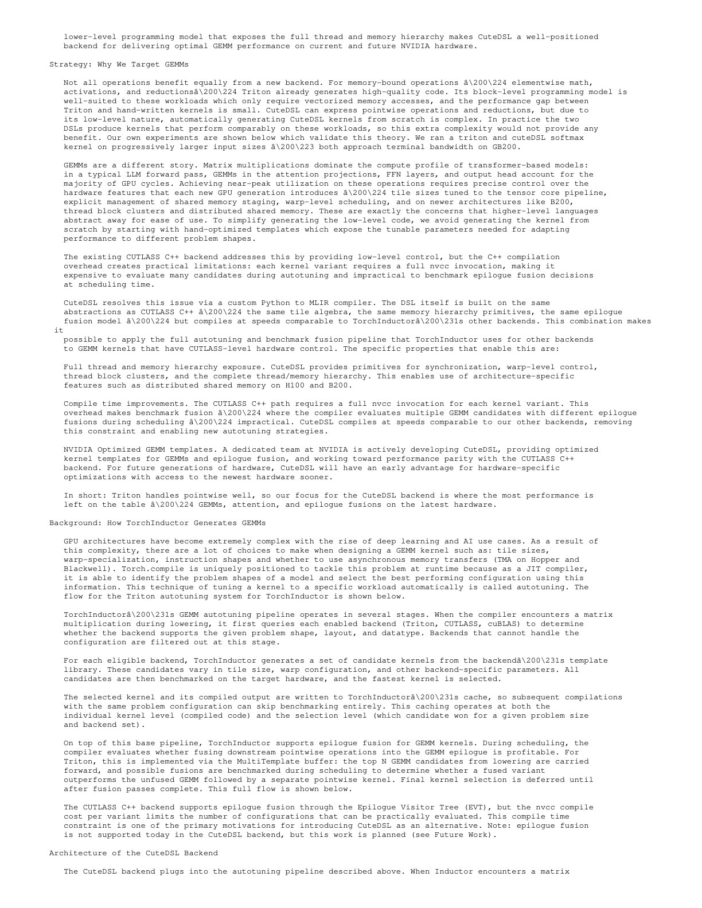
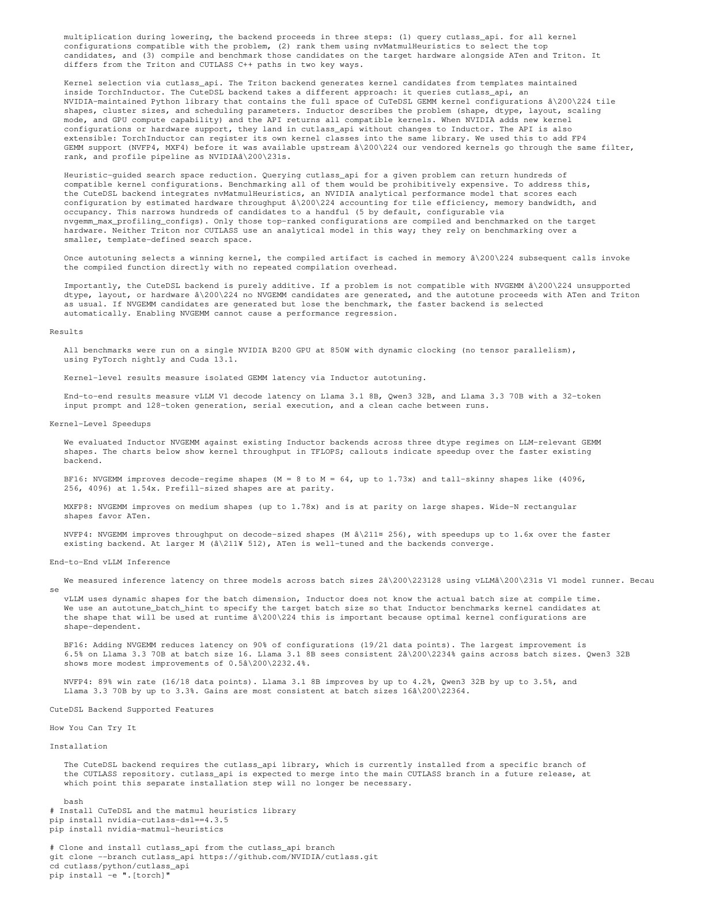
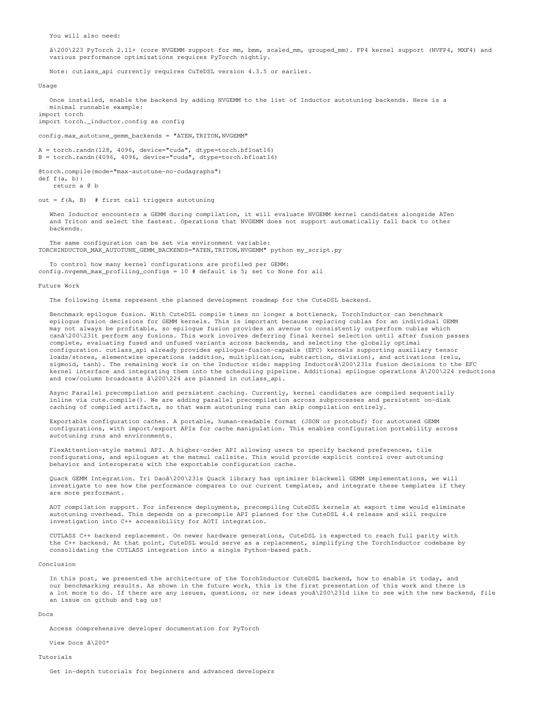
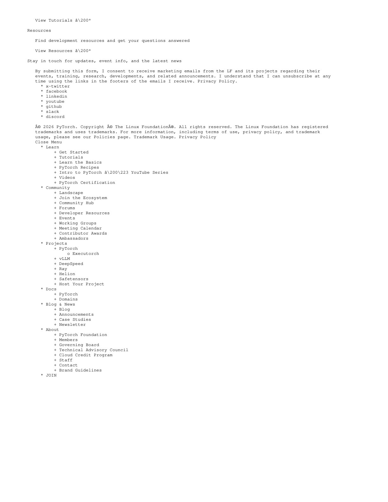

# TorchInductor CuTeDSL Backend 官方工程报告精读

## 1. 这不是“CuTeDSL 击败 Triton”的报告

PyTorch 的设计是把 ATen、Triton、CUTLASS/CuTeDSL 候选放进同一 autotuning pipeline。若 CuTeDSL：

- 不支持 dtype/layout/hardware，不生成候选；
- 支持但 benchmark 输掉，不会被选；
- 获胜才进入 cache。

因此关键架构是 portfolio + empirical selection，而不是静态指定 DSL。

## 2. 为什么 pointwise 仍留给 Triton

Pointwise、activation、reduction 多为 memory-bound。Triton 的 block-level program：

- 足够表达 vectorized/coalesced access；
- 编译器自动分配 threads；
- 代码短、维护成本低。

报告在 GB200 上比较 Triton 与 CuTeDSL softmax，二者随规模增加都接近终端带宽。CuTeDSL 可表达相同 kernel，但低层控制没有可兑现的性能空间。

## 3. 为什么 GEMM 不同

最新 GPU GEMM 的性能依赖：

- MMA instruction/tile shape；
- warp specialization；
- shared-memory stages；
- TMA；
- thread-block cluster 与 distributed shared memory；
- epilogue fusion；
- FP8/FP4 scaling layout。

这些正是 CuTe/CUTLASS 将硬件结构显式暴露的地方。Triton 更高层、更自动，但未必能立即利用每代 NVIDIA GPU 的全部专用路径。

## 4. TorchInductor 接入方式

遇到 GEMM 时：

1. 用 cutlass_api 查询与 shape、dtype、layout、compute capability 相容的 CuTeDSL configs；
2. nvMatmulHeuristics 对数百个候选排序；
3. 默认只编译 top 5；
4. 与 ATen、Triton 候选在目标 GPU 实测；
5. winner 与 compiled artifact 进入 cache。

区别在于 Triton candidates 主要由 Inductor 自己的 templates 生成；CuTeDSL configs 由 NVIDIA template/library 生态供给。

## 5. 编译时间为何重要

CUTLASS C++ 每个 variant 需要完整 nvcc compilation，候选多时很昂贵，尤其 epilogue fusion 会进一步乘大空间。CuTeDSL 使用 Python→MLIR JIT，报告称 compile time 与其他 backend 相近，使 scheduler 可以实际 benchmark 多种 fusion 决策。

这不是说 CuTeDSL compile 免费；报告的 future work 仍包括 parallel precompilation 和 persistent on-disk cache。

## 6. Kernel 结果

实验固定单 B200、850W dynamic clock、CUDA 13.1、PyTorch nightly：

- BF16：decode（$M=8\ldots64$）最高 1.73×，prefill shapes 基本持平；
- MXFP8：中等 shapes 最高 1.78×，大 shapes 持平，某些 wide-N 仍偏向 ATen；
- NVFP4：$M\le256$ 时最高 1.6×，$M\ge512$ 时 backends 收敛。

小 M decode 更能体现硬件专用 schedule；大 GEMM 时成熟库更容易接近峰值。

## 7. 端到端结果

报告用 vLLM V1、32-token prompt、生成 128 tokens、serial execution，模型为 Llama 3.1 8B、Qwen3 32B、Llama 3.3 70B。

- BF16：21 个点中 19 个 latency 下降；最大 6.5%；
- NVFP4：18 个点中 16 个获胜；单模型最大约 3.3%–4.2%。

Kernel 最高 1.78× 只带来个位数端到端提升，因为：

- 不是所有时间都在获胜 GEMM；
- attention、KV、sampling、scheduler 不变；
- 某些 shapes 由 ATen/Triton 获胜；
- batch/shape distribution 影响命中。

## 8. 使用与版本边界

快照要求/提到：

- nvidia-cutlass-dsl 4.3.5；
- nvidia-matmul-heuristics；
- 特定 cutlass_api branch；
- PyTorch 2.11+，部分 FP4 需 nightly；
- 通过 max_autotune backends 加入 NVGEMM。

这些条件变化快。复现应锁 commit/containers，而不是只记包名。

## 9. CuTeDSL 与 Triton 的实际选择

| Workload | 更合理的默认起点 | 原因 |
| --- | --- | --- |
| pointwise/reduction | Triton | 高层 tile 足够，开发快，接近带宽上限 |
| 标准成熟 GEMM | cuBLAS/ATen + autotune | 厂商库已高度优化 |
| B200 FP8/FP4 decode GEMM | CuTeDSL template | 需要最新硬件 layout/pipeline 控制 |
| 快速自定义融合 | Triton | 原型与 codegen 自动化更强 |
| 特殊 MMA/TMA/TMEM/cluster | CuTeDSL | thread/value 与 memory hierarchy 更显式 |

最稳妥策略是让真实 shape 在目标 GPU 上竞争。

## 10. 与论文材料的连接

- [Triton 论文](../triton_compiler/论文中文解读.md) 解释 block-level tiled programming 的初衷。
- [Linear Layouts](../linear_layouts/论文中文解读.md) 解释现代 Triton 的 layout codegen。
- [CuTe Layout Algebra](../cute_layout_algebra/论文中文解读.md) 解释 CuTeDSL 底层 layout/thread mapping。

报告最后的网页导航页也保存在快照中：

## 11. 常见误读

### “CuTeDSL 全面取代 Triton”

报告明确保留 Triton，并认为 pointwise/reduction 的额外 CuTeDSL 复杂度不值得。

### “NVGEMM 开启后不会回归，所以没有成本”

steady-state winner 不回归不代表没有首次编译、benchmark、依赖和 cache 成本。

### “B200 结果可外推 A100/H100”

不能。优势高度来自 Blackwell 的 FP4、cluster 和特定 tensor-core pipeline。

## 12. 复现检查点

- 锁 B200 power/clock、CUDA 13.1、nightly commit。
- 清楚说明 winner baseline 是 ATen 还是 Triton。
- 报告 cold/warm compile 与 cache。
- 对 dynamic batch 记录 autotune_batch_hint。
- 验证量化 scaling 与数值精度。
- 端到端同时报告每类 GEMM 的 backend 命中率。

## 13. 最终判断

这份报告给出的最佳实践不是押注单一 DSL，而是按层次组合：Triton 提供高生产力与通用 fused kernels，CuTeDSL/CUTLASS templates 提供最新 NVIDIA 硬件的低层控制，TorchInductor 用实测 autotuning 把选择推迟到具体 shape 和设备。

## 原文证据导航

以下页码按仓库内 PDF 的**文件页码**计，不等同于论文印刷页码。建议先读本节所指原文，再回看上面的中文解释。

- [打开原始 PDF](paper.pdf)
- [打开可检索文本](paper.txt)
