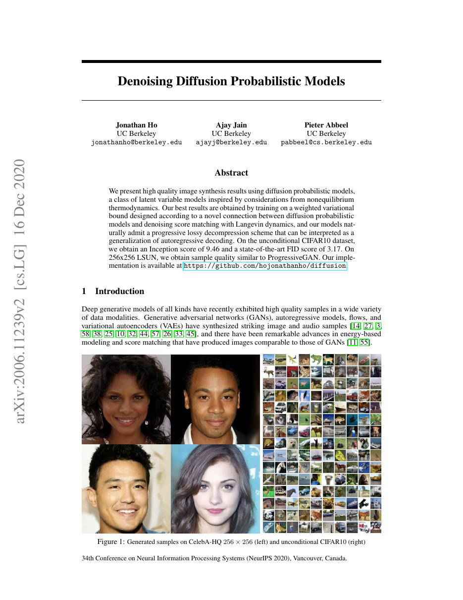
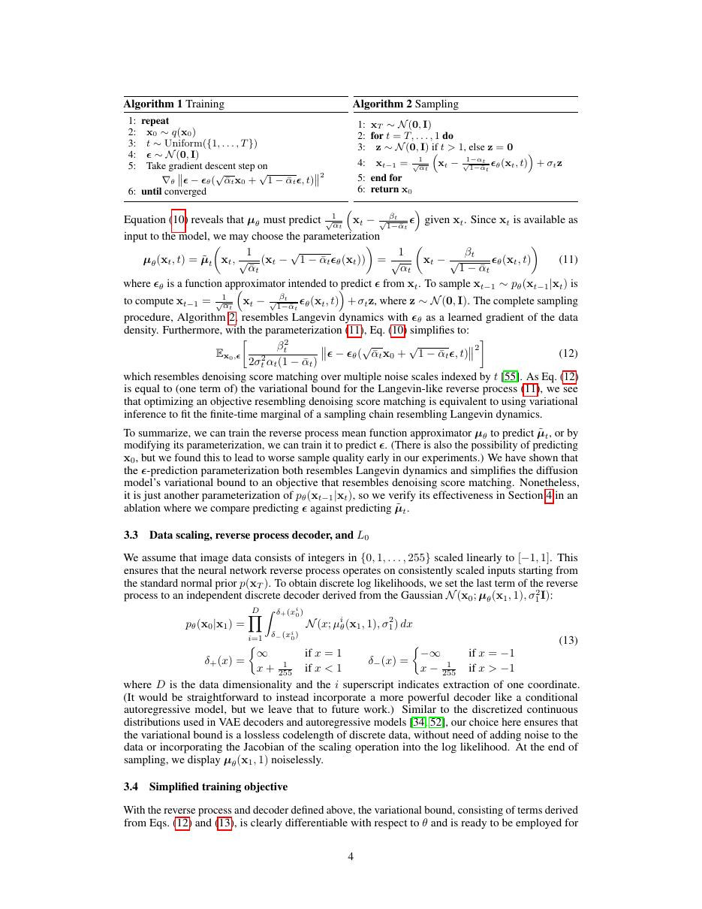
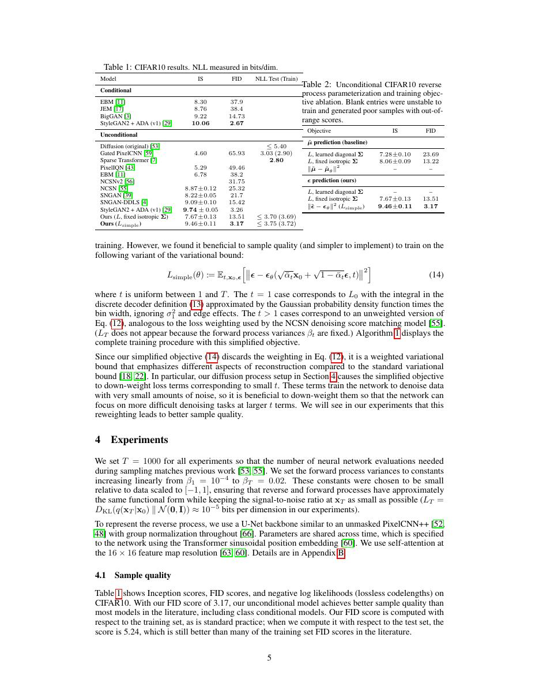
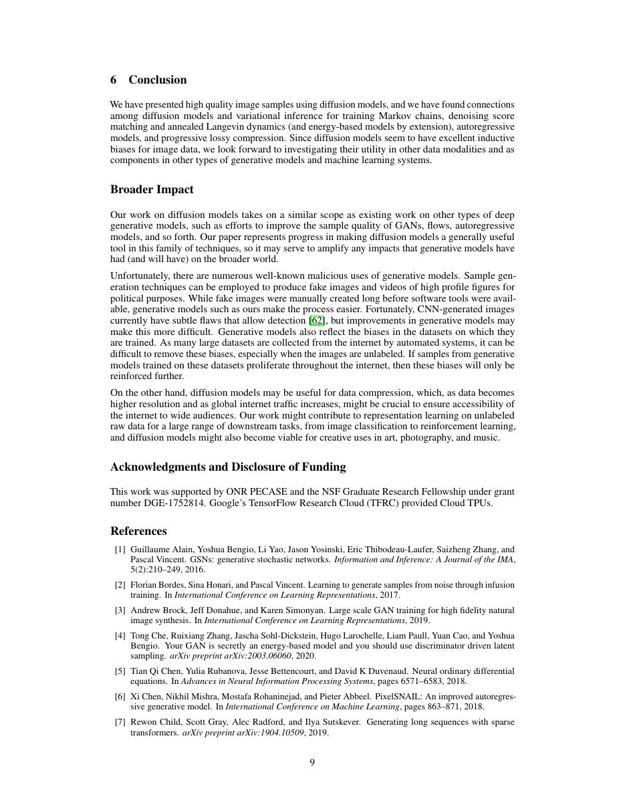

# 论文中文解读：《Denoising Diffusion Probabilistic Models》

## 一、它解决了什么

DDPM 通过固定前向加噪和学习反向去噪，把高质量生成建模转成一系列较稳定的条件高斯预测。

## 二、核心机制

前向 Markov 链逐步加入高斯噪声，反向网络常预测 ε；加权变分下界可简化为噪声预测 MSE。每一步只做小幅去噪，避免 GAN 的直接对抗博弈。

## 三、为什么成为主线

它奠定现代扩散生成主线，推动 score-based model、classifier guidance、Latent Diffusion 与 DiT。

## 四、证据应该怎样读

速度、显存、精度或 benchmark 数字只在论文给定的模型、数据、硬件、kernel 版本和评测预算下成立。跨论文比较前要统一训练 tokens、输入长度、batch、精度、采样/思考预算与是否使用工具。

## 五、局限与易误读点

原始采样要数百到上千步，延迟远高于一次前向生成；似然、感知质量和样本多样性并不完全一致。噪声 schedule 与参数化影响很大。

## 六、放进十年演进史

再读 Latent Diffusion 看如何把去噪移到压缩空间；读 DiT 看如何用 Transformer 替换 U-Net。

## 七、原文入口

[官方论文/页面](https://arxiv.org/abs/2006.11239)

## 八、原文论证链

DDPM 将复杂数据分布的生成转化为许多小的去噪步骤。前向过程按预设噪声日程逐步加入高斯噪声，最终接近标准高斯；反向过程用神经网络学习每一步的条件高斯。由于前向后验在给定 $x_0$ 时可解析，变分下界可分解为逐步 KL，训练能够从随机时间步抽样。

论文进一步发现，预测加入的噪声 $\epsilon$ 并使用简单 MSE，比直接优化完整加权变分项产生更好的样本。与 denoising score matching 的联系解释了网络为何学到每个噪声尺度上的 score。

> 原文定位：[PDF 文件第 1 页](paper.pdf#page=1) · [对应截图](rendered_figures/page-1.jpg)

## 九、前向与反向公式

定义
$$
q(x_t\mid x_{t-1})=\mathcal N(\sqrt{1-\beta_t}x_{t-1},\beta_tI).
$$
令 $\alpha_t=1-\beta_t,\ \bar\alpha_t=\prod_{s=1}^t\alpha_s$，可一次采样：
$$
x_t=\sqrt{\bar\alpha_t}x_0+\sqrt{1-\bar\alpha_t}\epsilon,\quad
\epsilon\sim\mathcal N(0,I).
$$
网络预测 $\epsilon_\theta(x_t,t)$，简化损失为
$$
L_{\rm simple}=\mathbb E_{t,x_0,\epsilon}
\|\epsilon-\epsilon_\theta(x_t,t)\|^2.
$$
采样时再从 $x_T$ 逐步应用学习到的反向均值。

> 原文定位：[PDF 文件第 4 页](paper.pdf#page=4) · [对应截图](rendered_figures/page-4.jpg)

## 十、实验怎样读

CIFAR-10 的 FID/Inception Score 与渐进采样图证明样本质量；负对数似然/无损压缩分析则展示概率模型视角。论文承认高质量与似然并不完全一致：重加权目标更利于视觉质量，而完整 VLB 更贴近编码长度。与 GAN 比较必须注意采样速度相差很大。

> 原文定位：[PDF 文件第 5 页](paper.pdf#page=5) · [对应截图](rendered_figures/page-5.jpg)

## 十一、复现检查

- 时间步索引、$\beta_t$、$\bar\alpha_t$ 的 off-by-one 错误最常见。
- 输入缩放、方差选择、时间 embedding 和 EMA 均需与配置一致。
- 训练时随机抽一个 $t$，无需真的顺序跑完整前向链。
- 评测 FID 应固定样本数、预处理和统计实现。

## 十二、常见误读

前向加噪无需学习，学习的是反向去噪条件。简单噪声 MSE 与 ELBO 有推导关系，但并非完整似然目标逐项等权实现。原始 DDPM 采样需要许多步骤；DDIM、latent diffusion 和现代 solver 是后续加速。

> 原文定位：[PDF 文件第 9 页](paper.pdf#page=9) · [对应截图](rendered_figures/page-9.jpg)

## 原文证据导航

以下页码按仓库内 PDF 的**文件页码**计，不等同于论文印刷页码。建议先读本节所指原文，再回看上面的中文解释。

- [打开原始 PDF](paper.pdf)
- [打开可检索文本](paper.txt)

| 中文笔记中的证据 | 原文位置 | 复核重点 |
|---|---|---|
| 原文首页、摘要与问题定义 | [PDF 文件第 1 页](paper.pdf#page=1) · [截图](rendered_figures/page-1.jpg) | 回到该页上下文，复核定义、图表或实验论证 |
| 核心方法、架构或算法定义所在关键页 | [PDF 文件第 4 页](paper.pdf#page=4) · [截图](rendered_figures/page-4.jpg) | 回到该页上下文，复核定义、图表或实验论证 |
| 实验、结果或关键分析所在原文页 | [PDF 文件第 5 页](paper.pdf#page=5) · [截图](rendered_figures/page-5.jpg) | 回到该页上下文，复核定义、图表或实验论证 |
| 讨论、结论或补充分析所在原文页 | [PDF 文件第 9 页](paper.pdf#page=9) · [截图](rendered_figures/page-9.jpg) | 回到该页上下文，复核定义、图表或实验论证 |
