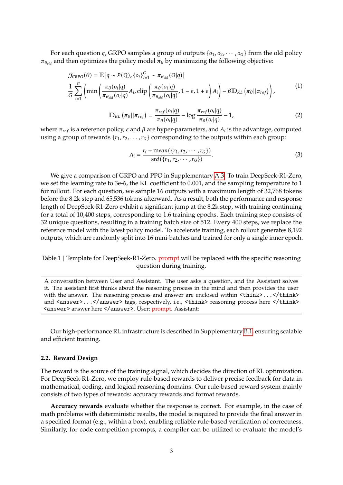
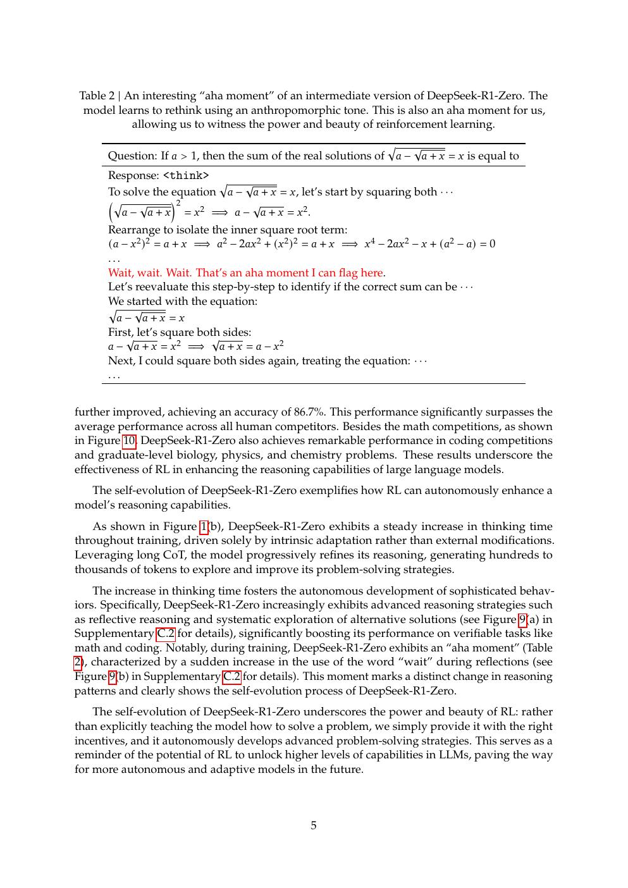
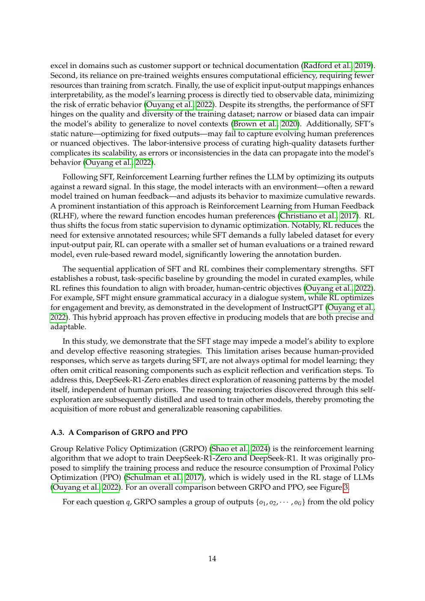
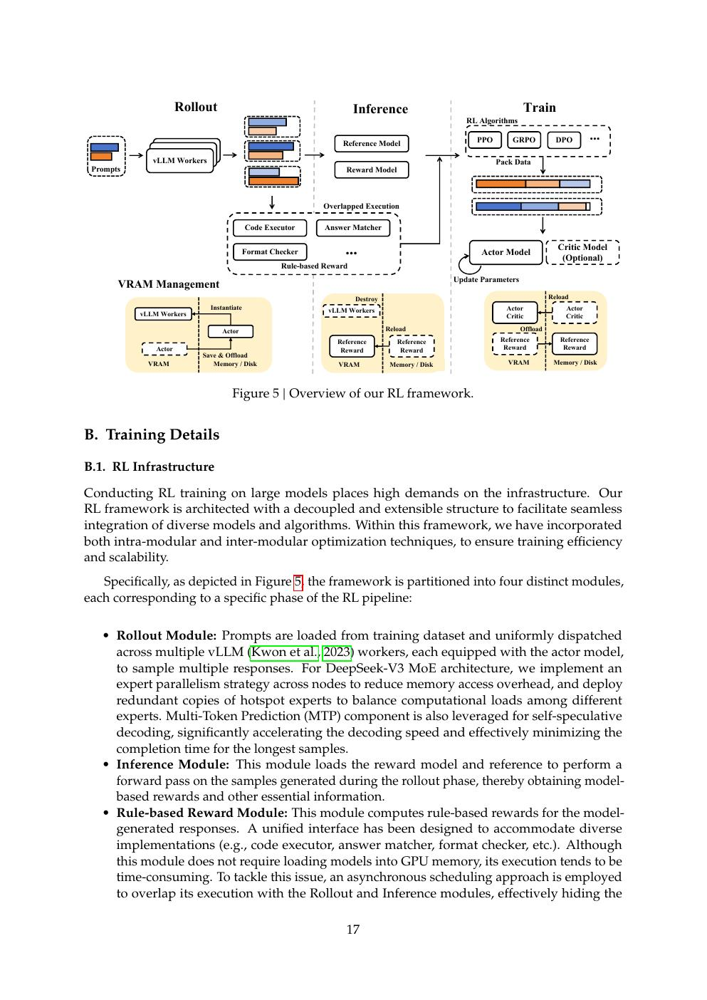
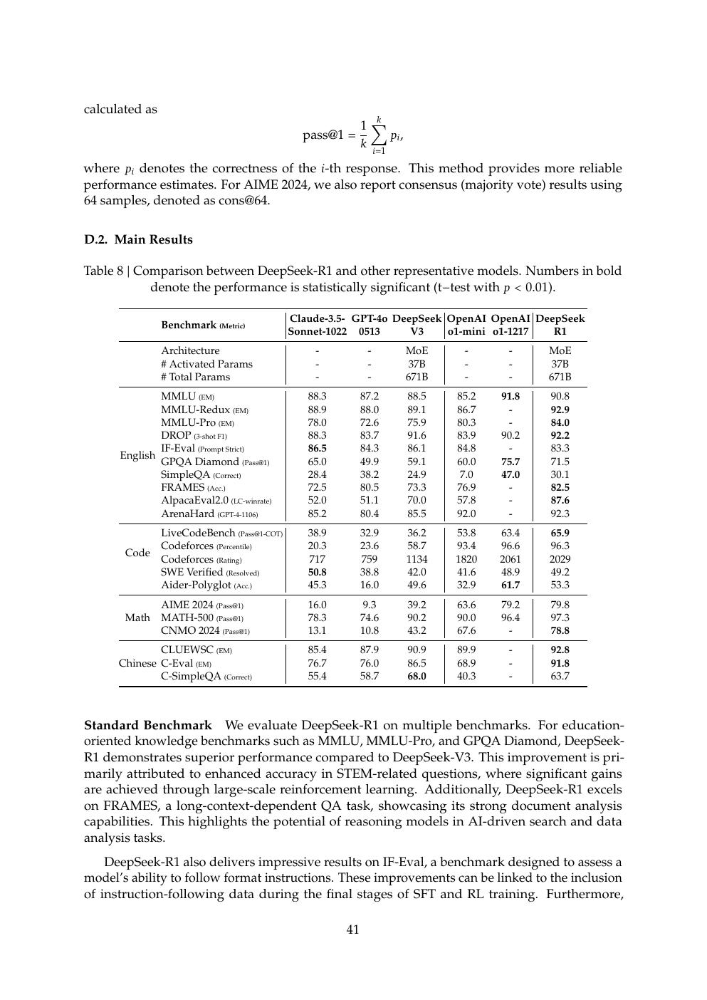

# 论文中文解读：《DeepSeek-R1》

## 一、先把“架构创新”和“后训练创新”分开

DeepSeek-R1 继承 DeepSeek-V3-Base 的 MLA、DeepSeekMoE 和 671B/37B 架构。它最重要的创新发生在训练目标与数据流程：让模型在可验证任务上反复采样、按答案正确性给 reward，并用 GRPO 更新策略。把 R1 描述成一种新的 attention 或 MoE 架构是不准确的。

论文首次公开于 2025 年 1 月，arXiv:2501.12948；本地 PDF 是后续扩展版，包含更多 RL 框架、成本、安全和测试时扩展分析。材料包括 [PDF](paper.pdf)、[文本](paper.txt) 与 [概要](论文概要.md)。

## 二、R1-Zero：最干净也最容易被过度解读的实验

R1-Zero 从 V3-Base 直接开始 RL，没有先做 reasoning SFT。数学题可由最终答案规则验证，代码题可由编译器/测试验证。随着训练推进，模型平均思考长度增长，AIME 表现提升，还出现“wait”“recheck”等反思行为。

这个实验支持的结论是：基础模型已经包含潜在推理能力，结果奖励能改变生成策略并把更长搜索变成更高成功率。它不证明：

- 模型从零学会了数学知识；知识主要来自预训练。
- 所有 self-reflection 文本都忠实描述内部计算。
- 只用 RL 就能训练一个通用、可读、安全的助手。

事实上 R1-Zero 的重复、语言混合和可读性问题正说明最后一点不成立。

## 三、Figure 2：R1 的多阶段 pipeline

正式 R1 的流程可理解为“先规定一种最低可读格式，再放大搜索能力，最后补回通用助手能力”：

1. **Cold-start SFT**：少量高质量长 CoT 数据，建立格式、可读性与基本推理模式。
2. **Reasoning-oriented RL**：在数学、代码、逻辑等可验证任务上扩大推理能力，并加入语言一致性 reward。
3. **Rejection sampling + SFT**：从 RL checkpoint 采样，保留正确且质量较好的轨迹，再混入写作、事实问答、自我认知等非推理数据。
4. **All-scenario RL**：同时优化 helpfulness、harmlessness 和 reasoning。

这也是为什么“R1 就是 GRPO”过于简化。算法、可验证环境、采样系统、数据筛选和阶段顺序共同决定结果。

## 四、GRPO 到底省了什么

PPO 常训练 policy、reference、reward、value 四类模型。GRPO 取消独立 value model：对同一问题采样一组输出 `G`，把每个 reward 用组内均值/标准差归一化，作为相对 advantage。

直觉是：不估计“这个状态绝对值多少”，而比较“同一道题的这个回答比同组回答好多少”。这样省掉 critic 的训练与显存，但 rollout 成本仍然很高，而且组内估计方差、reward 稀疏和长度偏差仍需处理。

论文的 clipped objective 还包含 policy ratio 与 KL regularization。GRPO 不是简单的“按答对/答错做监督学习”。

## 五、RL 系统：生成才是重成本

扩展版把系统拆成 policy training、reference/reward、rollout generation 与数据调度等模块。reasoning 输出可达数万 token，rollout 往往比一次反向传播更贵；policy 更新后，推理引擎还要高效同步新权重。

因此 reasoning RL 的系统瓶颈包括：

- 长序列 KV cache 与 decode 吞吐；
- 一题多样本造成的并行采样量；
- policy/rollout 引擎间权重更新；
- reward verification 的沙箱与超时；
- off-policy 程度与旧样本复用。

## 六、性能表该怎样读

R1 在 AIME、MATH、Codeforces、GPQA 等任务上达到当时开放模型前列，并与 o1 系列比较。reasoning benchmark 对评测协议极敏感：

- `pass@1` 是单次采样平均，`cons@k` 是多次采样后投票；
- temperature、最大输出 token 与是否允许工具都会改变结果；
- AIME 只有少量题，年度版本差异很大；
- 模型生成更长通常消耗更多 test-time compute。

所以要比较“同预算下的正确率”，而不是只比较不受限的最高分。

## 七、蒸馏为什么重要

R1 用教师生成的 reasoning 轨迹微调 Qwen/Llama 基座，发布 1.5B–70B 多个 dense 模型。论文发现，针对小模型，直接蒸馏强模型轨迹往往优于从同一小模型出发做大规模 RL。

蒸馏传递的是输出分布、解题模板和中间推理模式，不是把 671B 模型全部知识无损压进 7B/32B。distill 模型的许可证还继承各自基座约束，不能只看 DeepSeek 仓库的总说明。

## 八、失败模式比“aha moment”更有研究价值

- **可读性**：RL 优化正确性时，模型可能生成对 evaluator 有效、对人不友好的轨迹。
- **语言混合**：长 CoT 中切换语言可能不影响答案 reward，却降低使用质量。
- **reward hacking**：模型找到提高 reward 而非真实能力的捷径；扩展版给出 reward 上升但实际表现下降的例子。
- **overthinking**：简单题也消耗大量 token，正确后继续修改。
- **开放任务 reward**：没有确定 verifier 时依赖 reward model，又引入 judge 偏差。

## 九、与 OpenAI、Kimi、MiniMax 的比较坐标

| 路线 | 公开到什么程度 | 代表优化 |
|---|---|---|
| OpenAI o1 | 系统卡公开，架构/训练细节很少 | large-scale RL + hidden CoT |
| DeepSeek-R1 | 权重、报告与多阶段流程公开，训练数据/代码不完整 | GRPO + verifier + cold start |
| Kimi k1.5 | 报告公开，强调 long-context RL/partial rollout | online mirror descent 路线 |
| MiniMax-M1 | 权重与报告公开 | CISPO + hybrid lightning attention |

这些方法的名字不同，但共同问题是：如何在长 rollout 下稳定地做 policy update，并把 test-time compute 转成正确率。

## 十、与 Ascend 的关系

R1 本身没有为 Ascend 专门设计；它继承 V3 的 MoE/MLA/MTP workload。Ascend 的挑战主要发生在 serving：671B 权重驻留、大规模专家通信、长 CoT decode、MTP 验证和 KV 管理。CloudMatrix384 论文正是对这些系统问题的回答。

## 十一、原文入口

[arXiv](https://arxiv.org/abs/2501.12948) · [官方仓库](https://github.com/deepseek-ai/DeepSeek-R1)

## 原文证据导航

以下页码按仓库内 PDF 的**文件页码**计，不等同于论文印刷页码。建议先读本节所指原文，再回看上面的中文解释。

- [打开原始 PDF](paper.pdf)
- [打开可检索文本](paper.txt)

| 中文笔记中的证据 | 原文位置 | 复核重点 |
|---|---|---|
| R1-Zero 训练中 AIME 表现与思考长度变化 | [PDF 文件第 3 页](paper.pdf#page=3) · [截图](rendered_figures/page-3.jpg) | 回到该页上下文，复核定义、图表或实验论证 |
| DeepSeek-R1 的 cold start、两轮 RL 与两轮 SFT 流程 | [PDF 文件第 5 页](paper.pdf#page=5) · [截图](rendered_figures/page-5.jpg) | 回到该页上下文，复核定义、图表或实验论证 |
| PPO 与 GRPO 的结构比较 | [PDF 文件第 14 页](paper.pdf#page=14) · [截图](rendered_figures/page-14.jpg) | 回到该页上下文，复核定义、图表或实验论证 |
| R1 扩展版公开的 RL 系统模块 | [PDF 文件第 17 页](paper.pdf#page=17) · [截图](rendered_figures/page-17.jpg) | 回到该页上下文，复核定义、图表或实验论证 |
| R1 与其他模型在数学、代码和知识任务上的比较 | [PDF 文件第 41 页](paper.pdf#page=41) · [截图](rendered_figures/page-41.jpg) | 回到该页上下文，复核定义、图表或实验论证 |
