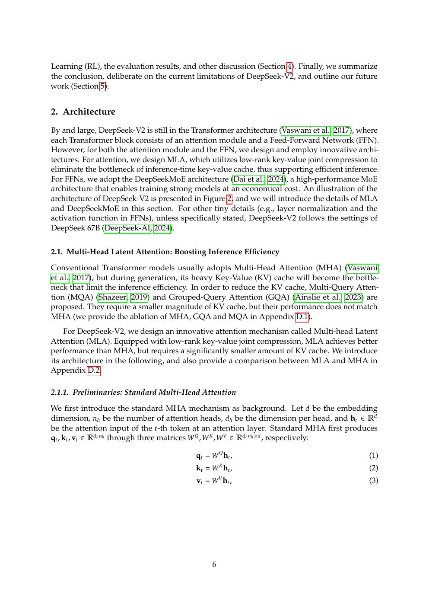
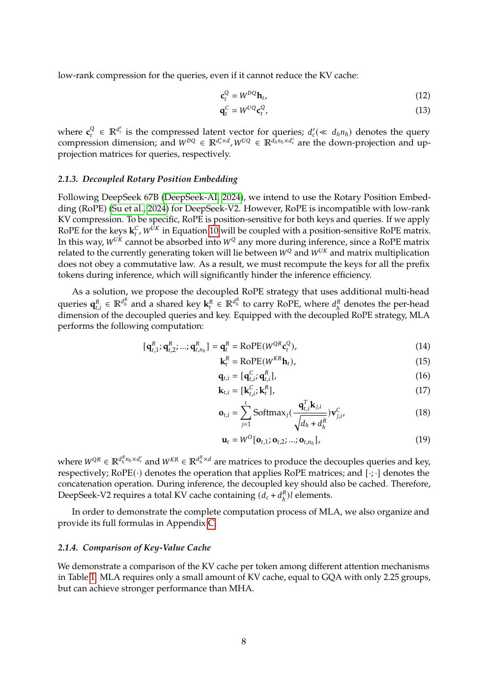
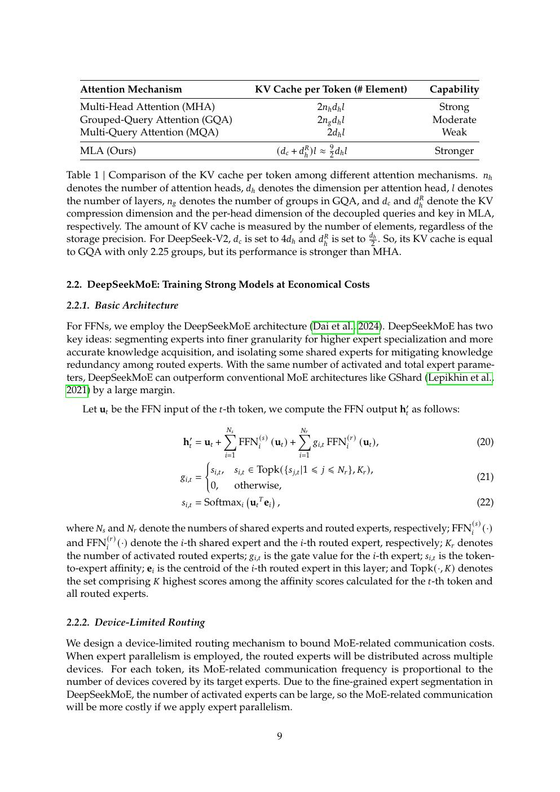
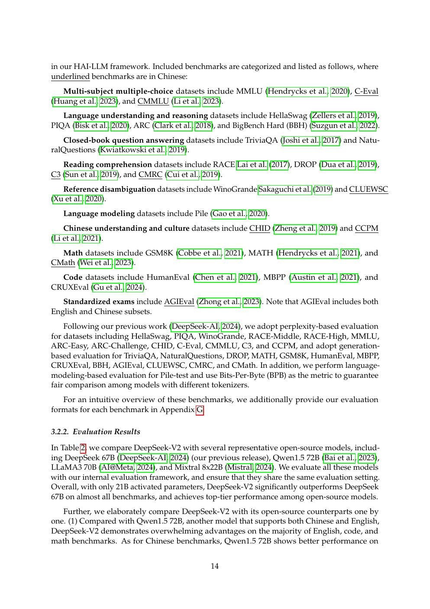
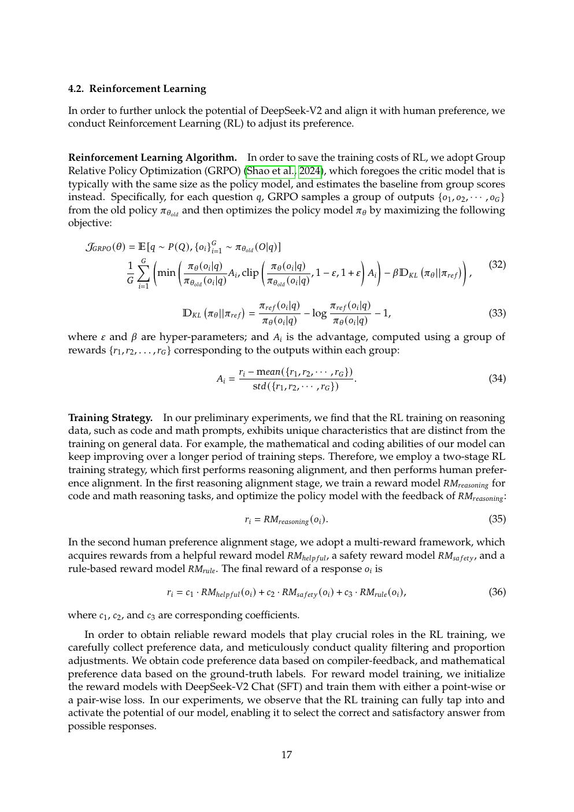

# 论文中文解读：《DeepSeek-V2》

## 一、为什么 V2 是 DeepSeek 架构主线的起点

DeepSeek-V2 同时确立了后续 V3/R1 的两根支柱：FFN 侧用 DeepSeekMoE 扩展总参数，attention 侧用 MLA 压缩 KV cache。R1 的“推理能力”来自后训练，但它运行时的主体架构仍是这条路线。

论文于 2024 年 5 月公开，模型为 236B 总参数、21B 激活参数、128K context。本地材料包括 [PDF](paper.pdf)、[文本](paper.txt) 与 [概要](论文概要.md)。

## 二、Figure 2：一个 block 里发生什么



每层仍是 decoder Transformer，但 attention 不再保存每个 head 的完整 K/V；FFN 也不是单一 dense MLP，而是 shared experts 加 routed experts。两个稀疏/压缩方向分别针对不同成本：

- MLA 针对随 batch、sequence length 增长的 KV cache；
- MoE 针对随参数规模增长的 FFN FLOPs。

二者叠加后，新的主瓶颈会转向专家通信、低秩 projection、小矩阵 kernel 与系统调度。

## 三、MLA：缓存 latent，而不是完整 K/V



标准 MHA 为每个 head 缓存 key 和 value。GQA/MQA 通过共享 KV heads 减少缓存，但也限制表达。MLA 的做法是先把 hidden state 压成低维 `c_t^KV`，再从 latent 恢复各 head 所需内容：

```text
h_t ──down projection──> c_t^KV
                         ├─up projection──> content keys
                         └─up projection──> values
```

如果 decode 时真的每步把 latent 展开成完整 K/V，再缓存或搬运，收益会消失。MLA 利用矩阵结合律，把可吸收的 projection 合并到 query/output 权重中，使 cache 主要保留低维 latent。

### RoPE 为什么要解耦

RoPE 对 query/key 应用位置相关旋转。这个变换与 token 位置相关，不能简单吸收到固定 projection 权重。V2 因此把 key 分成 content 部分和较小的 RoPE 部分：内容走低秩 latent，位置分支单独缓存/计算。

论文表格给出的理论 cache 对比显示，MLA 的每 token KV cache 接近只有约 2.25 个 GQA groups，并相对 DeepSeek 67B 配置降低 93.3%。这是存储口径，不是所有 latency 的 93.3% 降幅。

## 四、DeepSeekMoE 在 V2 中怎样变化



V2 继承 [DeepSeekMoE](../deepseek_moe/论文中文解读.md) 的细粒度专家和 shared expert。新增的重要系统约束是 device-limited routing：top-k 不只看 expert score，还限制 token 最多跨越多少设备。

这是一种算法—系统折中。纯粹按概率选 expert 可能让一个 token 的若干 expert 散落在许多设备，产生大量小消息；限制设备数能降低通信，却可能错过全局分数稍高的 expert。论文用负载损失与路由规则在质量和通信之间平衡。

## 五、训练、长上下文与对齐

V2 在 8.1T tokens 上预训练，并用 YaRN 分阶段扩展到 128K。长 context 能力不能只凭 RoPE scaling 宣称，论文用 Needle-in-a-Haystack 验证检索；但 NIAH 是单一事实召回测试，不能代表长文推理、跨段聚合和长程 agent memory。

后训练包括 SFT 和基于 GRPO 的 RL。GRPO 不训练独立 value model，而在同一 prompt 的多份采样内计算相对 advantage。V2 已经使用这一方向，R1 才把它扩大到可验证推理任务并成为主角。

## 六、性能证据



论文报告：

- 236B 总参数但每 token 激活 21B；
- 训练 8.1T tokens 的成本低于同等 dense 总参数；
- 相对 DeepSeek 67B，KV cache 显著下降，最大生成吞吐达到 5.76×；
- 多项中英文、代码与数学 benchmark 优于当时同级开放模型。

“最大 5.76×”是特定 serving 配置下的峰值。batch、prompt/output length、KV 精度、tensor/expert parallelism、kernel 与并发都会改变结果。

## 七、对齐结果应怎样看



对齐表格混合了静态 benchmark、GPT-4 judge 与开放式对话指标。它们可说明总体趋势，但不要把相差 1–2 分视为确定的架构因果。V2 最可复用的知识仍是 MLA 与通信约束下的 MoE，而不是历史排行榜。

## 八、局限与容易误读的点

- MLA 不是简单等同 MQA：它缓存 latent，同时保留多头表达和独立 RoPE 分支。
- “21B active”不等于只需存 21B 权重；部署仍需放置 236B 总权重，除非做分层/远程存储。
- MoE 降低计算不自动降低通信；device-limited routing 正是在补这个缺口。
- NIAH 满分不代表 128K 内每种推理都可靠。
- 推理引擎若没有 MLA 专用 kernel，可能出现理论 cache 小、实际速度不理想。

## 九、与 Ascend 的直接关联

V2 定义了后来 Ascend 需要优化的 workload：latent KV 让缓存容量下降，但引入 MLA projection/fusion；细粒度 MoE 让每 token FLOPs 下降，却放大 dispatch/combine。CloudMatrix384 用 UB + EP320 解决后一类问题，用定制 MLA operator 与 PDC cache pool 解决前一类问题。

## 十、原文入口

[arXiv](https://arxiv.org/abs/2405.04434) · [官方仓库](https://github.com/deepseek-ai/DeepSeek-V2)


## 原文证据导航

以下页码按仓库内 PDF 的**文件页码**计，不等同于论文印刷页码。建议先读本节所指原文，再回看上面的中文解释。

- [打开原始 PDF](paper.pdf)
- [打开可检索文本](paper.txt)

| 中文笔记中的证据 | 原文位置 | 复核重点 |
|---|---|---|
| DeepSeek-V2 的 MLA + DeepSeekMoE 总体结构 | [PDF 文件第 6 页](paper.pdf#page=6) · [截图](rendered_figures/page-6.jpg) | 回到该页上下文，复核定义、图表或实验论证 |
| MLA 与 MHA/GQA/MQA 的结构及 KV cache 比较 | [PDF 文件第 8 页](paper.pdf#page=8) · [截图](rendered_figures/page-8.jpg) | 回到该页上下文，复核定义、图表或实验论证 |
| DeepSeekMoE、device-limited routing 与负载均衡 | [PDF 文件第 9 页](paper.pdf#page=9) · [截图](rendered_figures/page-9.jpg) | 回到该页上下文，复核定义、图表或实验论证 |
| 基础模型评测与训练/推理效率 | [PDF 文件第 14 页](paper.pdf#page=14) · [截图](rendered_figures/page-14.jpg) | 回到该页上下文，复核定义、图表或实验论证 |
| SFT/RL 模型与开放模型的对齐评测 | [PDF 文件第 17 页](paper.pdf#page=17) · [截图](rendered_figures/page-17.jpg) | 回到该页上下文，复核定义、图表或实验论证 |
