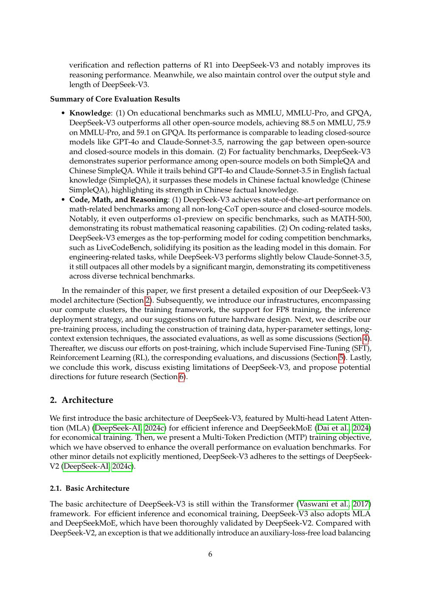
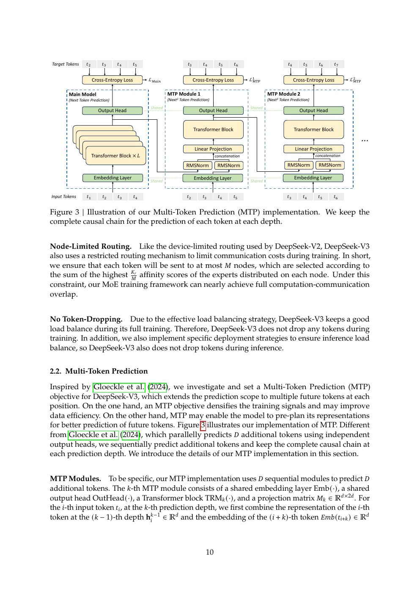
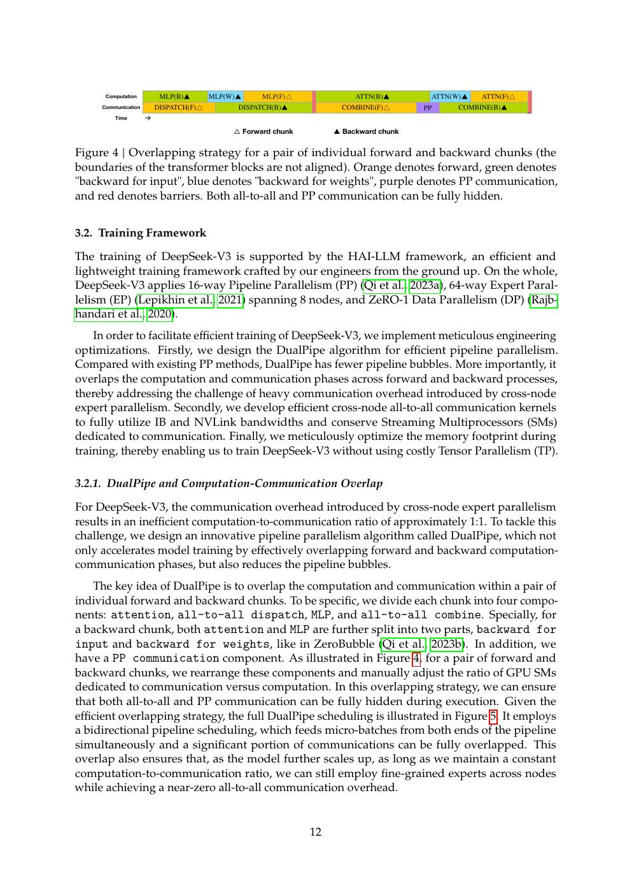
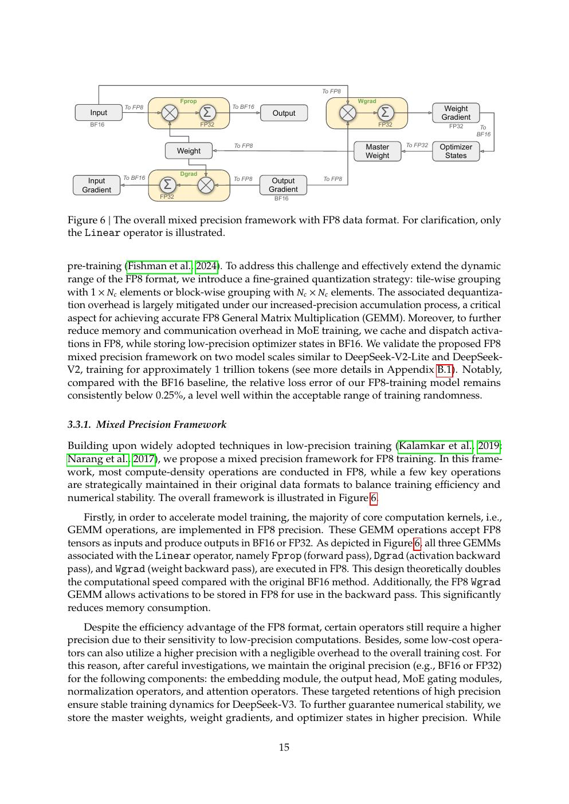
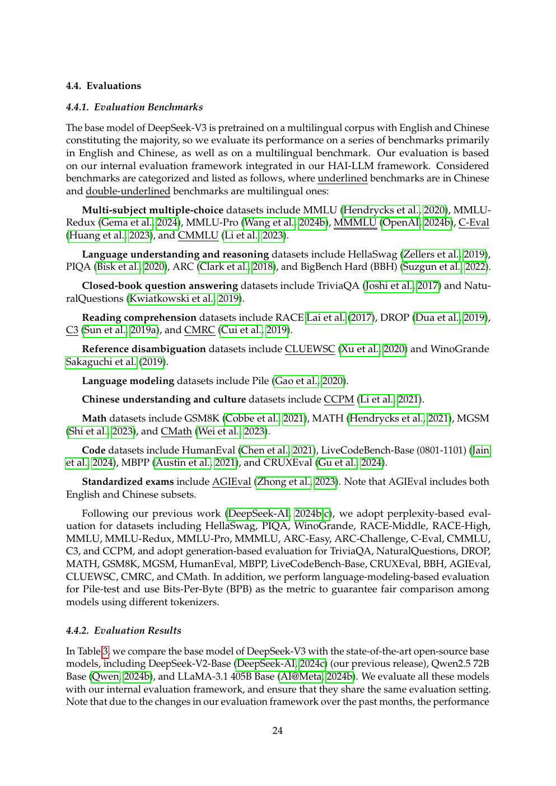
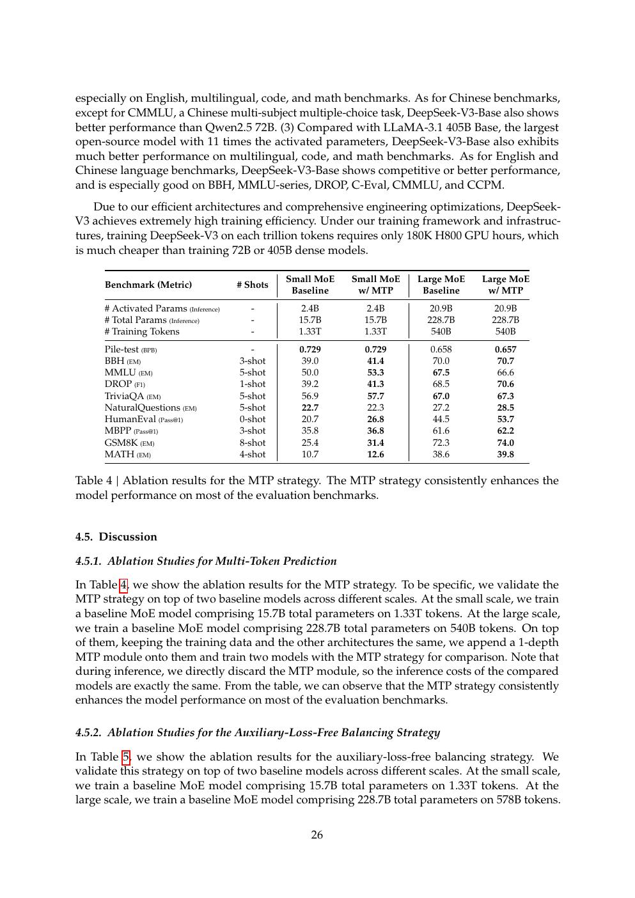

# 论文中文解读：《DeepSeek-V3 Technical Report》

## 一、先给结论

V3 最值得学的不是“低价训练了一个 671B 模型”这句口号，而是一组闭环：模型结构制造的效率机会与系统问题，被路由策略、pipeline、all-to-all kernel、FP8 和部署设计逐一接住。只复现 MLA/MoE 配置而没有训练系统，不会自动复现成本；只看系统优化而忽略路由与 MTP，也解释不了质量。

论文首次公开于 2024-12，arXiv:2412.19437。本地有 [PDF](paper.pdf)、[文本](paper.txt) 和 [概要](论文概要.md)。

## 二、总体架构：V2 的延续与三项升级



V3 仍以 MLA + DeepSeekMoE 为骨架：61 层、671B 总参数、37B 激活参数，256 routed experts、1 shared expert，每 token 选择 8 个 routed experts。真正新增的是：

1. expert load balancing 从显著辅助损失改为动态 bias；
2. 训练目标加入 Multi-Token Prediction；
3. 训练基础设施面向大规模 MoE 重新设计。

### Auxiliary-loss-free 并非“没有任何平衡机制”

路由仍按 affinity score 选择 expert，但每个 expert 维护一个 bias。若某 expert 近期过载，bias 下调；负载不足则上调。bias 参与 top-k 选择，却不进入最终 gating 权重，因此减少平衡目标对主训练梯度的直接干扰。

论文仍使用很小的 sequence-wise balance loss 防止单个序列内极端失衡。所以更准确的说法是“主要平衡信号不再依赖 auxiliary loss”，不是绝对零辅助约束。

## 三、MTP：训练信号与推测解码要分开理解



标准 LM 只让当前位置预测 `t+1`。V3 依次构造多个 MTP module，预测 `t+2、t+3...`，并共享输出 head。它可能带来两类收益：

- 训练时：每段文本提供更密集的监督，迫使 hidden state 包含更前瞻的信息；
- 推理时：MTP head 可提议多个未来 token，由主模型验证，形成 speculative decoding。

训练后可以移除 MTP 模块而保留主模型质量收益。部署加速则必须计算接受率、额外 head 成本与验证 batch；不能把论文里的训练消融直接当作推理 speedup。

## 四、DualPipe：MoE pipeline 的目标是覆盖通信



传统 pipeline 在 stage 边界有 bubble，MoE 又加入 expert all-to-all。DualPipe 从 pipeline 两端同时送入 microbatches，让一方向的 forward 与另一方向的 backward/通信重叠，并把 backward 拆成 input-gradient 与 weight-gradient 阶段。

代价是每个 stage 要容纳双向模型 chunk，参数/optimizer memory 管理更复杂。论文表格比较 bubble 和内存，表明它不是无条件支配所有方案；它在通信可被计算覆盖、stage 数和 microbatch 足够时最有价值。

## 五、FP8 训练不是简单把 dtype 改成 FP8



V3 对主要 GEMM 使用 FP8，但敏感组件保留 BF16/FP32，并做细粒度量化：activation 按 tile、weight 按 block 设 scale；累加途中提高精度，避免长 reduction 的误差集中；部分 activation 和通信也低精度存储。

因此“FP8 训练”包含至少四个问题：什么量化、scale 粒度、在哪种精度累加、何处保留高精度。硬件只有 FP8 Tensor Core 并不足以复现数值稳定性。

## 六、为什么论文专门写硬件建议

DeepSeekMoE 的计算被分散到许多小 expert GEMM，跨节点 all-to-all 又是低时延敏感路径。V3 建议未来硬件提供更强的网络、通信/计算协同和适配低精度/小矩阵的算力。

这段与 Ascend CloudMatrix 直接呼应：CloudMatrix 用 UB、AIV-direct 与大规模 EP 处理 dispatch/combine，用定制 INT8 GEMM/MLA kernel 处理矩阵形状。它不证明某硬件天然更适合，而说明模型架构会重新定义系统瓶颈。

## 七、预训练结果与消融



V3 在 14.8T tokens 上预训练，分阶段延长到 128K。基础模型表覆盖知识、代码、数学和中英文任务。论文的 MTP 消融显示多项任务一致改善；负载均衡消融显示 bias 方法在质量与负载间优于较强的 auxiliary loss 基线。

注意这些消融在较小训练规模或固定配置上完成。把它们扩到完整 671B 是合理工程推断，但并非每个组合都有完整 factorial experiment。

## 八、训练成本怎样正确解释

论文报告：

```text
pre-training: 2.664M H800 GPU hours
context extension + post-training: 约 0.124M
total: 2.788M H800 GPU hours
```

用 2 美元/GPU-hour 得到约 557.6 万美元，只是租赁算力的假设账面值。它不含早期实验、数据工程、人员、存储、网络、失败 run、推理和机房资本成本。更可靠的比较指标是 GPU hours、tokens、MFU 与训练配置，而不是传播最广的美元数。

## 九、后训练与 R1 的边界



V3 的 post-training 使用 SFT、规则/模型 reward 和 GRPO，并从早期 DeepSeek-R1 模型蒸馏长 CoT 模式。V3 报告中的“reasoning improvement”不等于完整 R1 pipeline；R1 论文进一步研究无 SFT 的 R1-Zero、cold start、两轮 RL/两轮 SFT 和 distillation。

## 十、最重要的局限

- 没有完整公开 14.8T 数据配方与训练 pipeline，难以做严格成本复现。
- FP8 与通信 kernel 高度 H800-specific；异构硬件必须重新优化。
- 公开权重让推理可复现，不等于训练过程完全开源。
- 历史 benchmark 接近闭源模型不代表统一提示、统一版本下的永久排名。
- MoE 总参数需要存储和通信；37B active 只描述每 token 计算，不描述模型驻留成本。

## 十一、推荐连读

- [DeepSeekMoE](../deepseek_moe/论文中文解读.md)：专家结构来源。
- [DeepSeek-V2](../deepseek_v2/论文中文解读.md)：MLA 推导与 cache 比较更完整。
- [DeepSeek-R1](../deepseek_r1/论文中文解读.md)：推理后训练。
- [CloudMatrix384](../ascend_cloudmatrix384/论文中文解读.md)：这些特性在 Ascend 超节点上如何服务化。

## 十二、原文入口

[arXiv](https://arxiv.org/abs/2412.19437) · [官方仓库](https://github.com/deepseek-ai/DeepSeek-V3) · [DualPipe](https://github.com/deepseek-ai/DualPipe)


## 原文证据导航

以下页码按仓库内 PDF 的**文件页码**计，不等同于论文印刷页码。建议先读本节所指原文，再回看上面的中文解释。

- [打开原始 PDF](paper.pdf)
- [打开可检索文本](paper.txt)

| 中文笔记中的证据 | 原文位置 | 复核重点 |
|---|---|---|
| DeepSeek-V3 的基础架构 | [PDF 文件第 6 页](paper.pdf#page=6) · [截图](rendered_figures/page-6.jpg) | 回到该页上下文，复核定义、图表或实验论证 |
| Multi-Token Prediction 模块 | [PDF 文件第 10 页](paper.pdf#page=10) · [截图](rendered_figures/page-10.jpg) | 回到该页上下文，复核定义、图表或实验论证 |
| DualPipe 双向 pipeline 调度 | [PDF 文件第 12 页](paper.pdf#page=12) · [截图](rendered_figures/page-12.jpg) | 回到该页上下文，复核定义、图表或实验论证 |
| V3 的 FP8 混合精度框架 | [PDF 文件第 15 页](paper.pdf#page=15) · [截图](rendered_figures/page-15.jpg) | 回到该页上下文，复核定义、图表或实验论证 |
| 基础模型评测与长上下文结果 | [PDF 文件第 24 页](paper.pdf#page=24) · [截图](rendered_figures/page-24.jpg) | 回到该页上下文，复核定义、图表或实验论证 |
| V3 chat 模型及后训练结果 | [PDF 文件第 26 页](paper.pdf#page=26) · [截图](rendered_figures/page-26.jpg) | 回到该页上下文，复核定义、图表或实验论证 |
