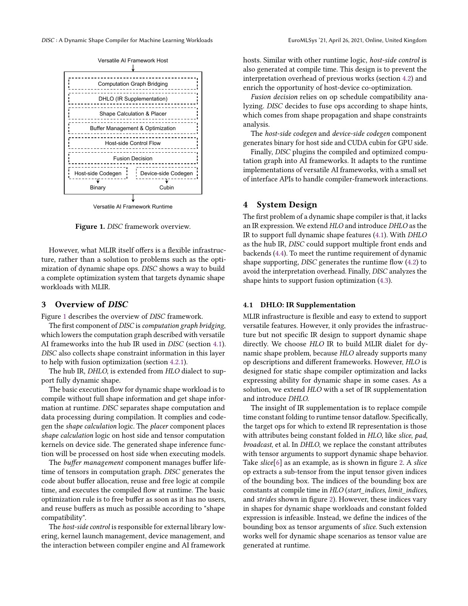
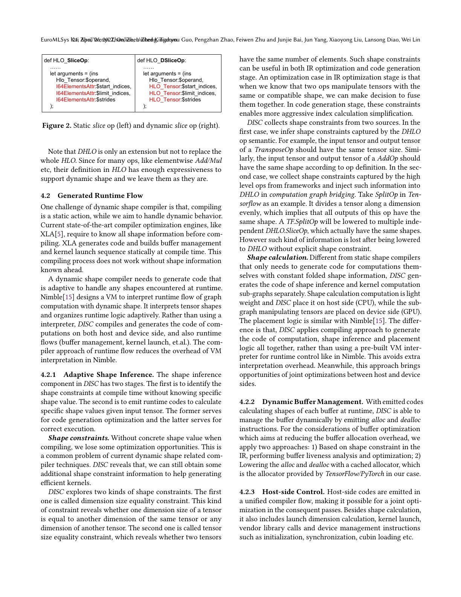
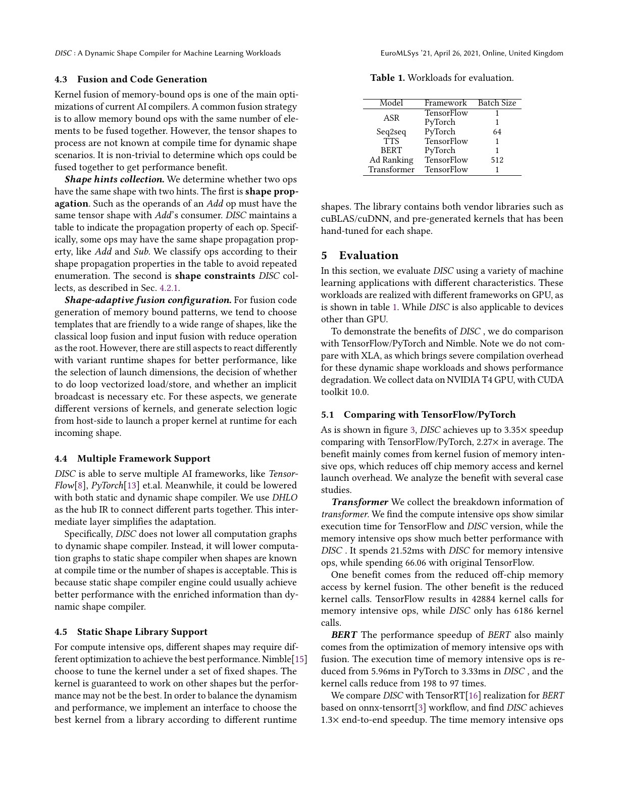
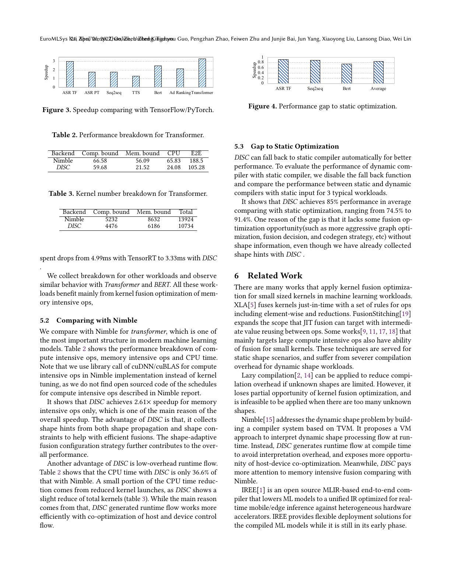

# DISC 中文精读：Dynamic Shape 编译、约束与融合

## 1. DISC 解决的不是动态 Python 控制流

DISC 的核心输入是已经得到的 computation graph，问题是 tensor dimensions 在 compile time 不完全已知。

典型 workload：

- variable sequence length 的 ASR/Seq2seq/BERT；
- variable image size；
- Unique 等 data-dependent output；
- sparse 或推荐模型。

若 static-shape compiler 为每个 shape 重新生成 fusion kernel，会产生 compile latency、cache 和 memory 开销；padding 又增加无效计算。

## 2. 总体架构

DISC 把 TensorFlow/PyTorch graph bridge 到 DHLO，然后联合生成：

- host-side shape inference；
- dynamic buffer allocation/reuse；
- host control 和 library calls；
- device kernels；
- shape-adaptive dispatch。

它只支持 static rank、dynamic dimensions。rank 本身变化会让 IR、layout 和 kernel interface 更复杂，论文不处理。

## 3. DHLO 如何补足 HLO

静态 HLO 中，slice 的 start/limit/stride、pad width、broadcast axes 等常是 compile-time attributes。

动态 workload 中这些值可能到 runtime 才知道。DHLO 将相关 attribute 变成 tensor arguments，让 shape/dataflow 可以表达运行时值。

这不是把所有 HLO 推翻：

- elementwise Add/Mul 等原定义已经能表达 dynamic dimension；
- 只对缺少动态表达力的部分补充；
- static 子图仍可走原 static compiler。

## 4. Shape inference 的两阶段

编译期：

- 传播 symbolic shape；
- 收集 equality/compatibility constraints；
- 决定哪些 fusion 与 index simplification 安全。

运行期：

- 执行生成的 shape code；
- 得到实际 buffer sizes；
- 分配/复用 memory；
- 选择 launch dimensions 和 kernel version。

DISC 关注两类 constraint：

1. dimension-size equality；
2. tensor element-count equality。

即使不知道具体值，也可能证明 producer/consumer element mapping 相容。

## 5. 为什么编译 host runtime flow

Nimble 用通用 VM 解释 runtime path。DISC 把 shape inference、allocation、launch 和 device management 也 codegen：

- 减少 VM instruction dispatch；
- compiler 同时看到 host 与 device work；
- 有机会消除冗余 shape computation；
- 可联合优化 buffer lifetime 和 kernel launch。

代价是生成系统更复杂，runtime flexibility 也更依赖编译时支持的行为集合。

## 6. 动态 shape 下的 fusion

常见规则“两个 tensor 元素数相同即可 fuse”在具体 shape 未知时无法直接判断。

DISC 用两种 hints：

- operator shape propagation：例如某些 elementwise op 保持 shape；
- 收集到的 equality constraints。

codegen 选择对多种 shape 相对稳健的 loop/input fusion template，并对以下决策保留 runtime variant：

- grid/block launch dimensions；
- vectorized load/store；
- implicit broadcast；
- vendor library 或预生成 kernel 选择。

所以“一个 graph 覆盖所有 shape”并不意味着“一个机器码 schedule 覆盖所有 shape”。

## 7. 端到端证据

实验环境是 NVIDIA T4、CUDA 10，workload 包含 TensorFlow 和 PyTorch 的 ASR、Seq2seq、TTS、BERT、广告排序、Transformer。

相对 framework eager/baseline：

- 平均约 2.27×；
- 最高约 3.35×；
- 收益主要来自 memory-bound fusion 和 kernel launch reduction。

Transformer 中：

- memory-bound time：66.06 ms 降到 21.52 ms；
- memory-bound kernel calls：42884 降到 6186。

BERT 中 memory-bound 部分从 PyTorch 5.96 ms 降到 3.33 ms，kernel calls 从 198 降到 97。

## 8. 与 Nimble 的对照要谨慎

论文对 Transformer 报告 DISC：

- memory-bound 21.52 ms，Nimble 56.09 ms；
- CPU 24.08 ms，Nimble 65.83 ms；
- E2E 105.28 ms，Nimble 188.5 ms。

但作者说明没有找到 Nimble compute-intensive schedule 的开源实现，因此用 cuDNN/cuBLAS 替代。这是重要复现边界，不能把表格当作完全同配置官方实现对比。

## 9. Dynamic 与 static 的差距

禁用 static fallback 后，DISC dynamic compiler 对三个 static-input workload 平均达到 static optimization 的约 85%，范围约 74.5%–91.4%。

原因包括：

- constraint 不如 concrete shape 完整；
- fusion scope 更保守；
- index/launch 不能完全专门化；
- runtime selection 与 shape code 有成本。

这给现代 symbolic shape 系统一个现实目标：减少重编译和 padding，但不承诺与每个 shape 的最优 specialization 相同。

## 10. 与 torch.compile 的连接

TorchDynamo 负责从 Python 取得图和 guards；DISC 更接近 backend/runtime 问题：

    Python capture
        -> symbolic graph + shape constraints
        -> dynamic buffer/fusion/codegen
        -> runtime assertions + kernel selection

PyTorch 2 的 Dynamic Shapes、Inductor wrapper code 和 guard system共同覆盖类似责任，但实现与 IR 不同。

## 11. 常见误读

### “Dynamic shape 等于任意 rank”

本文明确只做 static rank。多数 production system 也偏好固定 rank。

### “不重编译意味着不专门化”

DISC 对 kernel 和 library call 仍可多版本选择，只是不为每个完整 shape 重新编译整图。

### “2.27× 都来自 shape reasoning”

直接收益主要落在 fusion、memory traffic 和 launch count；shape reasoning是让这些优化在动态条件下仍能安全执行的前提。

## 12. 最终判断

DISC 把 symbolic shape 从一个类型标记变成完整编译问题：必须有能表达动态 attribute 的 IR、可执行 shape code、动态 buffer、约束证明和 shape-adaptive kernel。它是理解现代 PyTorch dynamic shapes 后端代价的紧凑案例。

## 原文证据导航

以下页码按仓库内 PDF 的**文件页码**计，不等同于论文印刷页码。建议先读本节所指原文，再回看上面的中文解释。

- [打开原始 PDF](paper.pdf)
- [打开可检索文本](paper.txt)

| 中文笔记中的证据 | 原文位置 | 复核重点 |
|---|---|---|
| DISC framework 与 DHLO hub IR | [PDF 文件第 3 页](paper.pdf#page=3) · [截图](rendered_figures/page-3.jpg) | 回到该页上下文，复核定义、图表或实验论证 |
| 动态 slice、shape constraints 与生成的 runtime flow | [PDF 文件第 4 页](paper.pdf#page=4) · [截图](rendered_figures/page-4.jpg) | 回到该页上下文，复核定义、图表或实验论证 |
| 动态融合、多框架支持与实验 workload | [PDF 文件第 5 页](paper.pdf#page=5) · [截图](rendered_figures/page-5.jpg) | 回到该页上下文，复核定义、图表或实验论证 |
| 端到端 speedup、Nimble breakdown 与 static gap | [PDF 文件第 6 页](paper.pdf#page=6) · [截图](rendered_figures/page-6.jpg) | 回到该页上下文，复核定义、图表或实验论证 |
