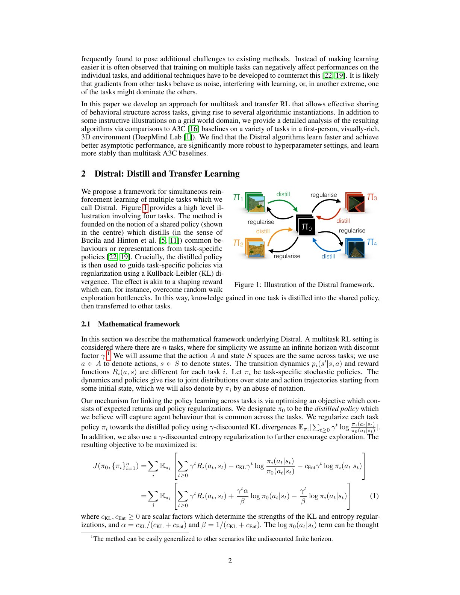
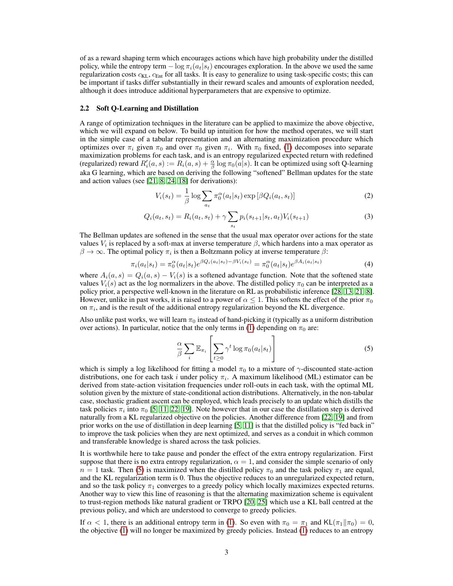
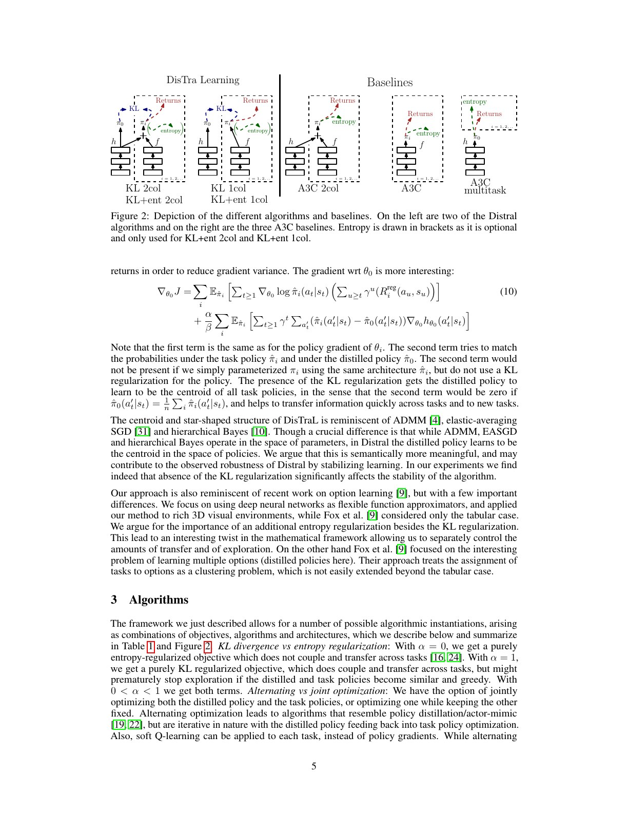
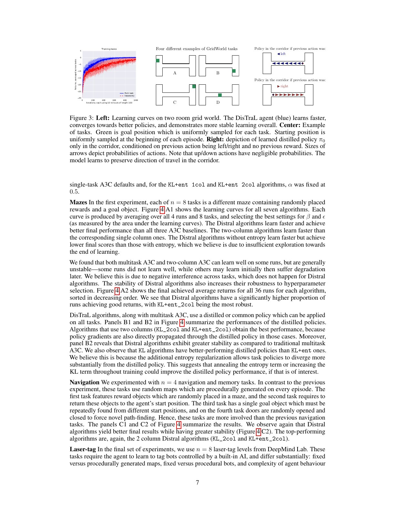
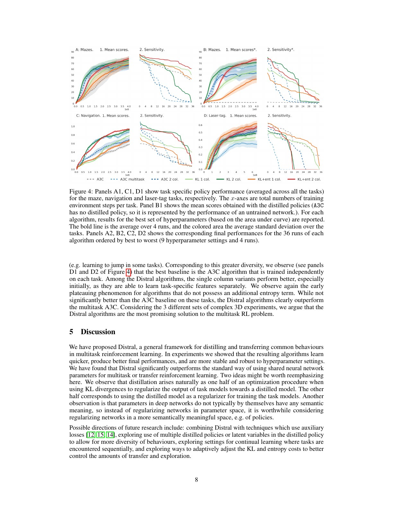
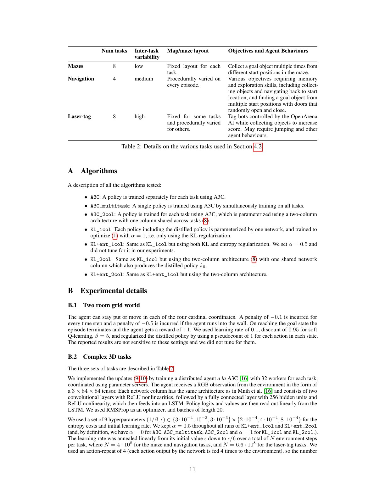

# 论文中文解读：Distral

> 原文：[Distral: Robust Multitask Reinforcement Learning](https://arxiv.org/abs/1707.04175)
>
> Yee Whye Teh 等，NeurIPS 2017。
>
> 本地材料：[`PDF`](paper.pdf) · [`全文`](paper.txt) · [`论文概要`](论文概要.md)

## 0. 多任务共享为何经常比单任务更差

直觉上相关任务应相互帮助，但直接共享网络参数会遇到：

- 不同任务梯度方向冲突；
- 奖励尺度不同，一个任务可能支配共享更新；
- 简单任务先收敛后，把共享表示拉向自己的局部最优；
- 多任务的平均性能可能掩盖某些任务完全失败。

Policy Distillation 已证明可把多个训练完成的 DQN policy 合到一个网络，但知识只单向流向 student。Distral 进一步让共享 policy 回头指导各任务学习，使迁移发生在探索和优化过程中。

## 1. 中心结构：共享的是 policy prior



中心 $\pi_0$ 是 distilled policy，外围 $\pi_i$ 是各任务策略。信息循环为：

```text
任务 i 的成功轨迹 ──蒸馏──▶ 共享策略 π0
共享策略 π0 ──KL 正则──▶ 其他任务的探索与学习
```

各任务仍可有独立参数，因此不会被迫在参数空间完全一致；它们只需在实际访问状态上的动作分布适度接近 $\pi_0$。这种共享对象比“第几层权重应相似”更有行为语义。

## 2. 联合目标逐项拆解



目标为：

$$
J(\pi_0,\{\pi_i\})=
\sum_i\mathbb E_{\pi_i}\left[
\sum_{t\ge0}\gamma^t
\left(
R_i(s_t,a_t)
-c_{KL}\log\frac{\pi_i(a_t\mid s_t)}{\pi_0(a_t\mid s_t)}
-c_{Ent}\log\pi_i(a_t\mid s_t)
\right)
\right].
$$

三项分别是：

1. 任务自身回报；
2. $-D_{KL}(\pi_i\|\pi_0)$，鼓励沿用跨任务共同行为；
3. task-policy entropy，鼓励继续探索。

论文重参数化为 $\alpha=c_{KL}/(c_{KL}+c_{Ent})$、$\beta=1/(c_{KL}+c_{Ent})$。对固定 $\pi_0$，每个任务相当于在原奖励上增加 shaping：

$$
R_i'(s,a)=R_i(s,a)+\frac{\alpha}{\beta}\log\pi_0(a\mid s).
$$

高共享概率动作得到额外奖励。对固定各任务策略，优化 $\pi_0$ 则是最大化它在各任务折扣 state-action visitation 上的对数似然，正好得到 policy distillation。

## 3. 为什么 KL 之外还要 entropy

若只有一个任务且只有 KL，$\pi_0$ 最终可等于 $\pi_1$，KL 为零，策略仍会走向普通 greedy optimum。多任务时风险更严重：简单任务率先产生确定性好策略，中心 policy 吸收后又把它强加给尚未遇到稀疏奖励的困难任务，使后者更难探索。

独立 entropy 项让 task policy 即使与 $\pi_0$ 相等也保持随机性。因此：

- $c_{KL}$ 控制迁移强度；
- $c_{Ent}$ 控制探索强度；
- 两者不应压成一个无法区分的“正则强度”。

论文实验也观察到无 entropy 的 Distral 前期快但后期早早平台。

## 4. 两列网络：共享行为 + 任务修正



中心 policy：

$$
\hat\pi_0(a\mid s)=\operatorname{softmax}(h_{\theta_0}(a\mid s)).
$$

task policy：

$$
\hat\pi_i(a\mid s)\propto
\exp(\alpha h_{\theta_0}(a\mid s)+\beta f_{\theta_i}(a\mid s)).
$$

$h_{\theta_0}$ 是共享列，$f_{\theta_i}$ 是任务列的 residual logits。共享行为一旦更新就直接进入所有 task policy，迁移快；任务列又能纠正中心 prior。

论文比较七种组合：独立 A3C、单网络 multitask A3C、共享列 A3C，以及 KL/KL+entropy 的一列和两列 Distral。这里的一列不是“只有一个网络处理所有任务”，而是每个任务与 distilled policy 各自独立参数化；两列则把中心 logits 直接加进 task policy。

## 5. policy-space centroid 的含义

对 $\theta_0$ 的梯度含有让 $\pi_0$ 接近各 $\pi_i$ 平均动作概率的项，因此中心是 **在各任务访问状态分布下的策略质心**。它与 EASGD/层级 Bayes 的星形结构相似，但后者通常在参数空间靠近。

policy-space 有两个优势：

- 神经网络存在参数置换等对称性，权重距离近未必行为近，权重远也可能行为相同；
- KL 直接度量同一状态上的动作分布差异，更接近要共享的对象。

但 centroid 仍受 visitation weighting 影响：频繁出现的状态/任务贡献更多，未访问区域没有约束；若各任务在同一状态需要相反动作，单一中心会成为折中甚至坏 prior。

## 6. GridWorld：共享的是走廊技能



每个任务目标位置不同，两房间只通过窄走廊相连。Distral 比各任务独立 soft Q-learning 学得快且稳定。中心 policy 没有记住某个目标，而是学到条件行为：进入走廊后保持之前的行进方向，避免随机来回。

这展示理想 transfer unit：它在多个任务中重复有用，又不决定最终任务目标。中心 prior 因而改善探索，尤其是新目标位于另一房间时。

该环境仍是表格小任务，不能单独证明深网规模下有效；其价值是提供可解释机制。

## 7. DeepMind Lab 主实验



实验用部分可观测第一视角 3D 环境，卷积 + LSTM，每任务 32 workers。三个任务族：

- 8 个 mazes，任务差异低；
- 4 个 procedurally generated navigation/memory，差异中等；
- 8 个 laser-tag，地图、bot 和行为要求差异高。

每算法扫描 3 个 entropy cost × 3 个学习率、每设置 4 次运行。Figure 4 的学习曲线选取平均 AUC 最好的设置；排序图则展示全部 36 次最终表现，因此比只看最好曲线更能检验稳健性。

### Maze

Distral 比三个 A3C baseline 学得快、终局高；两列快于一列；KL+entropy 两列的坏运行最少。普通 multitask A3C 有些 run 学会后又退化，支持负梯度干扰解释。

### Navigation

两列 Distral 再次终局最好且较稳，说明共享导航/记忆行为可跨随机地图迁移。

### Laser-tag

任务差异最大，独立 A3C 成为强基线。Distral 没有显著超越独立 A3C，但优于普通 multitask A3C；一列版本早期更好，可能因为两列让差异较大的技能传得太快。这是论文重要的负面边界：迁移强度必须匹配任务相关性。

## 8. 实验公平性与选择偏差

结果较有说服力的地方是报告了全部 9×4 运行排序，能看到算法对超参数的敏感性。仍需注意：

- 最佳曲线按 AUC 事后选择；
- 不同算法参数量和共享路径并不完全相同；
- 导航与 laser-tag 按独立 A3C 最好结果逐任务归一化；
- 训练步数高达每任务 $4\times10^8$ 或 $6.6\times10^8$ environment frames；
- 任务都来自同一 DeepMind Lab 接口，视觉和动作结构高度相容。

因此结论应限定为：在这类共享接口、相关任务集合上，policy-space regularization 比普通参数共享更稳。

## 9. Appendix：复现要点



- 每个网络列：两层卷积、256 单元全连接、LSTM，再输出 policy/value；
- RMSProp，rollout batch length 20；
- 每任务 32 workers；
- $\alpha=0.5$ 用于 KL+entropy 版本，没有调节；
- entropy/学习率共 9 组，学习率线性退火到初始值的 1/6；
- action repeat 4，因此 environment frames 与 network decision steps 相差 4 倍；
- value estimate 还加了系数 0.005 的小 L2 transfer regularizer。

最后一项意味着结果并非完全只共享 policy；作者认为 value 正则不关键，但严格复现应保留或消融。

## 10. 何时会失败，怎样扩展

单一 $\pi_0$ 假设所有任务存在一个共同动作模式。失败场景包括：

- 同状态在不同任务需要互斥动作；
- 任务的 observation/action spaces 不同；
- 某任务数据量或奖励频率远大于其他任务；
- 共享 prior 太强，阻碍任务专门探索；
- sequential tasks 中旧任务不可再访问，出现遗忘。

自然扩展是多个 latent distilled policies、按任务/状态选择 skill prior、自动调节 KL/entropy、给每任务设权重，以及在持续学习中配合 replay 或参数保护。

## 11. 最终结论

Distral 把“蒸馏”从训练后的压缩动作改造成多任务 RL 的通信协议：任务把可复用行为写入中心 policy，中心再作为 shaping prior 发送回所有任务。它避免用缺乏语义的权重距离定义共享，并把 transfer 与 exploration 分成 KL 和 entropy 两个可控因素。

实验同时告诉我们，正迁移不是免费的：任务越相似，两列快速共享越有效；任务差异越大，独立 task representation 和较慢 transfer 越重要。这个边界比“Distral 总是优于 A3C”的排行榜式结论更有价值。
