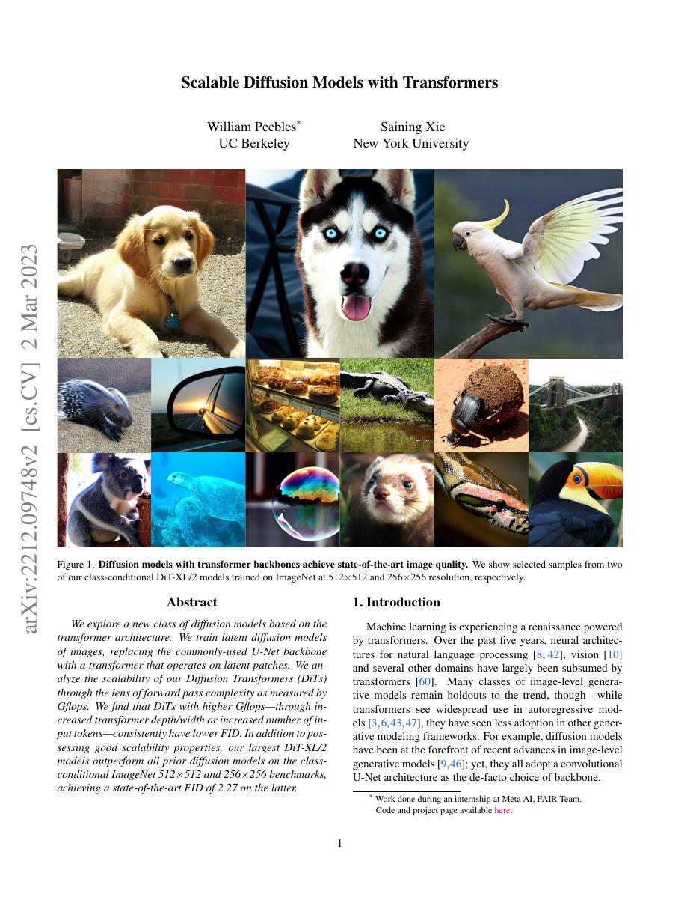
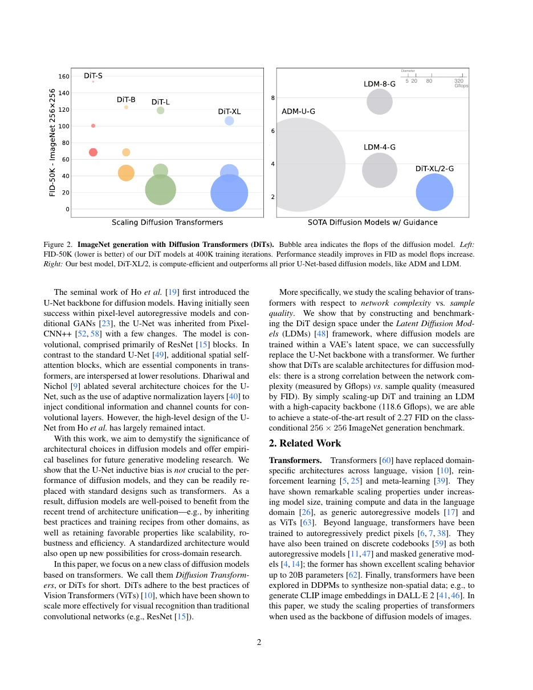
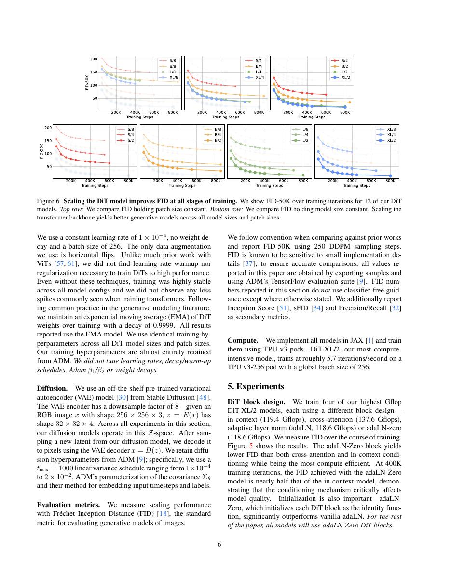
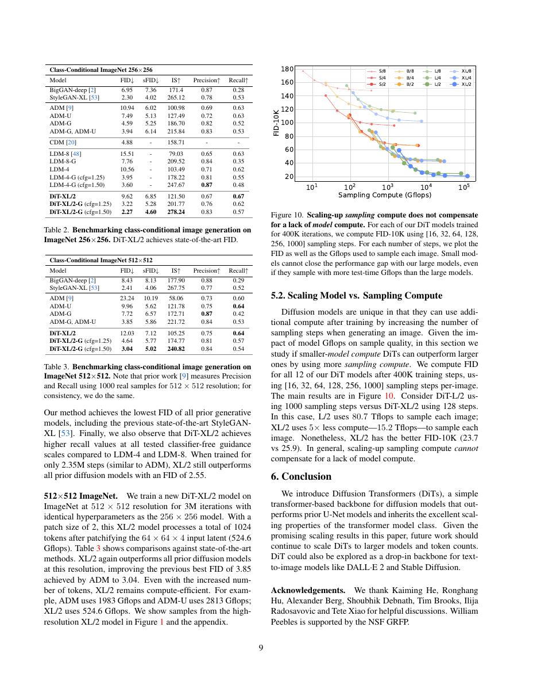

# 论文中文解读：《Scalable Diffusion Models with Transformers》

## 一、它解决了什么

DiT 用 Transformer 替代扩散 U-Net 主干，并发现生成质量随模型计算量呈稳定改善，连接扩散与 Transformer scaling。

## 二、核心机制

把 VAE latent 切成 patches，经过 Transformer blocks 预测噪声。时间步和类别条件通过 adaptive LayerNorm 注入；adaLN-Zero 用零初始化门控让深网从近 identity 开始稳定训练。

## 三、为什么成为主线

DiT 为后来的大规模图像/视频生成模型提供可扩展 backbone，说明 Transformer 的 token 范式也适用于连续生成。

## 四、证据应该怎样读

速度、显存、精度或 benchmark 数字只在论文给定的模型、数据、硬件、kernel 版本和评测预算下成立。跨论文比较前要统一训练 tokens、输入长度、batch、精度、采样/思考预算与是否使用工具。

## 五、局限与易误读点

原实验是 class-conditional ImageNet，不等同复杂文本到图像；FID 受采样器、guidance 和评测实现影响。全局 attention 对高分辨率 latent 仍昂贵。

## 六、放进十年演进史

与 Latent Diffusion 比较相同 latent 扩散框架下 U-Net 与 Transformer 主干；与 ViT 联系 patch token 化。

## 七、原文入口

[官方论文/页面](https://arxiv.org/abs/2212.09748)

## 八、原文论证链

DiT 询问扩散模型的去噪骨干是否必须是卷积 U-Net。作者把 VAE latent 切成 patch token，用 Transformer 预测噪声，并系统扩展深度、宽度和 token 数。时间步与类别条件通过 adaptive LayerNorm 注入。实验发现模型计算量（Gflops）与 FID 呈稳定改善趋势，说明标准 Transformer scaling 可迁移到图像扩散。

论文控制 latent autoencoder 与扩散设置，主要改变 DiT 尺寸和 patch size，因此比只比较不同系统更能支持“更多骨干计算改善生成”的主张。

> 原文定位：[PDF 文件第 1 页](paper.pdf#page=1) · [对应截图](rendered_figures/page-1.jpg)

## 九、条件注入与 token 数

latent $z_t$ 被 patchify 后得到序列。每个 block 先由时间/类别 embedding 产生 scale、shift 和 gate，形成 adaLN-Zero：
$$
\operatorname{adaLN}(h,c)
=\gamma(c)\odot\operatorname{LN}(h)+\beta(c).
$$
残差分支的 gate 初始化为零，使网络初始近似恒等，有助稳定训练。更小 patch 产生更多 token，从而显著提高 attention FLOPs；它既增加空间分辨能力，也增加计算预算，解释实验时需同时考虑。

> 原文定位：[PDF 文件第 2 页](paper.pdf#page=2) · [对应截图](rendered_figures/page-2.jpg)

## 十、实验怎样读

ImageNet 256/512 的 FID、sFID、IS、precision/recall 展示质量与覆盖。作者画 FID 对训练 Gflops/模型规模的曲线，重点是规律而非单个最优点。classifier-free guidance 会改善 FID/视觉质量却改变多样性，必须与无 guidance 结果区分。

> 原文定位：[PDF 文件第 6 页](paper.pdf#page=6) · [对应截图](rendered_figures/page-6.jpg)

## 十一、复现检查

- VAE、latent scaling 与噪声日程需固定，才能归因 Transformer 骨干。
- adaLN-Zero 的调制参数和残差 gate 初始化要核对。
- patch size 同时改变 token 数和 FLOPs；比较时报告二者。
- FID 样本数、guidance scale、采样器和步数必须一致。

## 十二、常见误读

DiT 证明 Transformer 是有效且可扩展的扩散骨干，不是证明 U-Net 已经无效。它仍依赖 VAE latent、扩散目标和采样过程；生成能力不能只归于 self-attention。

> 原文定位：[PDF 文件第 9 页](paper.pdf#page=9) · [对应截图](rendered_figures/page-9.jpg)

## 原文证据导航

以下页码按仓库内 PDF 的**文件页码**计，不等同于论文印刷页码。建议先读本节所指原文，再回看上面的中文解释。

- [打开原始 PDF](paper.pdf)
- [打开可检索文本](paper.txt)

| 中文笔记中的证据 | 原文位置 | 复核重点 |
|---|---|---|
| 原文首页、摘要与问题定义 | [PDF 文件第 1 页](paper.pdf#page=1) · [截图](rendered_figures/page-1.jpg) | 回到该页上下文，复核定义、图表或实验论证 |
| 核心方法、架构或算法定义所在关键页 | [PDF 文件第 2 页](paper.pdf#page=2) · [截图](rendered_figures/page-2.jpg) | 回到该页上下文，复核定义、图表或实验论证 |
| 实验、结果或关键分析所在原文页 | [PDF 文件第 6 页](paper.pdf#page=6) · [截图](rendered_figures/page-6.jpg) | 回到该页上下文，复核定义、图表或实验论证 |
| 讨论、结论或补充分析所在原文页 | [PDF 文件第 9 页](paper.pdf#page=9) · [截图](rendered_figures/page-9.jpg) | 回到该页上下文，复核定义、图表或实验论证 |
