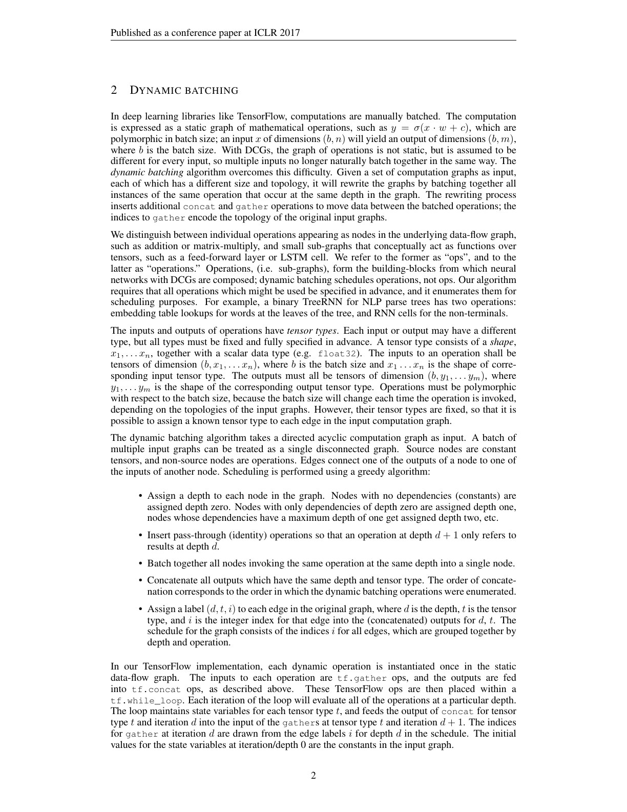
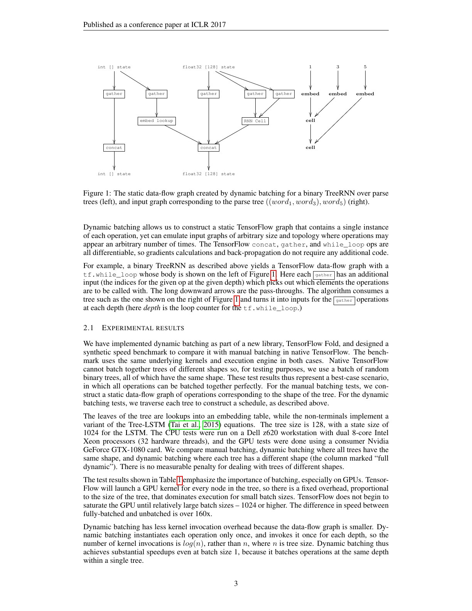
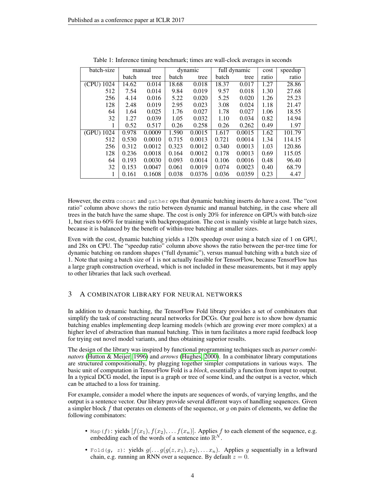
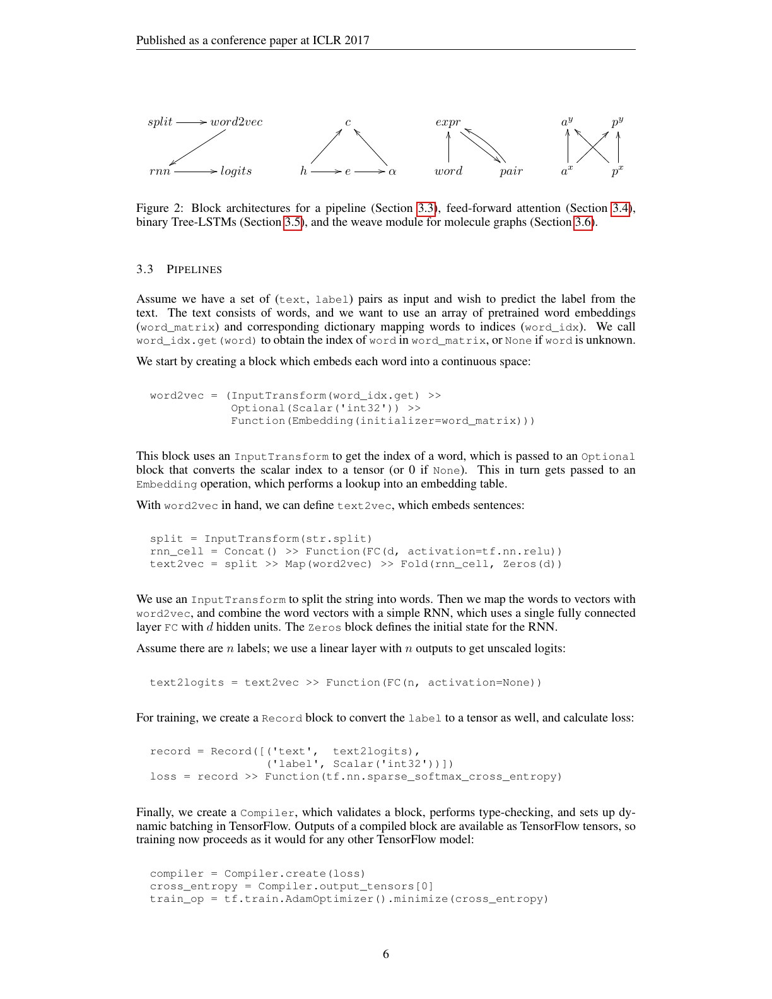
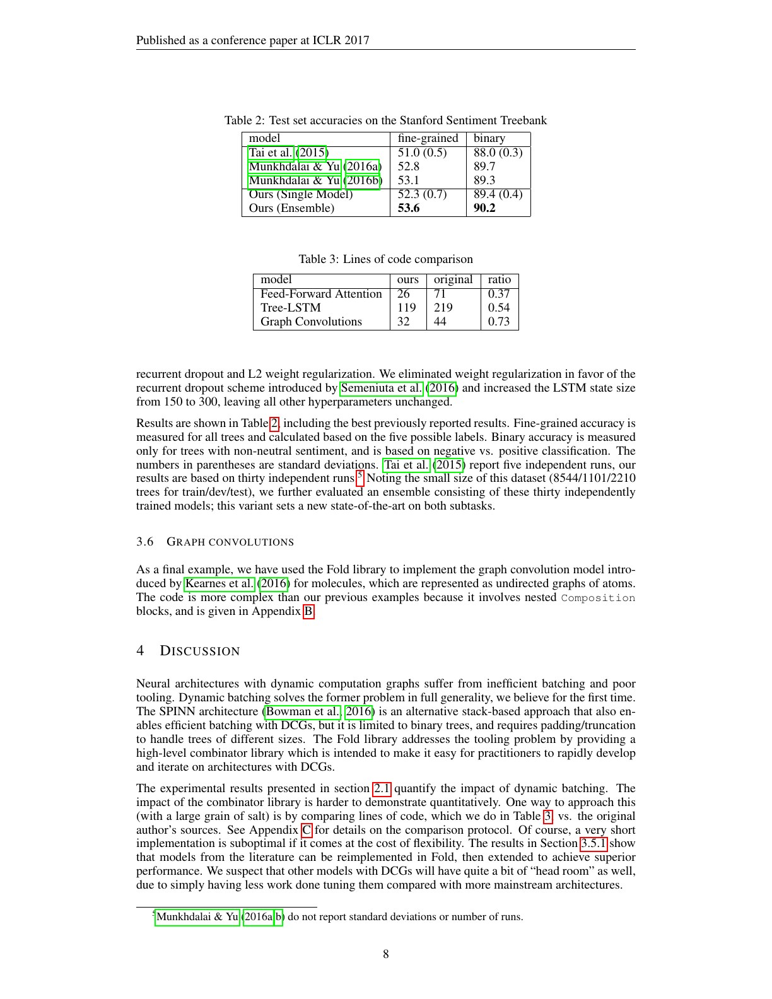

# Deep Learning with Dynamic Computation Graphs 中文精读

## 1. 论文中的“动态图”不是 eager autograd

本文关注的是 input graph：每个样本本身可能是一棵不同形状的 parse tree、molecule graph 或递归结构，因此计算 topology 随样本变化。

若逐节点执行：

- GPU kernel 很小；
- 每个 tree shape 不同，难以普通 stack；
- host 调度和 kernel launch 主导；
- 同一个 operation 的许多实例分散在不同 graph 中。

目标是保留输入相关结构，同时自动恢复 batch parallelism。

## 2. Dynamic batching 的核心

设每个动态 graph 节点拥有：

- operation signature：operator 类型以及输入输出 tensor type；
- incoming edges：它依赖哪些节点；
- depth：所有依赖完成后最早可执行的层。

编译 schedule 时：

1. 遍历一个 batch 中所有样本图；
2. 对节点做拓扑分层；
3. 按 depth 和 operation signature 分组；
4. 为每组生成输入索引；
5. runtime 用 gather 取出输入，执行一次 batched operator；
6. concat 结果，供下一深度索引。

大致成本可以写成：

$$
T \approx \sum_d \sum_{op}
\left(T_{gather}+T_{batched\ op}+T_{concat}\right)_{d,op}.
$$

它把逐节点 launch 数从与节点数接近，降为与 graph depth 和 operation kinds 接近。

## 3. 如何用静态 dataflow graph 模拟任意动态结构

TensorFlow Fold 为每种 operation 在静态 graph 中只放一个实例，并放进 while_loop：

- loop iteration 对应 dependency depth；
- state tensor 保存截至当前深度的结果；
- edge schedule 变成 gather indices；
- 当前深度输出 concat 回 state。

因为 gather、concat 和 while_loop 本身可微，backprop 不需要另一套手写逻辑。动态的是 schedule data，不是 TensorFlow graph topology。

这个方法和现代 compiler 中“把控制转成数据”的思想相通：把不规则拓扑编码成 index tensor 和 runtime state，从而让一个规则 executor 消费。

## 4. 性能结果的正确读法

论文构造大小为 128、hidden size 1024 的 Tree-LSTM：

- manual batching：所有树形相同，手工构造完美 batched graph；
- dynamic：相同树形但用自动 dynamic batching；
- full dynamic：每棵树形不同。

主要观察：

- 单样本 GPU 下 dynamic 对 manual 约 4.47×，因为还可对同一树同深度节点 batching；
- full dynamic 相对 batch size 1 的 per-tree time，GPU 高 batch 时约 120×、CPU 约 28×；
- 树形不同本身没有可测的额外惩罚；
- 大 batch 时 gather/concat 成本显现，dynamic 可能慢于形状一致的手工 batching。

“最高 120×”不是对现代 PyTorch eager 的普遍结论。其基线、树大小、GPU 和 TensorFlow graph construction 条件都很特殊。

## 5. Combinator library 为何也是贡献

只有 scheduler 还不够，用户仍需方便地描述异构结构。TensorFlow Fold 用 compositional blocks 表达：

- pipeline；
- Map/Fold；
- conditional OneOf；
- Optional；
- tuple/record；
- recursive ForwardDeclaration；
- general DAG composition。

block description 一方面生成样本图，另一方面提供 type signature，让 scheduler 知道哪些节点可以 batch。

## 6. 应用案例

### Tree-LSTM

parse tree 的 leaf 执行 embedding 与 leaf cell，internal node 消费左右 child state。递归定义天然产生随句法树变化的 topology。

### Feed-forward attention

不是单链 pipeline，而是一个有分叉和汇聚的 DAG，展示 combinator 不只处理 tree。

### Molecule graph convolution

atom/bond topology 不同，属于真正 graph-structured input；dynamic batching 跨 molecule 聚合同类 operation。

实验还报告 Stanford Sentiment Treebank accuracy 和代码行数。

作者明确说 accuracy 新高不是核心贡献；更重要的是相近模型能以更短定义和更高执行效率进行实验。

## 7. 与 PyTorch DataLoader batching 的区别

普通 batch：

- tensor shape 可 stack；
- 每个样本走同一 operator sequence；
- batch dimension 直接进入 kernel。

dynamic batching：

- 样本 topology 不同；
- 同类节点散落在不同位置；
- scheduler 在运行前发现兼容节点；
- batch 是 graph-node 级，而不只是 sample 级。

PyTorch 用户对 tree/GNN 写 Python loop 时，并不会自动得到本文算法；需要专门的 batching representation、vmap、segment operation 或 graph library。

## 8. 与 torch.compile 的区别

TorchDynamo 捕获 Python 执行区域并生成 FX graph；本文算法则先让用户生成一个动态 node graph，再把许多 node instance 编排进静态 executor。

二者可以组合：frontend capture 解决“程序是什么”，dynamic batching 解决“不规则工作怎样聚合成高效 batch”。

## 9. 常见误读

### “动态图性能问题只靠 compiler fusion”

对异构树，最大问题可能是无法形成足够大的 kernel workload。先 batching 再 fusion 往往比单纯 fusion 更重要。

### “不同 shape 等于不同 topology”

sequence length 变化是 shape dynamism；Tree-LSTM child relation 变化是 topology dynamism。系统处理方式不同。

### “动态 batching 没有额外代价”

schedule construction、gather、concat、padding/fragmentation 都是成本。规则大 batch 上手工 batching 可能更好。

## 10. 最终判断

本文提供一个极其具体的答案：动态图不必逐节点慢执行，可以把结构差异外置成 schedule data，再在深度和 operator 维度恢复批处理。它连接了算法结构、runtime scheduling 和硬件利用率。

## 原文证据导航

以下页码按仓库内 PDF 的**文件页码**计，不等同于论文印刷页码。建议先读本节所指原文，再回看上面的中文解释。

- [打开原始 PDF](paper.pdf)
- [打开可检索文本](paper.txt)

| 中文笔记中的证据 | 原文位置 | 复核重点 |
|---|---|---|
| 动态计算图与 dynamic batching 算法 | [PDF 文件第 2 页](paper.pdf#page=2) · [截图](rendered_figures/page-2.jpg) | 回到该页上下文，复核定义、图表或实验论证 |
| TreeRNN 的静态执行图与输入动态树 | [PDF 文件第 3 页](paper.pdf#page=3) · [截图](rendered_figures/page-3.jpg) | 回到该页上下文，复核定义、图表或实验论证 |
| Dynamic batching 的 CPU/GPU timing | [PDF 文件第 4 页](paper.pdf#page=4) · [截图](rendered_figures/page-4.jpg) | 回到该页上下文，复核定义、图表或实验论证 |
| Pipeline、attention、Tree-LSTM 与 molecule graph blocks | [PDF 文件第 6 页](paper.pdf#page=6) · [截图](rendered_figures/page-6.jpg) | 回到该页上下文，复核定义、图表或实验论证 |
| Tree-LSTM accuracy、代码量与 graph convolution 应用 | [PDF 文件第 8 页](paper.pdf#page=8) · [截图](rendered_figures/page-8.jpg) | 回到该页上下文，复核定义、图表或实验论证 |
