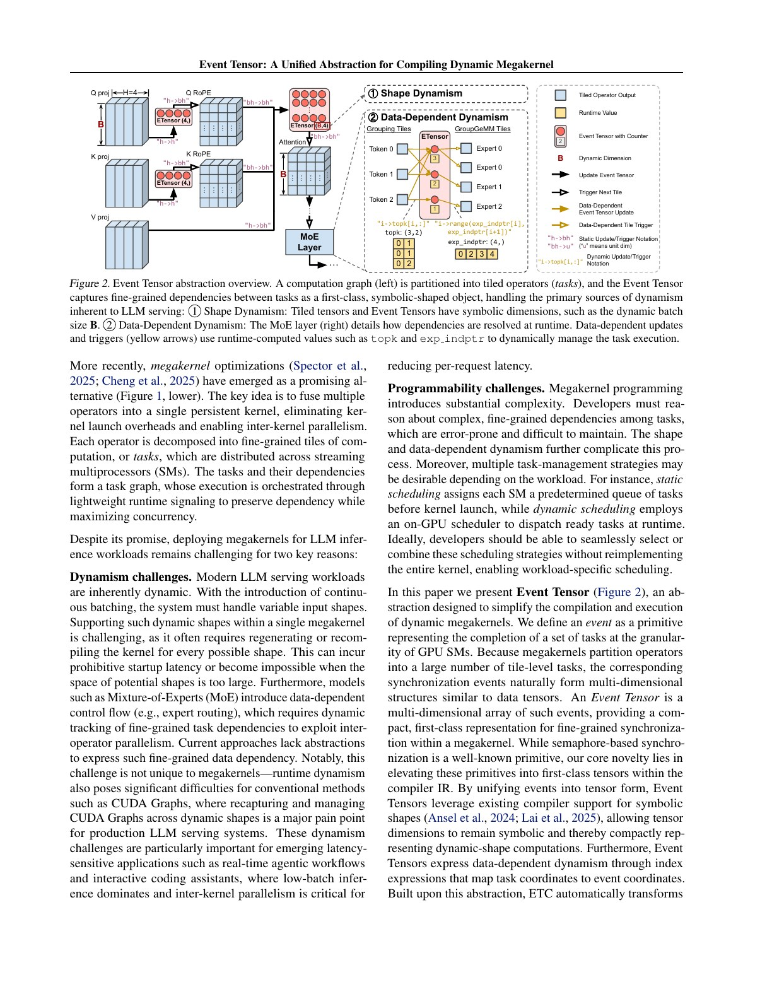
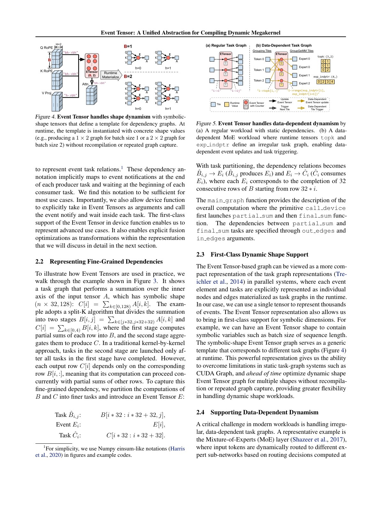
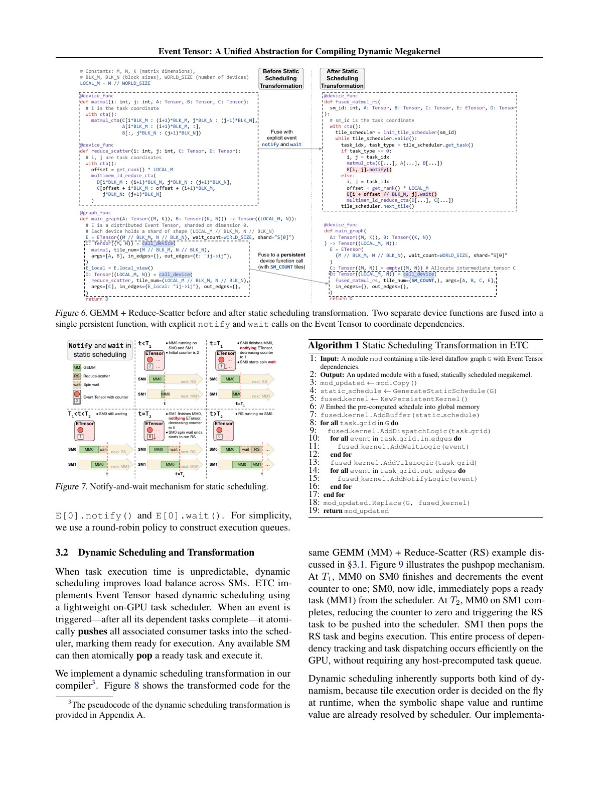
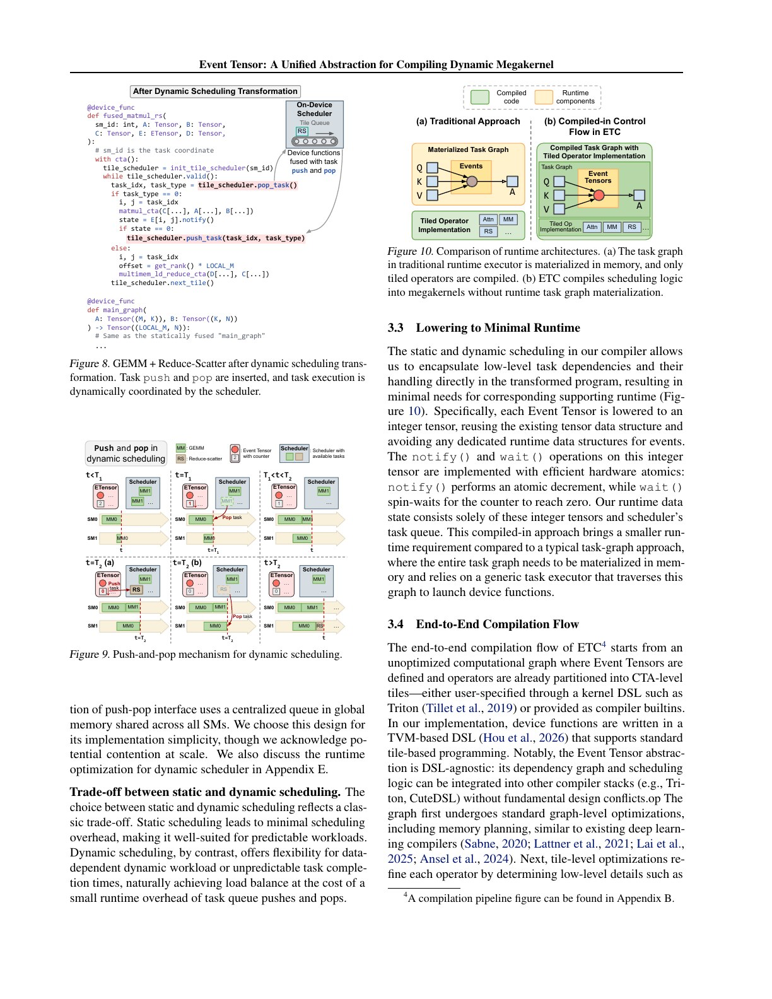
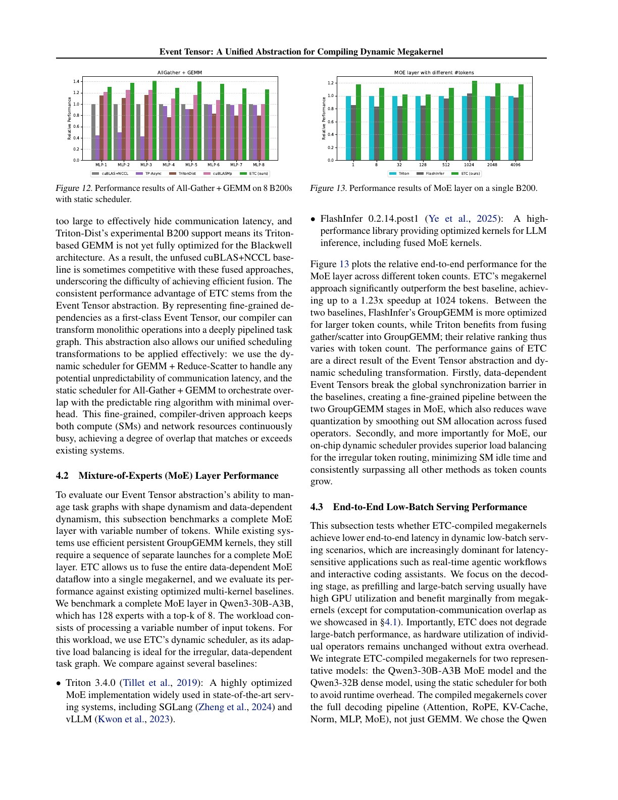
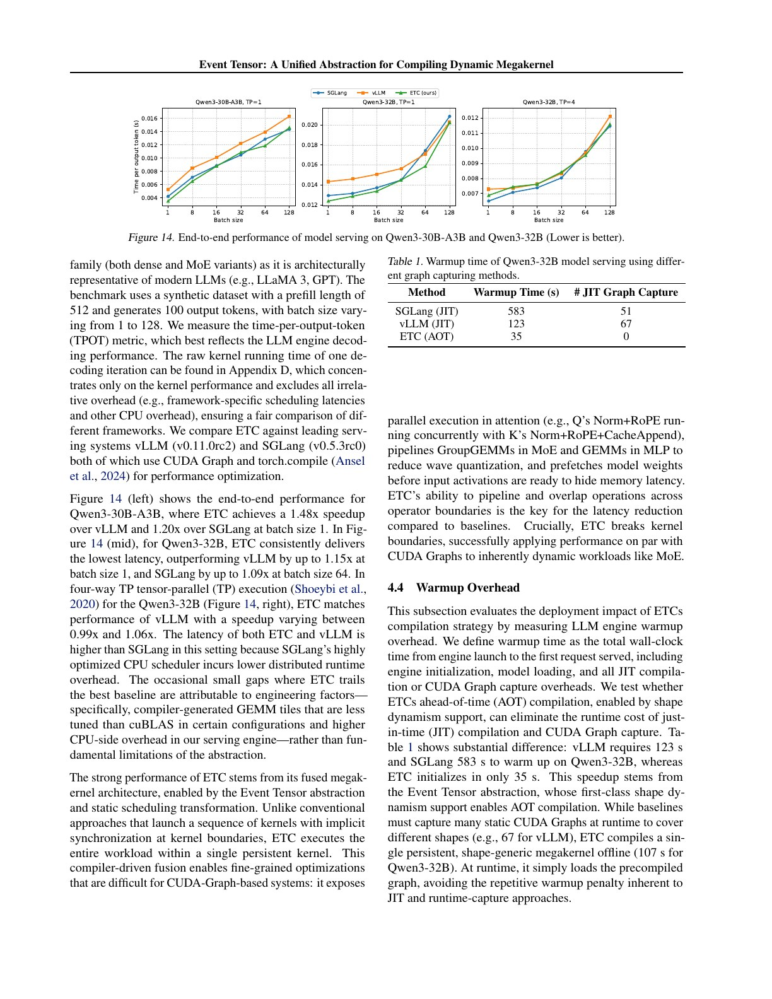
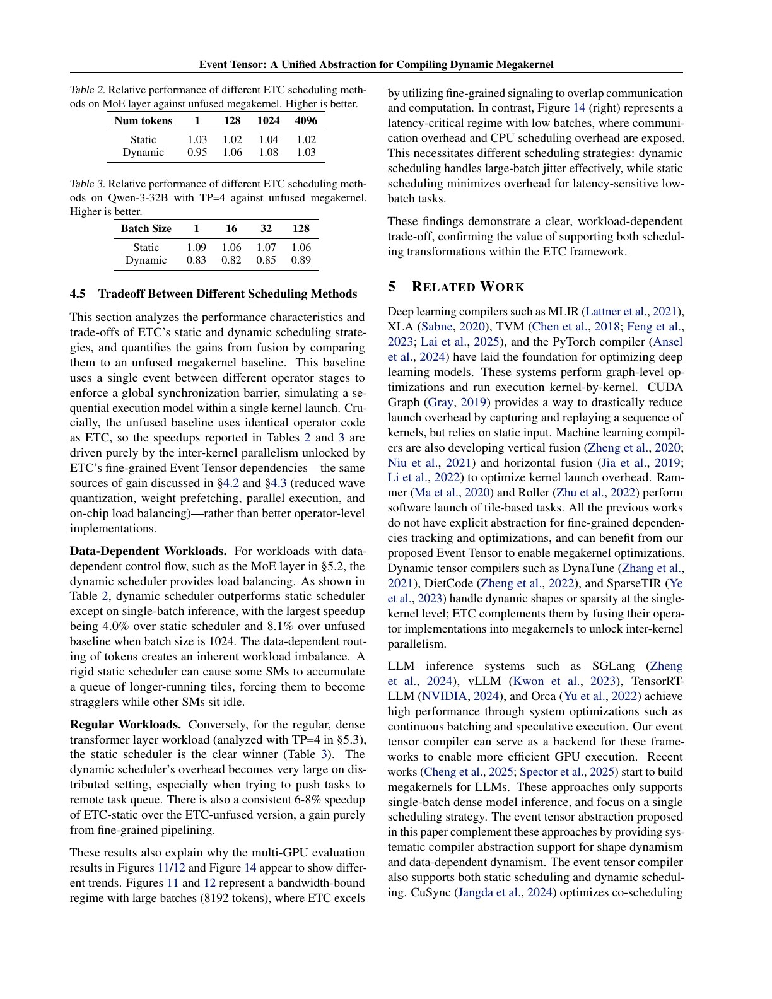

# Event Tensor 中文精读

## 1. 动态性为什么让 MegaKernel 困难

把固定 DAG 编成一个 persistent kernel 相对容易；真实 LLM serving 有两类动态：

- shape dynamism：batch、sequence、并发请求数变化；
- data dynamism：MoE top-k 路由决定某 expert 实际收到哪些 tokens。

静态 CUDA Graph 通常为固定 shape 捕获；设备侧通用 scheduler 能适应变化，但 queue/atomic/branch 可能抹掉小任务收益。

## 2. Event Tensor 抽象

计算被分解为 tiled tasks。若 task (B_j) 等待若干 (A_i)，就为依赖建立 event counter：

- predecessor 完成时 notify，counter 减少；
- counter 到 0 后 consumer 可执行；
- Event Tensor 的索引/shape 与 task tile 空间对应。

这比单一 global barrier 精细：某一输出 tile 的依赖满足后，不必等整个上游 operator。

## 3. 两类动态如何编码

### Shape dynamic

Event Tensor 的维度可以是 symbolic，运行时 batch/sequence 决定实际 task 数。Compiler 对模板做 AOT lowering，而不是为每个 shape 重新编译。

### Data dynamic

MoE 中 top-k 与 expert indptr 决定哪些 grouping tasks 通知哪些 expert tasks。这些索引是 runtime tensors，event update/trigger 可以由它们驱动。

所以“event”不是控制流旁路，而是可索引、可变换的 IR 对象。

## 4. Static scheduling

Compiler 预先为每个 SM 生成 task queue，使用 notify-and-wait 维护细粒度依赖。优点：

- 没有中央 queue pop；
- branch/atomic 较少；
- 适合执行时间可预测的 dense tasks 和小 batch。

缺点是遇到 MoE 偏斜等 runtime jitter 时会出现 straggler。

## 5. Dynamic scheduling

Dynamic transformation 将 ready tasks push 到设备侧 scheduler，workers pop 执行：

- 能依据真实 token/expert load 平衡；
- 天然支持 runtime task count；
- 但每个 task 多 queue、atomic 与调度成本。

论文不是宣称 dynamic 总优，而是让两种策略在同一 IR 上可替换。

## 6. MoE 与通信融合

论文评估：

- GEMM + ReduceScatter；
- AllGather + GEMM；
- 单 GPU MoE layer。

静态/动态 schedule 的选择取决于任务粒度和负载偏斜。MoE 在 token 数 1024 时，dynamic 相对 unfused megakernel 约 1.08×、相对 static 约 1.04×；单 token 时 dynamic 反而更慢。

这个结果比“最高 1.23×”更重要：调度机制必须按 workload 选择。

## 7. 端到端 serving

- Qwen3-30B-A3B、batch 1：相对 vLLM 1.48×，相对 SGLang 1.20×；
- Qwen3-32B 单 GPU：相对 vLLM 最高约 1.15×，相对 SGLang 最高约 1.09×；
- Qwen3-32B TP=4：约 0.99×–1.06× vLLM，且 SGLang 某些点更快。

论文把落后点归因于生成 GEMM tile 不如 cuBLAS 及 CPU serving overhead。这提醒我们：强抽象不自动带来强 kernel 和成熟 runtime。

## 8. Warmup 的正确口径

Qwen3-32B：

- vLLM 启动到首请求约 123 s；
- SGLang 约 583 s；
- ETC 约 35 s。

ETC 预先离线编译 shape-generic megakernel，论文另报约 107 s offline compile。它消除的是部署启动关键路径中的 repeated JIT/CUDA Graph capture，不是把编译成本变成零。

## 9. 调度消融

MoE 的 data-dependent jitter 越大，dynamic 越有价值；TP dense 模型的小 batch 延迟敏感区，static 更好。选择原则可概括为：

$$
Benefit_{dynamic}\approx LoadBalanceGain-QueueAndAtomicCost.
$$

## 10. 常见误读

### “Event Tensor 是普通 tensor 里存 event”

它是编译器抽象：shape 和索引空间用于表达 task dependencies，并不等同于用户数据 tensor。

### “AOT 解决了所有动态 shape”

抽象可表达 symbolic shape，但具体 kernel 的资源、tile 与性能仍可能需要 specialization。

### “Warmup 35 s 对比 583 s，就是总编译快 16×”

不是。ETC 把 107 s compilation 放在离线阶段，比较的是上线到首请求。

## 11. 复现检查点

- 分开记录 offline compile、engine load、graph capture/JIT、first request。
- 同一 operator implementation 下比较 static/dynamic/unfused，隔离 schedule 收益。
- MoE 必须报告 token/expert 分布，而不只 token 总数。
- 多 GPU报告 topology、collective library 和 CPU scheduler。
- 同时测 batch 1 和大 batch，避免只展示 dynamic scheduler 的甜点区。

## 12. 最终判断

Event Tensor 的贡献是一种“依赖也有 shape”的观点。它让 MegaKernel 编译器可以对动态 task graph 做类似 tensor program 的分析与变换，同时诚实展示 static 与 dynamic schedule 各自的适用区间。
