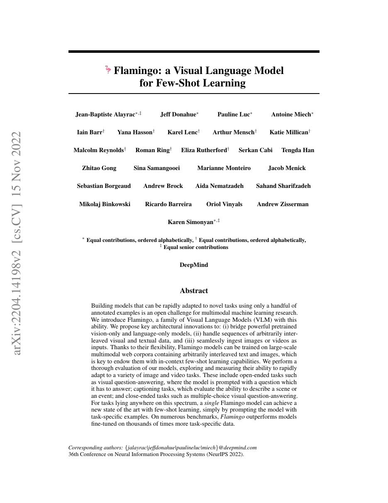
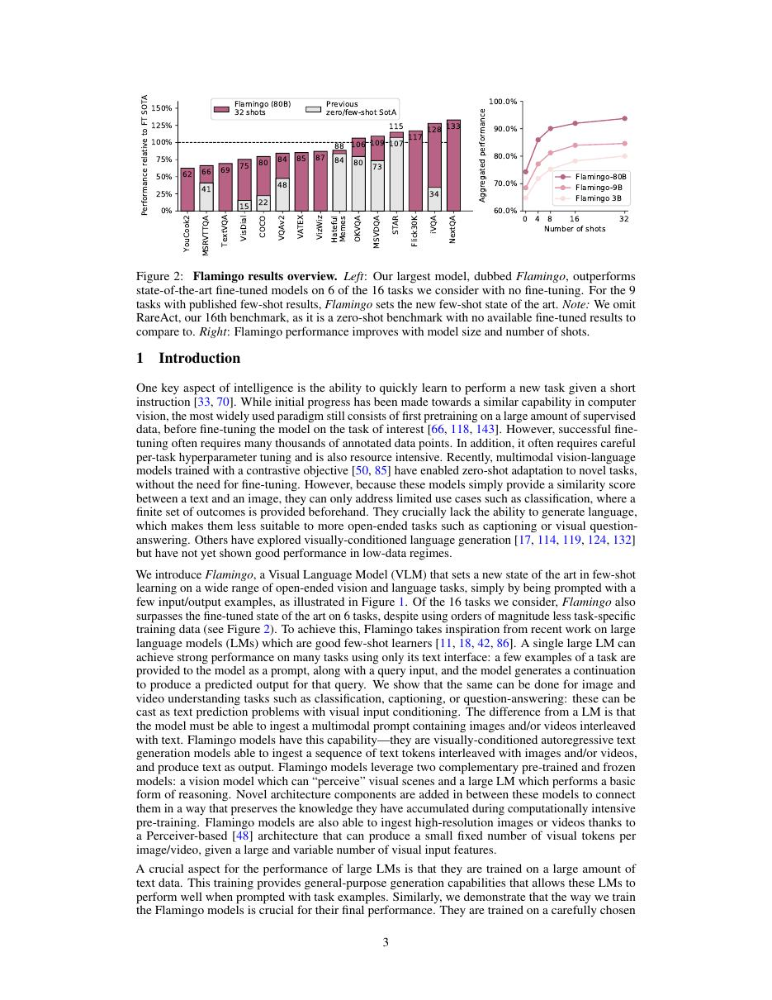
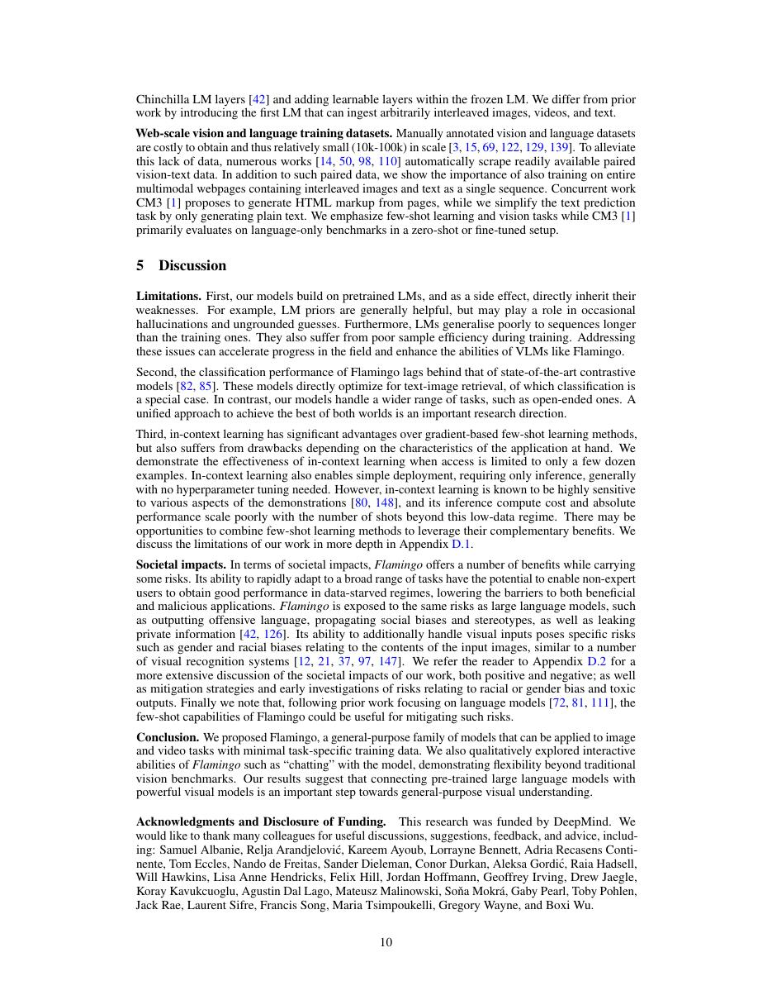
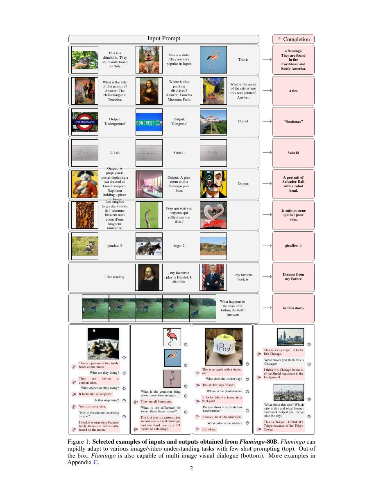

# 论文中文解读：《Flamingo: a Visual Language Model for Few-Shot Learning》

## 一、它解决了什么

Flamingo 用冻结的视觉 encoder 与语言模型，通过 Perceiver Resampler 和 gated cross-attention 连接任意交错的图像/视频与文本，实现多模态 in-context few-shot。

## 二、核心机制

视觉特征先由 Perceiver Resampler 压成固定数量 visual tokens；在冻结 LM 层间插入 gated cross-attention，让文本 token 读取最近图像。训练使用大规模交错网页图文与成对数据，保留语言能力并学习跨模态条件。

## 三、为什么成为重要节点

它建立“冻结强单模态 backbone + 小型连接模块 + interleaved prompt”的多模态 foundation model 路线，影响后续视觉语言助手。

## 四、证据怎样读

结果只在论文的数据、模型版本、硬件和评测协议下成立。闭源模型要把能力报告与可复现架构分开；系统论文要同时记录通信拓扑、编译预算和 runtime；科学模型要把预测精度与实验验证边界分开。

## 五、局限与易误读点

模型、数据和训练系统未完整开放；few-shot 示例格式与 benchmark 选择影响结果。固定视觉压缩会丢细粒度信息，语言流畅也不保证视觉 grounding。

## 六、放进十年演进史

与 CLIP 比较对比表征和生成式 cross-attention；与 LLaVA 比较少量 connector/instruction tuning 的开放路线；Gemini 则强调原生多模态大规模训练。

## 七、原文入口

[官方论文/页面](https://arxiv.org/abs/2204.14198)

## 八、原文论证链

Flamingo 要解决少样本多模态学习：给模型交错的图像/视频与文本上下文，再让它生成回答或描述。作者冻结预训练视觉编码器和大语言模型，只训练两类桥接模块：Perceiver Resampler 把任意数量视觉特征压成固定数量 visual tokens；gated cross-attention 层插入语言模型，让文本在需要时读取最近图像。

冻结大模型减少训练成本并保护原能力，海量交错图文数据则学习视觉—语言接口。few-shot 能力来自上下文示范，而非对每个下游数据集更新权重。

> 原文定位：[PDF 文件第 1 页](paper.pdf#page=1) · [对应截图](rendered_figures/page-1.jpg)

## 九、桥接模块怎样工作

Resampler 使用一组可学习 latent queries 对视觉时空特征做 cross-attention，输出固定长度表示，控制后续成本。语言层中，文本 hidden state 作 query，visual tokens 作 key/value。cross-attention 与新 FFN 的残差分支乘可学习 gate，gate 初始化接近零，使初始模型行为接近冻结 LM，再逐步学会利用视觉。

多图上下文使用 mask 让文字只访问当前及此前关联图像，避免未来图像泄漏。

> 原文定位：[PDF 文件第 3 页](paper.pdf#page=3) · [对应截图](rendered_figures/page-3.jpg)

## 十、实验怎样读

论文在 captioning、VQA、视觉对话等多任务比较 zero/few-shot，并与任务微调模型比较。few-shot 曲线随示例数变化比单点更能支持 in-context 主张。视频结果把帧作为视觉输入，并不意味着模型显式学习完整高帧率动态。

> 原文定位：[PDF 文件第 10 页](paper.pdf#page=10) · [对应截图](rendered_figures/page-10.jpg)

## 十一、复现检查

- 视觉 encoder 与 LM 是否冻结、哪些 LayerNorm 可训练要明确。
- 图文交错 mask 与 media token 对齐最易出错。
- 固定 Resampler latent 数并报告多图时总计算。
- few-shot 示例选择、顺序与图像分辨率必须公开。

## 十二、常见误读

Flamingo 不是把图像直接变成自然语言后交给 LM；视觉 token 通过 cross-attention 连续注入。少样本强也不表示视觉事实可靠，幻觉和训练数据偏差仍存在。

> 原文定位：[PDF 文件第 2 页](paper.pdf#page=2) · [对应截图](rendered_figures/page-2.jpg)

## 原文证据导航

以下页码按仓库内 PDF 的**文件页码**计，不等同于论文印刷页码。建议先读本节所指原文，再回看上面的中文解释。

- [打开原始 PDF](paper.pdf)
- [打开可检索文本](paper.txt)

| 中文笔记中的证据 | 原文位置 | 复核重点 |
|---|---|---|
| 原文首页、摘要与问题定义 | [PDF 文件第 1 页](paper.pdf#page=1) · [截图](rendered_figures/page-1.jpg) | 回到该页上下文，复核定义、图表或实验论证 |
| 核心架构、算法或编译方法所在关键页 | [PDF 文件第 3 页](paper.pdf#page=3) · [截图](rendered_figures/page-3.jpg) | 回到该页上下文，复核定义、图表或实验论证 |
| 实验、结果或关键分析所在原文页 | [PDF 文件第 10 页](paper.pdf#page=10) · [截图](rendered_figures/page-10.jpg) | 回到该页上下文，复核定义、图表或实验论证 |
| 讨论、结论或补充分析所在原文页 | [PDF 文件第 2 页](paper.pdf#page=2) · [截图](rendered_figures/page-2.jpg) | 回到该页上下文，复核定义、图表或实验论证 |
