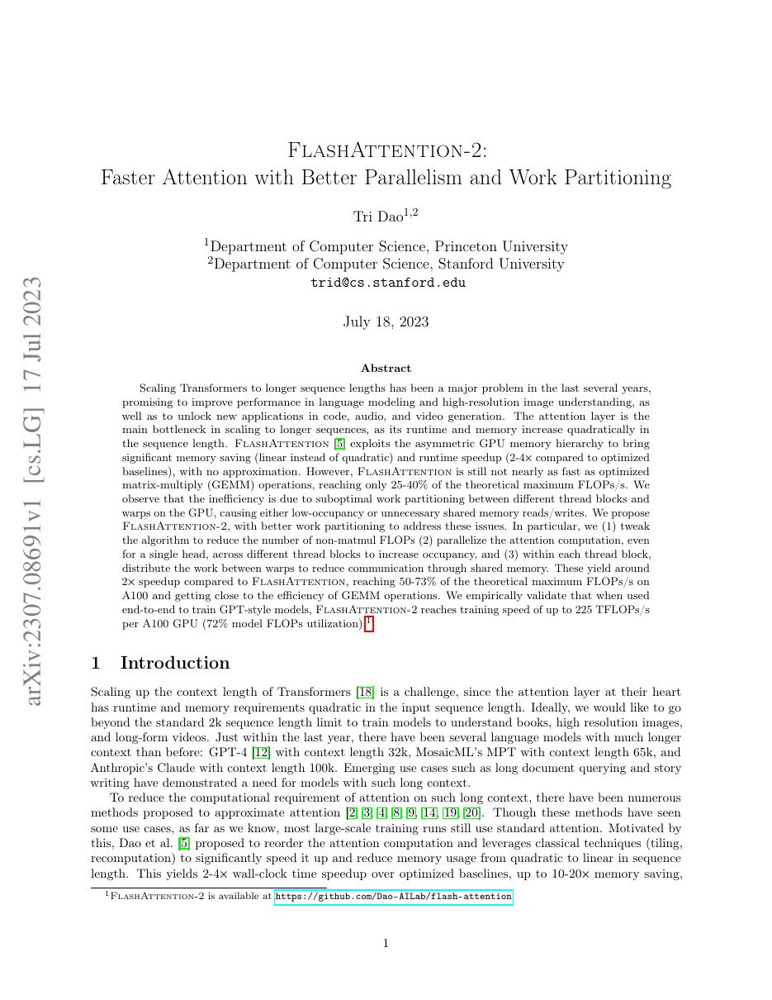
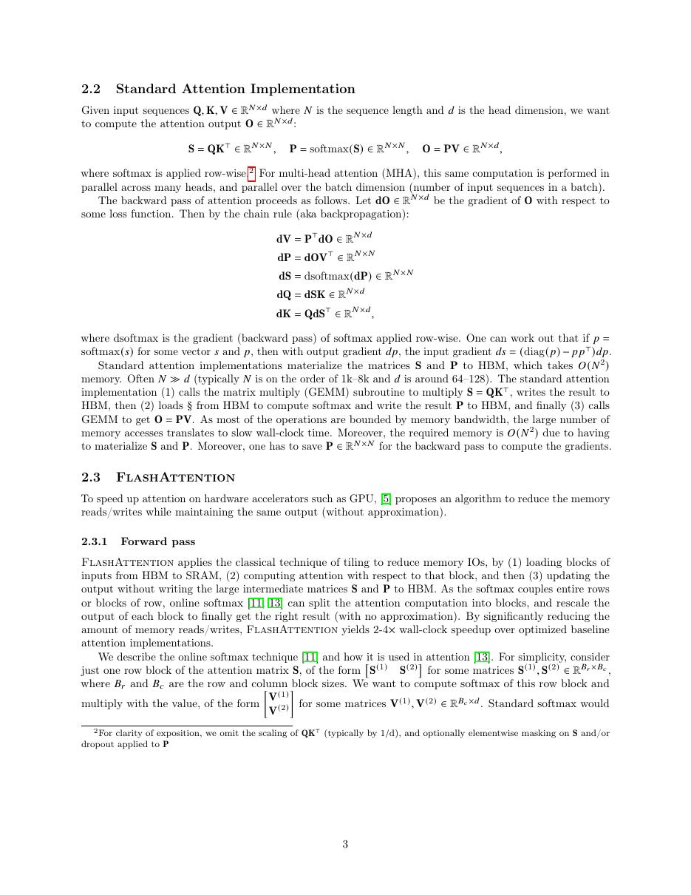
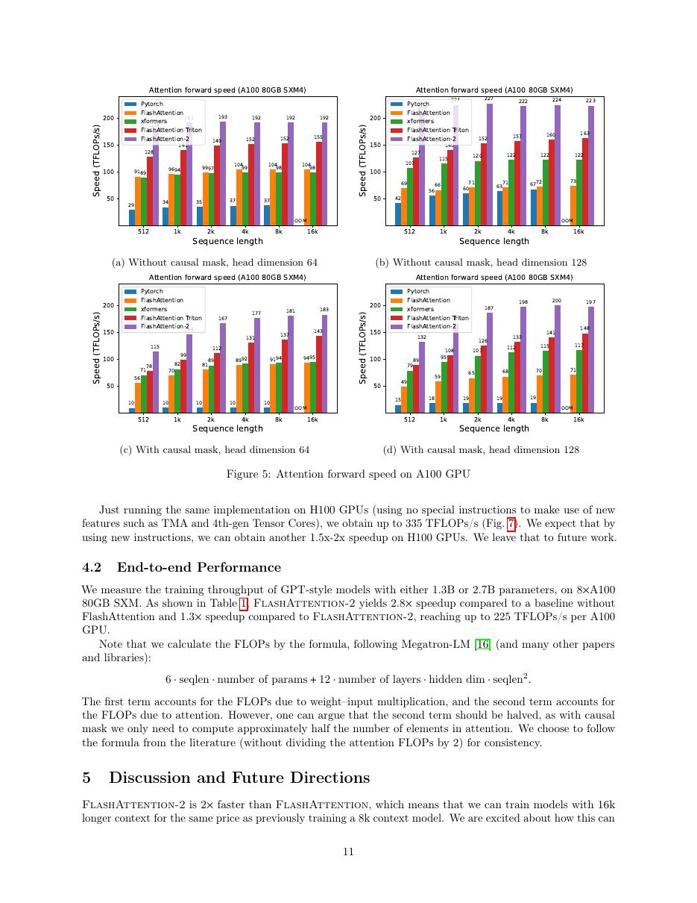
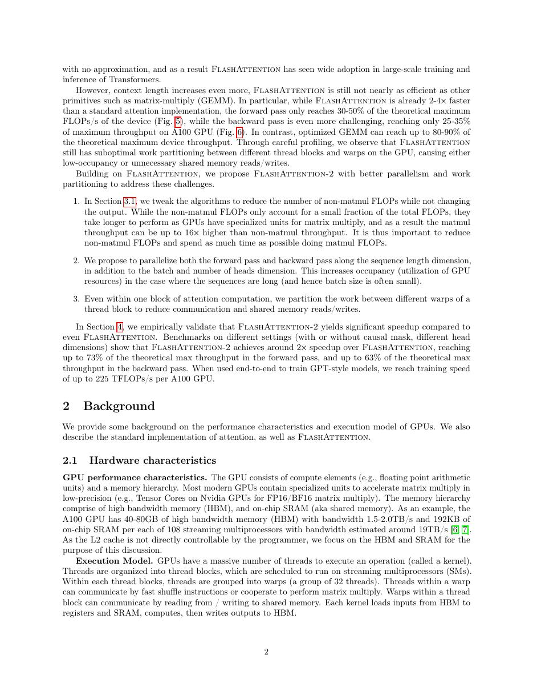

# 论文中文解读：《FlashAttention-2: Faster Attention with Better Parallelism and Work Partitioning》

## 一、它解决了什么

FA2 保留 FA1 的精确分块算法，重点减少非 matmul FLOPs、提高 occupancy 并重构 thread-block/warp 工作划分。

## 二、核心机制

增加 sequence 维并行，使 batch×heads 较小时仍有足够 blocks；把 Q 固定在各 warp、分割 K/V 工作，减少 shared-memory 通信。算法细节配合 A100 的 tensor core 与调度特性。

## 三、为什么成为主线

FA2 把 FlashAttention 从内存节省算法推进为广泛采用的高性能训练/推理 kernel，并成为许多框架 SDPA 后端。

## 四、证据应该怎样读

速度、显存、精度或 benchmark 数字只在论文给定的模型、数据、硬件、kernel 版本和评测预算下成立。跨论文比较前要统一训练 tokens、输入长度、batch、精度、采样/思考预算与是否使用工具。

## 五、局限与易误读点

论文峰值依 A100、head dim、序列长度与 causal 配置；不同 GPU/ROCm/形状需不同 kernel。它没有改变二次算术量。

## 六、放进十年演进史

FA1 给 IO 原理，FA2 给 Ampere 工作划分，FA3/4 分别围绕 Hopper/Blackwell pipeline 重写实现。

## 七、原文入口

[官方论文/页面](https://arxiv.org/abs/2307.08691)

## 八、原文论证链

FlashAttention-2 保留第一版精确、分块、IO-aware 的核心，但指出其 GPU 利用率仍受两类问题限制：softmax 重缩放等 non-matmul FLOPs 在 GPU 上昂贵；并行只按 batch/head 划分时，小 batch 或少 head 不能占满 SM。新算法重排 online softmax 更新，减少非矩阵乘操作，并把单个 attention head 的工作沿序列块分到多个 thread block。

> 原文定位：[PDF 文件第 1 页](paper.pdf#page=1) · [对应截图](rendered_figures/page-1.jpg)

## 九、前向与反向的并行重构

前向采用更少次数的 output rescale，并调整循环次序；反向按 Q 块而非 K/V 块分工，使 thread block 各自写独立的 $dQ$，避免原方案对 $dQ$ 的跨块原子累加。对 $dK,dV$ 则在块内组织计算与归约。

warp 级工作也重新划分，让多个 warp 分担 Q 而共享 K/V，减少 shared-memory 中间结果通信。算法目标仍为
$$
O=\operatorname{softmax}(QK^\top/\sqrt d)V,
$$
变化只在 tiling、统计量维护和并行 ownership。

> 原文定位：[PDF 文件第 3 页](paper.pdf#page=3) · [对应截图](rendered_figures/page-3.jpg)

## 十、实验怎样读

论文报告 kernel TFLOPs/s、相对 PyTorch/xFormers/FlashAttention-1 的加速，并给出 GPT 训练端到端吞吐。峰值常出现在特定 head dimension、长度和因果设置；应看完整 sweep。达到 GEMM 峰值的一定比例是更有可比性的指标，因为 attention 包含不可避免的非 matmul 工作。

> 原文定位：[PDF 文件第 11 页](paper.pdf#page=11) · [对应截图](rendered_figures/page-11.jpg)

## 十一、复现检查

- 分别验证 forward、dQ、dK、dV 数值误差。
- 测试 causal/non-causal、奇数长度、不同 head dimension 和 dropout。
- 编译参数、GPU 架构、dtype 与时钟都会改变结果。
- 端到端训练应包含优化器、通信和非 attention 层。

## 十二、常见误读

FA2 不是新的 attention 模型，也不是通过近似减少 FLOPs；它把相同数学工作更好地映射到 GPU。相对 FA1 的收益来自并行分解和操作重排，不应只概括成“更大 tile”。

> 原文定位：[PDF 文件第 2 页](paper.pdf#page=2) · [对应截图](rendered_figures/page-2.jpg)

## 原文证据导航

以下页码按仓库内 PDF 的**文件页码**计，不等同于论文印刷页码。建议先读本节所指原文，再回看上面的中文解释。

- [打开原始 PDF](paper.pdf)
- [打开可检索文本](paper.txt)

| 中文笔记中的证据 | 原文位置 | 复核重点 |
|---|---|---|
| 原文首页、摘要与问题定义 | [PDF 文件第 1 页](paper.pdf#page=1) · [截图](rendered_figures/page-1.jpg) | 回到该页上下文，复核定义、图表或实验论证 |
| 核心方法、架构或算法定义所在关键页 | [PDF 文件第 3 页](paper.pdf#page=3) · [截图](rendered_figures/page-3.jpg) | 回到该页上下文，复核定义、图表或实验论证 |
| 实验、结果或关键分析所在原文页 | [PDF 文件第 11 页](paper.pdf#page=11) · [截图](rendered_figures/page-11.jpg) | 回到该页上下文，复核定义、图表或实验论证 |
| 讨论、结论或补充分析所在原文页 | [PDF 文件第 2 页](paper.pdf#page=2) · [截图](rendered_figures/page-2.jpg) | 回到该页上下文，复核定义、图表或实验论证 |
