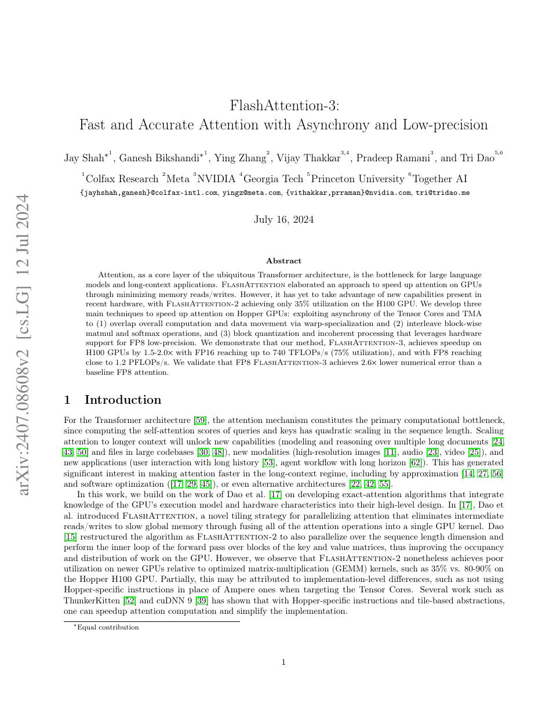
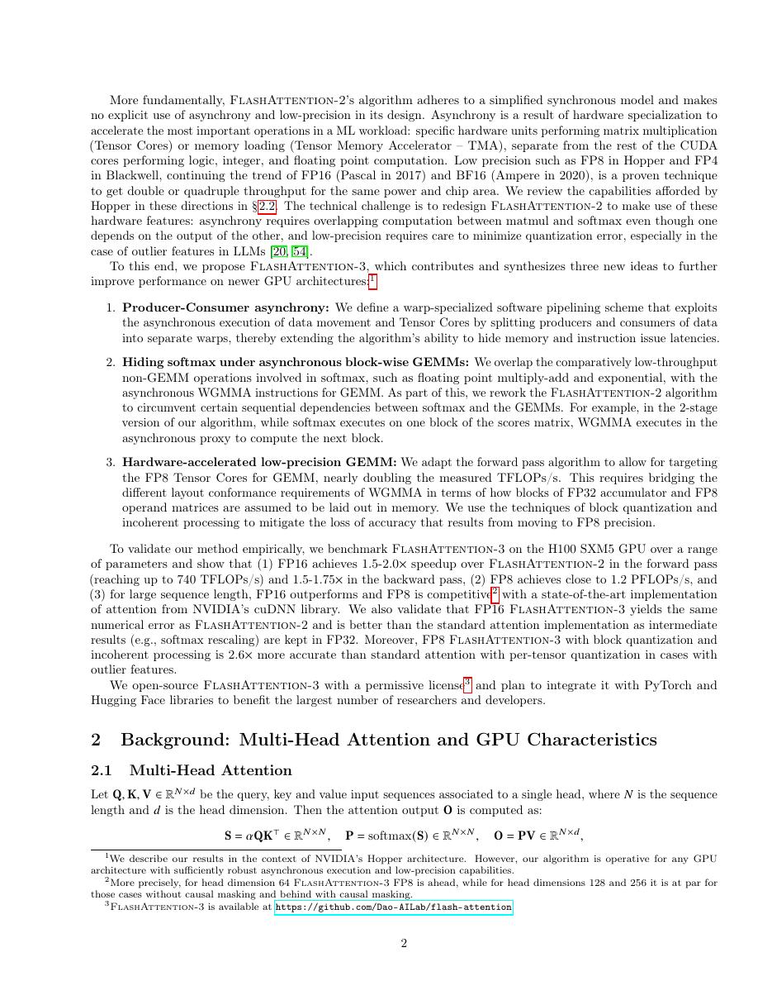
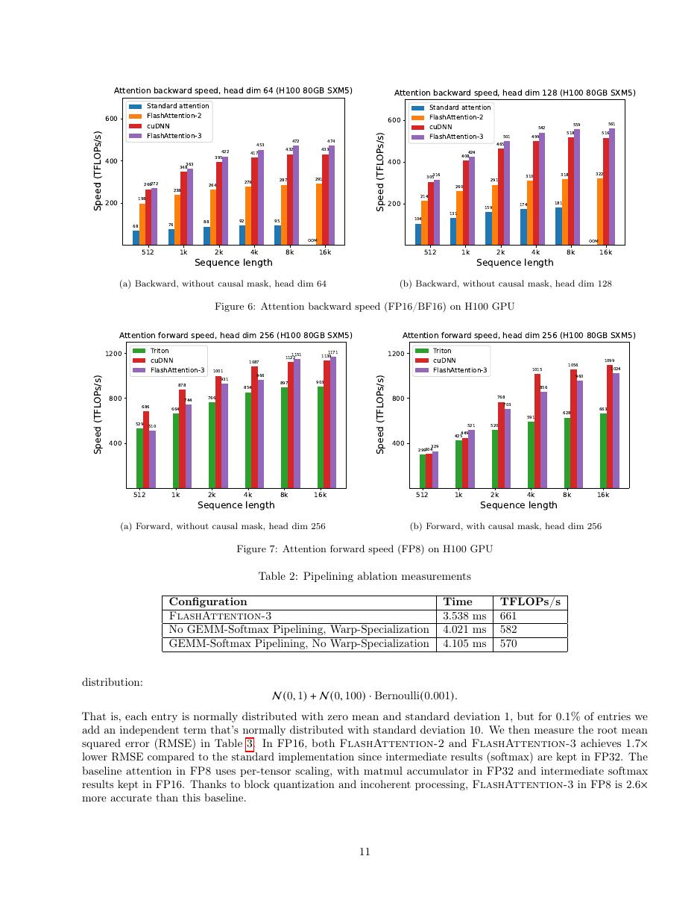
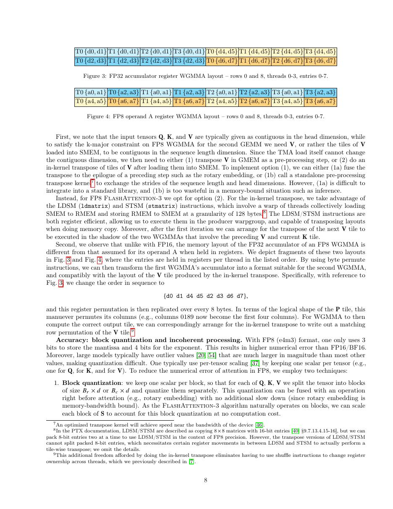

# 论文中文解读：《FlashAttention-3: Fast and Accurate Attention with Asynchrony and Low-precision》

## 一、它解决了什么

FA3 针对 Hopper 的 TMA、WGMMA 和异步执行重写 attention pipeline，并加入更准确的 FP8 路径。

## 二、核心机制

warp specialization 把 producer、matmul consumer 与 softmax 工作分工；在 GEMM 与 softmax 之间做 ping-pong overlap，隐藏数据搬运和非 matmul 延迟。FP8 使用 block quantization 与 incoherent processing 降低误差。

## 三、为什么成为主线

它标志高性能 attention 从通用 CUDA 优化进入“算法与特定 GPU 指令流水协同设计”阶段。

## 四、证据应该怎样读

速度、显存、精度或 benchmark 数字只在论文给定的模型、数据、硬件、kernel 版本和评测预算下成立。跨论文比较前要统一训练 tokens、输入长度、batch、精度、采样/思考预算与是否使用工具。

## 五、局限与易误读点

主要面向 H100/H800；A100 或其他加速器不能直接获得同样收益。FP8 精度结论依缩放、数据和训练设置，prototype 支持面也小于成熟 FA2。

## 六、放进十年演进史

FA4 延续协同设计，但 Blackwell 的 tensor core 增长快于 shared memory/SFU，瓶颈再次迁移。

## 七、原文入口

[官方论文/页面](https://arxiv.org/abs/2407.08608)

## 八、原文论证链

FlashAttention-3 面向 Hopper GPU。H100 引入 Tensor Memory Accelerator（TMA）与 warpgroup MMA（WGMMA），允许数据搬运和矩阵乘异步执行；若仍用同步 FA2 流水，硬件能力不能充分利用。FA3 通过 producer–consumer warp specialization、GEMM/softmax 交错和多阶段 pipeline，把 Q/K/V 传输、矩阵乘及 softmax 尽量重叠。

第二条线是低精度：FP8 提高 Tensor Core 峰值，但 attention logits 对量化误差敏感。论文采用 incoherent processing 等技巧改善数值误差，在速度与精度之间给出实测。

> 原文定位：[PDF 文件第 1 页](paper.pdf#page=1) · [对应截图](rendered_figures/page-1.jpg)

## 九、流水线怎样隐藏延迟

一个 warp group 负责 TMA 异步搬运 tile，另一个执行 WGMMA；barrier 跟踪 tile 是否可消费。softmax 必须依赖 $QK^\top$，但可在当前 score tile 上做指数/归约的同时启动下一 tile GEMM。随后 $P V$ 又与后续 score 工作交错。online softmax 状态仍保证不物化完整矩阵。

异步不是取消依赖，而是把独立阶段重叠。tile 数、寄存器占用、shared memory 与 warp 数共同决定 occupancy，不能简单把 pipeline stage 无限增加。

> 原文定位：[PDF 文件第 2 页](paper.pdf#page=2) · [对应截图](rendered_figures/page-2.jpg)

## 十、实验怎样读

论文分别报告 FP16/BF16 与 FP8 的 TFLOPs/s、不同长度/head dimension/causal 条件，并与 FA2、cuDNN 等比较。峰值利用率应对照 Hopper 对应 dtype 理论峰值。FP8 结果还要看输出和梯度误差，不能把吞吐与高精度版本直接等同。

> 原文定位：[PDF 文件第 11 页](paper.pdf#page=11) · [对应截图](rendered_figures/page-11.jpg)

## 十一、复现检查

- 仅 Hopper 或支持相应异步指令的架构能复现设计收益。
- barrier、producer/consumer ownership 与 shared-memory 生命周期需做竞态检查。
- 数值验证覆盖高幅度 logits、长序列和 backward。
- benchmark 固定功耗/时钟并做设备同步，报告完整形状矩阵。

## 十二、常见误读

FA3 不是把 FA2 代码重新编译到 H100；其调度显式围绕 TMA/WGMMA 重构。FP8 加速也不是无损，论文的数值技巧与误差评估是贡献的一部分。

> 原文定位：[PDF 文件第 8 页](paper.pdf#page=8) · [对应截图](rendered_figures/page-8.jpg)

## 原文证据导航

以下页码按仓库内 PDF 的**文件页码**计，不等同于论文印刷页码。建议先读本节所指原文，再回看上面的中文解释。

- [打开原始 PDF](paper.pdf)
- [打开可检索文本](paper.txt)

| 中文笔记中的证据 | 原文位置 | 复核重点 |
|---|---|---|
| 原文首页、摘要与问题定义 | [PDF 文件第 1 页](paper.pdf#page=1) · [截图](rendered_figures/page-1.jpg) | 回到该页上下文，复核定义、图表或实验论证 |
| 核心方法、架构或算法定义所在关键页 | [PDF 文件第 2 页](paper.pdf#page=2) · [截图](rendered_figures/page-2.jpg) | 回到该页上下文，复核定义、图表或实验论证 |
| 实验、结果或关键分析所在原文页 | [PDF 文件第 11 页](paper.pdf#page=11) · [截图](rendered_figures/page-11.jpg) | 回到该页上下文，复核定义、图表或实验论证 |
| 讨论、结论或补充分析所在原文页 | [PDF 文件第 8 页](paper.pdf#page=8) · [截图](rendered_figures/page-8.jpg) | 回到该页上下文，复核定义、图表或实验论证 |
