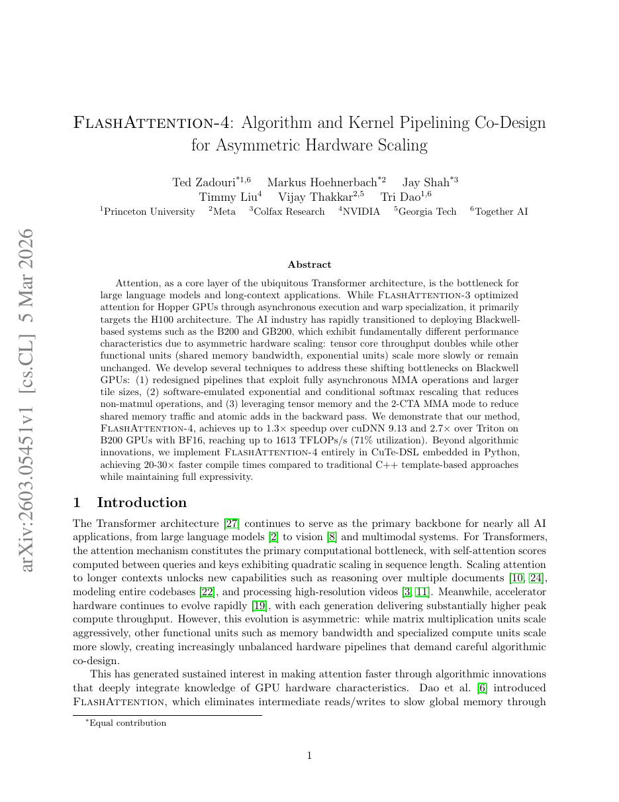
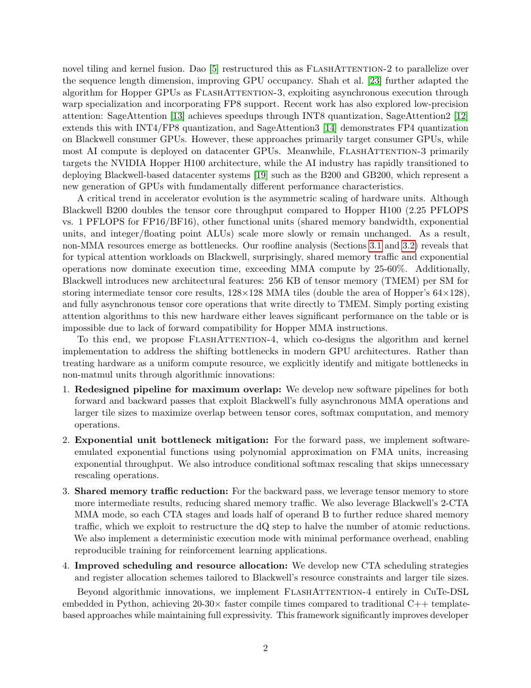
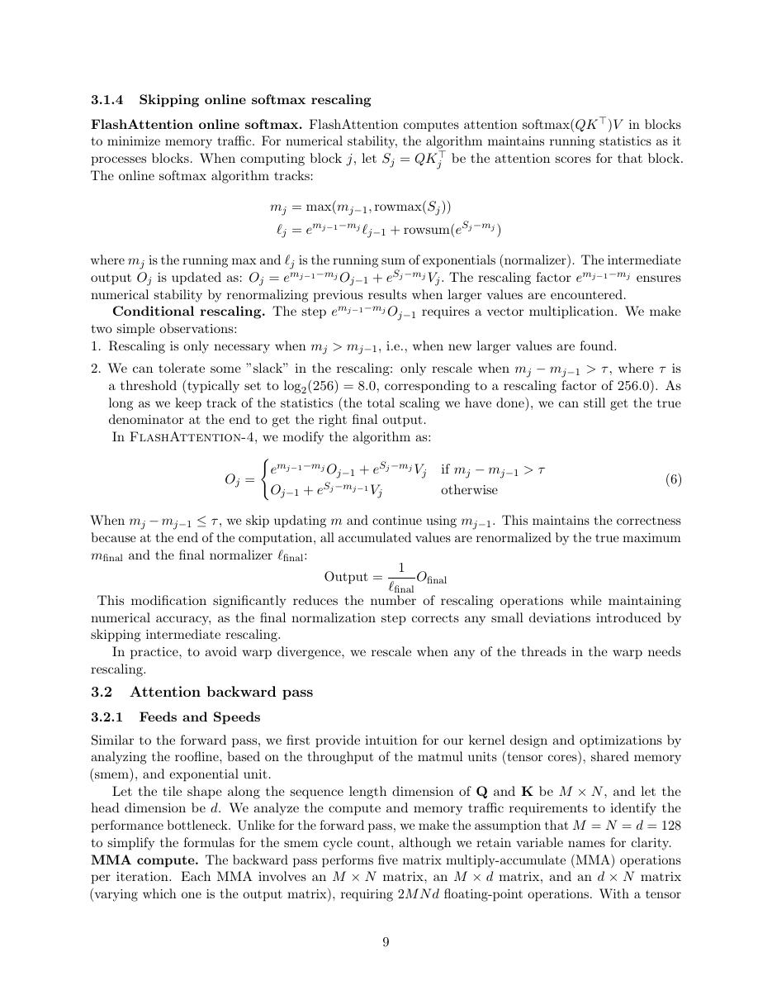
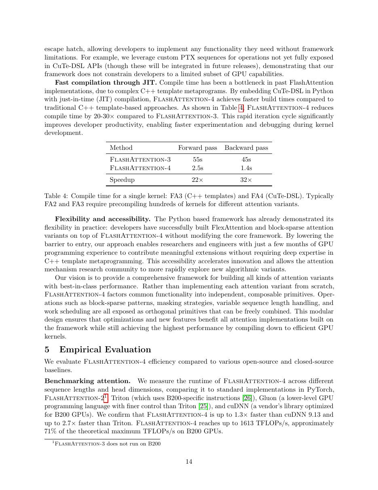

# 论文中文解读：《FlashAttention-4: Algorithm and Kernel Pipelining Co-Design for Asymmetric Hardware Scaling》

## 一、它解决了什么

FA4 针对 Blackwell 上 tensor core 吞吐增长快于 shared memory、指数单元等资源的非对称扩展，重新设计 attention 流水和非 matmul 部分。

## 二、核心机制

它利用全异步 MMA、更大 tile、软件模拟 exponential 与 conditional softmax rescaling；反向用 tensor memory 和 2-CTA MMA 降低 shared-memory traffic 与 atomics。实现改用 Python 内嵌 CuTe DSL，并报告比传统 C++ template 更快编译。

## 三、为什么成为主线

FA4 把 attention、Blackwell memory hierarchy、专用指令和可编程 DSL 合成一个设计问题，代表 2026 年 kernel/compiler co-design 前沿。

## 四、证据应该怎样读

速度、显存、精度或 benchmark 数字只在论文给定的模型、数据、硬件、kernel 版本和评测预算下成立。跨论文比较前要统一训练 tokens、输入长度、batch、精度、采样/思考预算与是否使用工具。

## 五、局限与易误读点

主要结果来自 B200/GB200 与特定 BF16 形状；beta 实现、功能覆盖和其他架构表现仍在演进。峰值 TFLOPs 不等于端到端训练同倍加速。2026-09 的 FP4 扩展还显示低精度 matmul 变快后，softmax/转换会成为新瓶颈。

## 六、放进十年演进史

按 FA1 的 IO、FA2 的 work partition、FA3 的 Hopper async、FA4 的 Blackwell asymmetric scaling 阅读；再连到 CuTeDSL 与编译器专题。

## 七、原文入口

[官方论文/页面](https://arxiv.org/abs/2603.05451)

## 八、原文论证链

FlashAttention-4 面向 Blackwell GPU 的新执行资源重新设计 attention kernel。论文的思路不是沿用 Hopper 调度小修，而是围绕更强的异步矩阵乘、数据搬运、片上存储和细粒度同步建立持久化流水线，让多个 attention tile 长时间驻留并重叠 score GEMM、softmax、输出 GEMM 与访存。

作者同时处理常见形状、因果边界和新低精度路径，报告最高约 1613 TFLOPS 的内核吞吐。这个数字是特定设备、dtype 和形状下的峰值，不应写成所有工作负载的固定速度。

> 原文定位：[PDF 文件第 1 页](paper.pdf#page=1) · [对应截图](rendered_figures/page-1.jpg)

## 九、为什么仍要 online softmax

即使硬件更强，attention 仍不能保存完整 $N^2$ 概率矩阵。分块处理中继续维护每行最大值 $m$、归一化量 $\ell$ 和输出累积 $o$，新 tile 到来时重缩放旧贡献。FA4 的创新主要是这些依赖如何映射到 Blackwell 的异步单元，以及如何在寄存器/shared memory 预算内保持更多阶段并行。

persistent kernel 让一个 thread block/cluster 连续处理多个工作单元，减少反复启动和状态装载；代价是调度、负载均衡与资源占用更复杂。

> 原文定位：[PDF 文件第 2 页](paper.pdf#page=2) · [对应截图](rendered_figures/page-2.jpg)

## 十、实验怎样读

应看完整 shape sweep：序列长度、head dimension、causal、dtype、forward/backward，而不只看摘要峰值。与 FA3/厂商库比较时必须在同一 Blackwell 设备和相同精度下。TFLOPS 是按 attention 数学操作量折算的有效吞吐，不等同芯片所有指令都执行这些 FLOPs。

> 原文定位：[PDF 文件第 9 页](paper.pdf#page=9) · [对应截图](rendered_figures/page-9.jpg)

## 十一、复现检查

- 明确 GPU 型号、CUDA/编译器版本、功耗与时钟。
- 对边界 tile、极端 logits、长序列和所有梯度做 reference 检查。
- benchmark 包含预热与同步，并报告中位数/分位数。
- 端到端验证模型吞吐，防止 kernel 峰值被其他层与通信稀释。

## 十二、常见误读

FA4 仍计算 dense exact attention，没有把 $O(N^2)$ 算术变成线性。它体现的是硬件代际与 kernel 算法协同；离开 Blackwell 的对应机制，不能期待同样收益。

> 原文定位：[PDF 文件第 14 页](paper.pdf#page=14) · [对应截图](rendered_figures/page-14.jpg)

## 原文证据导航

以下页码按仓库内 PDF 的**文件页码**计，不等同于论文印刷页码。建议先读本节所指原文，再回看上面的中文解释。

- [打开原始 PDF](paper.pdf)
- [打开可检索文本](paper.txt)

| 中文笔记中的证据 | 原文位置 | 复核重点 |
|---|---|---|
| 原文首页、摘要与问题定义 | [PDF 文件第 1 页](paper.pdf#page=1) · [截图](rendered_figures/page-1.jpg) | 回到该页上下文，复核定义、图表或实验论证 |
| 核心方法、架构或算法定义所在关键页 | [PDF 文件第 2 页](paper.pdf#page=2) · [截图](rendered_figures/page-2.jpg) | 回到该页上下文，复核定义、图表或实验论证 |
| 实验、结果或关键分析所在原文页 | [PDF 文件第 9 页](paper.pdf#page=9) · [截图](rendered_figures/page-9.jpg) | 回到该页上下文，复核定义、图表或实验论证 |
| 讨论、结论或补充分析所在原文页 | [PDF 文件第 14 页](paper.pdf#page=14) · [截图](rendered_figures/page-14.jpg) | 回到该页上下文，复核定义、图表或实验论证 |
