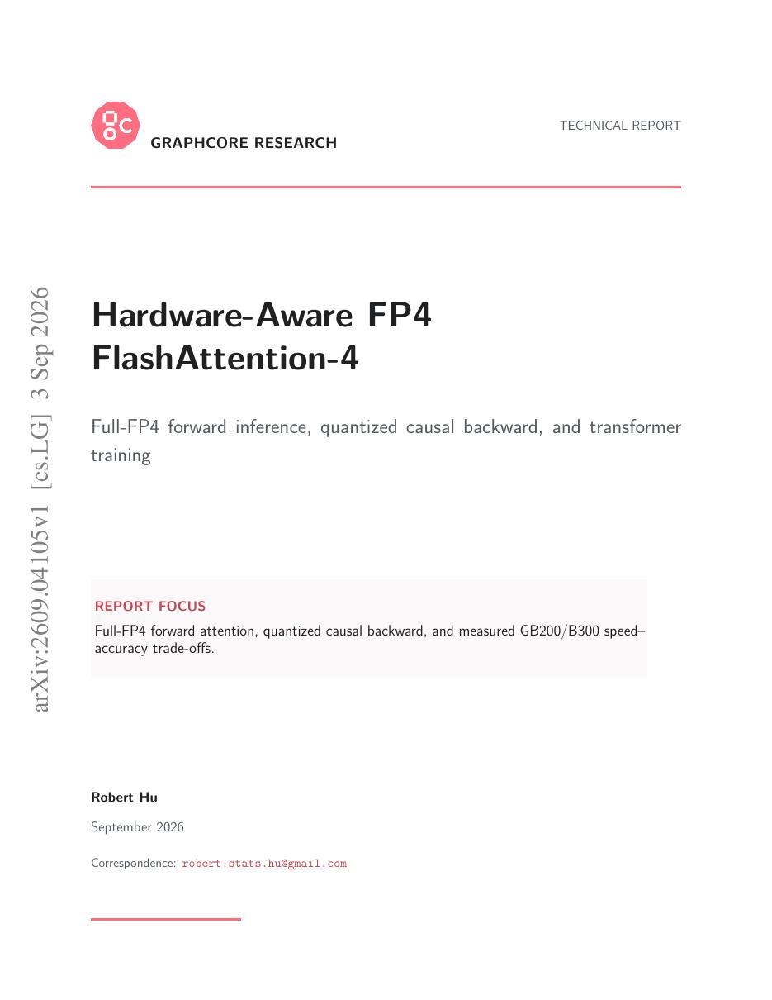
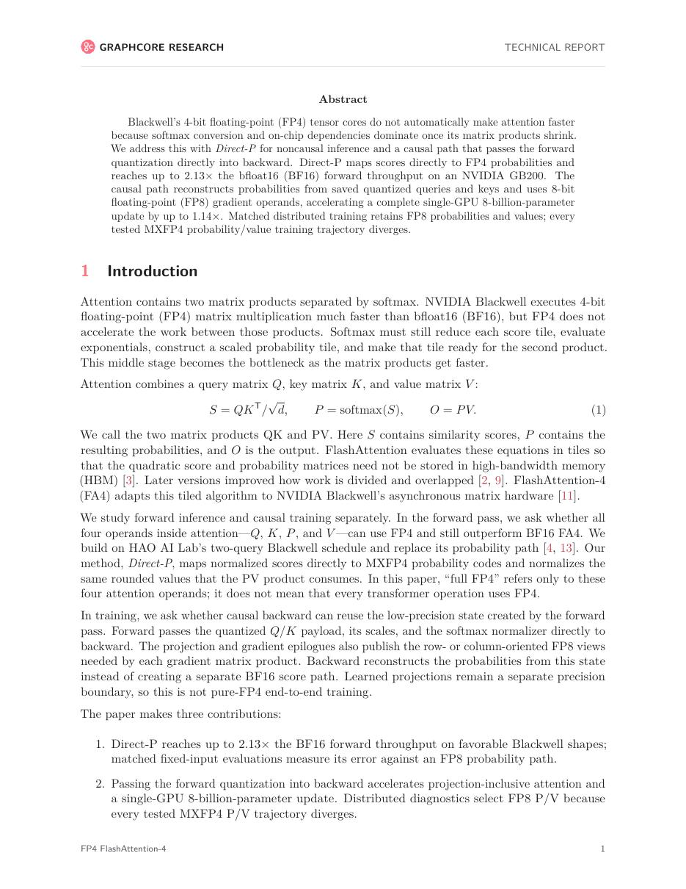
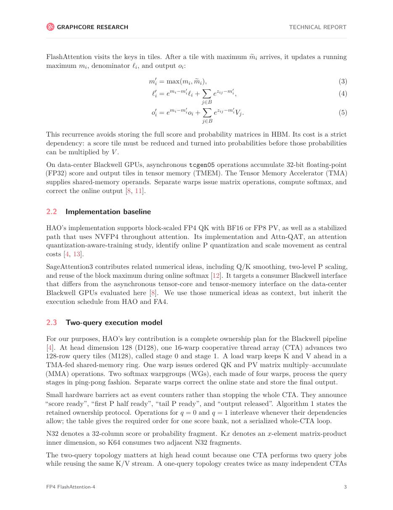
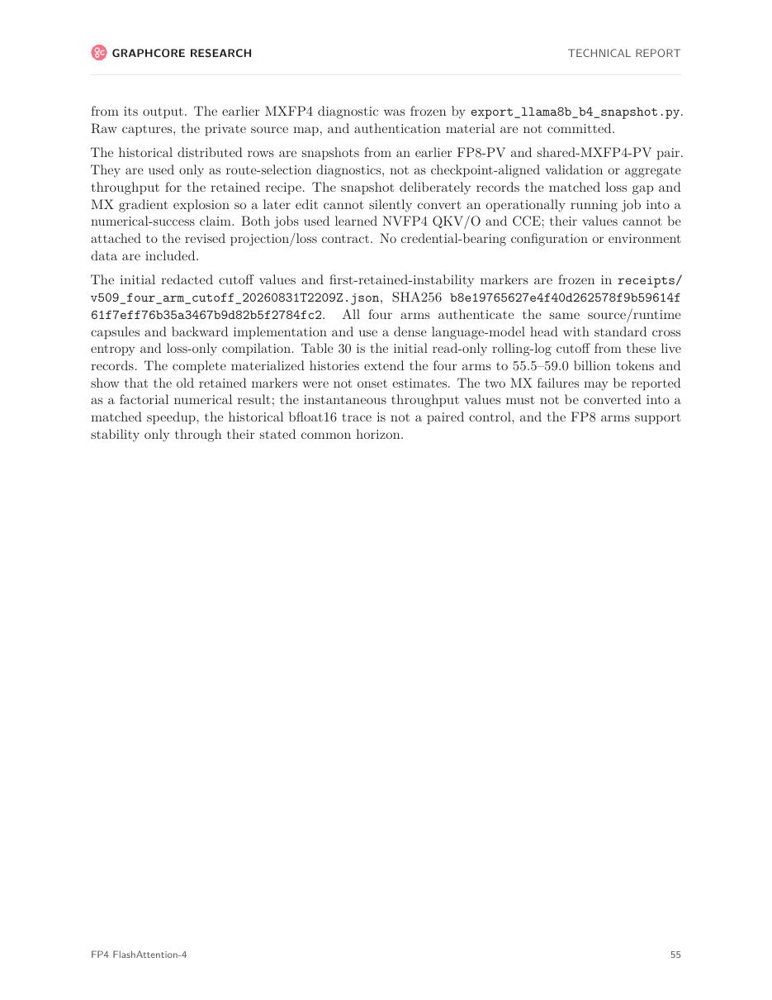

# 论文中文解读：《Hardware-Aware FP4 FlashAttention-4》

## 一、为什么 FP4 tensor core 不等于 FP4 attention 自动加速

矩阵乘精度下降后，QKᵀ/PV 的时间缩短，但 softmax 的 max/sum/exp、数据转换、缩放和片上同步不会同比变快。FA4 已指出 Blackwell 的资源增长不对称；本文把这个问题推进到 FP4。

## 二、Direct-P 与 causal 路径

non-causal Direct-P 尽量避免在高精度 probability 中间表示上反复转换，直接把 score 映射到低精度 P。causal 路径需要同时满足 mask、前向量化复用和反向稳定，因此不能简单复制 non-causal kernel。

## 三、速度数字怎样读

论文报告某些 non-causal forward 相对 BF16 的明显提升，但完整单 GPU 训练更新的收益较小。原因是模型 step 还包含投影、FFN、通信、优化器等部分，attention kernel 峰值不会一比一变成端到端收益。

## 四、精度是共同设计约束

最值得保留的是负结果：所测 MXFP4 probability/value 训练会发散，而 FP8 方案保持可训练。概率矩阵接近 0 的大量值、softmax 动态范围和反向误差，使它比普通 GEMM 更难直接量化。

## 五、历史位置

这不是独立于 FA4 的新代际，而是 2026-09 的最新低精度分支。阅读顺序应是 FA1 的 IO-aware 原理、FA2 的并行划分、FA3 的 Hopper pipeline、FA4 的 Blackwell pipeline，再读本文的 FP4 数值—硬件协同。

## 六、局限

- 极新结果需要更多实现和独立复现。
- 主要针对 Blackwell/GB200，不能外推 A100/H100/Ascend。
- FP4 格式、缩放粒度、head dimension 和 causal 配置都会改变结论。

## 七、原文入口

[arXiv:2609.04105](https://arxiv.org/abs/2609.04105)

## 八、原文论证链

FP4 扩展研究如何把 FlashAttention-4 的 Blackwell 流水线推进到 4-bit 浮点/块缩放路径。attention 比普通 GEMM 更难量化：QK 的误差会经 softmax 非线性放大，概率矩阵再与 V 相乘；不同 tile 和通道的动态范围差异很大。论文因此把量化尺度、数据重排、反量化位置和异步矩阵乘一起设计，而不是简单把输入 cast 成 4 bit。

> 原文定位：[PDF 文件第 1 页](paper.pdf#page=1) · [对应截图](rendered_figures/page-1.jpg)

## 九、块缩放的含义

低精度值可概括为
$$
x\approx s_b\,q,\qquad q\in\mathrm{FP4},
$$
其中一组元素共享 block scale $s_b$。block 越小，尺度越贴合局部分布但元数据与转换开销越高；block 越大，效率高但离群值会浪费表示范围。Q、K、V 可能需要不同尺度粒度，score 的 softmax 统计通常保留更高精度。

算法必须在片上完成 scale 加载、低精度 MMA 与高精度累积，并避免中间结果回写 HBM，否则量化节省会被转换流量抵消。

> 原文定位：[PDF 文件第 2 页](paper.pdf#page=2) · [对应截图](rendered_figures/page-2.jpg)

## 十、实验怎样读

速度表应与 BF16/FP8 FA4 在相同形状比较，同时查看 forward/backward 数值误差和端到端模型指标。峰值吞吐证明 kernel 能利用低精度单元，不能单独证明训练或推理质量可接受。校准分布、长序列 logits 和异常值输入尤其重要。

> 原文定位：[PDF 文件第 4 页](paper.pdf#page=4) · [对应截图](rendered_figures/page-4.jpg)

## 十一、复现检查

- 记录 FP4 格式、scale 格式、block shape 与 rounding 规则。
- 比较 reference 时区分量化误差与分块浮点求和误差。
- 测试极端范数 Q/K、不同 head 与长上下文。
- 端到端实验报告 loss/perplexity 或任务质量，而不只 kernel 误差。

## 十二、常见误读

“四位”不等于内存和延迟严格减半：scale、布局、转换和累积仍有成本。该工作证明的是在特定 Blackwell 数据通路上可构造高吞吐、受控误差的 attention，不是所有模型都可无校准切换 FP4。

> 原文定位：[PDF 文件第 56 页](paper.pdf#page=56) · [对应截图](rendered_figures/page-56.jpg)

## 原文证据导航

以下页码按仓库内 PDF 的**文件页码**计，不等同于论文印刷页码。建议先读本节所指原文，再回看上面的中文解释。

- [打开原始 PDF](paper.pdf)
- [打开可检索文本](paper.txt)

| 中文笔记中的证据 | 原文位置 | 复核重点 |
|---|---|---|
| 首页、摘要与硬件瓶颈定义 | [PDF 文件第 1 页](paper.pdf#page=1) · [截图](rendered_figures/page-1.jpg) | 回到该页上下文，复核定义、图表或实验论证 |
| FP4 数据路径和算法设计 | [PDF 文件第 2 页](paper.pdf#page=2) · [截图](rendered_figures/page-2.jpg) | 回到该页上下文，复核定义、图表或实验论证 |
| 性能与硬件利用率分析 | [PDF 文件第 4 页](paper.pdf#page=4) · [截图](rendered_figures/page-4.jpg) | 回到该页上下文，复核定义、图表或实验论证 |
| 附录、训练稳定性与补充实验 | [PDF 文件第 56 页](paper.pdf#page=56) · [截图](rendered_figures/page-56.jpg) | 回到该页上下文，复核定义、图表或实验论证 |
