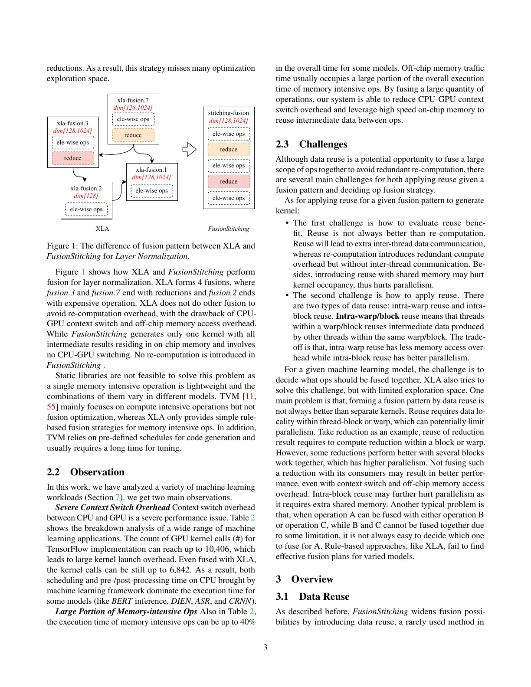
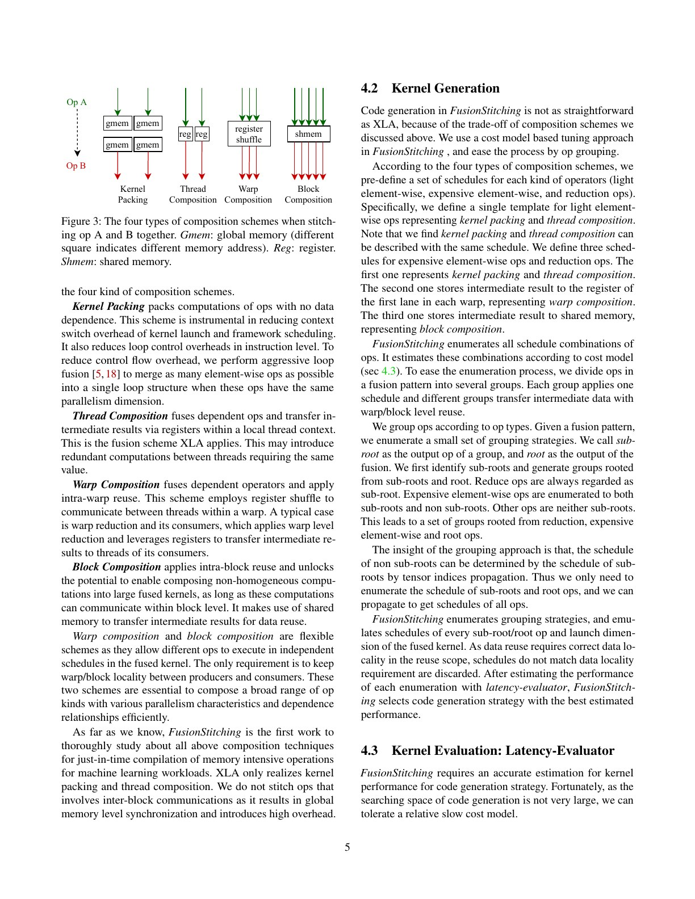
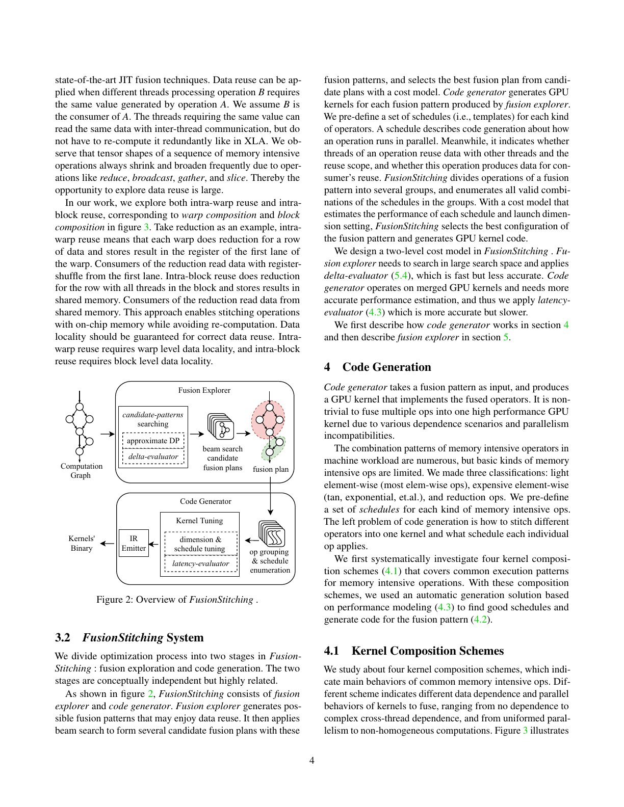
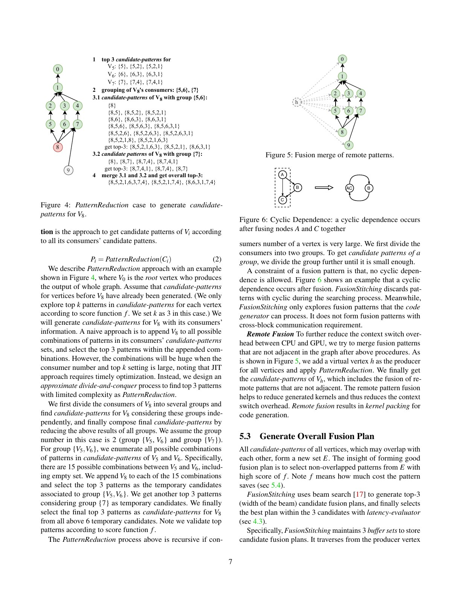
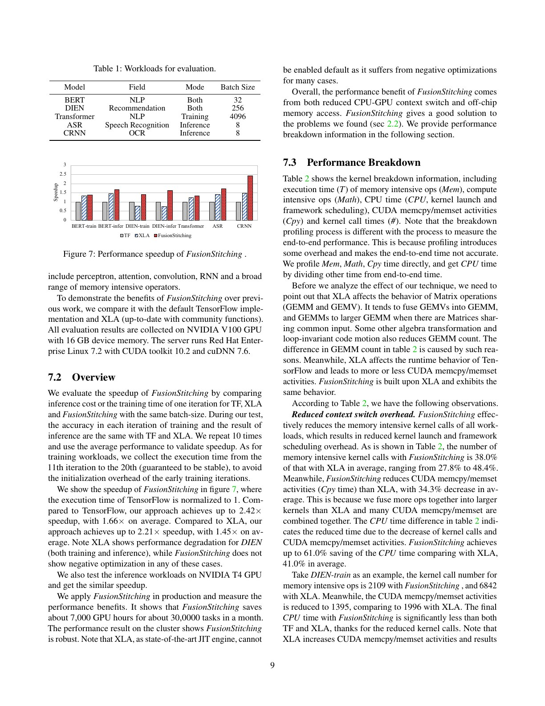
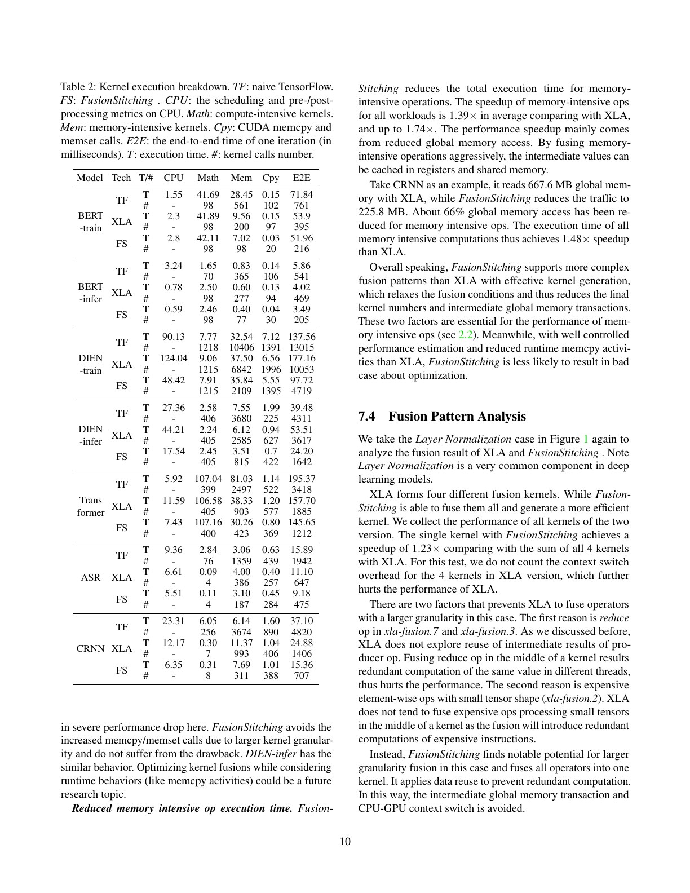

# FusionStitching 中文精读

## 1. 论文定位

Kernel fusion 最容易被简化成一句话：“把多个算子写进同一个 CUDA kernel”。FusionStitching 的价值在于把这句话拆成三个真正困难的问题：

1. 哪些算子组合语义上可以融合？
2. 并行结构不同的算子怎样在一个 kernel 中交换数据？
3. 节省 HBM 与 launch 的收益，是否大于同步、寄存器、shared memory 和 occupancy 的损失？

论文不是发明 fusion，而是扩展 XLA 当时可表达的融合空间，并给出可在生产中运行的搜索、估价与 codegen 链路。

## 2. 为什么简单融合不够

对两个相邻算子 $A\to B$，不融合时中间 tensor 写回 global memory，随后又被 $B$ 读回。融合后可以令中间值停留在 register 或 shared memory：

$$
T_{gain}\approx T_{HBM,removed}+T_{launch,removed}
-T_{sync}-T_{recompute}-T_{occupancy loss}.
$$

右侧最后三项决定了“融合越多越好”是错的。Reduction 的线程组织常与 elementwise consumer 不同；强行融合可能需要跨线程通信、重复计算或更大 shared memory，并使可驻留 block 数下降。

下图所在页对比了 XLA 与 FusionStitching 在 layer normalization 上的融合边界，并给出系统动机：

## 3. 四种 stitching scheme

论文把组合方式分为四类：

- thread composition：同一线程生产并消费中间值，通常放 register。
- warp composition：warp 内线程通过 shuffle 等方式交换数据。
- block composition：block 内经 shared memory 和同步交换。
- block packing：两个子计算放在同一 kernel/block，但不强求共享中间数据，主要省 launch。

这套分类的重要之处是把“图上的 fusion”落到硬件通信域。一个中间值能否留在 on-chip memory，取决于 producer 与 consumer 的索引映射和并行度，而不是只看它们在计算图上是否相邻。

## 4. 系统流程

系统包含两层决策：

### 4.1 Fusion explorer

从图的输出向前遍历，用 beam search 保留少量候选。搜索状态不只是“节点集合”，还包括 producer-consumer 的 stitching 方式。它需要拒绝：

- 数据依赖形成不允许的环；
- resource usage 超限；
- 预期并行度过低；
- 不支持的 codegen 组合。

远端 pattern 合并和循环依赖处理见下页：

### 4.2 两级 evaluator

delta-evaluator 用较便宜的模型衡量新增一次 fusion 的边际收益，适合大空间剪枝；latency-evaluator 更细致地估算 warp 延迟、occupancy、访存与同步，只用于最后少量候选。

这种 coarse-to-fine 结构比“为每个候选真正编译并 benchmark”便宜，也比单一静态规则更能适应不同模型。

## 5. 代码生成为什么是方法的一部分

论文不只做图搜索。若 backend 只能生成同构 elementwise loop，再好的融合计划也落不了地。其 codegen 支持：

- reduction 与 elementwise 的异构并行组合；
- register、shuffle、shared memory 三种中间值传递；
- aggressive loop unrolling；
- shared-memory buffer 复用；
- consumer 间的计算复用，避免每个分支重复 producer。

这解释了 fusion compiler 的一个普遍规律：搜索空间和代码生成能力必须共同设计。扩大搜索空间但没有高质量 lowering，只会找到理论上可融合、实际更慢的 kernel。

## 6. 实验证据

在论文的 7 个 workload 上：

- 相对 TensorFlow：最高 2.42×，平均 1.66×；
- 相对 XLA：最高 2.21×，平均 1.45×；
- 测试覆盖 BERT、DIEN、Transformer、ASR、CRNN 等训练与推理任务。

重要的是看 breakdown，而不是只看最高柱：

- memory-intensive kernel 数平均为 XLA 的 38.0%；
- CPU/调度时间相对 XLA 平均下降 41.0%，最高下降 61.0%；
- memory-intensive 部分相对 XLA 平均加速 1.39×；
- CRNN 的相关 global-memory traffic 减少约 66%。

因此收益同时来自少 launch 与少 HBM traffic。论文也指出 XLA 在 DIEN 上出现负优化，而 FusionStitching 在所测案例中没有；这不是“永不负优化”的保证，只说明候选估价在该集合上有效。

## 7. 生产数字怎样读

作者报告系统在数千 GPU 的生产集群运行四个月，每月约 30,000 个任务节省 7,000 GPU 小时。这个数字证明工程可部署性，但缺少公开 workload mix、排队策略和成本归一化，不能与其他论文的实验室 speedup 直接比较。

## 8. 常见误读

### 误读一：融合就是减少 kernel 数

减少 kernel 数只是代理指标。一个 occupancy 很差的巨型 kernel 可能比多个高效 kernel 更慢。

### 误读二：所有中间值都会留在寄存器

跨线程/warp/block 的依赖决定需要 shuffle 或 shared memory；某些方案还会选择重算。

### 误读三：平均 1.45× 可迁移到现代 GPU

论文环境是 V100/T4 和 2020 年 XLA。现代 CUDA Graph、Triton、Inductor 与厂商 fused kernels 已改变基线，方法思想仍有效，数值不能照搬。

## 9. 复现检查点

- 固定 GPU、CUDA、XLA commit 与 cuDNN 版本。
- 同时报告端到端、kernel 数、HBM bytes、CPU launch time 和 occupancy。
- 分离 warmup/编译时间与 steady-state runtime。
- 检查数值语义，尤其 reduction 顺序改变造成的浮点误差。
- 为每个 fusion plan 记录 resource usage，定位性能下降究竟来自寄存器、shared memory 还是并行度。

## 10. 与后续论文的关系

- [Welder](../welder/论文中文解读.md) 把核心抽象推进到 tile 与多级存储流量。
- [Korch](../korch/论文中文解读.md) 进一步主张先把 operator fission 成 primitives，再做全局 kernel orchestration。
- MegaKernel 工作则跨越更多 operator，在一个 persistent kernel 内引入设备侧任务调度。

## 11. 最终判断

FusionStitching 最值得带走的不是四个具体规则，而是一个决策框架：fusion 的价值必须用“减少的数据移动与 launch”减去“新增的资源、同步和并行度损失”来判断；fusion plan、cost model 与 codegen 缺一不可。
