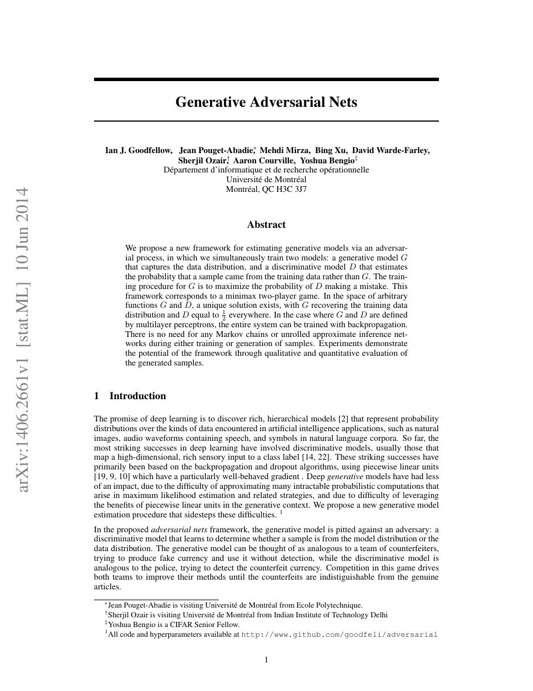
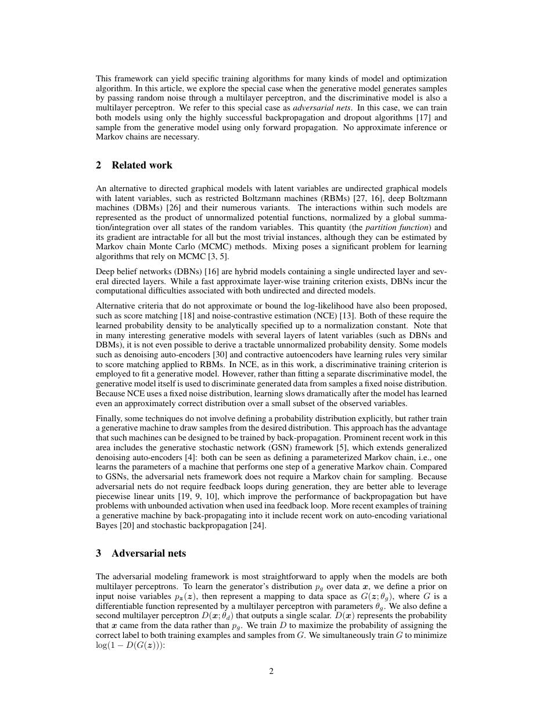
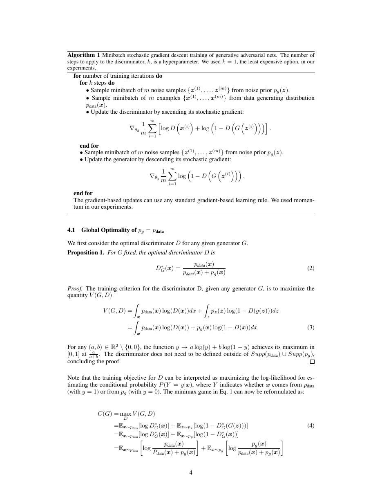
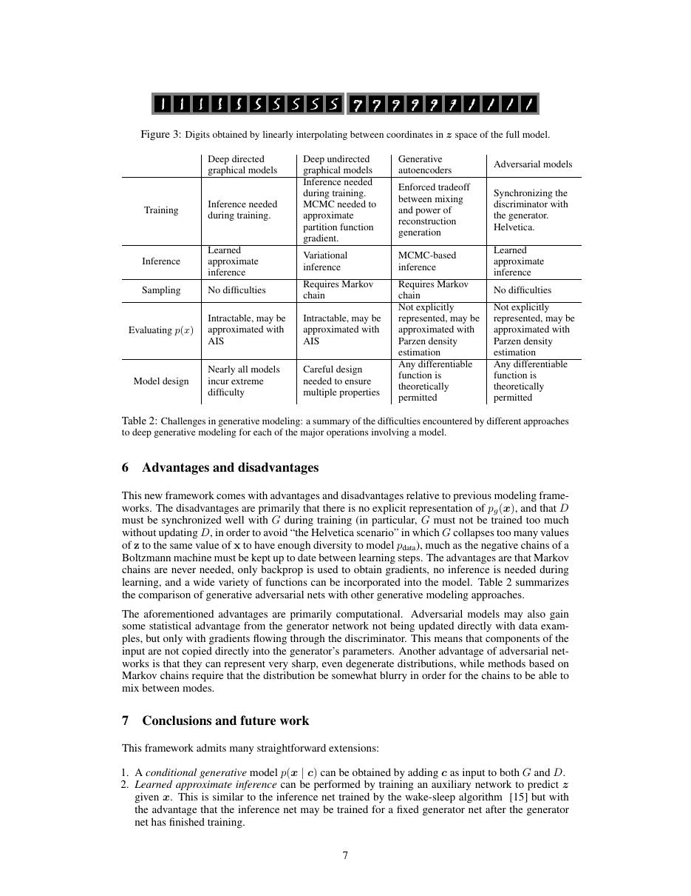

# 论文中文解读：《Generative Adversarial Nets》

## 一、它解决了什么

GAN 用生成器与判别器的二人博弈绕开显式似然：生成器造样本，判别器区分真假，二者对抗训练。

## 二、核心机制

原始 minimax 目标在理想判别器下对应 Jensen–Shannon divergence。实践常改用 non-saturating generator loss，以免判别器过强时梯度消失。训练不是普通单目标下降，而是在随时间变化的对手上寻找均衡。

## 三、为什么成为主线

GAN 把高保真图像生成推向主流，并催生条件 GAN、StyleGAN、对抗域适配等大量工作；它也让研究者重视“训练动力学”而非只看静态损失。

## 四、应该怎样读证据

论文里的结果首先证明方法在当时数据、模型规模、硬件和评测协议下成立。跨年代比较时要统一参数量、训练 tokens、数据质量、上下文长度、推理预算与系统实现，不能只横比单个最佳分数。

## 五、局限与易误读点

mode collapse、振荡和超参敏感是根本难点；判别器分数不是可靠似然。原论文的小规模结果不能直接代表后来的高分辨率 GAN。

## 六、放进十年演进史

与 VAE 相比，GAN 通常锐利但缺少显式编码/似然；与扩散模型相比，采样快但训练更不稳定、覆盖度更难保证。

## 七、原文入口

[官方论文/页面](https://arxiv.org/abs/1406.2661)

## 八、原文论证链

GAN 把隐式生成分布的学习写成二人博弈：判别器区分真实样本与 $G(z)$，生成器让判别失败。原文先定义 minimax 目标，再在“判别器容量充分且固定 $G$ 时达到最优”的条件下求出 $D_G^*$，证明全局最优为 $p_g=p_{\rm data}$，最后给出交替小批量更新与样本实验。理论描述的是理想函数空间，实际交替梯度并没有全局收敛保证。

> 原文定位：[PDF 文件第 1 页](paper.pdf#page=1) · [对应截图](rendered_figures/page-1.jpg)

## 九、公式与两种生成器目标

$$
\min_G\max_D
\mathbb E_{x\sim p_{\rm data}}\log D(x)
+\mathbb E_{z\sim p_z}\log(1-D(G(z))).
$$
固定 $G$ 后，
$$
D_G^*(x)=\frac{p_{\rm data}(x)}
{p_{\rm data}(x)+p_g(x)}.
$$
代回可得
$$
C(G)=-\log4+2\,\operatorname{JSD}(p_{\rm data}\Vert p_g).
$$
当早期 $D(G(z))\approx0$ 时，原 minimax 生成器梯度容易饱和，因此论文建议实践中最大化 $\log D(G(z))$。non-saturating 目标与理论 minimax 目标不相同，但具有相同理想不动点。

> 原文定位：[PDF 文件第 2 页](paper.pdf#page=2) · [对应截图](rendered_figures/page-2.jpg)

## 十、实验怎样读

MNIST、TFD、CIFAR-10 等结果用样本与 Parzen-window 似然近似展示可行性。高维 Parzen 估计对带宽敏感，不能按现代 FID 的可信度理解。漂亮样本也不能排除 mode dropping，必须结合多样性和最近邻检查。

> 原文定位：[PDF 文件第 4 页](paper.pdf#page=4) · [对应截图](rendered_figures/page-4.jpg)

## 十一、复现检查

- 明确生成器使用 minimax 还是 non-saturating loss。
- 同时记录 $D(x)$、$D(G(z))$、多样性与梯度，不只看总 loss。
- 平衡两方更新频率、容量与学习率。
- 诊断模式崩溃时按博弈动力学处理，而非普通单目标过拟合。

## 十二、常见误读

全局最优定理不等于训练保证到达该点。DCGAN、Wasserstein 距离和谱归一化均是后续工作；本文奠定的是对抗学习隐式分布的原则。

> 原文定位：[PDF 文件第 7 页](paper.pdf#page=7) · [对应截图](rendered_figures/page-7.jpg)

## 原文证据导航

以下页码按仓库内 PDF 的**文件页码**计，不等同于论文印刷页码。建议先读本节所指原文，再回看上面的中文解释。

- [打开原始 PDF](paper.pdf)
- [打开可检索文本](paper.txt)

| 中文笔记中的证据 | 原文位置 | 复核重点 |
|---|---|---|
| 原文首页、摘要与问题定义 | [PDF 文件第 1 页](paper.pdf#page=1) · [截图](rendered_figures/page-1.jpg) | 回到该页上下文，复核定义、图表或实验论证 |
| 核心方法、架构或算法定义所在关键页 | [PDF 文件第 2 页](paper.pdf#page=2) · [截图](rendered_figures/page-2.jpg) | 回到该页上下文，复核定义、图表或实验论证 |
| 实验、结果或关键分析所在原文页 | [PDF 文件第 4 页](paper.pdf#page=4) · [截图](rendered_figures/page-4.jpg) | 回到该页上下文，复核定义、图表或实验论证 |
| 讨论、结论或补充分析所在原文页 | [PDF 文件第 7 页](paper.pdf#page=7) · [截图](rendered_figures/page-7.jpg) | 回到该页上下文，复核定义、图表或实验论证 |
