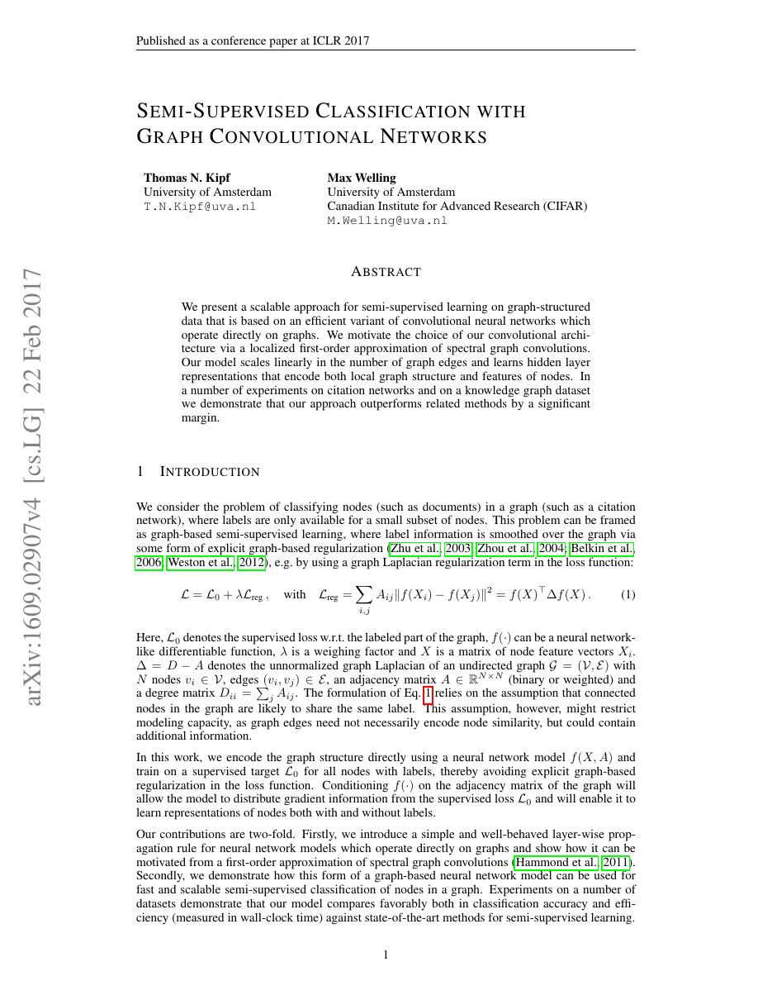
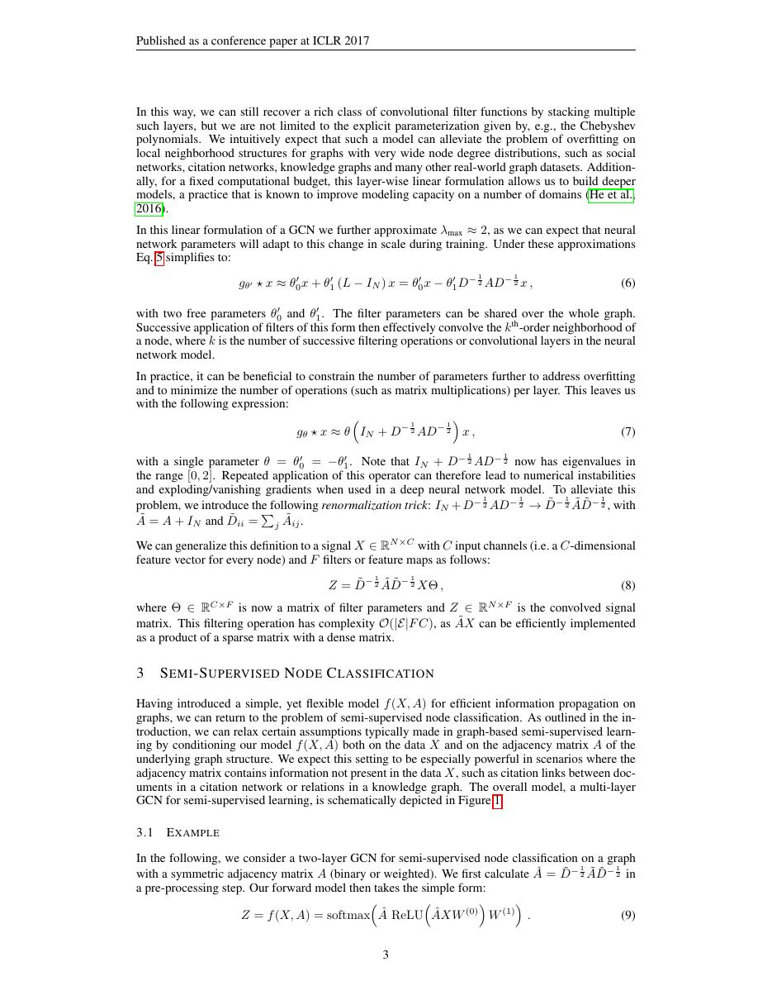
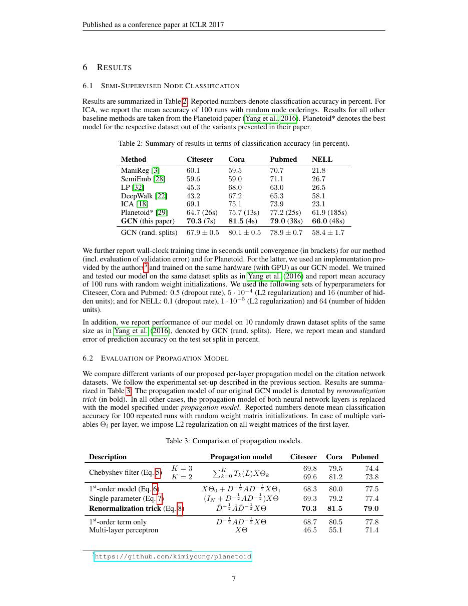
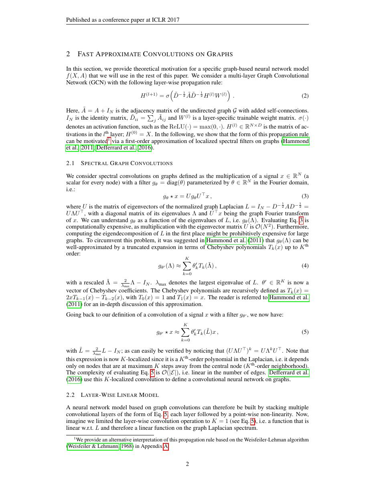

# 论文中文解读：《Semi-Supervised Classification with Graph Convolutional Networks》

## 一、它解决了什么

GCN 把卷积推广到图：每层聚合邻居特征，让节点表示同时编码自身与局部结构。

## 二、核心机制

从谱图卷积的一阶近似得到 H′=σ(D̂^{-1/2}ÂD̂^{-1/2}HW)，其中 Â=A+I 加入自环。归一化抑制度数差异；在引文网络上用少量标签做 transductive 半监督学习。

## 三、为什么成为主线

GCN 成为 message passing GNN 的标准基线，影响推荐、知识图谱、分子建模与图编译优化。

## 四、应该怎样读证据

论文里的结果首先证明方法在当时数据、模型规模、硬件和评测协议下成立。跨年代比较时要统一参数量、训练 tokens、数据质量、上下文长度、推理预算与系统实现，不能只横比单个最佳分数。

## 五、局限与易误读点

多层会 over-smoothing，邻居爆炸限制大图训练；原实验是静态 transductive 图，不能直接外推到动态图和 inductive 部署。

## 六、放进十年演进史

与 Attention 结合形成 GAT；与 Transformer 的区别在于 GCN 的连接由图边预先限定，而 self-attention 通常学习全连接权重。

## 七、原文入口

[官方论文/页面](https://arxiv.org/abs/1609.02907)

## 八、原文论证链

论文从谱图卷积出发，用 Chebyshev 多项式的一阶近似把全局特征分解计算变成局部邻居传播，再通过 renormalization 稳定多层堆叠。半监督训练使用全图的特征和边传播信息，但只在有标签节点上计算损失，因此是 transductive end-to-end 学习。

> 原文定位：[PDF 文件第 1 页](paper.pdf#page=1) · [对应截图](rendered_figures/page-1.jpg)

## 九、从谱形式到传播规则

归一化拉普拉斯
$$
L=I-D^{-1/2}AD^{-1/2}=U\Lambda U^\top
$$
上的谱滤波为
$$
g_\theta*x=Ug_\theta(\Lambda)U^\top x.
$$
一阶近似和参数约束后，实际采用
$$
\tilde A=A+I,\qquad
\tilde D_{ii}=\sum_j\tilde A_{ij},
$$
$$
H^{(l+1)}=\sigma\!\left(
\tilde D^{-1/2}\tilde A\tilde D^{-1/2}
H^{(l)}W^{(l)}\right).
$$
自环保留自身信息，对称归一化抑制高度节点的尺度放大；每层混合一跳邻域。

> 原文定位：[PDF 文件第 3 页](paper.pdf#page=3) · [对应截图](rendered_figures/page-3.jpg)

## 十、实验怎样读

Cora、Citeseer、Pubmed 的少标签节点分类支持联合使用拓扑与特征。训练阶段整个图以及测试节点的无标签连接可见，不能把结果直接解释成对全新图的 inductive 泛化。小数据集还对 split 很敏感。

> 原文定位：[PDF 文件第 7 页](paper.pdf#page=7) · [对应截图](rendered_figures/page-7.jpg)

## 十一、复现检查

- 自环只加一次，并用新的 $\tilde D$ 归一化。
- 使用稀疏乘法才符合复杂度主张。
- 固定并报告数据划分、特征归一化和 early stopping。
- 区分 transductive 与 inductive 评测。

## 十二、常见误读

GCN 不是任意邻居平均，而是特定谱近似导出的归一化传播。异配图、深层过平滑和动态图不是本文已解决的问题。

> 原文定位：[PDF 文件第 2 页](paper.pdf#page=2) · [对应截图](rendered_figures/page-2.jpg)

## 原文证据导航

以下页码按仓库内 PDF 的**文件页码**计，不等同于论文印刷页码。建议先读本节所指原文，再回看上面的中文解释。

- [打开原始 PDF](paper.pdf)
- [打开可检索文本](paper.txt)

| 中文笔记中的证据 | 原文位置 | 复核重点 |
|---|---|---|
| 原文首页、摘要与问题定义 | [PDF 文件第 1 页](paper.pdf#page=1) · [截图](rendered_figures/page-1.jpg) | 回到该页上下文，复核定义、图表或实验论证 |
| 核心方法、架构或算法定义所在关键页 | [PDF 文件第 3 页](paper.pdf#page=3) · [截图](rendered_figures/page-3.jpg) | 回到该页上下文，复核定义、图表或实验论证 |
| 实验、结果或关键分析所在原文页 | [PDF 文件第 7 页](paper.pdf#page=7) · [截图](rendered_figures/page-7.jpg) | 回到该页上下文，复核定义、图表或实验论证 |
| 讨论、结论或补充分析所在原文页 | [PDF 文件第 2 页](paper.pdf#page=2) · [截图](rendered_figures/page-2.jpg) | 回到该页上下文，复核定义、图表或实验论证 |
