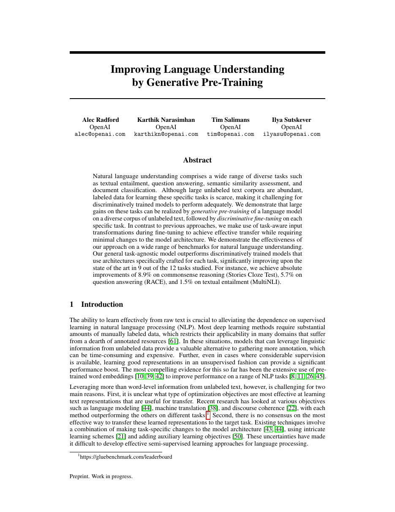
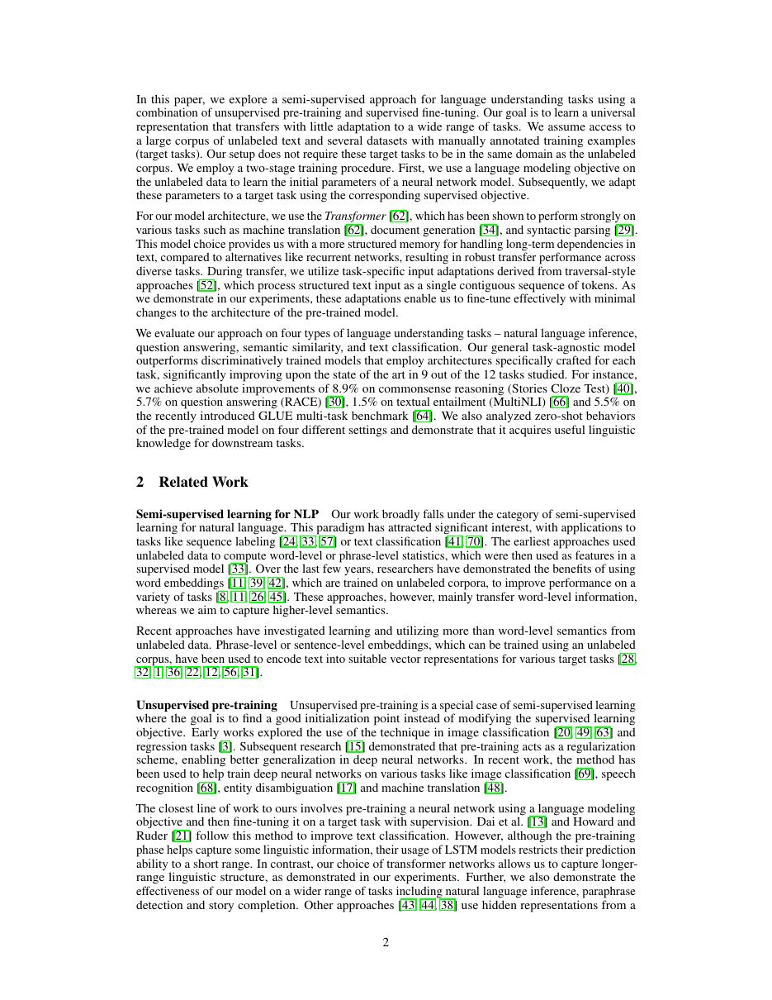
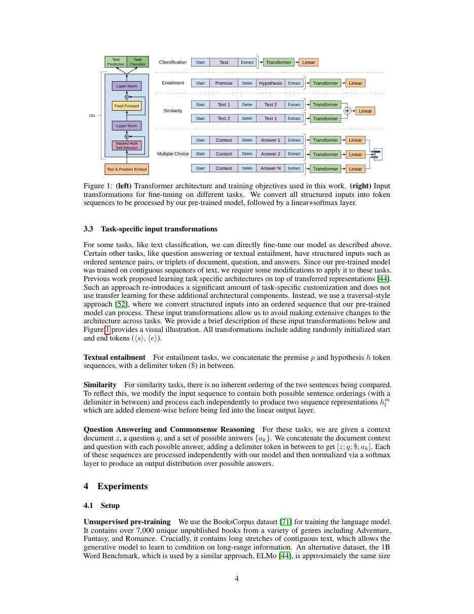
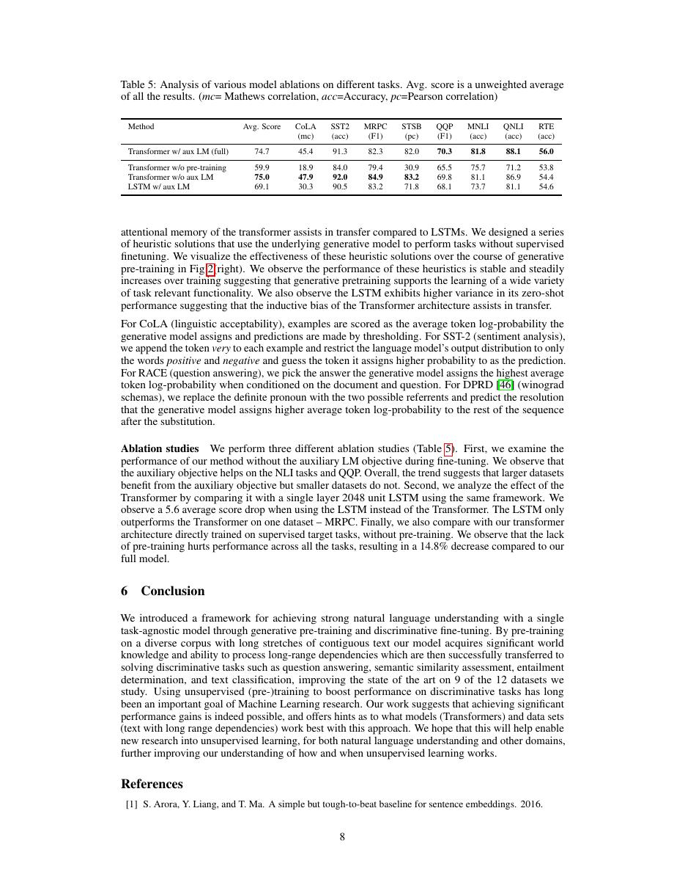

# 论文中文解读：《Improving Language Understanding by Generative Pre-Training》

## 一、它解决了什么

GPT-1 证明 decoder-only Transformer 可先用大规模无标注文本做自回归预训练，再用少量任务数据微调。

## 二、核心机制

模型最大化 next-token likelihood 学通用表示；微调时把不同任务输入统一成 token 序列，并在语言模型损失外加入监督目标。它仍为每项任务更新全部参数，尚不是今天的纯 prompting。

## 三、为什么成为主线

GPT-1 把 NLP 从单任务监督网络推向预训练—适配范式，并开出 GPT-2/3 的规模化路线。

## 四、应该怎样读证据

论文里的结果首先证明方法在当时数据、模型规模、硬件和评测协议下成立。跨年代比较时要统一参数量、训练 tokens、数据质量、上下文长度、推理预算与系统实现，不能只横比单个最佳分数。

## 五、局限与易误读点

BookCorpus 规模和 12 层模型远小于后续 LLM；任务格式需要手工转换，微调可能灾难性遗忘。论文结果不应按今天 benchmark 直接比较。

## 六、放进十年演进史

BERT 选择双向 MLM encoder；GPT-2/3 继续扩大 decoder-only 自回归路线；T5 用 encoder–decoder text-to-text 统一任务。

## 七、原文入口

[官方论文/页面](https://cdn.openai.com/research-covers/language-unsupervised/language_understanding_paper.pdf)

## 八、原文论证链

论文提出“两阶段迁移”：先在大规模无标注文本上学习通用语言模型，再用少量有标注数据微调。其问题意识是有监督 NLP 任务的数据和标签格式各异，逐任务训练会浪费未标注语料中的语言规律。作者选用 Transformer decoder，因为它既能做自回归语言建模，又能通过统一的序列化输入处理分类、文本蕴含、相似度和多选题。

预训练最大化
$$
L_1(U)=\sum_i\log P(u_i\mid u_{i-k},\ldots,u_{i-1};\Theta).
$$
微调时最大化监督目标 $L_2(C)$，并保留一个辅助语言模型项：
$$
L_3(C)=L_2(C)+\lambda L_1(C).
$$
辅助项不是新的标签任务，而是约束表示在微调时继续保留语言建模能力。

> 原文定位：[PDF 文件第 1 页](paper.pdf#page=1) · [对应截图](rendered_figures/page-1.jpg)

## 九、任务输入变换怎样工作

模型主体保持不变，差异被移到输入表示：分类任务在文本后接特殊标记；文本蕴含把 premise 与 hypothesis 串接；相似度任务对两个顺序分别编码再合并；多选题把 context 与每个 answer 组成候选。这样，论文检验的是“同一个预训练 Transformer 能否通过很少的任务专用结构迁移”，而不是为每个 benchmark 设计一套网络。

> 原文定位：[PDF 文件第 2 页](paper.pdf#page=2) · [对应截图](rendered_figures/page-2.jpg)

## 十、实验与消融怎样读

结果应结合三类证据：多任务整体提升、低资源设置中的优势、以及去掉预训练/辅助 LM/Transformer 后的消融。预训练收益在标注较少时尤其重要，支持“无标签知识降低监督样本需求”。同时，部分任务仍需输入变换和监督微调，所以本文并未实现后来的纯提示式零样本通用模型。

> 原文定位：[PDF 文件第 4 页](paper.pdf#page=4) · [对应截图](rendered_figures/page-4.jpg)

## 十一、复现检查

- 使用严格自回归 mask，不能把 BERT 式双向上下文混入预训练复现。
- tokenizer、上下文窗口、预训练语料和微调学习率都会显著影响结果。
- 多选和相似度输入要按论文的 traversal-style 序列化，而非任意拼接。
- 报告每任务多次运行方差；小数据集对随机种子很敏感。

## 十二、常见误读

GPT-1 的核心不是规模本身，而是“生成式预训练 + 判别式微调”的可迁移接口。它仍依赖每个任务的标注和格式设计；把 GPT-2/3 的零样本或 in-context learning 能力归给本文是不准确的。

> 原文定位：[PDF 文件第 8 页](paper.pdf#page=8) · [对应截图](rendered_figures/page-8.jpg)

## 原文证据导航

以下页码按仓库内 PDF 的**文件页码**计，不等同于论文印刷页码。建议先读本节所指原文，再回看上面的中文解释。

- [打开原始 PDF](paper.pdf)
- [打开可检索文本](paper.txt)

| 中文笔记中的证据 | 原文位置 | 复核重点 |
|---|---|---|
| 原文首页、摘要与问题定义 | [PDF 文件第 1 页](paper.pdf#page=1) · [截图](rendered_figures/page-1.jpg) | 回到该页上下文，复核定义、图表或实验论证 |
| 核心方法、架构或算法定义所在关键页 | [PDF 文件第 2 页](paper.pdf#page=2) · [截图](rendered_figures/page-2.jpg) | 回到该页上下文，复核定义、图表或实验论证 |
| 实验、结果或关键分析所在原文页 | [PDF 文件第 4 页](paper.pdf#page=4) · [截图](rendered_figures/page-4.jpg) | 回到该页上下文，复核定义、图表或实验论证 |
| 讨论、结论或补充分析所在原文页 | [PDF 文件第 8 页](paper.pdf#page=8) · [截图](rendered_figures/page-8.jpg) | 回到该页上下文，复核定义、图表或实验论证 |
