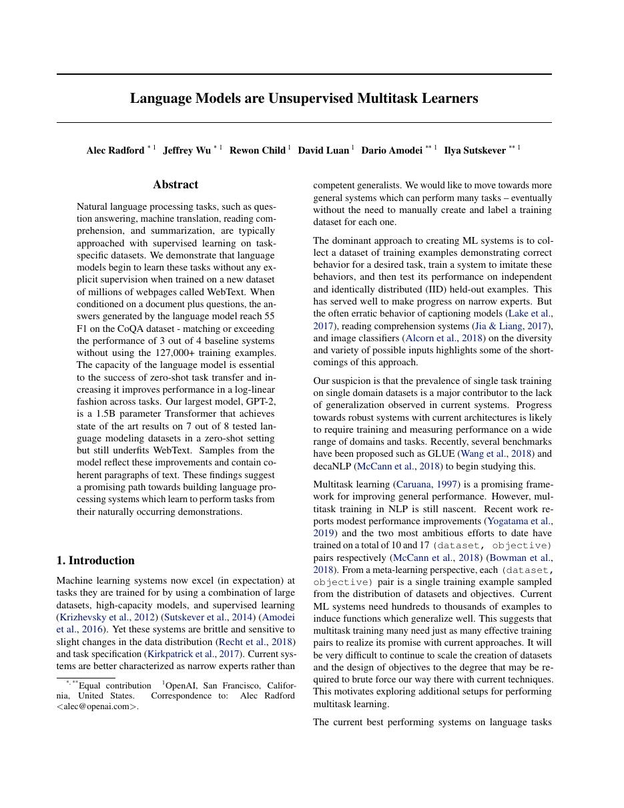
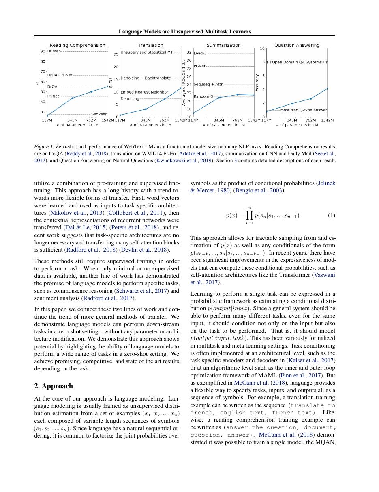
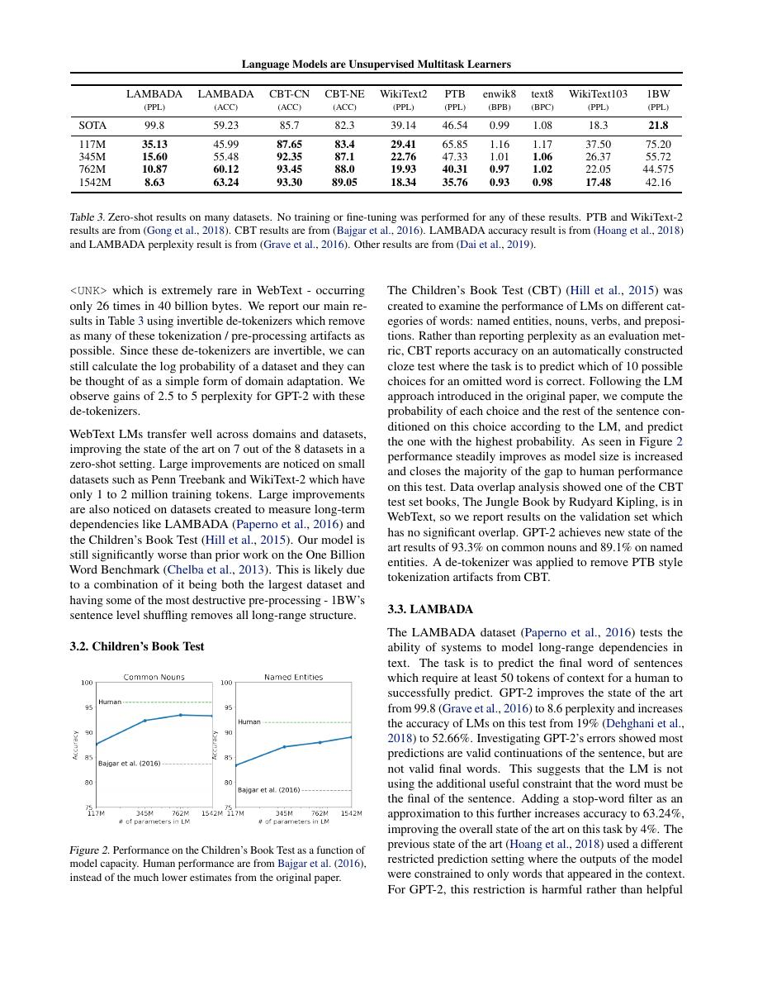
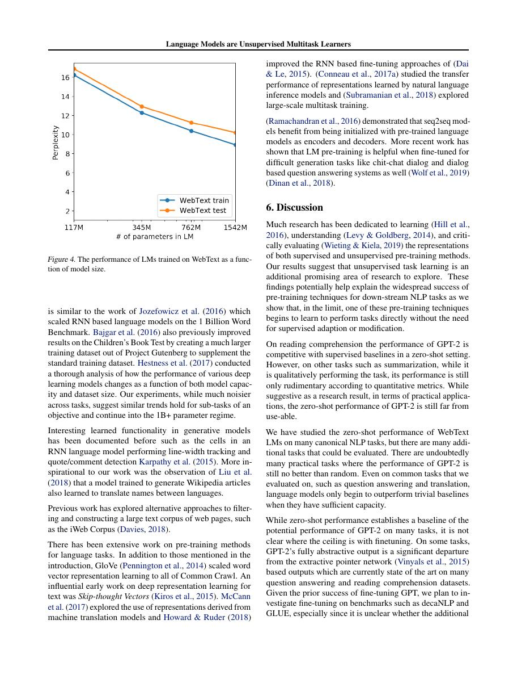

# 论文中文解读：《Language Models are Unsupervised Multitask Learners》

## 一、它解决了什么

GPT-2 把 GPT 路线扩大到 1.5B 参数与 WebText，展示仅靠自然语言上下文即可产生零样本任务行为。

## 二、核心机制

仍是 decoder-only next-token objective，但数据更广、模型更大；任务被视为 p(output|input, task text) 的条件生成。LayerNorm 位置、残差缩放等工程改动改善深网训练。

## 三、为什么成为主线

它让 prompt 作为任务接口进入主流，并显示能力可以随模型和数据规模涌现，而不必为每项任务微调。

## 四、应该怎样读证据

论文里的结果首先证明方法在当时数据、模型规模、硬件和评测协议下成立。跨年代比较时要统一参数量、训练 tokens、数据质量、上下文长度、推理预算与系统实现，不能只横比单个最佳分数。

## 五、局限与易误读点

零样本质量仍弱且依赖提示格式；WebText 过滤和数据偏差影响结论。发布策略与 benchmark contamination 也说明规模化模型不只是架构问题。

## 六、放进十年演进史

GPT-3 把这一现象扩展为 in-context learning；InstructGPT 再解决“预测文本”与“遵循意图”的目标错位。

## 七、原文入口

[官方论文/页面](https://cdn.openai.com/better-language-models/language_models_are_unsupervised_multitask_learners.pdf)

## 八、原文论证链

论文把大量 NLP 任务重写为“给定文本条件，继续预测文本”。若训练语料天然包含多种任务和示范，足够大的语言模型可能在不更新参数的情况下，根据上下文隐式识别任务。作者因此在 WebText 上训练更大的自回归 Transformer，并用零样本方式测试阅读理解、翻译、摘要和问答。

这条论证是能力趋势证据，不是严格证明“所有任务都是语言建模”。模型在若干任务上随参数规模改善，有些接近或超过专用无监督基线，但许多仍远逊于监督系统。标题中的“unsupervised multitask”强调任务信息来自自然文本，没有为每个评测做梯度训练。

> 原文定位：[PDF 文件第 1 页](paper.pdf#page=1) · [对应截图](rendered_figures/page-1.jpg)

## 九、自回归目标与提示接口

模型最大化
$$
\sum_t\log p(x_t\mid x_{<t}),
$$
任务通过前缀文本表达。例如翻译可以把源文和目标语言提示放在上下文，模型再补全文本。模型参数没有在测试集上更新，所以这是 zero-shot；它不同于 GPT-3 中给几个示例的 few-shot in-context learning。

架构仍是 decoder-only Transformer，论文还调整了 LayerNorm 位置、残差初始化与词表/上下文长度。能力不应只归因于参数量，数据分布与稳定训练配方也是实验变量。

> 原文定位：[PDF 文件第 2 页](paper.pdf#page=2) · [对应截图](rendered_figures/page-2.jpg)

## 十、实验怎样读

语言建模困惑度展示跨数据集泛化；下游表格则展示无需微调时的任务表现。阅读每个数字要查看具体格式化规则和后处理，因为“零样本”仍可能需要任务提示、答案抽取或长度限制。长文本样本展示连贯性，却不能证明事实可靠；模型仍会重复、矛盾和编造。

> 原文定位：[PDF 文件第 5 页](paper.pdf#page=5) · [对应截图](rendered_figures/page-5.jpg)

## 十一、复现检查

- WebText 的去重、链接筛选和清洗是数据配方的一部分。
- 使用 byte-level BPE 时要核对空格、Unicode 与解码细节。
- 生成样本必须报告温度、top-k 和是否人工挑选。
- 零样本比较应冻结参数，并公开提示模板和后处理。

## 十二、常见误读

本文没有证明语言模型已经掌握真正通用的多任务推理，也没有提出 RLHF。它的重要贡献是把规模化自回归预训练当作统一任务接口，并给出能力随规模出现的早期系统证据。

> 原文定位：[PDF 文件第 9 页](paper.pdf#page=9) · [对应截图](rendered_figures/page-9.jpg)

## 原文证据导航

以下页码按仓库内 PDF 的**文件页码**计，不等同于论文印刷页码。建议先读本节所指原文，再回看上面的中文解释。

- [打开原始 PDF](paper.pdf)
- [打开可检索文本](paper.txt)

| 中文笔记中的证据 | 原文位置 | 复核重点 |
|---|---|---|
| 原文首页、摘要与问题定义 | [PDF 文件第 1 页](paper.pdf#page=1) · [截图](rendered_figures/page-1.jpg) | 回到该页上下文，复核定义、图表或实验论证 |
| 核心方法、架构或算法定义所在关键页 | [PDF 文件第 2 页](paper.pdf#page=2) · [截图](rendered_figures/page-2.jpg) | 回到该页上下文，复核定义、图表或实验论证 |
| 实验、结果或关键分析所在原文页 | [PDF 文件第 5 页](paper.pdf#page=5) · [截图](rendered_figures/page-5.jpg) | 回到该页上下文，复核定义、图表或实验论证 |
| 讨论、结论或补充分析所在原文页 | [PDF 文件第 9 页](paper.pdf#page=9) · [截图](rendered_figures/page-9.jpg) | 回到该页上下文，复核定义、图表或实验论证 |
