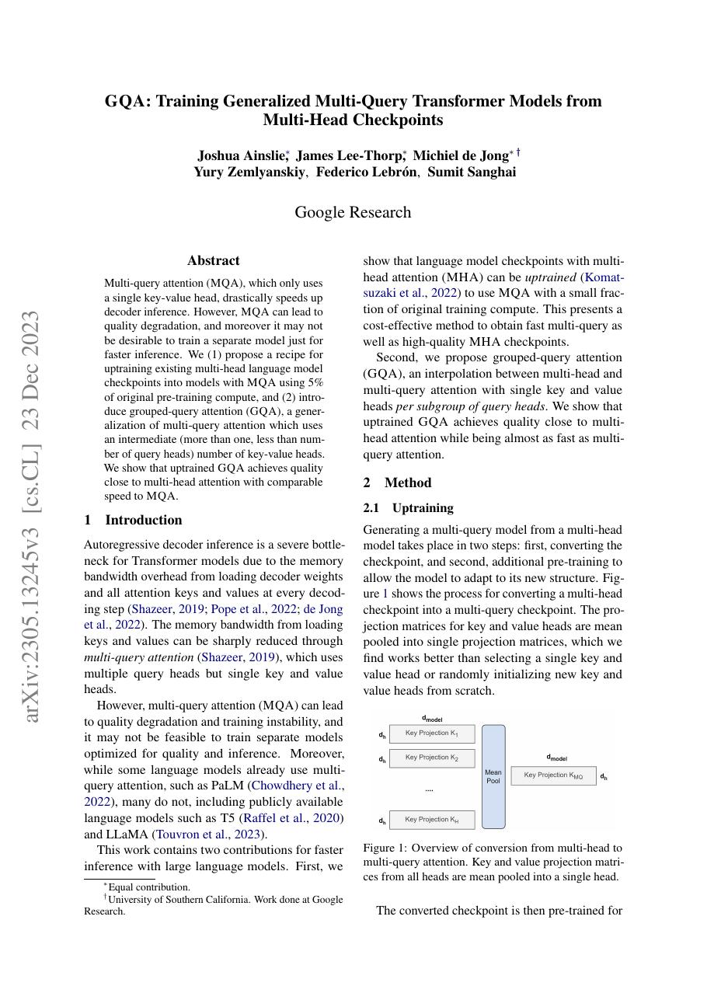
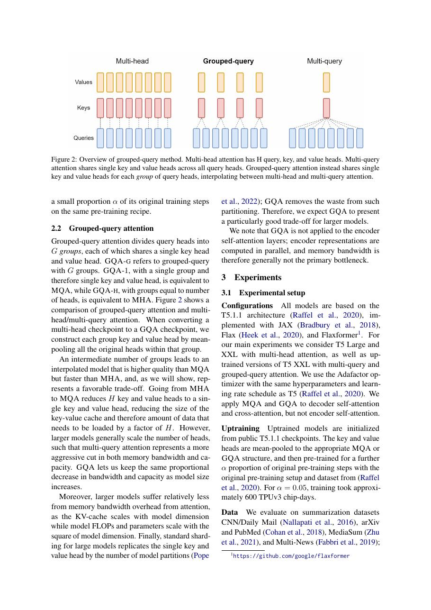
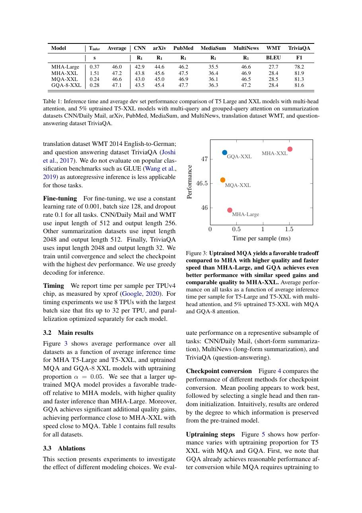
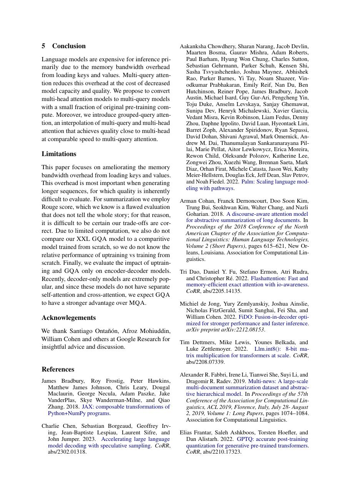

# 论文中文解读：《GQA: Training Generalized Multi-Query Transformer Models from Multi-Head Checkpoints》

## 一、它解决了什么

GQA 在 MHA 与 MQA 之间设置若干 KV groups，以接近 MQA 的缓存/带宽成本保留更多质量。

## 二、核心机制

多个 query heads 共享同组 K/V；从已有 MHA checkpoint uptrain 时，把同组 K/V heads 做 mean pooling，再用少量预训练 compute 适配。group 数是质量、KV cache 和 kernel 并行的显式旋钮。

## 三、为什么成为主线

GQA 被 LLaMA 2/3、Mistral、Qwen 等大量模型采用，成为高吞吐 decoder serving 的标准设计。

## 四、证据应该怎样读

速度、显存、精度或 benchmark 数字只在论文给定的模型、数据、硬件、kernel 版本和评测预算下成立。跨论文比较前要统一训练 tokens、输入长度、batch、精度、采样/思考预算与是否使用工具。

## 五、局限与易误读点

最优 group 数依模型和部署；KV 缩小不代表 prefill 的 QK matmul 消失。uptraining 结论依赖原 checkpoint 与额外数据。

## 六、放进十年演进史

沿 MHA→MQA→GQA→MLA 阅读，并结合 PagedAttention/Mooncake 理解 KV 表示与系统管理是两层问题。

## 七、原文入口

[官方论文/页面](https://arxiv.org/abs/2305.13245)

## 八、原文论证链

GQA 位于 MHA 与 MQA 之间。MHA 每个 query head 有独立 K/V，质量高但 KV cache 大；MQA 所有 query heads 共享一套 K/V，解码快但某些模型质量下降。GQA 把 query heads 分组，每组共享一个 K/V head，用可调组数交换质量与带宽。

论文还解决已有 MHA checkpoint 如何低成本转换：把同组 K/V 投影头做 mean pooling 初始化，再用少量预训练计算 uptrain。这样不必从头训练，实验显示 GQA 以接近 MQA 的速度获得接近 MHA 的质量。

> 原文定位：[PDF 文件第 1 页](paper.pdf#page=1) · [对应截图](rendered_figures/page-1.jpg)

## 九、形状与折中

若有 $h_q$ 个 query heads、$h_{kv}$ 个 K/V heads，且 $h_q$ 可被 $h_{kv}$ 整除，则每组包含 $h_q/h_{kv}$ 个 query。KV cache 大小约
$$
2BT h_{kv}d_{\rm head},
$$
相对 MHA 按 $h_{kv}/h_q$ 缩小。$h_{kv}=h_q$ 退化为 MHA，$h_{kv}=1$ 退化为 MQA。

mean pooling 是参数初始化，不是推理时对 cache 再平均。uptraining 让模型适应被合并的表示。

> 原文定位：[PDF 文件第 2 页](paper.pdf#page=2) · [对应截图](rendered_figures/page-2.jpg)

## 十、实验怎样读

质量表覆盖预训练 perplexity 与下游任务，速度/内存表关注 decoder inference。要检查组数曲线，而非只看一个 GQA 点；这样才能验证连续折中。速度接近 MQA 的程度取决于 kernel、batch、上下文和内存带宽。

> 原文定位：[PDF 文件第 3 页](paper.pdf#page=3) · [对应截图](rendered_figures/page-3.jpg)

## 十一、复现检查

- query head 到 KV group 的映射和张量 reshape 必须固定。
- 转换 checkpoint 时对 K、V 分别按组 pooling，不能混合权重维。
- benchmark 分离 prefill 与 decode，并报告 KV cache 字节数。
- uptraining 的 token/计算比例应计入转换成本。

## 十二、常见误读

GQA 不减少 query heads，也不改变 dense attention 的 $T^2$ 连接；它主要减少 K/V 参数与缓存。效果是架构—kernel 协同，而不是只改配置字段就必然提速。

> 原文定位：[PDF 文件第 5 页](paper.pdf#page=5) · [对应截图](rendered_figures/page-5.jpg)

## 原文证据导航

以下页码按仓库内 PDF 的**文件页码**计，不等同于论文印刷页码。建议先读本节所指原文，再回看上面的中文解释。

- [打开原始 PDF](paper.pdf)
- [打开可检索文本](paper.txt)

| 中文笔记中的证据 | 原文位置 | 复核重点 |
|---|---|---|
| 原文首页、摘要与问题定义 | [PDF 文件第 1 页](paper.pdf#page=1) · [截图](rendered_figures/page-1.jpg) | 回到该页上下文，复核定义、图表或实验论证 |
| 核心方法、架构或算法定义所在关键页 | [PDF 文件第 2 页](paper.pdf#page=2) · [截图](rendered_figures/page-2.jpg) | 回到该页上下文，复核定义、图表或实验论证 |
| 实验、结果或关键分析所在原文页 | [PDF 文件第 3 页](paper.pdf#page=3) · [截图](rendered_figures/page-3.jpg) | 回到该页上下文，复核定义、图表或实验论证 |
| 讨论、结论或补充分析所在原文页 | [PDF 文件第 5 页](paper.pdf#page=5) · [截图](rendered_figures/page-5.jpg) | 回到该页上下文，复核定义、图表或实验论证 |
