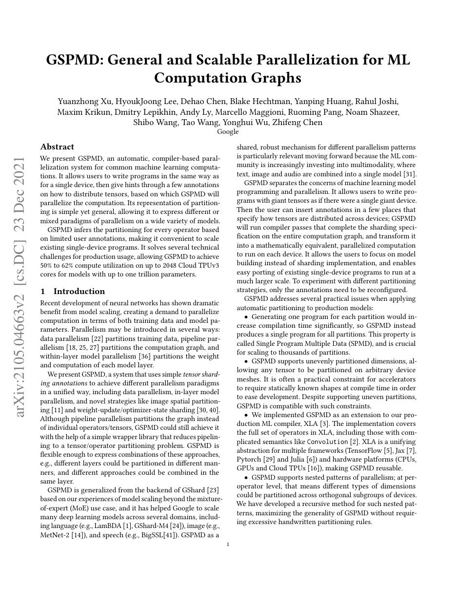
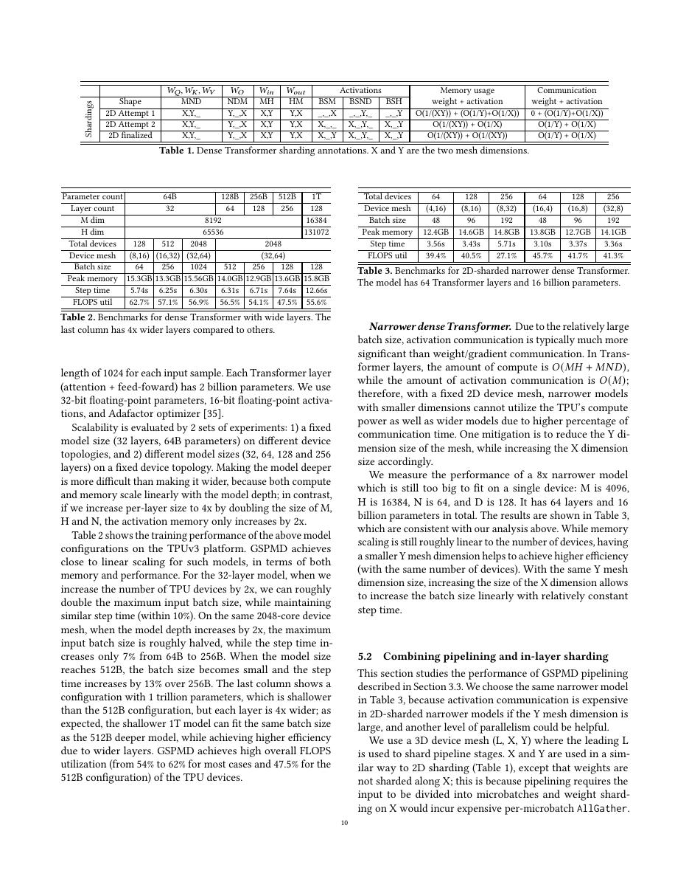
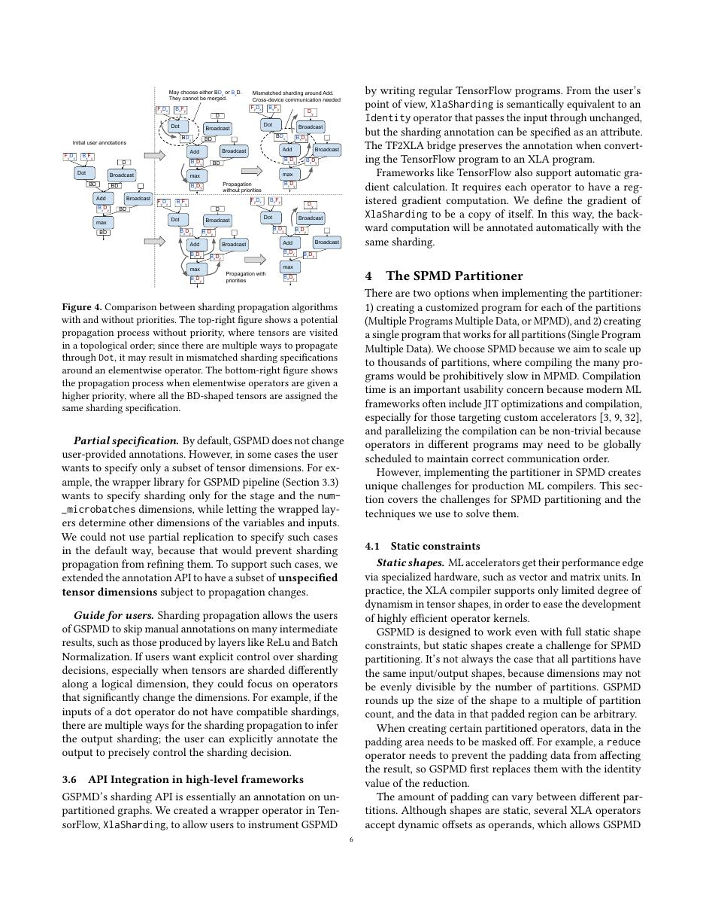
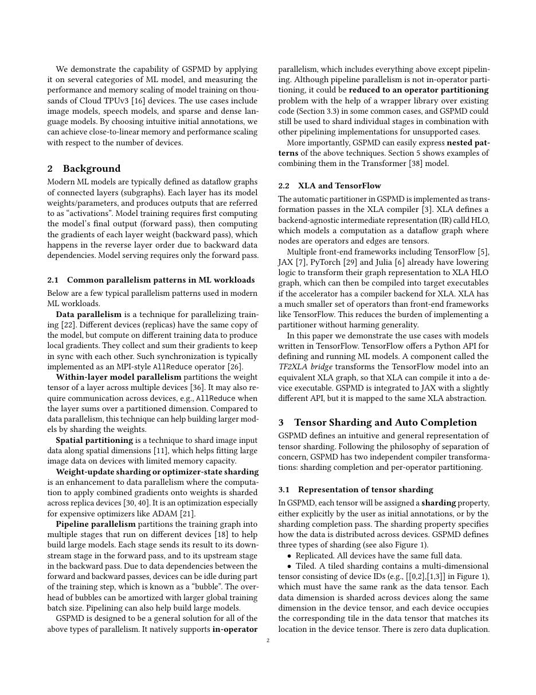

# 论文中文解读：《GSPMD: General and Scalable Parallelization for ML Computation Graphs》

## 一、它解决了什么

GSPMD 让用户只标注少量 tensor sharding，编译器沿计算图传播分片并插入 collectives，用单程序表达数据、模型、序列和混合并行。

## 二、核心机制

每个逻辑 tensor 带 mesh partition spec；partitioner 为每个 HLO operator 推导局部分片计算，需要时产生 all-reduce、all-gather、all-to-all 等 reshard。SPMD 保持每个设备执行同一程序，降低多副本控制复杂度。

## 三、为什么成为重要节点

它成为 XLA/JAX 大模型并行的重要基础，证明自动 sharding 是 AI compiler 的核心职责而不只是训练框架配置。

## 四、证据怎样读

结果只在论文的数据、模型版本、硬件和评测协议下成立。闭源模型要把能力报告与可复现架构分开；系统论文要同时记录通信拓扑、编译预算和 runtime；科学模型要把预测精度与实验验证边界分开。

## 五、局限与易误读点

用户仍需给关键 sharding hints，错误布局会产生昂贵 reshard；cost model、拓扑和编译时间影响方案。TPU 结果不能直接外推 GPU/NPU 网络。

## 六、放进十年演进史

与 Alpa 连读：GSPMD 擅长给定 sharding 的 SPMD lowering，Alpa进一步搜索 intra-/inter-op 组合计划；DeepSeek DualPipe 则是专家手工系统设计。

## 七、原文入口

[官方论文/页面](https://arxiv.org/abs/2105.04663)

## 八、原文论证链

GSPMD 试图统一数据并行、张量并行、序列/空间分片和混合方案。用户只在关键 tensor 上给 mesh sharding annotation；partitioner 沿 HLO 图传播布局，把每个全局 op 改写为各设备执行的局部 op，并在布局不兼容时插入 collective。所有设备运行同一 SPMD 程序，只是数据 shard 与 device id 不同。

> 原文定位：[PDF 文件第 1 页](paper.pdf#page=1) · [对应截图](rendered_figures/page-1.jpg)

## 九、分片传播与 reshard

逻辑 tensor 的 partition spec 把若干维映射到设备 mesh 轴。逐元素 op 通常直接继承分片；reduction 若跨被分片维，需要 all-reduce；改变被分片维可能需要 all-to-all；复制值可能触发 all-gather。局部 matmul 是否需要通信取决于 contracting/non-contracting 维的布局。

总时间近似
$$
T_{\rm compute}+T_{\rm collective}+T_{\rm imbalance},
$$
所以“每设备张量更小”不保证更快。编译器还需处理 padding、halo exchange、随机数和控制流的一致性。

> 原文定位：[PDF 文件第 10 页](paper.pdf#page=10) · [对应截图](rendered_figures/page-10.jpg)

## 十、实验怎样读

论文在大规模 Transformer、CNN/MoE 等 workload 上展示可扩展性。应看弱/强 scaling、每步通信、编译时间和模型可表达的 sharding，而不只看设备数。少量 annotation 成功传播支持易用性，但好的初始 annotation 仍含专家判断。

> 原文定位：[PDF 文件第 6 页](paper.pdf#page=6) · [对应截图](rendered_figures/page-6.jpg)

## 十一、复现检查

- 保存 mesh 形状、轴名、每个关键 tensor sharding。
- dump partitioned HLO，统计 all-reduce/all-gather/all-to-all 字节。
- 确认 batch、模型维与设备数的整除/padding。
- 真实拓扑与 cost model 对齐；跨机链路不能按片上带宽估计。

## 十二、常见误读

GSPMD 自动的是给定/推导 sharding 的 lowering，不等于总能自动找到全局最优分片。SPMD 也不表示没有通信，只表示设备执行统一程序。

> 原文定位：[PDF 文件第 2 页](paper.pdf#page=2) · [对应截图](rendered_figures/page-2.jpg)

## 原文证据导航

以下页码按仓库内 PDF 的**文件页码**计，不等同于论文印刷页码。建议先读本节所指原文，再回看上面的中文解释。

- [打开原始 PDF](paper.pdf)
- [打开可检索文本](paper.txt)

| 中文笔记中的证据 | 原文位置 | 复核重点 |
|---|---|---|
| 原文首页、摘要与问题定义 | [PDF 文件第 1 页](paper.pdf#page=1) · [截图](rendered_figures/page-1.jpg) | 回到该页上下文，复核定义、图表或实验论证 |
| 核心架构、算法或编译方法所在关键页 | [PDF 文件第 10 页](paper.pdf#page=10) · [截图](rendered_figures/page-10.jpg) | 回到该页上下文，复核定义、图表或实验论证 |
| 实验、结果或关键分析所在原文页 | [PDF 文件第 6 页](paper.pdf#page=6) · [截图](rendered_figures/page-6.jpg) | 回到该页上下文，复核定义、图表或实验论证 |
| 讨论、结论或补充分析所在原文页 | [PDF 文件第 2 页](paper.pdf#page=2) · [截图](rendered_figures/page-2.jpg) | 回到该页上下文，复核定义、图表或实验论证 |
