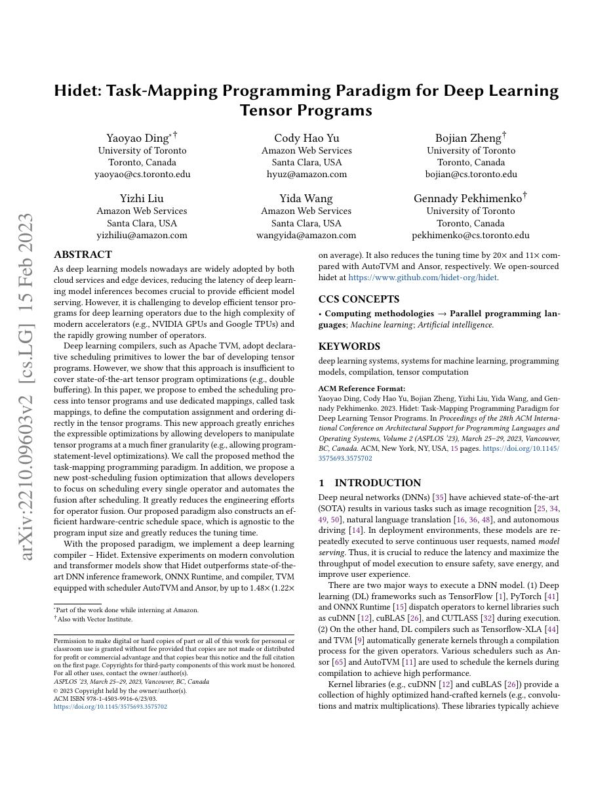
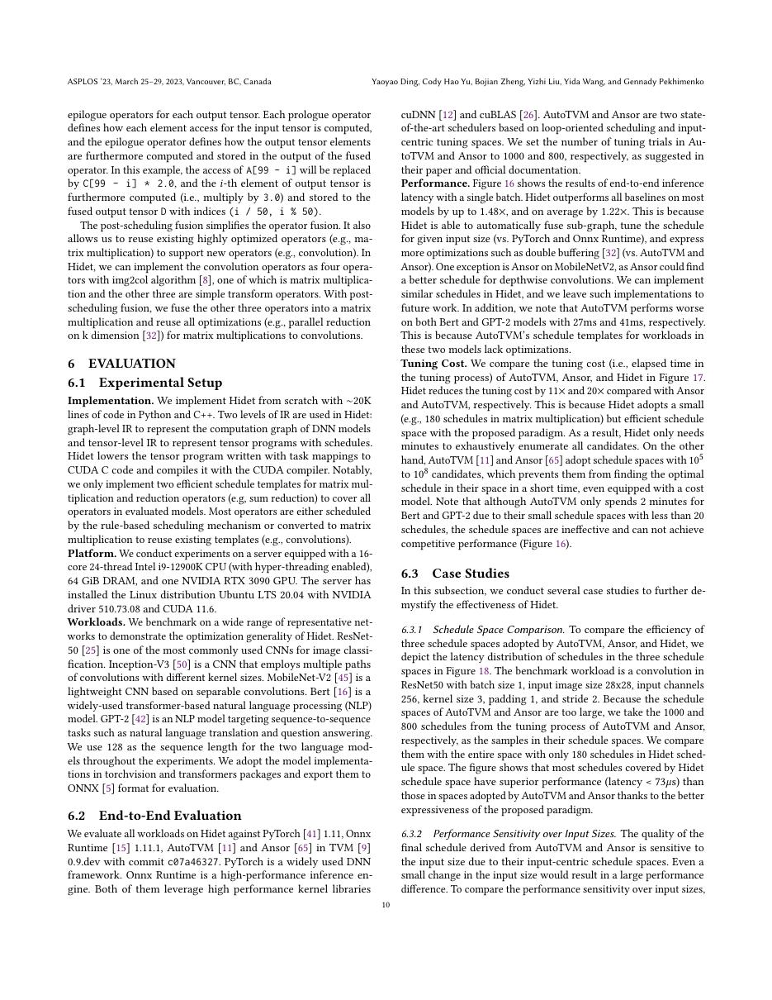
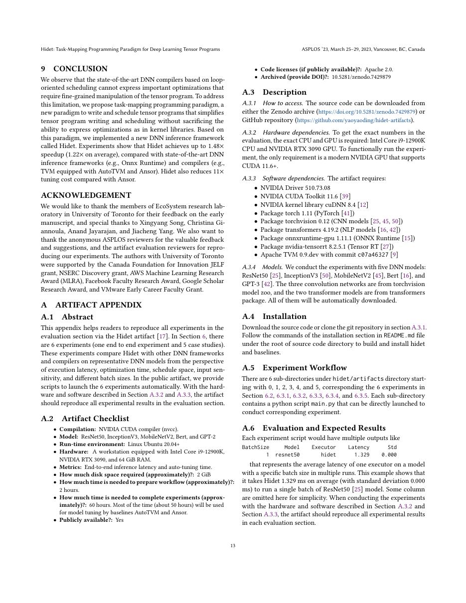
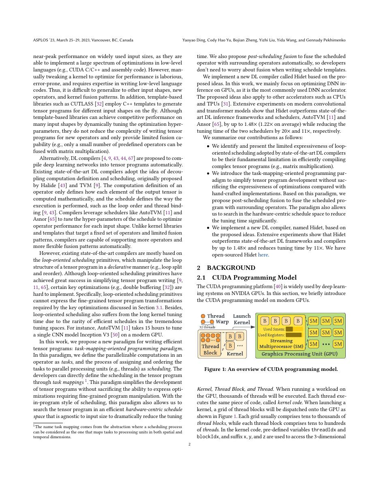

# 中文精读：《Hidet: Task-Mapping Programming Paradigm for Deep Learning Tensor Programs》

## 一、它解决了什么

Hidet 把调度过程嵌入 tensor program，用 task mapping 显式描述计算实例到线程/任务的分配与顺序。

## 二、编译抽象与优化路径

task mapping 可组合 spatial 与 repeat mappings，程序员在细粒度上表达线程层级、循环和数据移动；post-scheduling fusion 在各算子单独调度后自动融合，缩小调优负担。

## 三、为什么影响后续系统

它说明传统声明式 schedule primitives 对复杂 GPU 优化表达不足，推动更程序化、硬件中心的 kernel DSL。

## 四、怎样读性能结果

编译器结果必须同时记录 frontend、shape、batch、精度、目标硬件、vendor library、调优预算和编译时间。单算子加速不等于端到端同倍加速，首次编译延迟也不能与缓存命中后的 steady-state 混为一谈。

## 五、局限与工程边界

更强表达力也提高编写和验证难度；论文主要评估推理算子和当时硬件。后融合能否保留局部最优取决于内存与资源冲突。

## 六、放进十年编译器演进史

与 Triton 的 block program、TileLang 的 tile dataflow+annotations、CuTe 的 layout algebra 对照不同可编程层级。

## 七、原文入口

[论文/官方页面](https://arxiv.org/abs/2210.09603)

## 八、原文论证链

Hidet 认为传统 schedule language 把优化表达成一长串外部变换，对复杂 GPU 映射不够直观。它提出 task-mapping programming：在 tensor program 内显式描述计算实例如何映射到 worker，以及每个 worker 以何种顺序重复任务。spatial mapping 表示并行分配，repeat mapping 表示串行迭代，二者可组合。

另一个设计是 post-scheduling fusion：先为各 operator 生成高质量 schedule，再在保持局部映射的前提下融合，避免联合搜索整个融合图。

> 原文定位：[PDF 文件第 1 页](paper.pdf#page=1) · [对应截图](rendered_figures/page-1.jpg)

## 九、mapping 的语义

给定逻辑 task 域，mapping 产生 worker id 到 task 坐标序列的关系。二维 tile 可将一维 worker group 分解为行列 spatial mapping，再把每个 worker 的多个元素写成 repeat mapping。这样线程布局、循环次序和数据加载对应关系出现在程序语义中，而不是隐藏于编译 pass。

表达力增强也意味着合法性责任更重：越界、race、同步与内存层次需要编译器检查或程序员保证。

> 原文定位：[PDF 文件第 10 页](paper.pdf#page=10) · [对应截图](rendered_figures/page-10.jpg)

## 十、实验怎样读

论文在 GPU tensor programs 和模型推理上比较 vendor library/TVM 等，并分析编译时间。应检查融合后是否新增重复计算或寄存器压力；单算子 schedule 强不保证融合后仍最优。task mapping 的可读性/开发效率也是定性主张。

> 原文定位：[PDF 文件第 13 页](paper.pdf#page=13) · [对应截图](rendered_figures/page-13.jpg)

## 十一、复现检查

- 用小 shape 枚举 worker→task 映射，检查覆盖一次且无冲突。
- barrier 与 shared-memory 生命周期需显式验证。
- 分别测 fusion 前后 kernel 数、HBM 流量、寄存器和 occupancy。
- 固定 CUDA/编译器版本与 autotuning budget。

## 十二、常见误读

Hidet 不是简单的另一个 AutoTVM 模板系统；它改变调度表达方式。更程序化的映射给专家控制，也提高了编写和验证难度。

> 原文定位：[PDF 文件第 2 页](paper.pdf#page=2) · [对应截图](rendered_figures/page-2.jpg)

## 原文证据导航

以下页码按仓库内 PDF 的**文件页码**计，不等同于论文印刷页码。建议先读本节所指原文，再回看上面的中文解释。

- [打开原始 PDF](paper.pdf)
- [打开可检索文本](paper.txt)

| 中文笔记中的证据 | 原文位置 | 复核重点 |
|---|---|---|
| 原文首页、摘要或官方架构概览 | [PDF 文件第 1 页](paper.pdf#page=1) · [截图](rendered_figures/page-1.jpg) | 回到该页上下文，复核定义、图表或实验论证 |
| IR、架构、搜索空间或执行模型关键页 | [PDF 文件第 10 页](paper.pdf#page=10) · [截图](rendered_figures/page-10.jpg) | 回到该页上下文，复核定义、图表或实验论证 |
| 实验、性能或设计分析所在原文页 | [PDF 文件第 13 页](paper.pdf#page=13) · [截图](rendered_figures/page-13.jpg) | 回到该页上下文，复核定义、图表或实验论证 |
| 讨论、结论或补充设计所在原文页 | [PDF 文件第 2 页](paper.pdf#page=2) · [截图](rendered_figures/page-2.jpg) | 回到该页上下文，复核定义、图表或实验论证 |
