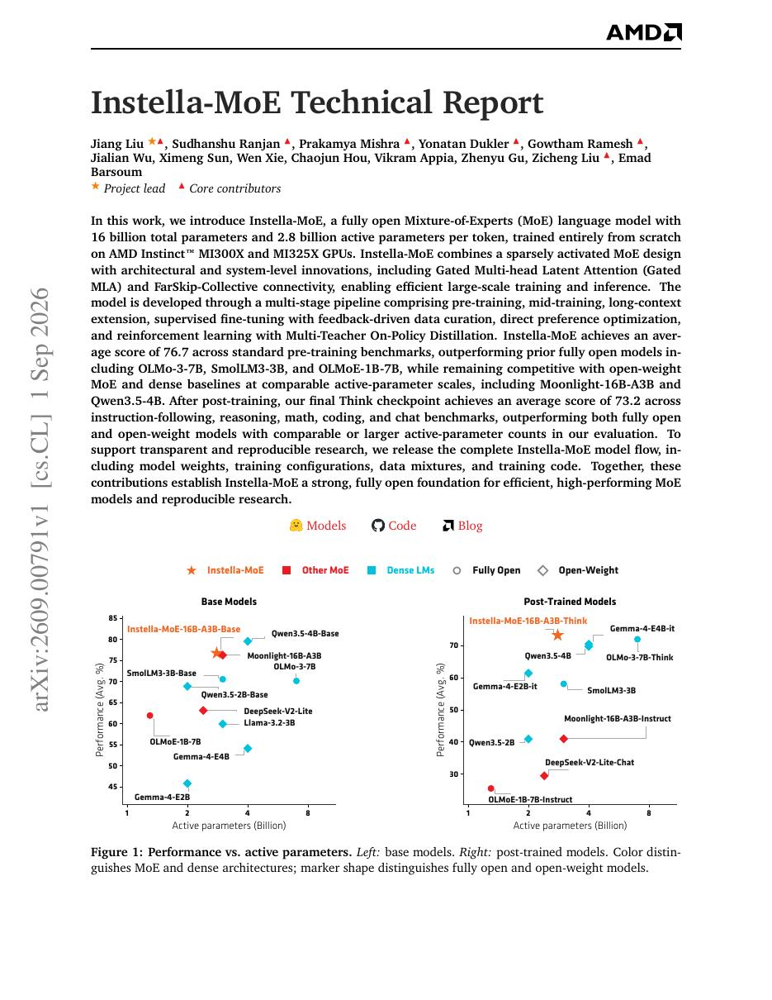
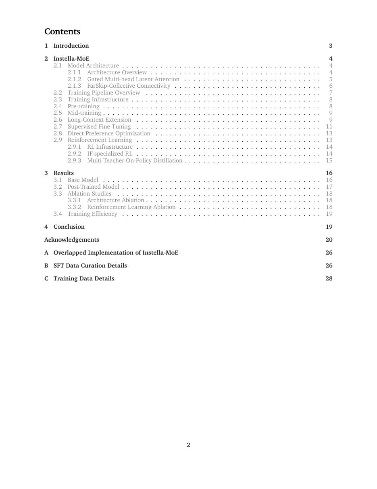
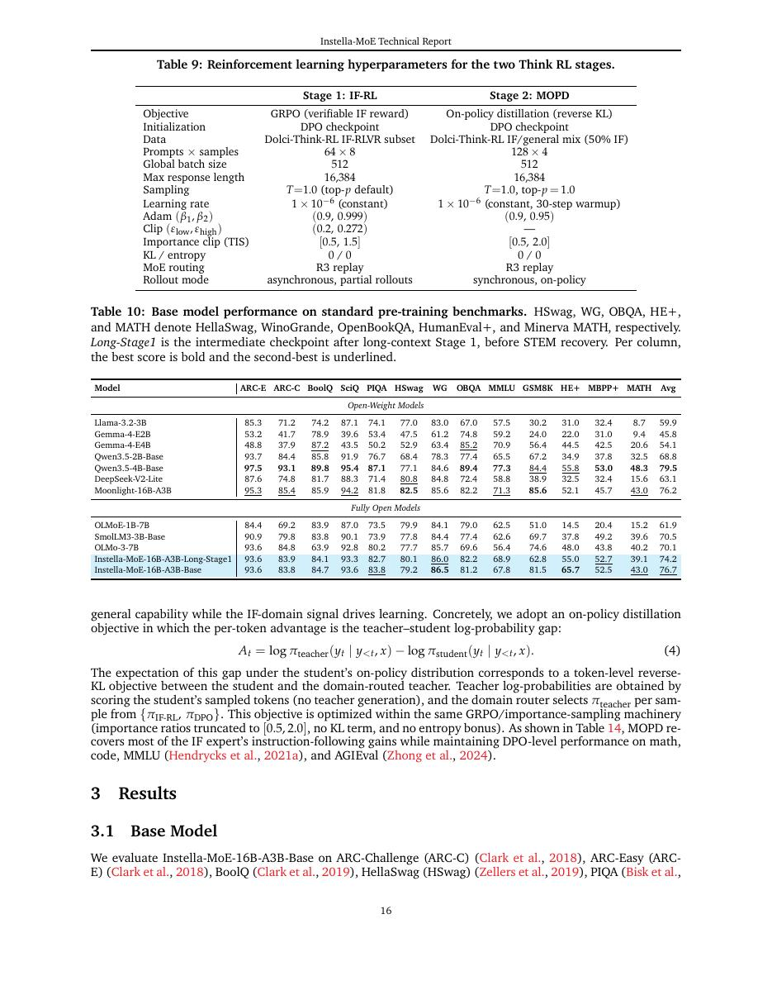
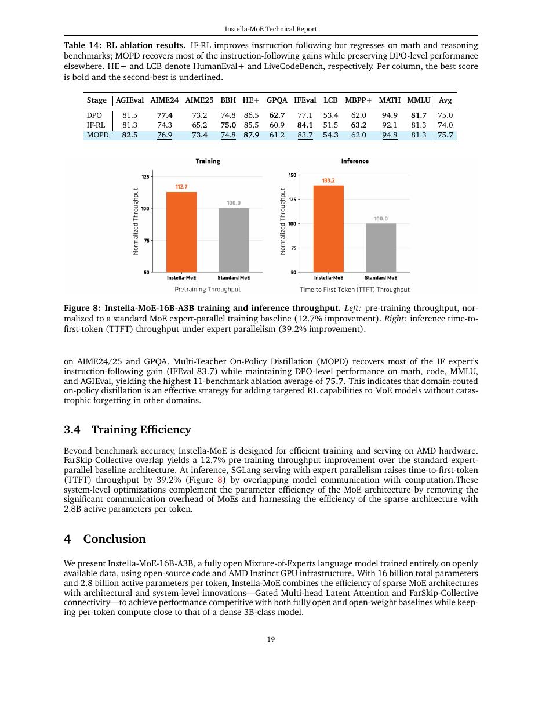

# 论文中文解读：《Instella-MoE Technical Report》

## 一、它解决了什么

Instella-MoE 是 16B total、2.8B active 的全流程开放模型，在 AMD MI300X/MI325X 上从零训练，并公开数据混合、配置、代码与权重。

## 二、核心机制

架构结合稀疏 MoE、Gated MLA 与 FarSkip-Collective connectivity；训练覆盖预训练、中期训练、长上下文、SFT/DPO 与 Multi-Teacher On-Policy Distillation。它把模型设计与 AMD 通信/kernel 栈共同披露。

## 三、为什么成为重要节点

它代表 2026 年“真正可复现开放”方向：不仅开放 checkpoint，还强调训练 recipe 与非 NVIDIA 全栈系统。由于刚发布，更适合作为最新节点而非已确立行业标准。

## 四、证据怎样读

结果只在论文的数据、模型版本、硬件和评测协议下成立。闭源模型要把能力报告与可复现架构分开；系统论文要同时记录通信拓扑、编译预算和 runtime；科学模型要把预测精度与实验验证边界分开。

## 五、局限与易误读点

规模和影响尚不能与 Llama/Qwen/DeepSeek 等成熟生态等同；报告 benchmark 需要独立复现。新连接与 distillation 的单独贡献仍需更细消融。

## 六、放进十年演进史

与 DeepSeekMoE/Kimi K2 比较稀疏架构，与 GSPMD/Alpa/CloudMatrix 比较硬件—并行协同；它补足时间线的 2026 开放模型节点。

## 七、原文入口

[官方论文/页面](https://arxiv.org/abs/2609.00791)

## 八、原文论证链

Instella-MoE 不是只发布一个更大的 MoE，而是围绕“稀疏模型怎样获得稳定质量和高效长上下文”比较设计选择。论文把 gated MLA、FarSkip 等机制放进约 16B 总参数、约 2.8B 激活参数的模型，并通过消融与下游评测讨论稀疏路由、注意力状态压缩和跨层信息通路的作用。

理解时要把三层分开：总参数反映 expert 容量，激活参数近似每 token 计算，实际部署还受 expert dispatch、跨设备 all-to-all、KV cache 和内核效率影响。只比较“2.8B 激活”与 dense 2.8B 会漏掉内存和通信。

> 原文定位：[PDF 文件第 1 页](paper.pdf#page=1) · [对应截图](rendered_figures/page-1.jpg)

## 九、机制拆解

MoE router 对每个 token 选择少数 experts，并需要负载均衡避免热门 expert 过载。gated MLA 通过低维潜表示压缩/组织 attention 的 K/V 状态，再用 gate 控制不同路径贡献，目标是在长上下文下降低缓存同时保留表达。FarSkip 提供跨较远层的残差信息路径，缓解深层或稀疏路由中的信息损失。

这些模块的价值需由独立消融判断：若同时更改数据、训练 token 和结构，最终 benchmark 无法给出单组件因果结论。

> 原文定位：[PDF 文件第 2 页](paper.pdf#page=2) · [对应截图](rendered_figures/page-2.jpg)

## 十、实验怎样读

首先比较 dense/MoE 或不同激活参数下的语言建模 loss，再看知识、推理、代码和长上下文任务，最后检查吞吐、显存与 expert 负载。长上下文结果应区分 KV 节省和真实检索质量；路由统计应包括 expert 使用率、溢出/丢 token 及不同领域分布。

> 原文定位：[PDF 文件第 16 页](paper.pdf#page=16) · [对应截图](rendered_figures/page-16.jpg)

## 十一、复现检查

- 报告 expert 数、top-$k$、capacity factor、共享 expert 与 auxiliary loss。
- 给出总参数、激活参数、KV cache 和单 token 通信量四个口径。
- tensor/expert/data parallel 拓扑与 all-to-all 时间必须进入吞吐分析。
- 分别消融 gated MLA、FarSkip 和路由策略，并保持训练计算接近。

## 十二、常见误读

稀疏激活不等于模型只有激活参数那么大，也不保证在任意硬件更快。论文的架构主张建立在特定训练与系统实现上，不能只从模型名推断效果。

> 原文定位：[PDF 文件第 19 页](paper.pdf#page=19) · [对应截图](rendered_figures/page-19.jpg)

## 原文证据导航

以下页码按仓库内 PDF 的**文件页码**计，不等同于论文印刷页码。建议先读本节所指原文，再回看上面的中文解释。

- [打开原始 PDF](paper.pdf)
- [打开可检索文本](paper.txt)

| 中文笔记中的证据 | 原文位置 | 复核重点 |
|---|---|---|
| 原文首页、摘要与问题定义 | [PDF 文件第 1 页](paper.pdf#page=1) · [截图](rendered_figures/page-1.jpg) | 回到该页上下文，复核定义、图表或实验论证 |
| 核心架构、算法或编译方法所在关键页 | [PDF 文件第 2 页](paper.pdf#page=2) · [截图](rendered_figures/page-2.jpg) | 回到该页上下文，复核定义、图表或实验论证 |
| 实验、结果或关键分析所在原文页 | [PDF 文件第 16 页](paper.pdf#page=16) · [截图](rendered_figures/page-16.jpg) | 回到该页上下文，复核定义、图表或实验论证 |
| 讨论、结论或补充分析所在原文页 | [PDF 文件第 19 页](paper.pdf#page=19) · [截图](rendered_figures/page-19.jpg) | 回到该页上下文，复核定义、图表或实验论证 |
