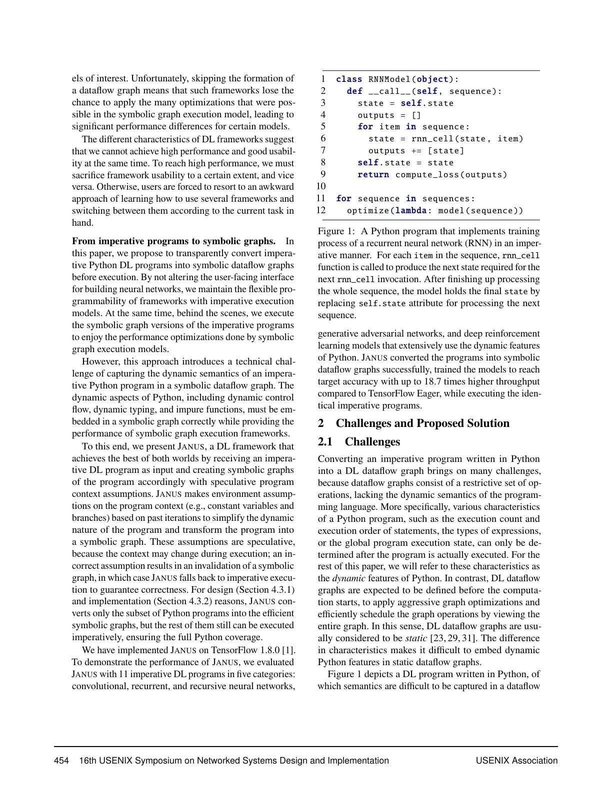
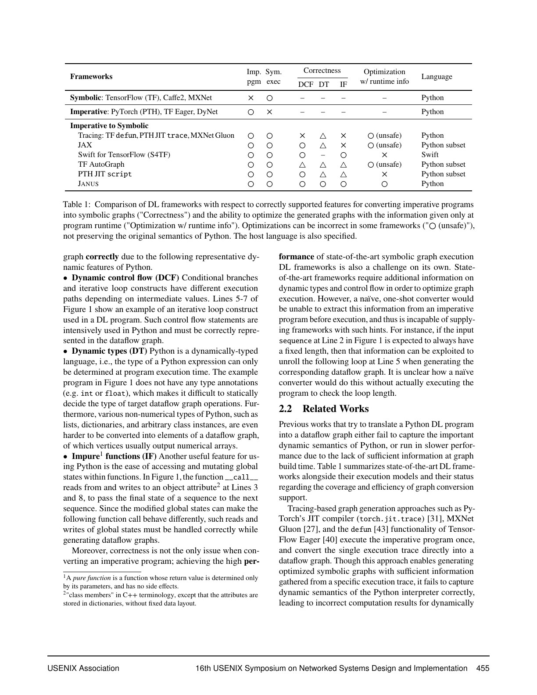
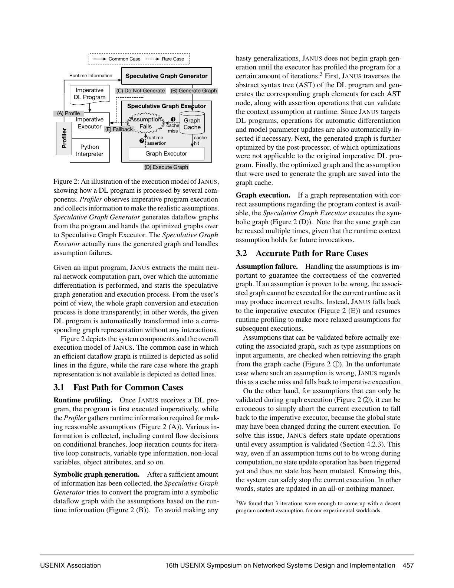
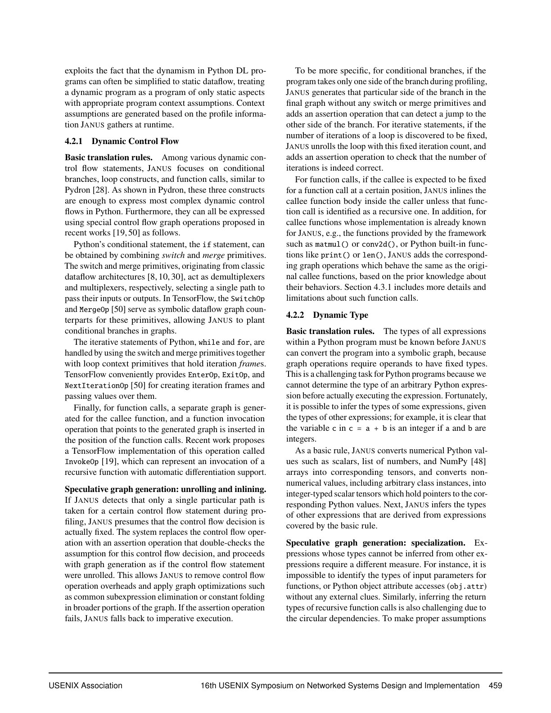
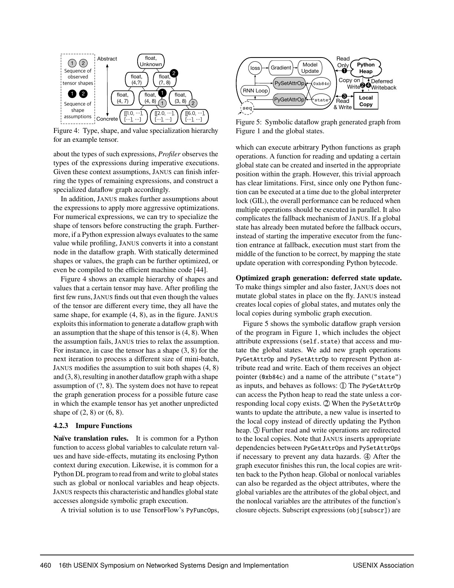
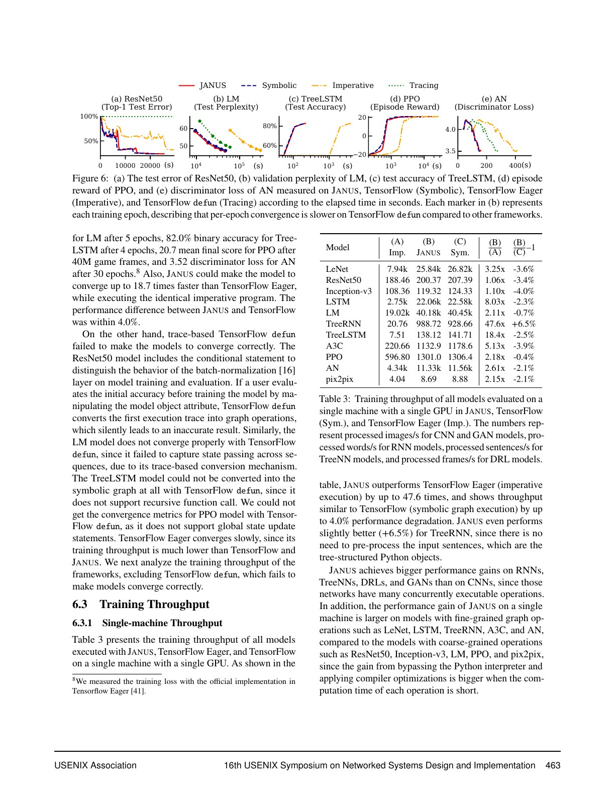
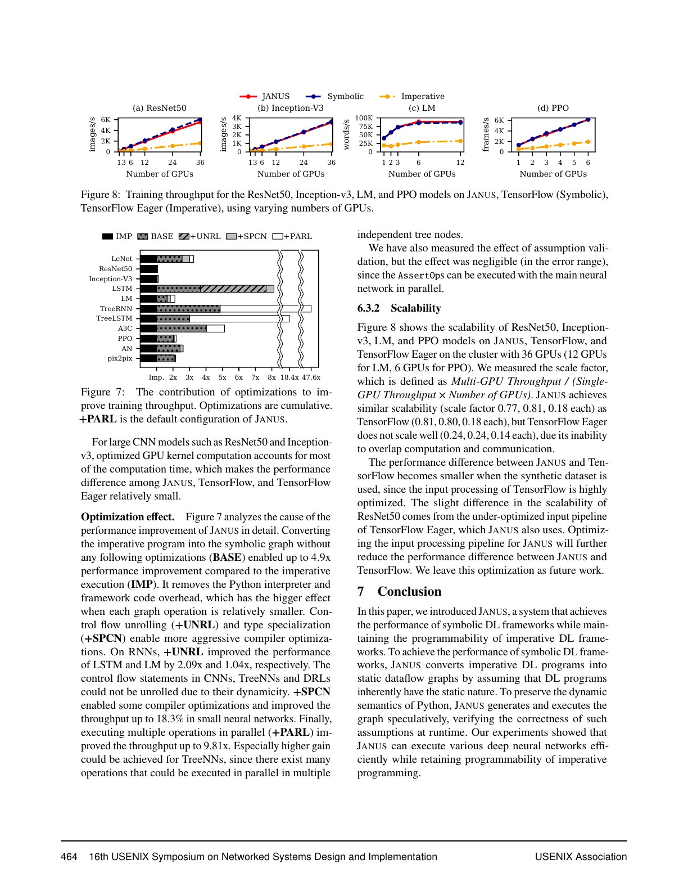

# JANUS 中文精读：从命令式 Python 到推测性符号图

## 1. 两种执行模型的冲突

符号图的优势：

- 提前看到多个 operators；
- 可做 constant folding、common subexpression elimination 和并行调度；
- 易于设备放置与分布式执行。

命令式执行的优势：

- 使用完整 Python 控制流与数据结构；
- 立即得到结果；
- 调试路径与真实执行一致；
- 动态模型表达自然。

JANUS 的问题不是简单 tracing，而是如何在不牺牲 Python correctness 的情况下利用符号图。

## 2. 为什么一次 tracing 不够

Python 的动态特征包括：

- data-dependent branch 和 loop count；
- 动态类型；
- function target 变化；
- object attribute 与 global state；
- impure function 和 mutation。

只记录一次 operator trace 可能把偶然路径当成永远成立。论文比较了 tracing、JAX、AutoGraph 和 TorchScript 等系统在当时对这些特征的处理。

JANUS 的答案是 speculative optimization：常见情况专门化，罕见情况验证失败后 deopt/fallback。

## 3. 系统执行循环

完整流程：

1. Imperative Executor 先执行程序。
2. Profiler 收集 branch、loop count、type、shape、non-local state 等 runtime context。
3. Speculative Graph Generator 基于常见 context 构图。
4. 图中插入 AssertOp，并做 symbolic graph optimization。
5. Graph cache 保存图与适用假设。
6. 后续调用若 guards/assumptions 成立，直接执行 graph。
7. 假设失败则回到 imperative execution，并尝试生成更宽松的新图。

论文实验中先 profile 约 3 次，但这是 workload-specific heuristic，不是语义保证。

## 4. 假设怎样保证正确性

可在 graph 启动前检查的假设，例如 input type，失败时直接 cache miss。

有些假设只能在 graph 中途检查，例如依赖中间 tensor value 的 branch。如果此时程序已经更新 global state，再 fallback 会重复副作用。

JANUS 因此：

- 把 state update 延迟；
- 先执行纯计算和 assertions；
- 只有全部假设通过才统一 commit；
- 失败则丢弃本次 graph execution。

这是 all-or-nothing state semantics，代价是可转换的副作用范围受限。

## 5. 动态控制流如何转图

对 branch：

- profiling 只见一侧时，可只生成该侧；
- 插入 assertion 验证后续仍走该侧；
- 两侧都重要时可用 graph control-flow ops。

对 loop：

- 稳定 iteration count 可 unroll；
- 否则保留 graph loop representation。

对 function call：

- 稳定 callee 可 inline；
- recursive call 需特殊处理。

对 shape/type/value，JANUS 形成 specialization hierarchy：具体 value 最强、type-only 最宽，越专门化越容易优化，也越容易失效。

## 6. Impure function 与 deferred update

Python attribute、list 和 global variable 读取可以转成 graph input 或 state operation；但 invisible mutation、I/O、generator、coroutine 等难以提供 rollback。

因此 JANUS 不是“支持全部 Python 的 compiler”：

- 不支持的部分仍能在 imperative executor 运行；
- 但它们会阻止相应区域成为优化 graph；
- correctness 来自 fallback，而不是图表示能力无限。

这个思想与现代 graph break 很接近：完整 Python 可运行，不代表完整 Python 都被编译。

## 7. 实验覆盖

论文评估 11 个程序，类别包括：

- ResNet/Inception 等 CNN；
- LSTM、language model；
- TreeRNN/TreeLSTM；
- A3C/PPO 等 deep RL；
- adversarial network 和 pix2pix。

它同时检查收敛/accuracy，避免只证明 throughput 却改变语义。

JANUS 相对 TensorFlow Eager 的收益在细粒度和动态模型上更大；粗粒度 CNN 的 heavy kernels 已经掩盖部分 interpreter overhead。

## 8. Throughput 与消融

论文报告最高 18.7× training throughput，并分析：

- loop unrolling；
- specialization；
- parallel execution；
- assertion validation。

assertion 成本在实验中接近误差范围，但不能推广到任意 guard 数量和 tiny workload。多 graph versions、频繁 invalidation、低重复路径都会改变结论。

## 9. 与 TorchDynamo 的概念映射

| JANUS | TorchDynamo/PT2 |
| --- | --- |
| AST + runtime profiling | Python bytecode interpreter |
| speculative context assumption | guard |
| generated symbolic graph | FX graph |
| graph cache | per-code-object compiled variants |
| assumption failure | guard failure/recompile |
| imperative fallback | graph break/eager fallback |
| deferred state update | side-effect tracking/functionalization 等机制 |

两者不能视为同一实现。Dynamo 的目标是 PyTorch eager compatibility，后端和 dynamic shape 系统也不同。

## 10. 三个性能陷阱

### 路径爆炸

若输入频繁触发不同 branch/type/shape，graph cache 会增长，compile 成本与 memory 增加。

### 过度专门化

value specialization 给 optimizer 更多常量，但一个小变化就会 invalidation。

### 副作用

看似普通的 Python 操作可能阻止 capture，或需要昂贵的 state handling。

## 11. 实践启示

- 稳定控制流和类型能提高 graph reuse；
- graph count 与 guard failure 应作为性能指标；
- fallback 保证可用性，却会切断跨区域优化；
- benchmark 必须计入 warmup/compile；
- correctness 测试要覆盖罕见 branch，而不只常见路径。

## 12. 最终判断

JANUS 的长期价值是把动态图编译描述成“推测—验证—复用—失效—回退”的循环。现代 PyTorch 术语已变化，但 guard-based compilation 的基本矛盾几乎完全保留。
