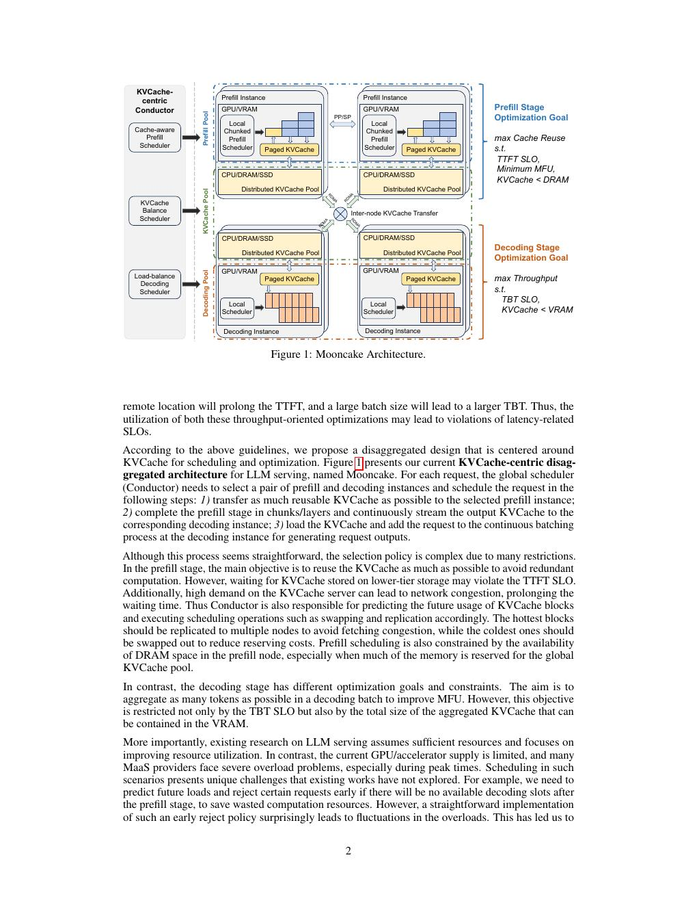
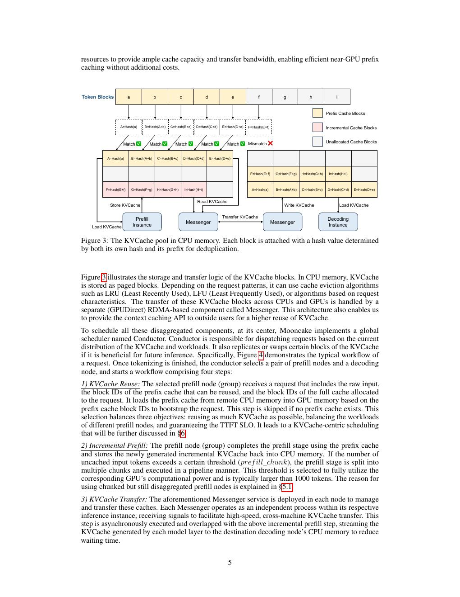
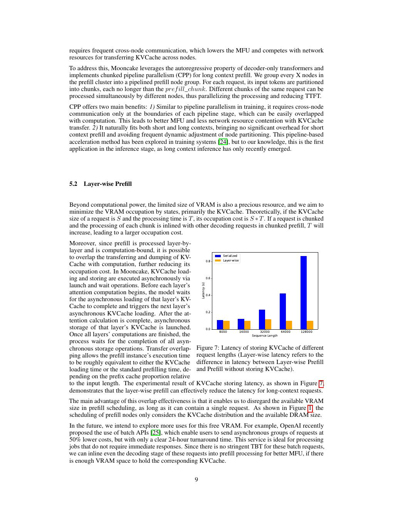
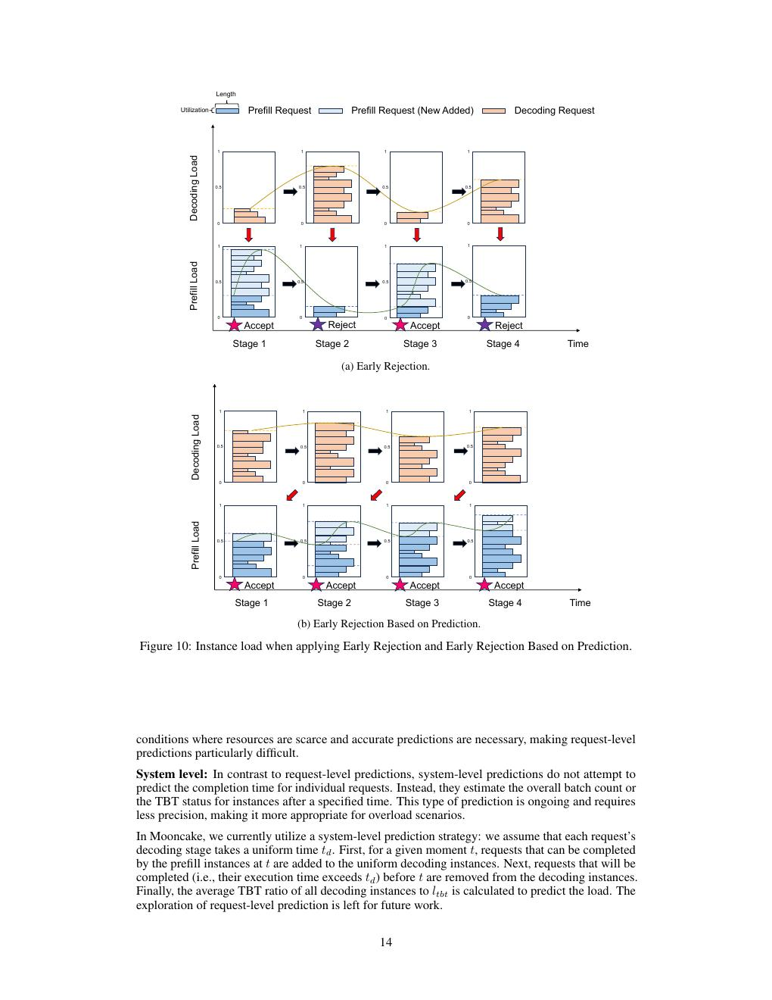
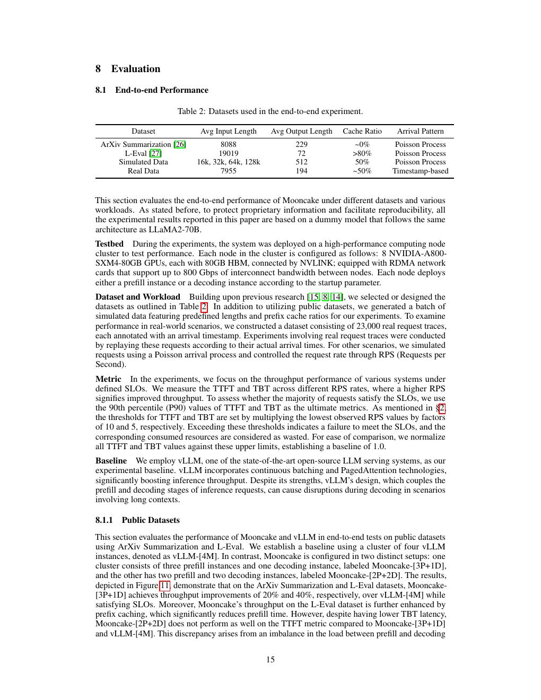

# 论文中文解读：《Mooncake》

## 一、为什么 Kimi 的核心系统论文围绕 KV cache

长 context 服务时，prefill 负责一次处理大量输入，decode 每轮只产生一个 token。二者资源特征不同，而 KV cache 是连接两阶段、决定复用和迁移成本的状态。Mooncake 因此不是先从“如何排 GPU kernel”出发，而是先问“cache 在哪里、何时复用、如何迁移”。

论文首次公开于 2024-07，后获 FAST 2025 Best Paper，arXiv:2407.00079。本地有 [PDF](paper.pdf)、[文本](paper.txt) 与 [概要](论文概要.md)。

## 二、总体架构

prefill pool、decode pool 与 CPU/DRAM/SSD cache pool 分离。全局 Conductor 根据 cache hit、队列与 SLO 选择实例。与只做 P/D disaggregation 的系统相比，它把 cache locality 也纳入调度。

目标不是 raw throughput，而是满足 TTFT/TBT SLO 后完成的请求数，即 goodput。一个请求若最后超时，之前计算的 token 不计有效产出。

## 三、一次请求的四步流程

1. 根据 prefix hash 找可复用 KV blocks，并加载到选定 prefill GPU。
2. 只计算未缓存输入；长输入按 chunk 做 prefill。
3. 每层产生的增量 KV 通过 Messenger/RDMA 流式发送到 decode 节点 CPU memory。
4. cache 到齐后进入 decode continuous batch；本地调度器再次检查 TBT SLO。

layer-wise transfer 将通信与后续层计算重叠，避免 prefill 完成后才整体搬运。代价是需要细粒度状态机和足够 RDMA 带宽。

## 四、真实 trace 为什么重要

论文公开 1 小时 23,608 请求的匿名 trace，包含到达时间、input/output length 与重映射 block hashes，不含用户文本。它保留 session 内前缀复用关系，能研究 cache-aware scheduling，而普通 ShareGPT trace 往往只有长度。

隐私处理后 hash 只能表示复用结构，不能研究内容语义；一小时也未必代表日周期、热点突发和所有用户群。

## 五、prefill pool：CPP 与 layer-wise transfer

超长单请求可能需要多节点 prefill。Mooncake 用 Chunked Pipeline Parallelism，把序列分 chunk 并在 pipeline stages 间流动。相对 sequence parallelism，它减少频繁 collective，且容易随长度调节使用节点数。

但 chunk 过小增加调度/通信，过大又损害 TTFT 与负载均衡；最优点与模型、网络和请求长度分布相关。

## 六、cache-aware 与 overload-aware 调度

调度存在冲突：把请求送到已有 cache 的节点可省 prefill，却可能形成热点；送到空闲节点要先搬 cache。Mooncake 通过热点 block 复制/迁移与启发式评分平衡 cache reuse 和负载。

过载时，晚拒绝最浪费：prefill 已做完、cache 已迁移，decode 才发现无法满足 TBT。系统预测短期负载，尽早拒绝注定 miss SLO 的请求。这样提高 goodput，但必须考虑优先级、公平、重试和用户可见错误率。

## 七、结果怎样读

模拟场景最高 525% 吞吐提升、真实回放多处理 75% 请求，均依赖长 context、高复用和具体 SLO。实验为保护生产信息使用 LLaMA2-70B-like dummy model，不等于完整 Kimi 生产线上同样的绝对延迟。

评估 cache 系统应至少同时报告：

- cache hit/reuse rate 与 block size；
- TTFT/TBT P50/P90/P99；
- RDMA bytes 与传输重叠比例；
- rejection rate 与 wasted compute；
- prompt/output 长度和 arrival burst；
- 完成请求 goodput，而非只算 generated tokens。

## 八、与 CloudMatrix384 的对照

| 维度 | Mooncake | CloudMatrix-Infer |
|---|---|---|
| 基础硬件 | 常规 GPU cluster + RDMA | 384 Ascend NPU 的 UB 超节点 |
| 解耦 | Prefill / Decode / KV pool | Prefill / Decode / Cache pool |
| cache | 利用 CPU DRAM/SSD，显式迁移 | UB 统一访问的分布式内存池 |
| 重点 | KV reuse 与过载调度 | DeepSeek MoE/MLA、EP320 与算子共设计 |
| 风险 | 迁移/命中/调度复杂度 | 专用硬件与定制软件复现门槛 |

两者不是互斥：都把 cache 从单实例私有状态提升为可调度资源，只是硬件假设不同。

## 九、原文入口

[arXiv](https://arxiv.org/abs/2407.00079) · [官方仓库与 trace](https://github.com/kvcache-ai/Mooncake)

## 原文证据导航

以下页码按仓库内 PDF 的**文件页码**计，不等同于论文印刷页码。建议先读本节所指原文，再回看上面的中文解释。

- [打开原始 PDF](paper.pdf)
- [打开可检索文本](paper.txt)

| 中文笔记中的证据 | 原文位置 | 复核重点 |
|---|---|---|
| Mooncake 的 prefill/decode/KVCache 分离架构 | [PDF 文件第 2 页](paper.pdf#page=2) · [截图](rendered_figures/page-2.jpg) | 回到该页上下文，复核定义、图表或实验论证 |
| KV block hash、复用、迁移与请求工作流 | [PDF 文件第 5 页](paper.pdf#page=5) · [截图](rendered_figures/page-5.jpg) | 回到该页上下文，复核定义、图表或实验论证 |
| Chunked Pipeline Parallelism 与 layer-wise prefill | [PDF 文件第 9 页](paper.pdf#page=9) · [截图](rendered_figures/page-9.jpg) | 回到该页上下文，复核定义、图表或实验论证 |
| cache load balancing、热点迁移与 early rejection | [PDF 文件第 14 页](paper.pdf#page=14) · [截图](rendered_figures/page-14.jpg) | 回到该页上下文，复核定义、图表或实验论证 |
| 端到端吞吐、SLO 与真实工作负载回放 | [PDF 文件第 15 页](paper.pdf#page=15) · [截图](rendered_figures/page-15.jpg) | 回到该页上下文，复核定义、图表或实验论证 |
