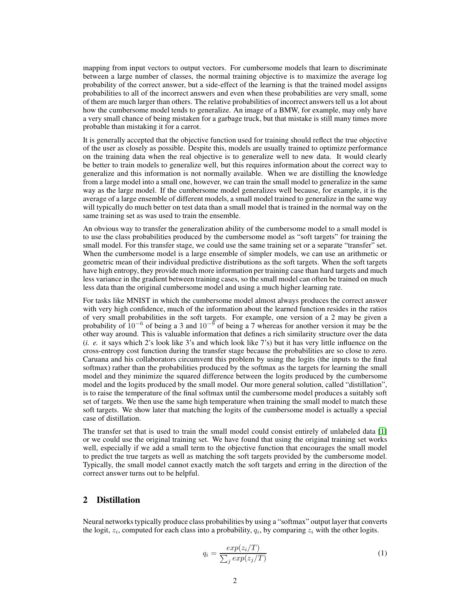
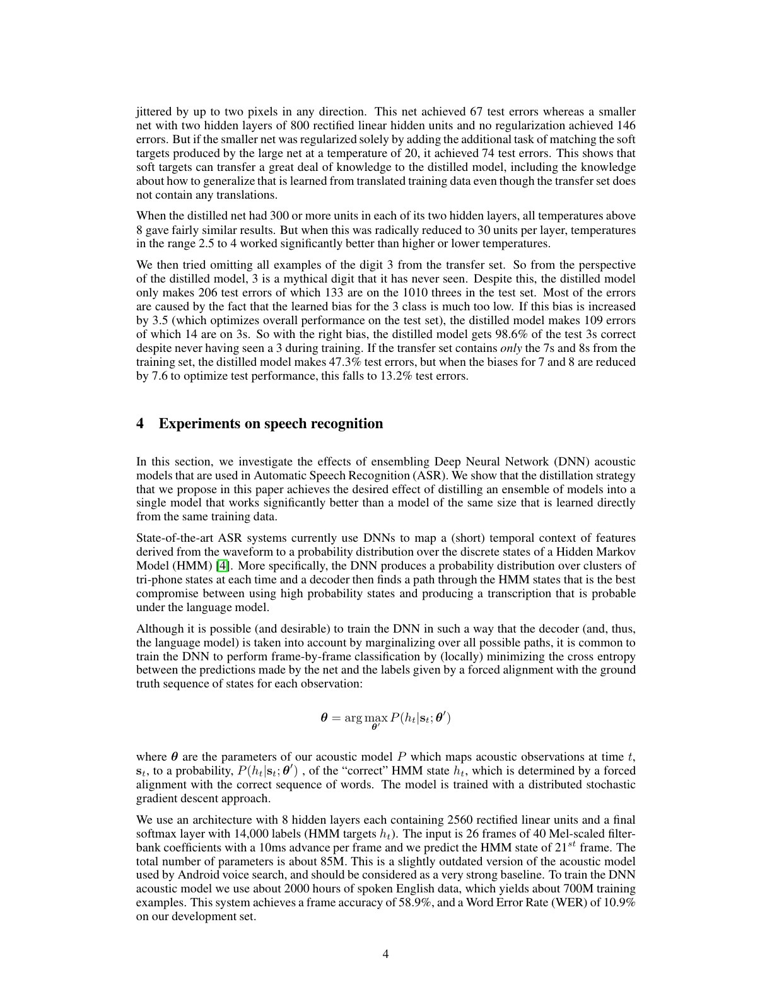
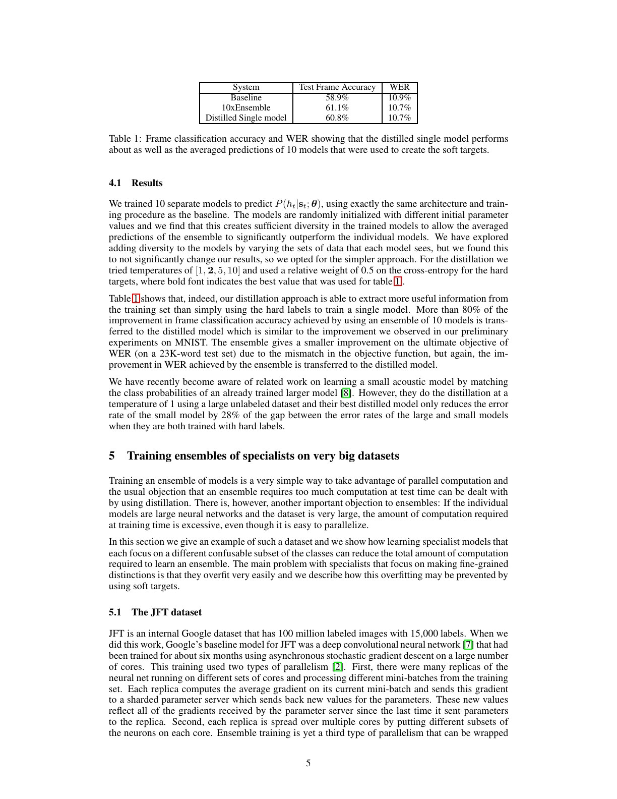
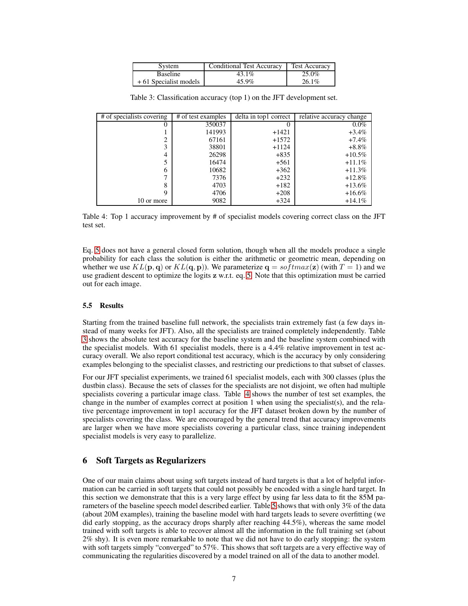
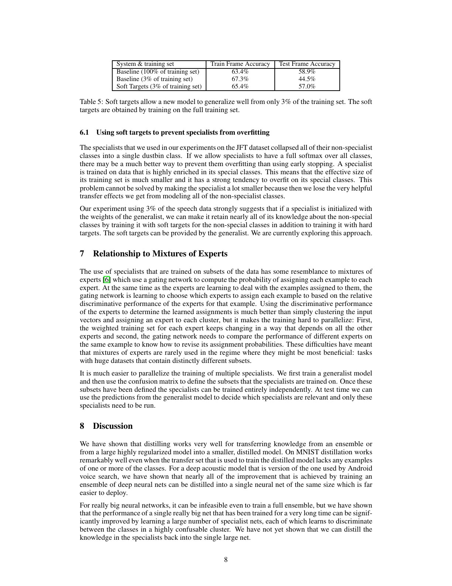

# 论文中文解读：Distilling the Knowledge in a Neural Network

> 原文：[Distilling the Knowledge in a Neural Network](https://arxiv.org/abs/1503.02531)
>
> Geoffrey Hinton、Oriol Vinyals、Jeff Dean，arXiv 2015；工作源自 NIPS 2014 Deep Learning Workshop。
>
> 本地材料：[`PDF`](paper.pdf) · [`全文`](paper.txt) · [`论文概要`](论文概要.md)

## 0. 论文的关键观念转变

传统直觉把知识等同于训练后参数，因此“大 ensemble 的知识怎样进入结构完全不同的小模型”看起来很困难。论文提出更抽象的定义：知识是模型在输入空间上实现的映射，尤其是完整输出分布，而不是某组权重。

训练期与部署期的需求不同：训练可以使用庞大 ensemble、dropout 或慢模型以提取结构，部署则要求低延迟和低内存。蒸馏允许 teacher/cumbersome model 与 student/deployment model 使用不同架构。

## 1. “暗知识”在哪里

硬标签只给正确类一个 1，其余为 0。教师即便对正确类非常自信，也会给错误类分配不同的小概率：BMW 被判成其他轿车的概率通常远大于被判成胡萝卜。这些相对概率表达了：

- 类别间相似结构；
- 单个样本接近哪些决策边界；
- ensemble 对不确定性的平均；
- 数据增强和正则化学到的泛化方式。

教师的错误分布并不天然是真实语义，它也可能反映数据偏差或错误校准。“暗知识”是便于理解的解释，不是论文证明的一种独立可观测实体。

## 2. 温度 softmax

对 logit $z_i$：

$$
q_i(T)=\frac{\exp(z_i/T)}{\sum_j\exp(z_j/T)}.
$$

- $T=1$ 是普通 softmax；
- $T>1$ 缩小 logit 差异，使分布更平、更能看见非正确类关系；
- 训练 student 时，teacher 与 student 必须用同一个高温计算 soft loss；
- 部署推理时 student 回到 $T=1$。

有标签时，论文建议同时优化高温 soft targets 与 $T=1$ hard labels。现代常见写法为：

$$
L=\lambda T^2,CE(p_T^T,p_T^S)+(1-\lambda)CE(y,p_1^S).
$$

论文不是规定唯一 $\lambda$，而是说明 hard-target 项通常权重较低；语音实验对 hard CE 使用相对权重 0.5。

## 3. 为什么必须乘 $T^2$

soft-target cross-entropy 对 student logit 的梯度为：

$$
\frac{\partial C}{\partial z_i}=\frac{1}{T}(q_i-p_i).
$$

高温下 $q_i-p_i$ 自身又近似按 $1/T$ 缩小，所以梯度总体约按 $1/T^2$ 缩小。如果调高 $T$ 却不乘 $T^2$，soft loss 会在数值上悄悄失去权重，实验看似是温度效应，实际可能只是损失比例改变。

乘 $T^2$ 不是改变 softmax 定义，而是让温度扫描时软/硬监督的相对梯度规模大致可比。

## 4. logit matching 是高温特例

若 teacher logits 为 $v_i$、student logits 为 $z_i$，且两者对每个样本分别去均值，高温展开得到：

$$
\frac{\partial C}{\partial z_i}\approx
\frac{1}{NT^2}(z_i-v_i).
$$

这与最小化平方 logit 差的梯度同形。有限温度的额外作用是：对远低于平均值的极负 logits 关注更少。那些 logits 在原教师交叉熵中约束很弱，可能噪声较大；但它们也可能包含信息，所以最佳温度是经验问题。

论文在极小学生网络上发现中间温度 2.5–4 优于更高或更低温度，恰好说明“越软越好”不成立。

## 5. MNIST：压缩、泛化与一个反直觉实验

大网络有两层各 1200 个 ReLU 单元，并用 dropout、权重约束和图像平移增强，测试错误 67。普通两层各 800 单元、无正则的小网络错误 146；同一小网络匹配大网络 $T=20$ 的 soft targets 后错误降到 74。

这说明学生获得的不只是教师 top-1 伪标签，因为后者和真实标签几乎相同；有用信号来自完整分布。

更著名的实验把所有数字 3 从 transfer set 删除。学生未见过任何 3，却通过其他数字样本上 teacher 给“3”的小概率学习到了部分 3 类方向。原始结果为 1010 个测试 3 中错 133 个；作者再用测试集选择把 3 类 bias 增加 3.5 后，只错 14 个，即 98.6%。

最后一步直接用测试集调 bias，存在数据泄漏，不能作为标准 test accuracy；它更像机制演示：类别知识分散在所有 soft targets 中，而不只在该类样本上。

## 6. 语音识别：ensemble 收益能否装进一个模型

实验使用约 2000 小时英语、约 700M 样本、8 层各 2560 ReLU、14,000 个 HMM state labels、约 85M 参数，是当时 Android voice search 的强基线。

| 系统 | 测试 frame accuracy | WER |
| --- | ---: | ---: |
| 单模型 baseline | 58.9% | 10.9% |
| 10 模型 ensemble | 61.1% | 10.7% |
| 蒸馏单模型 | 60.8% | 10.7% |

蒸馏单模型转移了 ensemble frame accuracy 提升的 80% 以上，并完全保留这组实验中的 WER 改善。frame accuracy 与最终 WER 并不一致，所以不能只看教师训练目标；论文也据此指出任务目标失配。

学生在这里与单个 teacher 架构相同，主要压缩的是“10 个模型 ensemble → 1 个模型”的部署成本，不是把 85M 参数再压成远小模型。

## 7. Specialist ensemble：把算力投向易混类别

JFT 有 100M 图像、15,000 labels，全模型训练数月。作者不再完整训练多个 generalist，而是：

1. 用 generalist 预测的类别协方差聚类经常一起出现的类别；
2. 每个 specialist 聚焦约 300 个易混类，其余合并成 dustbin；
3. specialist 从 generalist 初始化，一半看目标子集、一半看其他随机样本；
4. 推理时由 generalist top class 激活相关 specialists，再通过 KL 目标合并分布。

61 个 specialists 将 top-1 从 25.0% 提高到 26.1%，相对改善 4.4%；被更多 specialist 覆盖的测试样本通常收益更大。

但标题主题是 distillation，这一节的 JFT 结果实际上评估 generalist + specialists ensemble。论文明确说还没有证明能把所有 specialist 知识再蒸馏回单个大模型，不能把 26.1% 当作单模型蒸馏结果。

## 8. soft targets 作为数据依赖正则器

只用 3% 语音数据（约 20M 样本）训练 85M 参数模型：

| 训练信号 | 训练 frame accuracy | 测试 frame accuracy |
| --- | ---: | ---: |
| 100% 数据 hard labels | 63.4% | 58.9% |
| 3% 数据 hard labels | 67.3% | 44.5% |
| 3% 数据 soft targets | 65.4% | 57.0% |

hard-label 模型训练准确率更高却严重过拟合；soft targets 几乎恢复全数据测试表现，且无需早停。原因不是 soft labels 更“模糊”这么简单，而是每个样本输出一个 14,000 维结构化目标，把全量数据上学到的函数形状传给新模型。

## 9. 迁移的是教师函数，也包括教师缺陷

蒸馏学生可能超过 teacher 的 top-1，因为 soft targets 是正则器，hard labels 又能纠正部分教师错误；但没有普遍保证。风险包括：

- 教师的系统偏差和错误类相似性被复制；
- teacher 在 transfer set 外的行为没有监督；
- 高温可能放大不校准的尾部概率；
- 容量不足让 student 只能拟合教师函数的某个投影；
- 若教师输出由私有数据训练，soft labels 也可能泄露隐私或成员信息。

因此应分别评估学生对真实标签、教师一致性、校准、OOD、鲁棒性和公平性的变化。

## 10. 与 label smoothing、伪标签的区别

- **label smoothing** 通常把固定质量平均分给错误类，不随样本变化；
- **hard pseudo-labeling** 只取教师 argmax，丢掉类间关系；
- **knowledge distillation** 用教师的样本条件分布作为目标；
- **feature distillation** 进一步对齐中间表示，不是本文主方法；
- **self-distillation** 师生可同架构甚至同代际，收益更接近正则化和优化效应。

这些方法可组合，但“用了 soft labels”不足以说明复现了本文配方，还要报告温度、$T^2$、软硬权重和 transfer data。

## 11. 部署评估不能只看准确率

蒸馏的动机是部署，因此完整实验应同时报告：

1. 参数量与模型文件大小；
2. 目标硬件的 batch-1 延迟与批量吞吐；
3. 峰值内存、能耗和预处理成本；
4. teacher 生成软标签的离线成本；
5. 精度、校准和长尾/OOD 变化。

参数少不自动意味着快：算子形状、内存带宽、量化和硬件内核支持都可能主导实际延迟。

## 12. 最终结论

这篇论文把 ensemble 压缩、模型压缩和软标签学习统一到一个极简单的原则：让学生不仅学习“正确答案是什么”，还学习教师如何在所有备选答案之间分配信念。温度控制能看见多少尾部结构，$T^2$ 保持梯度权重可比，hard labels 则给学生保留纠错通道。

它的实验证据横跨 MNIST、生产级语音和超大类别视觉，但各实验回答的问题不同：MNIST 展示知识分散，语音展示 ensemble-to-single 部署，JFT 展示 specialist 组合，3% 数据实验展示正则化。把这些证据边界分开，才能正确理解“蒸馏”为什么有效、又何时会失效。
