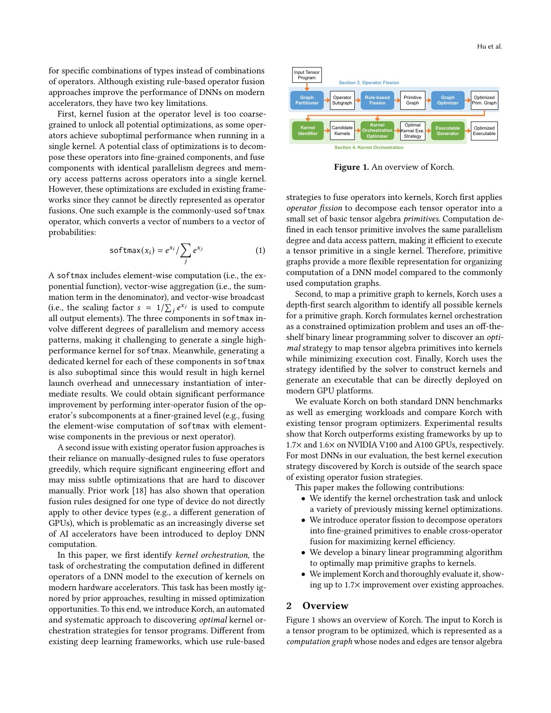
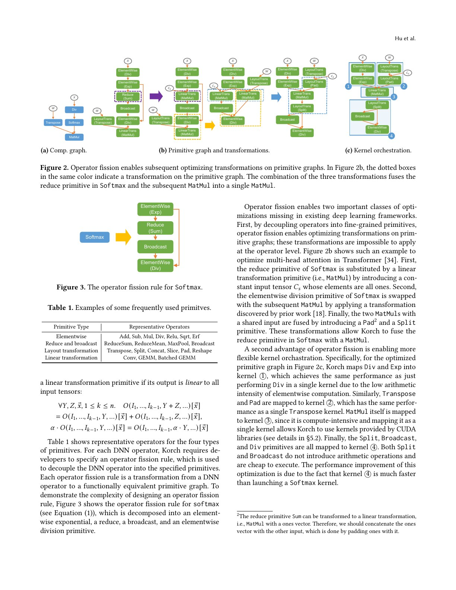
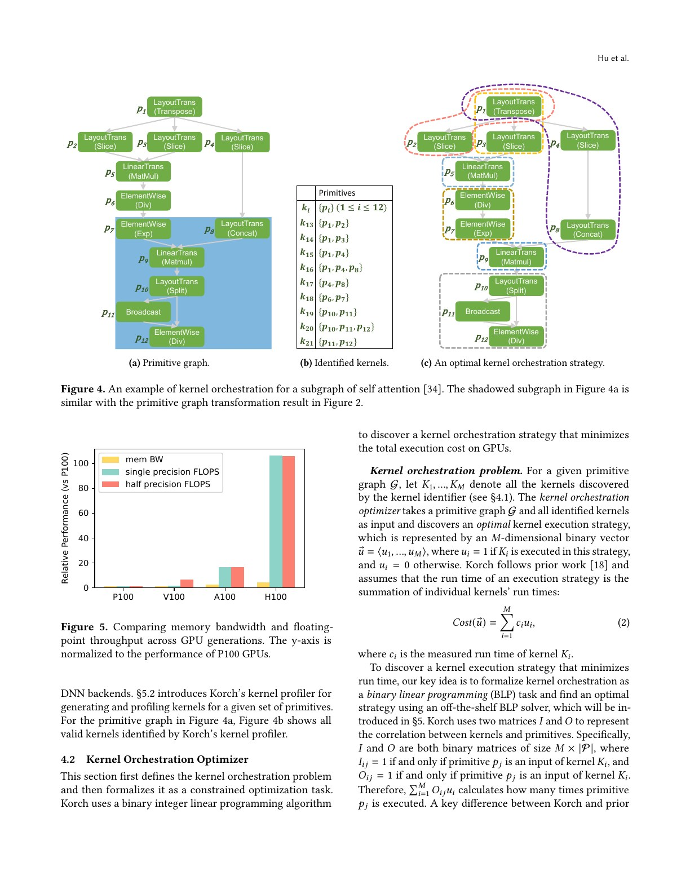
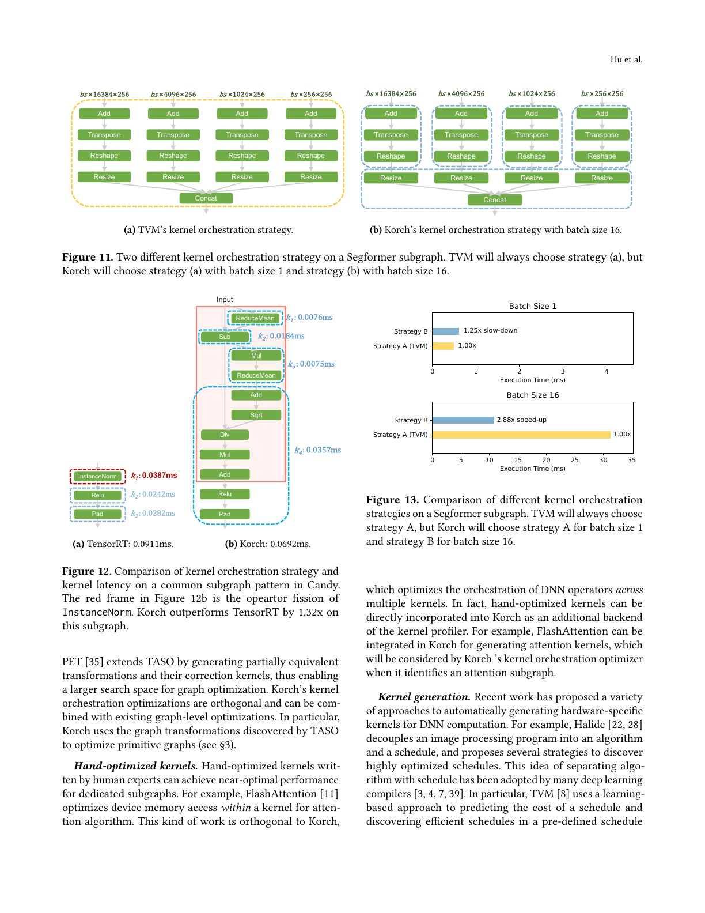
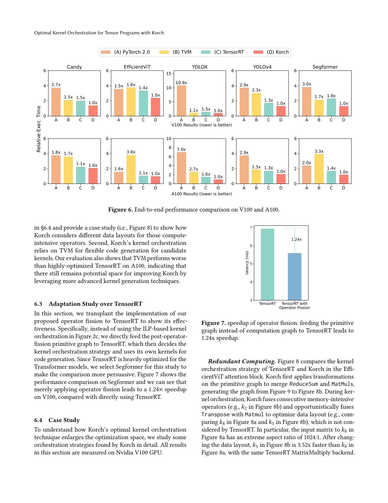
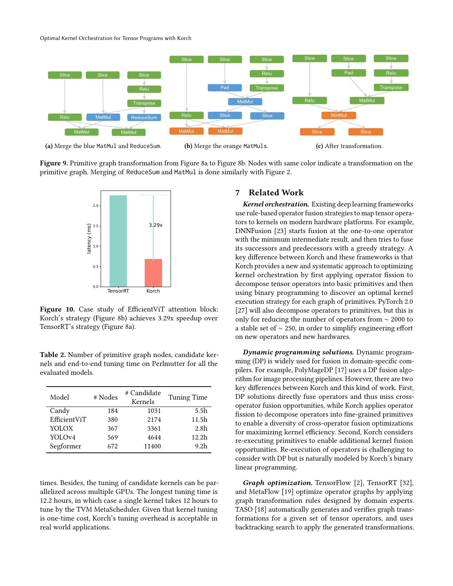

# Korch 中文精读

## 1. Kernel fusion 的粒度还可以再往下

传统 graph compiler 把 Softmax、LayerNorm、MatMul 看成节点，然后决定节点间 fusion。Korch 指出这会遗漏两类机会：

- 一个 operator 内含多种并行模式，不适合整体放进同一 kernel；
- operator 的某一部分可以与前驱融合，另一部分与后继融合。

所以论文使用“orchestration”而不只是 fusion：目标是把整个 tensor program 的 primitive computations 映射到一组 kernels。

## 2. Operator fission

以 Softmax 为例：

$$
y_i=\frac{e^{x_i}}{\sum_j e^{x_j}}
$$

可拆成 elementwise exp、ReduceSum、broadcast/divide。拆开后，exp 可与上游 elementwise 合并，reduce 可与相邻矩阵运算重组，divide 可与下游融合。

论文中的 primitive 是具有统一 parallelism degree 和 access pattern 的小 tensor algebra 单元。fission 规则必须保持语义；随后还可以做 primitive-graph rewrite。

这一步的本质不是把 IR 变得更低级，而是暴露原 operator 内部被 API 边界隐藏的调度自由度。

## 3. 枚举 candidate kernels

对 primitive graph，Korch 枚举候选 (K_i=(P_i,I_i,O_i,c_i))：

- (P_i)：kernel 计算的 primitive 集；
- (I_i/O_i)：外部输入输出；
- (c_i)：生成后实测 latency。

候选必须依赖闭合、可生成且资源合法。memory-intensive 候选由 TVM/Ansor 调优；compute-intensive primitive 若适配，就调用 cuDNN、cuBLAS 或 TensorRT，避免自动 codegen 很难超过厂商库的问题。

## 4. 二元线性规划

为每个候选 kernel 定义二元变量 (x_i\in\{0,1\})，最小化：

$$
\min \sum_i c_i x_i.
$$

约束要求：

- 每个必要 primitive 被合法覆盖；
- 选中 kernel 的外部输入必须由图输入或其他选中 kernel 提供；
- 最终图输出必须产生；
- 不能出现矛盾的执行/物化关系。

因为候选 latency 来自 profile，目标比单纯最小 kernel 数更可靠。代价是候选生成和求解都可能很慢。

## 5. 为什么“全融合”会输

大 kernel 可能：

- 使复杂 schedule 无法用最优库 kernel；
- 寄存器/shared memory 超标；
- 降低 occupancy；
- 为了统一并行度加入冗余计算；
- 在不同 batch/shape 上表现不稳定。

论文的 SegFormer 案例中，TVM 的 greedy strategy 把一段图全部融合；batch 16 时，改成多个 kernel 快 2.24×。

这直接说明 fusion count 不是优化目标，latency 才是。

## 6. 端到端结果

5 个模型包括 Candy、YOLOv4、YOLOX-Nano、SegFormer、EfficientViT，均为 batch 1：

- V100：最高 1.7×、平均 1.39×；
- A100：最高 1.6×、平均 1.30×。

A100 平均收益反而较小。论文解释，一方面 TensorRT/A100 的库 kernel 更强，另一方面 Korch 的 flexible codegen 依赖 TVM，对 A100 的优化不如厂商实现。不能把这解释成“新 GPU 不需要 fusion”。

## 7. 两个关键案例

### 7.1 EfficientViT

Korch 通过 primitive rewrite 合并 ReduceSum 与 MatMul，并改变极端长宽比矩阵的数据布局。相同 TensorRT MatMul backend 下，布局调整后的 kernel 快 3.52×；整个 attention block 用 7 个而不是 12 个 kernels，子图快 3.29×。

### 7.2 把 fission 单独移植到 TensorRT

不使用 Korch 的 ILP，只把 fission 后的图送入 TensorRT，也在 SegFormer/V100 上获得 1.24×。这说明收益不全来自全局 solver，暴露细粒度 IR 本身就有价值。

## 8. 调优成本与边界

最大 primitive graph 有 584 个 execution states 和 3,078 个 candidates；PuLP 在所有案例中能于 1,000 秒内求解，但 profile 每个 candidate 还需要 codegen/tuning。论文把它视为一次性部署成本。

当前目标假设 kernels 顺序执行，不建模 CUDA multi-stream 或通信重叠。若扩展到 MegaKernel/多 GPU，候选的并行执行与资源占用需要进入模型，问题会更复杂。

## 9. 常见误读

### “Operator fission 就是 lowering”

普通 lowering 可能只是换表示；Korch 的 fission 特意用于开放跨 operator 重组与多 kernel 覆盖空间。

### “ILP 保证全局最优，所以最终程序全局最优”

它只在已枚举候选和给定 latency/顺序执行模型内最优。漏掉 candidate、profile 噪声或忽略 overlap 都会限制结论。

### “冗余计算一定是坏事”

某些 reshape/transpose 可在多个 consumer kernel 中廉价重算，从而避免物化与额外 kernel；Korch 明确允许这种权衡。

## 10. 复现检查点

- 保留原始 ONNX 与 fission 后 primitive graph。
- 单独验证每条 rewrite 的数值语义和浮点容差。
- 记录 candidate 数、codegen backend、tuning budget、profile 次数。
- 报告 solver 时间和总 compile time。
- 检查 shape/batch 改变是否需要重新求解。
- 与 TensorRT 比较时固定精度及 Tensor Core 模式。

## 11. 与其他论文的连接

- [FusionStitching](../fusion_stitching/论文中文解读.md)：扩大异构 operator 的融合/codegen 能力。
- [Welder](../welder/论文中文解读.md)：以 tile traffic 联合优化存储层次。
- [Event Tensor](../event_tensor/论文中文解读.md)：把细粒度 task dependency 带入 persistent megakernel，支持动态调度。

## 12. 最终判断

Korch 最有价值的观念是：operator API 是软件边界，不应自动成为 kernel 边界；最优程序可能需要先拆再合。其具体 ILP 和 fission 规则仍有规模与动态性限制，但它清楚证明了 greedy fusion 的搜索空间为什么不够。
