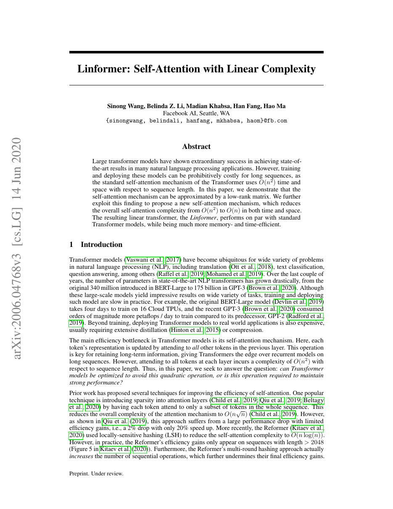
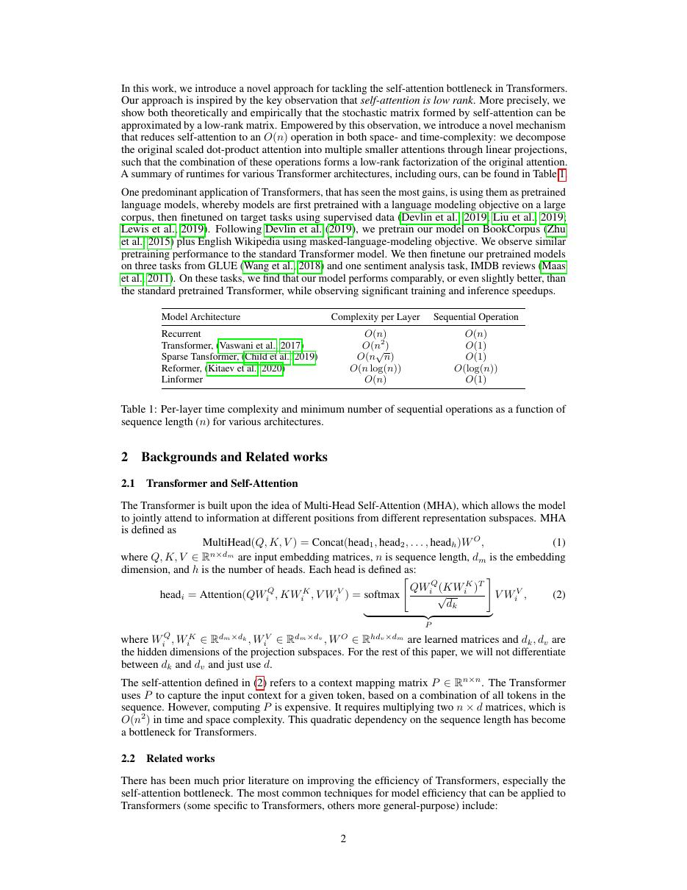
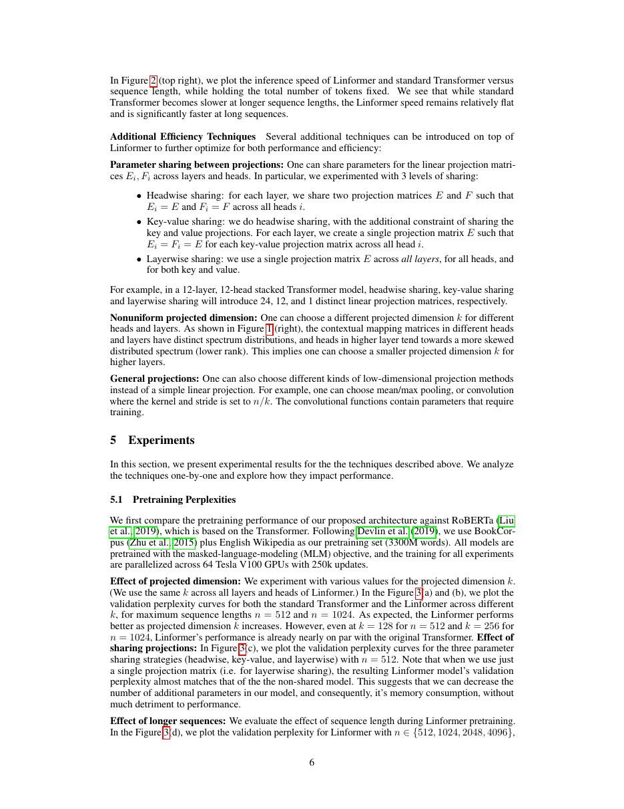
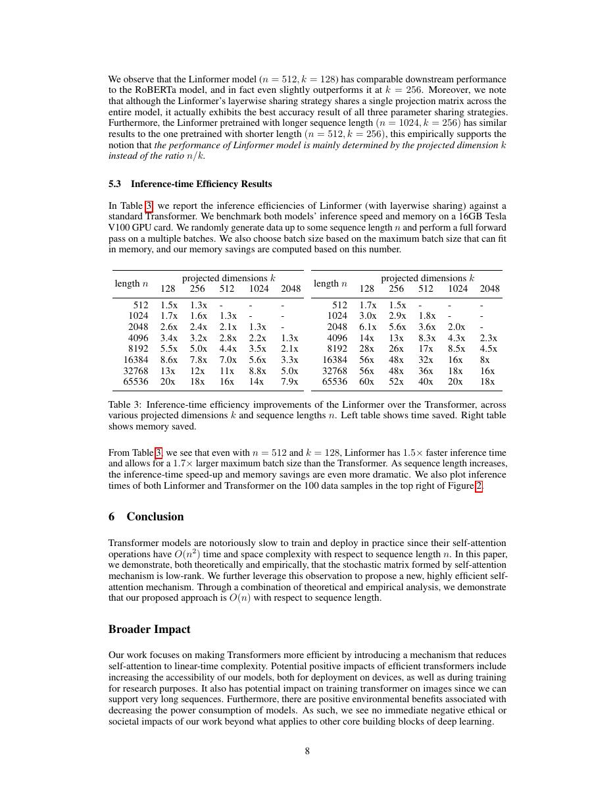

# 论文中文解读：《Linformer: Self-Attention with Linear Complexity》

## 一、它解决了什么

Linformer 假设 attention 矩阵在序列维近似低秩，用投影压缩 K/V 长度，使复杂度近似 O(nk)。

## 二、核心机制

学习矩阵 E、F 把长度 n 的 K/V 映射到固定 k，再执行 Q(EK)ᵀ。若有效 rank 不随 n 快速增长，k 可远小于 n；可在 head/layer 间共享投影减少参数。

## 三、为什么成为主线

它是线性 attention 研究的重要分支，强调从矩阵低秩结构而非稀疏图减少成本。

## 四、应该怎样读证据

论文里的结果首先证明方法在当时数据、模型规模、硬件和评测协议下成立。跨年代比较时要统一参数量、训练 tokens、数据质量、上下文长度、推理预算与系统实现，不能只横比单个最佳分数。

## 五、局限与易误读点

固定投影与训练最大长度绑定，外推和精确 token recall 可能受损；低秩假设是经验性的。理论 FLOPs 降低不保证 kernel、内存和小 batch 延迟同步改善。

## 六、放进十年演进史

Performer 用随机特征近似 softmax kernel；MiniMax Lightning Attention 用可递推状态；三者不要混称为同一种 linear attention。

## 七、原文入口

[官方论文/页面](https://arxiv.org/abs/2006.04768)

## 八、原文论证链

Linformer 从一个经验观察出发：许多训练后 attention matrix 在序列维度上呈近似低秩。若 key/value 沿长度维可投影到固定 $k\ll n$，就无需显式构造 $n\times n$ 分数矩阵。论文用两个投影矩阵 $E,F$ 把 K/V 从长度 $n$ 压到 $k$，将时间与空间复杂度从二次降到约 $O(nk)$。

它与局部稀疏 attention 的思路不同：每个 query 仍可通过投影后的全局摘要接触整个序列，但摘要容量受秩 $k$ 限制。理论部分在条件下给出低秩近似界，实验则检查不同 $k$、参数共享和长度上的精度/效率。

> 原文定位：[PDF 文件第 1 页](paper.pdf#page=1) · [对应截图](rendered_figures/page-1.jpg)

## 九、张量计算

标准注意力为
$$
\mathrm{softmax}(QK^\top/\sqrt d)V.
$$
Linformer 改为
$$
\mathrm{softmax}(Q(EK)^\top/\sqrt d)\,(FV),
$$
其中 $E,F\in\mathbb R^{k\times n}$。分数矩阵形状由 $n\times n$ 变为 $n\times k$。投影可按层、按头独立，也可跨头/层共享来进一步减少参数。

这里的低秩发生在序列轴，不是把 hidden dimension $d$ 变小。若输入长度变化，投影矩阵的参数化或插值策略必须明确，否则固定 $n$ 的 $E,F$ 不能直接泛化。

> 原文定位：[PDF 文件第 2 页](paper.pdf#page=2) · [对应截图](rendered_figures/page-2.jpg)

## 十、实验怎样读

论文在 MLM 预训练和 GLUE/IMDB 等任务上比较 BERT 类基线，展示在选定 $k$ 下质量接近、内存和速度更好。attention 奇异值分析是设计动机，不等于对所有层、所有输入都严格低秩。效率曲线要看实际序列长度；短序列时投影开销可能掩盖收益。

> 原文定位：[PDF 文件第 6 页](paper.pdf#page=6) · [对应截图](rendered_figures/page-6.jpg)

## 十一、复现检查

- 确认 E/F 作用于 sequence length 维，张量转置很容易写错。
- 记录 $k$、跨头/层共享策略和可支持的最大长度。
- benchmark 必须用真正的 $n\times k$ kernel，不能构造全矩阵后截断。
- 做不同 $k$ 的质量—速度曲线，而不是只选一个有利点。

## 十二、常见误读

Linformer 没有证明所有注意力矩阵在任意任务上都低秩，也没有保持标准 attention 的逐元素连接。它用固定容量的全局投影换取线性复杂度；长上下文中的细粒度检索可能因此受损。

> 原文定位：[PDF 文件第 8 页](paper.pdf#page=8) · [对应截图](rendered_figures/page-8.jpg)

## 原文证据导航

以下页码按仓库内 PDF 的**文件页码**计，不等同于论文印刷页码。建议先读本节所指原文，再回看上面的中文解释。

- [打开原始 PDF](paper.pdf)
- [打开可检索文本](paper.txt)

| 中文笔记中的证据 | 原文位置 | 复核重点 |
|---|---|---|
| 原文首页、摘要与问题定义 | [PDF 文件第 1 页](paper.pdf#page=1) · [截图](rendered_figures/page-1.jpg) | 回到该页上下文，复核定义、图表或实验论证 |
| 核心方法、架构或算法定义所在关键页 | [PDF 文件第 2 页](paper.pdf#page=2) · [截图](rendered_figures/page-2.jpg) | 回到该页上下文，复核定义、图表或实验论证 |
| 实验、结果或关键分析所在原文页 | [PDF 文件第 6 页](paper.pdf#page=6) · [截图](rendered_figures/page-6.jpg) | 回到该页上下文，复核定义、图表或实验论证 |
| 讨论、结论或补充分析所在原文页 | [PDF 文件第 8 页](paper.pdf#page=8) · [截图](rendered_figures/page-8.jpg) | 回到该页上下文，复核定义、图表或实验论证 |
