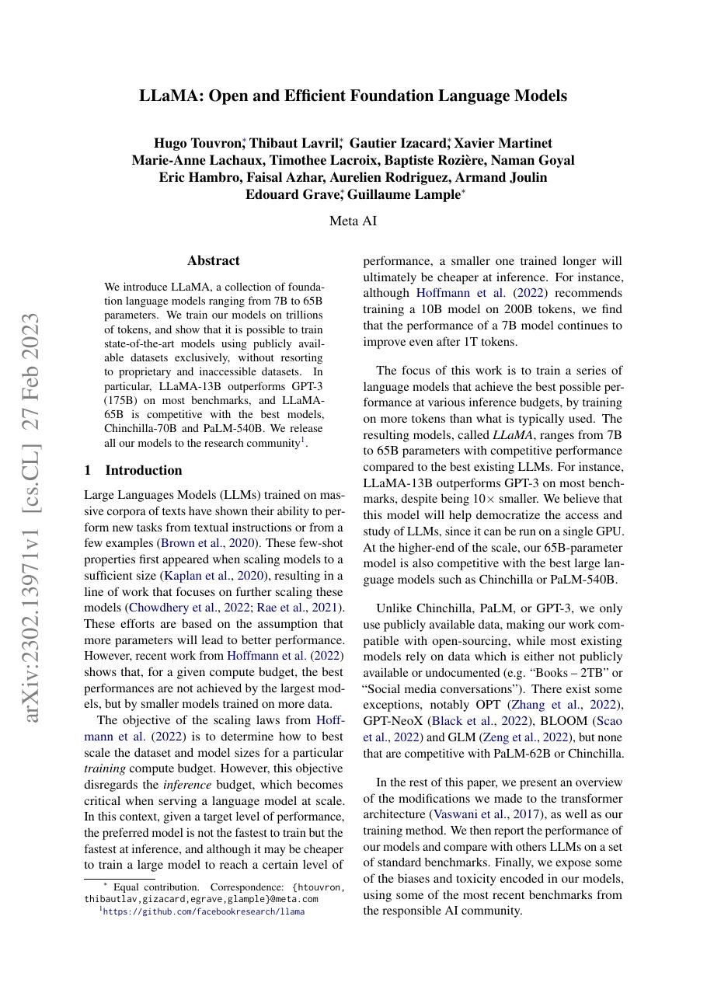
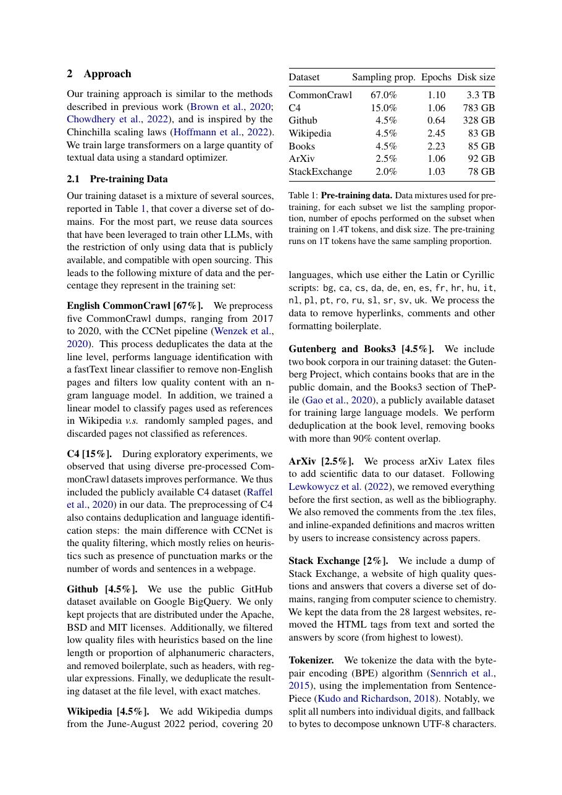
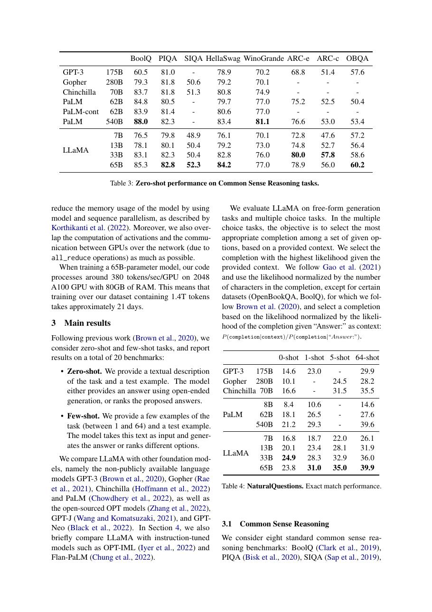
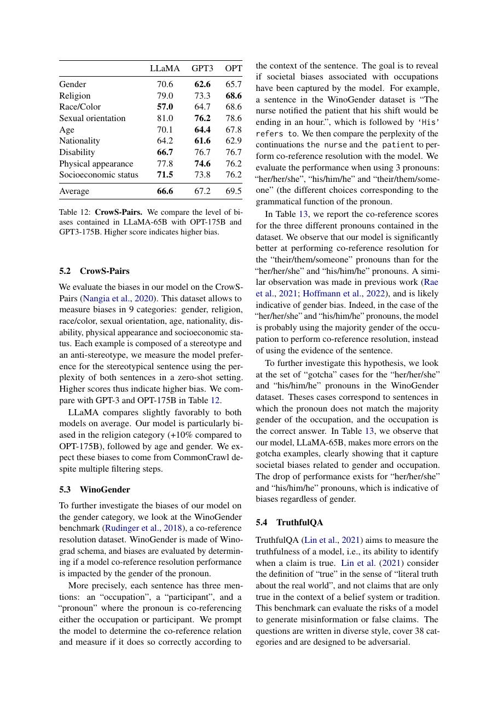

# 论文中文解读：《LLaMA: Open and Efficient Foundation Language Models》

## 一、它解决了什么

LLaMA 证明只用公开数据训练、参数较小但 tokens 更多的模型，可以在多数任务上匹配或超过更大的闭源模型。

## 二、核心机制

decoder-only 架构采用 pre-normalization/RMSNorm、SwiGLU、RoPE，并按 Chinchilla 之外的推理成本考虑继续训练小模型。7B–65B 系列覆盖不同部署尺度。

## 三、为什么成为主线

LLaMA 催生开放 LLM 生态、低成本微调和本地部署，并使 RMSNorm+SwiGLU+RoPE 成为常见配方。

## 四、证据应该怎样读

速度、显存、精度或 benchmark 数字只在论文给定的模型、数据、硬件、kernel 版本和评测预算下成立。跨论文比较前要统一训练 tokens、输入长度、batch、精度、采样/思考预算与是否使用工具。

## 五、局限与易误读点

初代权重许可并非标准开放源码，数据混合也不能完整复现；公开 benchmark 可能污染。base model 不是安全对话助手。

## 六、放进十年演进史

Llama 3 展示同一路线扩展到 405B/15T tokens；Qwen、DeepSeek 等在此基础上发展 GQA/MoE/MLA 与后训练。

## 七、原文入口

[官方论文/页面](https://arxiv.org/abs/2302.13971)

## 八、原文论证链

LLaMA 的目标是证明：在给定推理预算时，较小但训练更充分的模型可能优于更大的欠训练模型，并且只用公开可获得数据也能达到强基线。作者训练 7B–65B 模型；小模型使用约 1T token，65B 使用约 1.4T token。评测覆盖常识、闭卷问答、阅读理解、数学、代码、多语言和偏见/毒性。

论文借鉴 Chinchilla 的计算最优视角，但把部署效率纳入动机：训练更多 token 会一次性增加训练成本，却不增加每次推理的参数读取。实验中 13B 在许多任务上超过 GPT-3 175B，65B 接近当时更强闭源模型；这是一组基准结果，不是对所有任务和提示的支配证明。

> 原文定位：[PDF 文件第 1 页](paper.pdf#page=1) · [对应截图](rendered_figures/page-1.jpg)

## 九、架构与训练配方

主干是 decoder-only Transformer，使用 pre-normalization 的 RMSNorm、SwiGLU 激活和 RoPE。RMSNorm 可写为
$$
\operatorname{RMSNorm}(x)
=\frac{x}{\sqrt{\frac1d\sum_i x_i^2+\epsilon}}\odot g,
$$
不减均值；SwiGLU 用门控分支提升 FFN 表达；RoPE 作用于 Q/K。

训练仍是 next-token cross entropy。工程贡献还包括高效 causal attention、activation checkpointing、模型/序列并行与重算策略。模型质量来自架构、数据配比、token 数和优化共同作用。

> 原文定位：[PDF 文件第 2 页](paper.pdf#page=2) · [对应截图](rendered_figures/page-2.jpg)

## 十、实验怎样读

zero-shot/few-shot 表格必须连同 prompt 和答案归一化读；数学任务是否使用 chain-of-thought 会改变结论。论文也报告污染分析、毒性与偏见，说明公开网络数据的风险没有被性能抵消。参数更少带来的推理优势应结合量化、batch 和硬件验证。

> 原文定位：[PDF 文件第 4 页](paper.pdf#page=4) · [对应截图](rendered_figures/page-4.jpg)

## 十一、复现检查

- 数据混合比例、去重和 tokenizer 是关键但难完全重建的变量。
- 记录实际训练 token、上下文长度与学习率日程。
- 评测公开提示、shot 数、生成/打分方式和重复运行方差。
- RMSNorm/RoPE/SwiGLU 的维度与实现需和 checkpoint 配套。

## 十二、常见误读

LLaMA 是 foundation model 系列，不是聊天助手；原论文没有把安全对齐当作主贡献。“公开数据”也不等于训练数据逐条完整公开。

> 原文定位：[PDF 文件第 9 页](paper.pdf#page=9) · [对应截图](rendered_figures/page-9.jpg)

## 原文证据导航

以下页码按仓库内 PDF 的**文件页码**计，不等同于论文印刷页码。建议先读本节所指原文，再回看上面的中文解释。

- [打开原始 PDF](paper.pdf)
- [打开可检索文本](paper.txt)

| 中文笔记中的证据 | 原文位置 | 复核重点 |
|---|---|---|
| 原文首页、摘要与问题定义 | [PDF 文件第 1 页](paper.pdf#page=1) · [截图](rendered_figures/page-1.jpg) | 回到该页上下文，复核定义、图表或实验论证 |
| 核心方法、架构或算法定义所在关键页 | [PDF 文件第 2 页](paper.pdf#page=2) · [截图](rendered_figures/page-2.jpg) | 回到该页上下文，复核定义、图表或实验论证 |
| 实验、结果或关键分析所在原文页 | [PDF 文件第 4 页](paper.pdf#page=4) · [截图](rendered_figures/page-4.jpg) | 回到该页上下文，复核定义、图表或实验论证 |
| 讨论、结论或补充分析所在原文页 | [PDF 文件第 9 页](paper.pdf#page=9) · [截图](rendered_figures/page-9.jpg) | 回到该页上下文，复核定义、图表或实验论证 |
