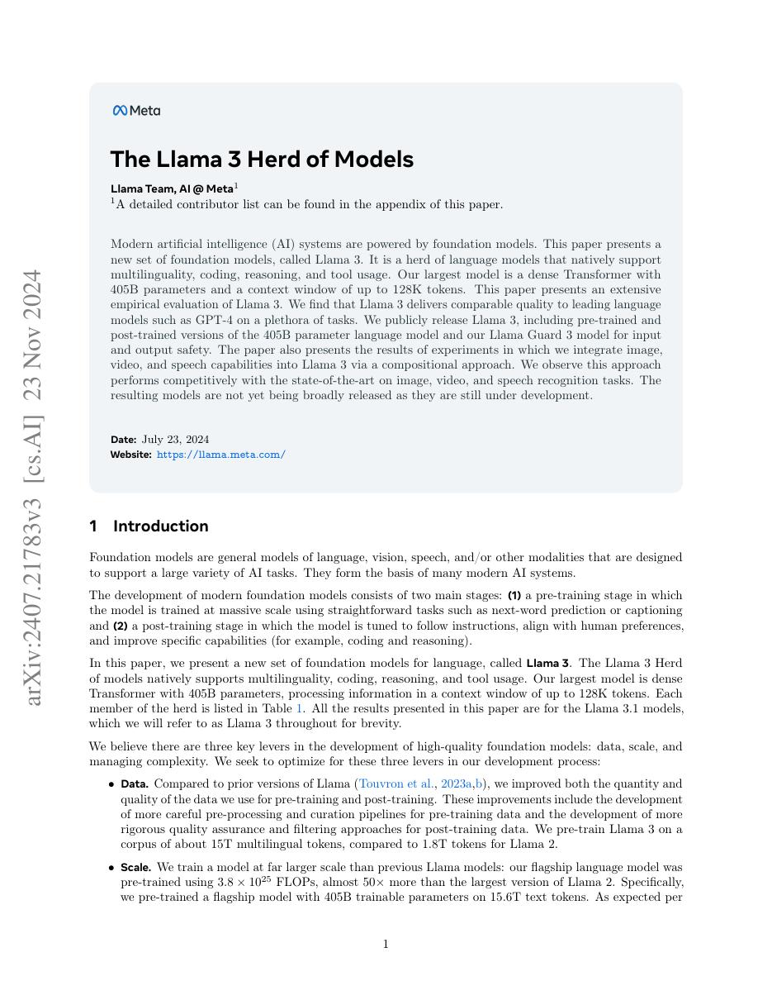
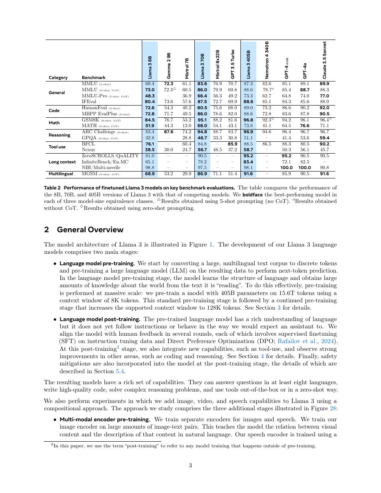
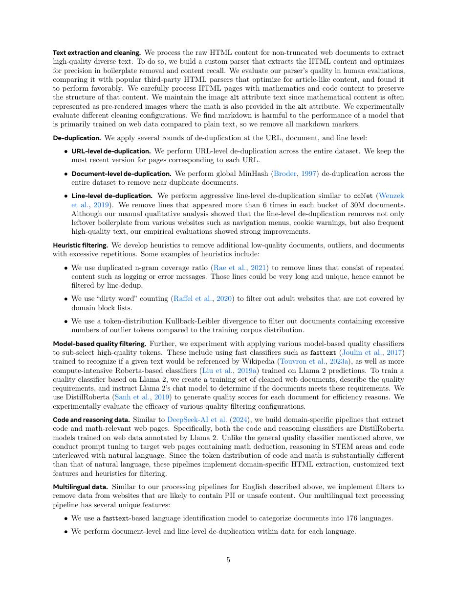
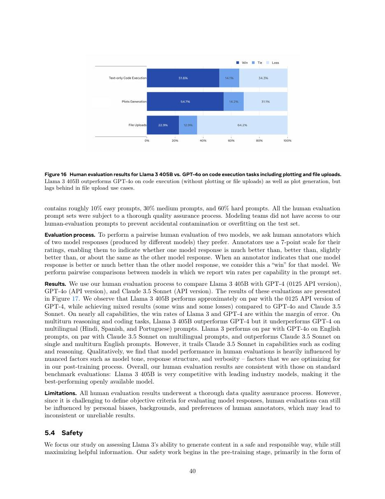

# 论文中文解读：《The Llama 3 Herd of Models》

## 一、它解决了什么

Llama 3 把开放 dense Transformer 扩展到 405B、约 15T 训练 tokens 和 128K context，并系统披露数据、并行、后训练与安全评测。

## 二、核心机制

核心仍是 decoder-only、RoPE、GQA、SwiGLU/RMSNorm；规模化重点转向数据过滤、退火、长上下文、SFT、reward modeling、rejection sampling 与 DPO。报告还探索通过组合式适配加入图像、视频和语音。

## 三、为什么成为主线

它是开放权重 dense LLM 的重要工业参考，说明成熟架构下数据与训练系统往往比新增模块更决定质量。

## 四、证据应该怎样读

速度、显存、精度或 benchmark 数字只在论文给定的模型、数据、硬件、kernel 版本和评测预算下成立。跨论文比较前要统一训练 tokens、输入长度、batch、精度、采样/思考预算与是否使用工具。

## 五、局限与易误读点

完整数据和生产基础设施不可复现，Llama 许可证不是 OSI 开源许可证；多模态部分当时未广泛发布。benchmark 结果依 inference recipe。

## 六、放进十年演进史

与初代 LLaMA 看训练规模与后训练升级；与 DeepSeek-V3/Kimi K2 对照 dense 与 MoE；与 Qwen3 对照 thinking mode。

## 七、原文入口

[官方论文/页面](https://arxiv.org/abs/2407.21783)

## 八、原文论证链

Llama 3 技术报告把重点从单一预训练模型扩展到完整模型族：8B、70B、405B，覆盖基础模型、指令模型、多语言、代码、工具使用和长上下文。405B 以约 15.6T token 训练，团队强调数据过滤/去重、规模律选型、训练稳定性和大规模并行；后训练再用监督微调、偏好优化与合成数据迭代提升可用性。

论证由三部分组成：预训练 loss 与下游能力随规模增长；405B 可作为较小模型的数据生成器/评审器；系统化 post-training 能把基础能力转化为指令遵循和安全行为。基础模型与 instruct 模型的表格不能混读。

> 原文定位：[PDF 文件第 1 页](paper.pdf#page=1) · [对应截图](rendered_figures/page-1.jpg)

## 九、架构与长上下文

主干仍是 dense decoder Transformer，使用 GQA 降低 KV cache，tokenizer 词表扩大以提高多语言/代码效率。长上下文版本扩到 128K，并通过继续预训练与质量控制保持短上下文能力。

训练计算近似由参数、token 与并行效率决定；报告中的 MFU、故障恢复和大规模集群稳定性说明“训练成功”不仅是模型公式。post-training 的偏好数据、拒绝采样和模型生成数据形成迭代闭环，但也可能继承 teacher 偏差。

> 原文定位：[PDF 文件第 3 页](paper.pdf#page=3) · [对应截图](rendered_figures/page-3.jpg)

## 十、实验怎样读

MMLU、GSM8K、HumanEval、多语言、长上下文与人评覆盖不同能力。开放/闭源对比需核对 prompt、是否使用 CoT、pass@k 与评测污染。405B 领先并不代表 8B/70B 在同样部署约束下不重要；论文也把蒸馏和合成数据视为模型族策略。

> 原文定位：[PDF 文件第 5 页](paper.pdf#page=5) · [对应截图](rendered_figures/page-5.jpg)

## 十一、复现检查

- 区分 8B/70B/405B、base/instruct、上下文版本。
- 记录 chat template、system prompt、sampling 与答案抽取。
- 长上下文同时测试 needle retrieval 与真实长文推理，避免只看单一指标。
- 数据治理、去重和评测集污染检查必须与 benchmark 一起报告。

## 十二、常见误读

Llama 3 的成绩不是由 GQA 或 token 数单独造成，而是数据、规模、基础设施与后训练的系统结果。长达 128K 也只表示接口容量，不保证每个距离上的信息利用同等可靠。

> 原文定位：[PDF 文件第 40 页](paper.pdf#page=40) · [对应截图](rendered_figures/page-40.jpg)

## 原文证据导航

以下页码按仓库内 PDF 的**文件页码**计，不等同于论文印刷页码。建议先读本节所指原文，再回看上面的中文解释。

- [打开原始 PDF](paper.pdf)
- [打开可检索文本](paper.txt)

| 中文笔记中的证据 | 原文位置 | 复核重点 |
|---|---|---|
| 原文首页、摘要与问题定义 | [PDF 文件第 1 页](paper.pdf#page=1) · [截图](rendered_figures/page-1.jpg) | 回到该页上下文，复核定义、图表或实验论证 |
| 核心方法、架构或算法定义所在关键页 | [PDF 文件第 3 页](paper.pdf#page=3) · [截图](rendered_figures/page-3.jpg) | 回到该页上下文，复核定义、图表或实验论证 |
| 实验、结果或关键分析所在原文页 | [PDF 文件第 5 页](paper.pdf#page=5) · [截图](rendered_figures/page-5.jpg) | 回到该页上下文，复核定义、图表或实验论证 |
| 讨论、结论或补充分析所在原文页 | [PDF 文件第 40 页](paper.pdf#page=40) · [截图](rendered_figures/page-40.jpg) | 回到该页上下文，复核定义、图表或实验论证 |
