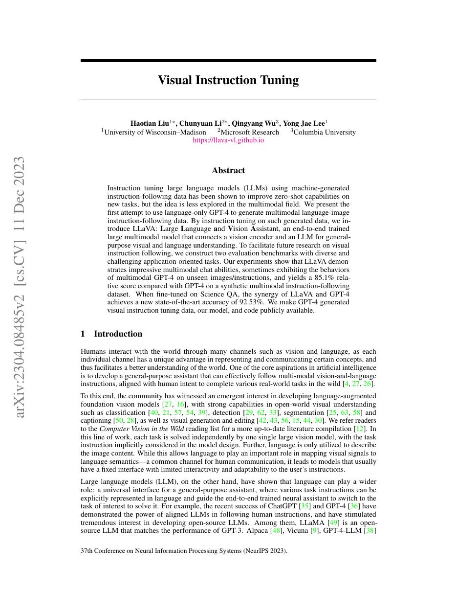
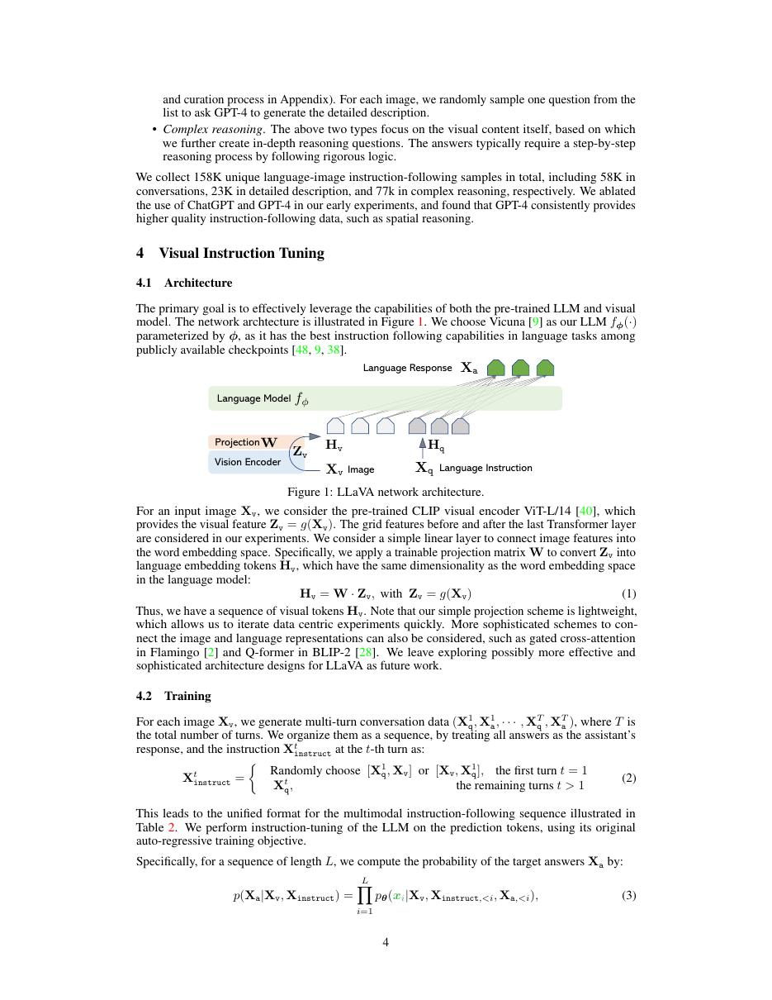
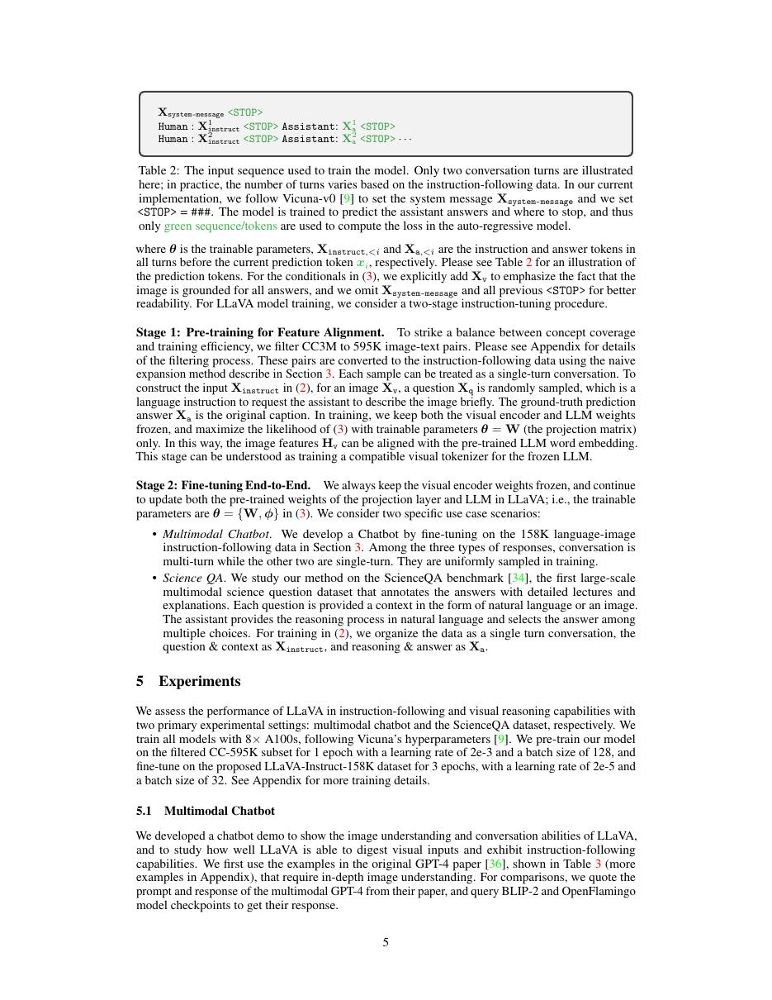
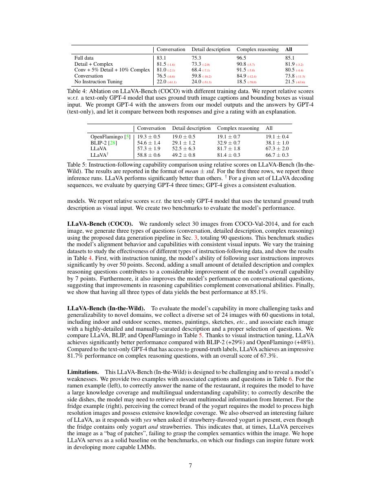

# 论文中文解读：《Visual Instruction Tuning》

## 一、它解决了什么

LLaVA 用一个简单投影层连接 CLIP vision encoder 与 Vicuna/LLaMA，并用 GPT-4 生成的视觉指令数据训练开放多模态助手。

## 二、核心机制

第一阶段用图文 caption 对齐视觉特征到语言 embedding；第二阶段做多模态 instruction tuning。训练数据由图像 caption/bounding box 等符号描述交给语言模型生成对话、描述和复杂推理指令。

## 三、为什么成为重要节点

它以低复杂度、可复现的 connector+LLM 配方推动开源视觉语言助手生态，并证明 instruction tuning 比单纯 caption pretraining 更接近交互需求。

## 四、证据怎样读

结果只在论文的数据、模型版本、硬件和评测协议下成立。闭源模型要把能力报告与可复现架构分开；系统论文要同时记录通信拓扑、编译预算和 runtime；科学模型要把预测精度与实验验证边界分开。

## 五、局限与易误读点

GPT-4 生成数据会继承教师偏差，早期 evaluation 又部分使用 GPT-4 judge；线性 projector 容量有限。视觉推理回答可能依语言先验而非真正观察。

## 六、放进十年演进史

CLIP 提供视觉表征，LLaMA/Vicuna 提供语言 backbone，LLaVA 把二者用 instruction data 接起来；后续多模态模型主要改进 connector、resolution 和数据。

## 七、原文入口

[官方论文/页面](https://arxiv.org/abs/2304.08485)

## 八、原文论证链

LLaVA 探索用 GPT-4 生成视觉指令数据，把预训练视觉编码器与开源语言模型连接成通用视觉对话助手。由于纯文本 GPT-4 看不到图像，作者先把图像转换为 captions 与 bounding-box 描述，再让 GPT-4 生成 conversation、detailed description 和 complex reasoning 三类指令问答。模型使用 CLIP 视觉特征，经线性投影映射到 Vicuna embedding 空间，再按两阶段训练。

> 原文定位：[PDF 文件第 1 页](paper.pdf#page=1) · [对应截图](rendered_figures/page-1.jpg)

## 九、两阶段对齐

图像 $X_v$ 经冻结 CLIP encoder 得到特征 $Z_v$，投影为
$$
H_v=WZ_v,
$$
与文本 token embedding 拼成语言模型上下文。第一阶段冻结视觉 encoder 和 LLM，只训练投影层，使视觉特征对齐语言空间；第二阶段继续冻结视觉 encoder，微调投影与 LLM 做视觉指令跟随。

这套线性桥接的简单性是论文论点之一：强视觉和语言先验加合适指令数据，未必需要复杂融合模块。

> 原文定位：[PDF 文件第 4 页](paper.pdf#page=4) · [对应截图](rendered_figures/page-4.jpg)

## 十、实验怎样读

ScienceQA、视觉对话与 LLaVA-Bench 分别检验知识推理、交互质量和开放式回答。GPT-4 作为评审方便但可能偏好其生成风格，因此应结合客观题准确率和人工检查。合成数据质量依赖原始 caption/box；它不能凭空补回未描述的视觉细节。

> 原文定位：[PDF 文件第 5 页](paper.pdf#page=5) · [对应截图](rendered_figures/page-5.jpg)

## 十一、复现检查

- 固定 CLIP 层、是否使用 patch/class token、投影维度与图像分辨率。
- 两阶段冻结策略和学习率不同，不应合并成一次随意微调。
- 对话模板、图像占位 token 与 label masking 必须一致。
- GPT 评审公开 rubric、顺序随机化和原始回答。

## 十二、常见误读

LLaVA 不是端到端从像素预训练的大多模态模型；视觉 encoder 已预训练且通常冻结。GPT-4 生成指令也不表示 GPT-4 给出了像素级真值，它只基于文本化图像信息构造教学信号。

> 原文定位：[PDF 文件第 7 页](paper.pdf#page=7) · [对应截图](rendered_figures/page-7.jpg)

## 原文证据导航

以下页码按仓库内 PDF 的**文件页码**计，不等同于论文印刷页码。建议先读本节所指原文，再回看上面的中文解释。

- [打开原始 PDF](paper.pdf)
- [打开可检索文本](paper.txt)

| 中文笔记中的证据 | 原文位置 | 复核重点 |
|---|---|---|
| 原文首页、摘要与问题定义 | [PDF 文件第 1 页](paper.pdf#page=1) · [截图](rendered_figures/page-1.jpg) | 回到该页上下文，复核定义、图表或实验论证 |
| 核心架构、算法或编译方法所在关键页 | [PDF 文件第 4 页](paper.pdf#page=4) · [截图](rendered_figures/page-4.jpg) | 回到该页上下文，复核定义、图表或实验论证 |
| 实验、结果或关键分析所在原文页 | [PDF 文件第 5 页](paper.pdf#page=5) · [截图](rendered_figures/page-5.jpg) | 回到该页上下文，复核定义、图表或实验论证 |
| 讨论、结论或补充分析所在原文页 | [PDF 文件第 7 页](paper.pdf#page=7) · [截图](rendered_figures/page-7.jpg) | 回到该页上下文，复核定义、图表或实验论证 |
