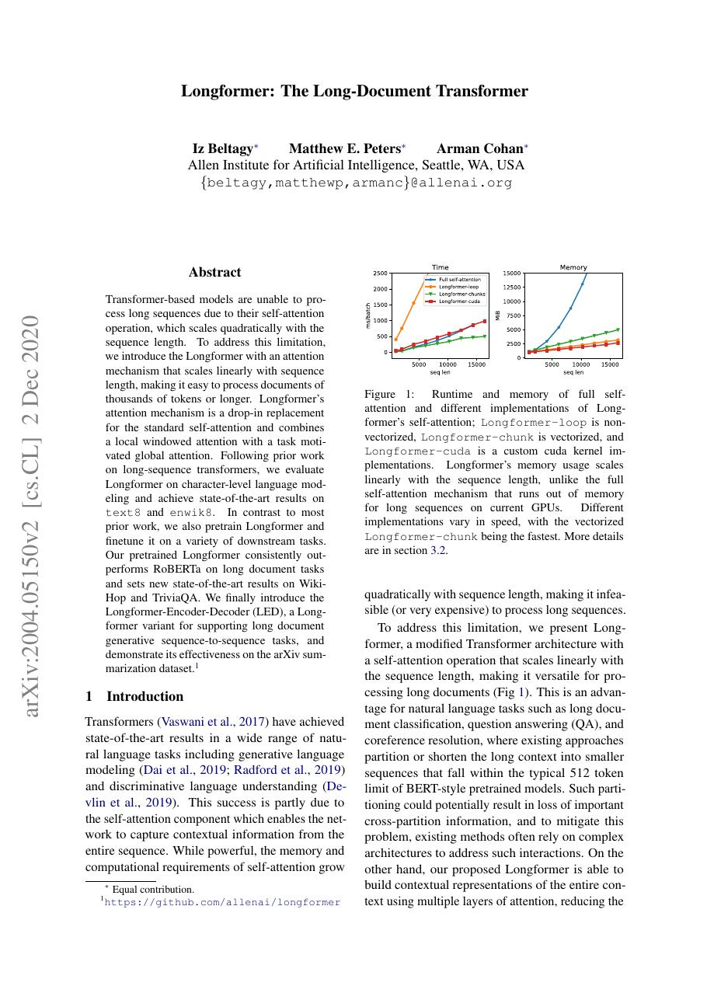
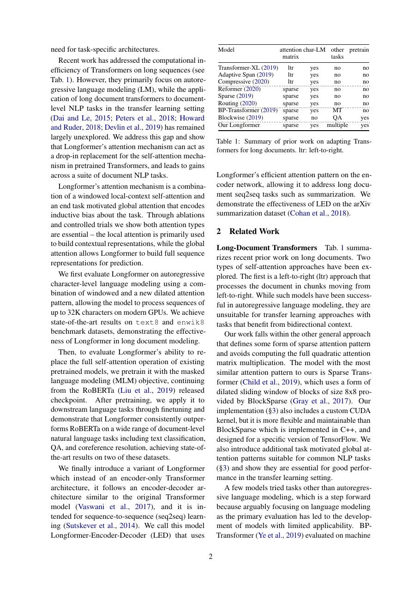
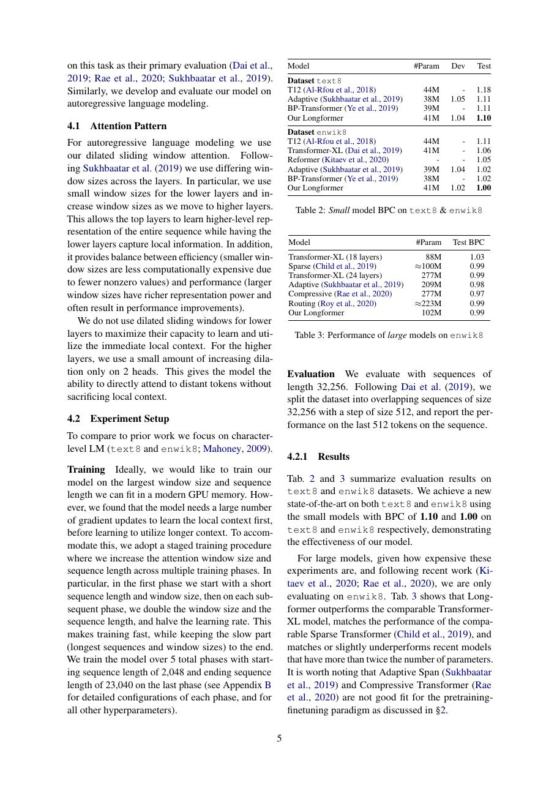
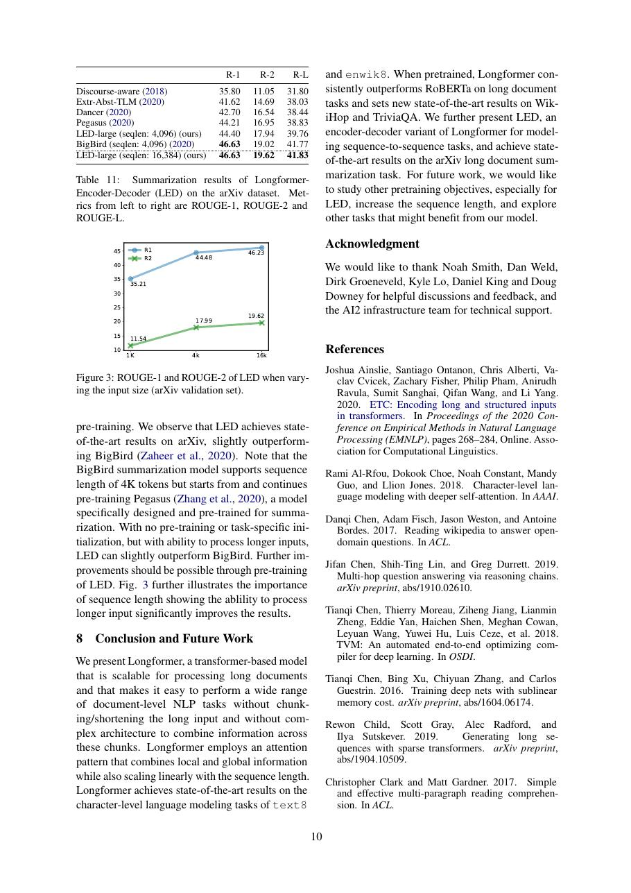

# 论文中文解读：《Longformer: The Long-Document Transformer》

## 一、它解决了什么

Longformer 用局部滑窗 attention 加少量任务相关 global attention，把长文 encoder 的复杂度从平方降为线性。

## 二、核心机制

多数 token 只连接邻近窗口，堆叠层后逐渐扩大感受野；分类 token、问题 token 等可配置为全局连接。dilated window 可进一步扩大覆盖，但不同任务需选择 global pattern。

## 三、为什么成为主线

它证明结构化稀疏 attention 能在文档任务上处理数千 token，并启发 LED 等长文生成模型。

## 四、应该怎样读证据

论文里的结果首先证明方法在当时数据、模型规模、硬件和评测协议下成立。跨年代比较时要统一参数量、训练 tokens、数据质量、上下文长度、推理预算与系统实现，不能只横比单个最佳分数。

## 五、局限与易误读点

局部传播使远距离信息需要多层中转；global token 位置依赖任务知识。理论 O(n) 只有在专用 sparse kernel 下才转化为实际加速。

## 六、放进十年演进史

与 BigBird 的 local+random+global 比较；与 FlashAttention 对照“改稀疏图”与“保持精确 dense attention 但优化 IO”。

## 七、原文入口

[官方论文/页面](https://arxiv.org/abs/2004.05150)

## 八、原文论证链

全局 self-attention 对长度 $n$ 需要 $O(n^2)$ 连接，文档级输入很快不可承受。Longformer 用滑动窗口 attention 捕获局部上下文，并在少数任务相关 token 上设置 global attention，使它们既看见所有位置、也被所有位置看见。局部连接负责语言的近邻结构，全局节点承担跨文档聚合，复杂度近似随长度线性增长。

论文同时给出自回归语言模型和双向预训练/下游任务版本。LED 把这种 encoder 扩展到长文档生成。重要的是 attention pattern 与任务接口配套：分类可令 [CLS] 全局，问答可令问题 token 全局，不能认为任意固定稀疏图都同样有效。

> 原文定位：[PDF 文件第 1 页](paper.pdf#page=1) · [对应截图](rendered_figures/page-1.jpg)

## 九、稀疏模式与复杂度

若每个 token 只关注窗口宽度 $w$，局部边数约 $O(nw)$；再有 $g$ 个全局 token，额外约 $O(ng)$。当 $w,g\ll n$ 时，相比 $O(n^2)$ 显著节省。堆叠多层后信息可逐层传播更远，但纯局部模式中两点建立联系需要与距离相关的层数；全局 token 提供短路径。

论文还使用 dilation 扩大感受野。高效实现不能先生成完整 $n\times n$ 矩阵再 mask，而应直接计算窗口块，否则理论稀疏度不会转化为显存和速度收益。

> 原文定位：[PDF 文件第 2 页](paper.pdf#page=2) · [对应截图](rendered_figures/page-2.jpg)

## 十、实验怎样读

字符级语言建模用于检验长依赖，长文档分类、QA、coreference 等任务验证预训练迁移。比较时要核对最大长度：Longformer 的优势常来自既能处理更多原文，也有适合的稀疏连接。若基线被截断，结果同时证明“更多上下文有用”和“结构能承载它”，不能只归因稀疏算子。

> 原文定位：[PDF 文件第 5 页](paper.pdf#page=5) · [对应截图](rendered_figures/page-5.jpg)

## 十一、复现检查

- 明确每层窗口、是否 dilation、哪些 token 设置 global。
- 检查 global attention 是双向特殊连接，而非普通局部窗口。
- 报告实际峰值显存和吞吐，避免只报理论复杂度。
- 从短上下文 checkpoint 扩展位置 embedding 时记录初始化方法。

## 十二、常见误读

Longformer 不是低秩或线性核近似，它保留 softmax attention 但改变连接图。线性复杂度也不等于常数内存；KV/激活仍随 $n$ 增长。全局 token 的选择包含任务先验。

> 原文定位：[PDF 文件第 10 页](paper.pdf#page=10) · [对应截图](rendered_figures/page-10.jpg)

## 原文证据导航

以下页码按仓库内 PDF 的**文件页码**计，不等同于论文印刷页码。建议先读本节所指原文，再回看上面的中文解释。

- [打开原始 PDF](paper.pdf)
- [打开可检索文本](paper.txt)

| 中文笔记中的证据 | 原文位置 | 复核重点 |
|---|---|---|
| 原文首页、摘要与问题定义 | [PDF 文件第 1 页](paper.pdf#page=1) · [截图](rendered_figures/page-1.jpg) | 回到该页上下文，复核定义、图表或实验论证 |
| 核心方法、架构或算法定义所在关键页 | [PDF 文件第 2 页](paper.pdf#page=2) · [截图](rendered_figures/page-2.jpg) | 回到该页上下文，复核定义、图表或实验论证 |
| 实验、结果或关键分析所在原文页 | [PDF 文件第 5 页](paper.pdf#page=5) · [截图](rendered_figures/page-5.jpg) | 回到该页上下文，复核定义、图表或实验论证 |
| 讨论、结论或补充分析所在原文页 | [PDF 文件第 10 页](paper.pdf#page=10) · [截图](rendered_figures/page-10.jpg) | 回到该页上下文，复核定义、图表或实验论证 |
