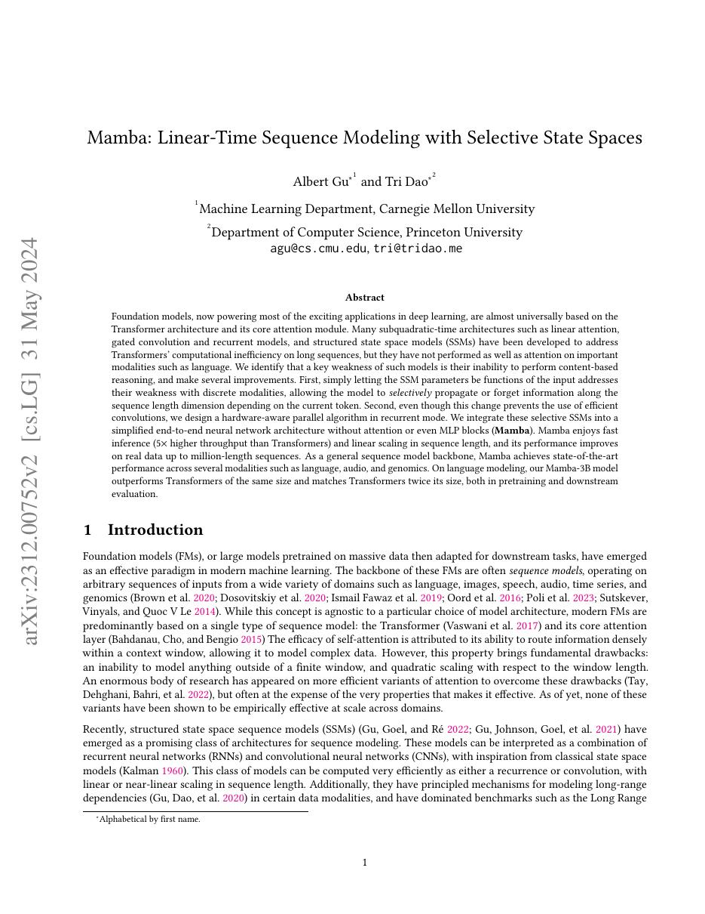
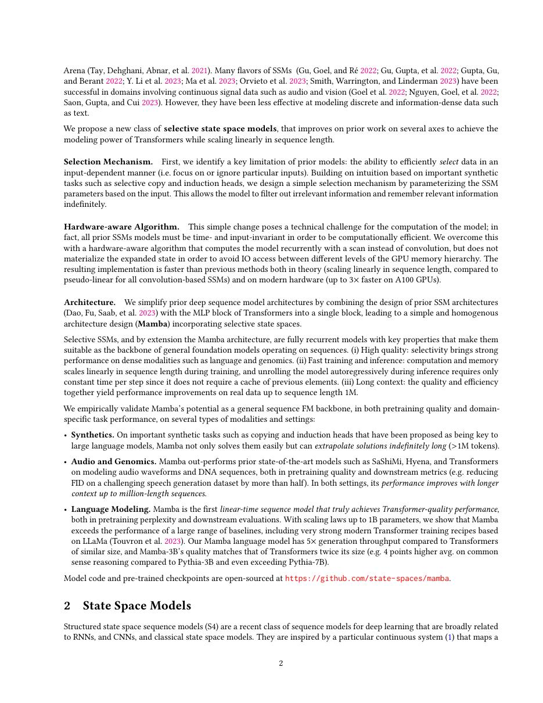
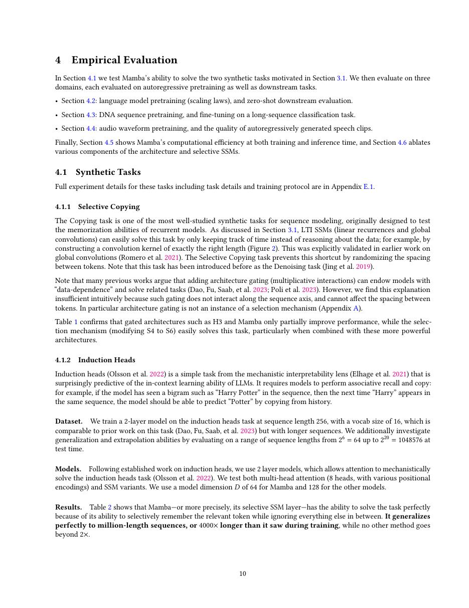
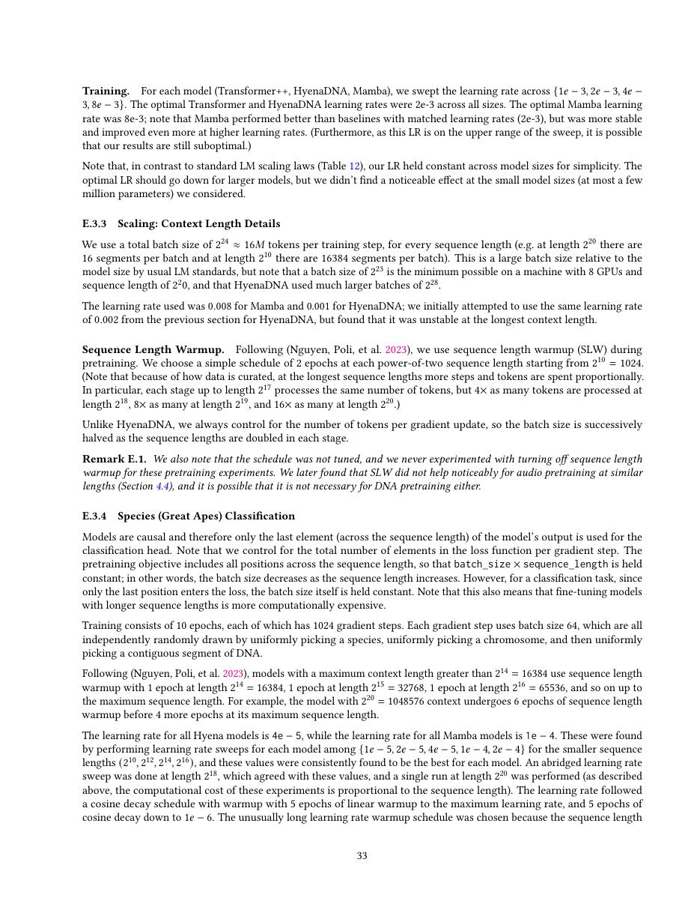

# 论文中文解读：《Mamba: Linear-Time Sequence Modeling with Selective State Spaces》

## 一、它解决了什么

Mamba 用 input-dependent selective SSM 在保持线性序列复杂度的同时实现内容选择，挑战 Transformer attention 的统治地位。

## 二、核心机制

状态更新参数 Δ、B、C 由当前输入生成，使模型能选择写入、保留和读出信息；这破坏固定卷积形式，但可用 parallel scan 训练、recurrent update 推理。硬件感知 fused kernel 避免扩展状态写回 HBM。

## 三、为什么成为主线

它复兴 SSM 路线，并推动 attention/recurrence/structured matrix 的统一研究与混合架构。

## 四、证据应该怎样读

速度、显存、精度或 benchmark 数字只在论文给定的模型、数据、硬件、kernel 版本和评测预算下成立。跨论文比较前要统一训练 tokens、输入长度、batch、精度、采样/思考预算与是否使用工具。

## 五、局限与易误读点

无显式 attention map/KV cache 不等于无限记忆；固定状态容量会压缩历史，精确复制和 in-context retrieval 可能较弱。实际优势依赖专用 scan kernel。

## 六、放进十年演进史

Mamba-2 用 SSD 解释 SSM 与 attention 的矩阵联系并重构高效算法；与 MiniMax Lightning Attention 比较递推状态路线。

## 七、原文入口

[官方论文/页面](https://arxiv.org/abs/2312.00752)

## 八、原文论证链

传统结构化状态空间模型用输入无关的动态，能线性扫描长序列，却不擅长根据当前 token 选择保留或遗忘信息；attention 的内容寻址强，但成本随长度平方增长。Mamba 让 SSM 的步长 $\Delta$、输入矩阵 $B$ 和输出矩阵 $C$ 依赖当前输入，从而获得选择性。输入相关破坏了固定卷积核形式，于是作者设计并行 selective scan，在 GPU 上融合离散化、递推和内存访问。

> 原文定位：[PDF 文件第 1 页](paper.pdf#page=1) · [对应截图](rendered_figures/page-1.jpg)

## 九、选择性 SSM

连续状态模型
$$
h'(t)=Ah(t)+Bx(t),\qquad y(t)=Ch(t)
$$
离散后为
$$
h_t=\bar A_t h_{t-1}+\bar B_t x_t,\qquad y_t=C_t h_t.
$$
Mamba 中 $A$ 具有结构，而 $\Delta_t,B_t,C_t$ 由 $x_t$ 产生。较大/较小 $\Delta_t$ 可改变信息衰减尺度，输入依赖的 $B_t,C_t$ 决定写入和读取哪些通道。

递推在时间上看似顺序，但可表示为关联 scan 并行训练；推理只维护固定大小 state，因此每 token 更新不需读取完整 KV cache。

> 原文定位：[PDF 文件第 2 页](paper.pdf#page=2) · [对应截图](rendered_figures/page-2.jpg)

## 十、实验怎样读

论文用 selective copying 和 induction heads 等合成任务先验证选择能力，再在语言、DNA、音频等任务比较 Transformer 与 SSM。合成任务对应机制诊断，下游 perplexity/准确率对应实用性。线性 scaling 图要结合 kernel 实现；理论 $O(n)$ 不自动快于高度优化的短序列 attention。

> 原文定位：[PDF 文件第 10 页](paper.pdf#page=10) · [对应截图](rendered_figures/page-10.jpg)

## 十一、复现检查

- 离散化、$\Delta$ 参数化和数值范围决定稳定性。
- selective scan 必须避免把全部中间 state 写入 HBM。
- 训练吞吐、prefill 和单 token decode 分开测量。
- 检查 state reset；不同文档之间泄漏状态会造成错误评测。

## 十二、常见误读

Mamba 不是“没有记忆”，而是把随长度增长的 KV cache 换成固定维递归状态；固定状态也意味着信息压缩。它并未证明 attention 对所有任务都多余，精确检索和长上下文泛化仍需单独检验。

> 原文定位：[PDF 文件第 33 页](paper.pdf#page=33) · [对应截图](rendered_figures/page-33.jpg)

## 原文证据导航

以下页码按仓库内 PDF 的**文件页码**计，不等同于论文印刷页码。建议先读本节所指原文，再回看上面的中文解释。

- [打开原始 PDF](paper.pdf)
- [打开可检索文本](paper.txt)

| 中文笔记中的证据 | 原文位置 | 复核重点 |
|---|---|---|
| 原文首页、摘要与问题定义 | [PDF 文件第 1 页](paper.pdf#page=1) · [截图](rendered_figures/page-1.jpg) | 回到该页上下文，复核定义、图表或实验论证 |
| 核心方法、架构或算法定义所在关键页 | [PDF 文件第 2 页](paper.pdf#page=2) · [截图](rendered_figures/page-2.jpg) | 回到该页上下文，复核定义、图表或实验论证 |
| 实验、结果或关键分析所在原文页 | [PDF 文件第 10 页](paper.pdf#page=10) · [截图](rendered_figures/page-10.jpg) | 回到该页上下文，复核定义、图表或实验论证 |
| 讨论、结论或补充分析所在原文页 | [PDF 文件第 33 页](paper.pdf#page=33) · [截图](rendered_figures/page-33.jpg) | 回到该页上下文，复核定义、图表或实验论证 |
