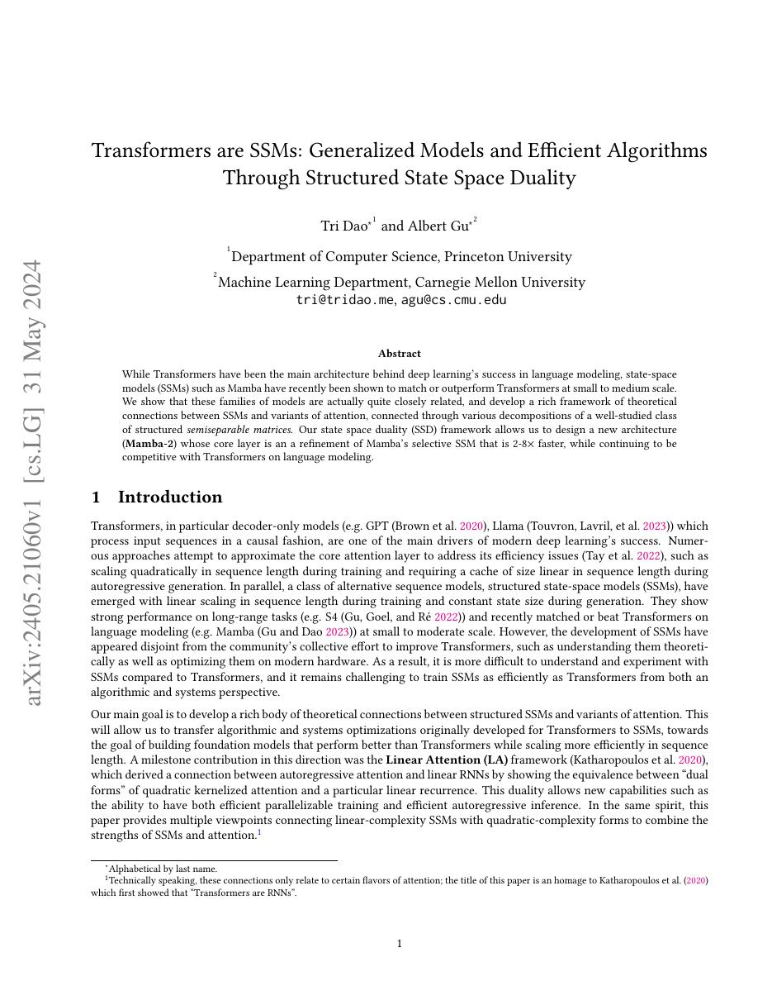
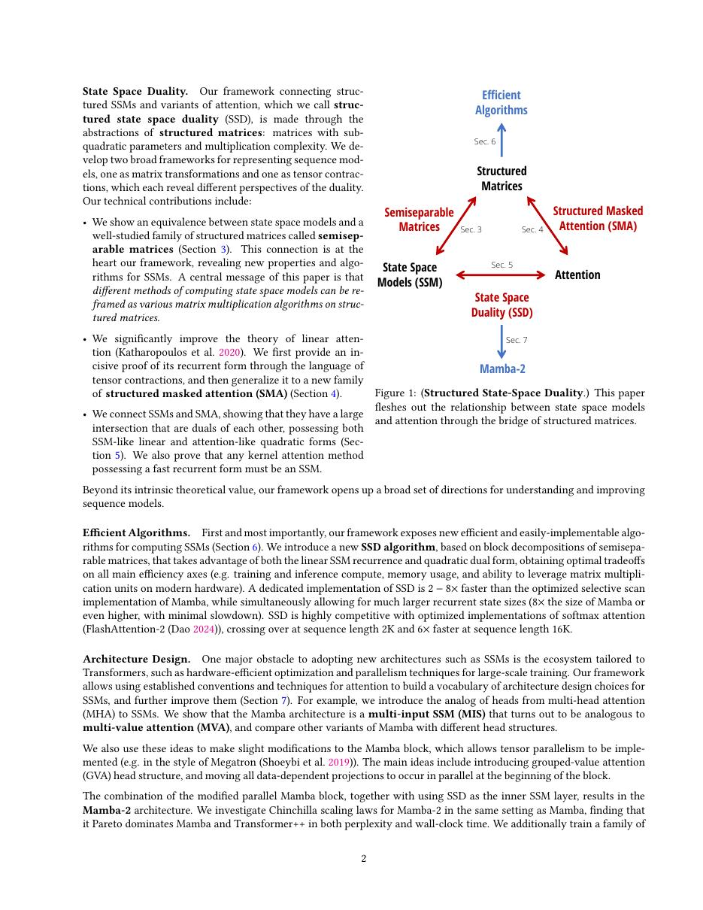
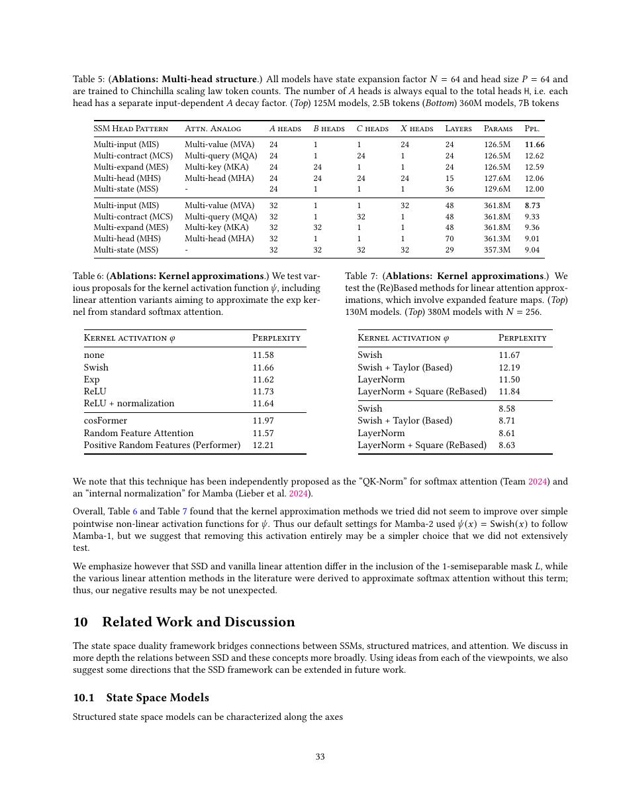
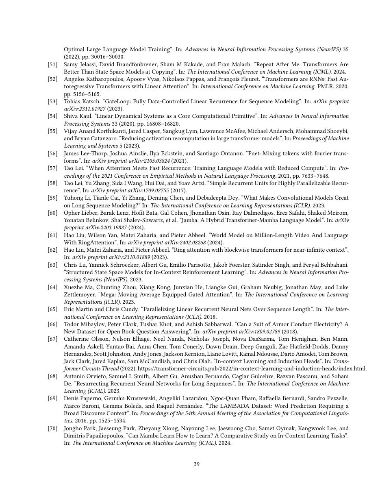

# 论文中文解读：《Transformers are SSMs: Generalized Models and Efficient Algorithms Through Structured State Space Duality》

## 一、它解决了什么

Mamba-2 用 Structured State Space Duality 说明一类 SSM 与结构化 masked attention 是同一半可分矩阵的两种计算方式。

## 二、核心机制

SSD 把序列变换表示为 semiseparable matrix：可用 recurrent/scan 线性执行，也可按 chunk 转成矩阵乘。Mamba-2 采用更受限、head-wise 的标量状态转移，使 tensor core 友好并报告核心层 2–8× 提速。

## 三、为什么成为主线

它提供统一理论语言连接 attention、线性 attention 与 SSM，并把 Mamba 从单一架构提升为算法设计框架。

## 四、证据应该怎样读

速度、显存、精度或 benchmark 数字只在论文给定的模型、数据、硬件、kernel 版本和评测预算下成立。跨论文比较前要统一训练 tokens、输入长度、batch、精度、采样/思考预算与是否使用工具。

## 五、局限与易误读点

层级 microbenchmark 提速不等于端到端模型同倍提速；状态维、chunk size 和 kernel 决定实际效果。大规模 LLM 生态与任务鲁棒性仍不如 Transformer 成熟。

## 六、放进十年演进史

回看 Mamba 的 selectivity，再与 Performer/Lightning Attention 比较不同线性序列算子的状态表达和硬件实现。

## 七、原文入口

[官方论文/页面](https://arxiv.org/abs/2405.21060)

## 八、原文论证链

Mamba-2 从结构化状态空间模型与 attention 的数学联系出发，提出 state space duality（SSD）。某类标量状态转移的 SSM，其序列混合矩阵是结构化半可分（semiseparable）矩阵；同一计算既可按递归/scan 执行，也可按分块矩阵乘执行。作者据此设计更适合 Tensor Core 的算法与模型块，获得比 Mamba-1 更高训练吞吐。

> 原文定位：[PDF 文件第 1 页](paper.pdf#page=1) · [对应截图](rendered_figures/page-1.jpg)

## 九、半可分结构与分块算法

递推
$$
h_t=a_t h_{t-1}+B_tx_t,\qquad y_t=C_th_t
$$
展开后，位置 $i$ 对 $j\le i$ 的权重包含
$$
C_i\left(\prod_{k=j+1}^{i}a_k\right)B_j.
$$
因此整个因果混合矩阵不是任意下三角矩阵，而有低阶半可分结构。SSD 把序列切块：块内用并行矩阵乘计算，跨块只传播压缩 state；这在长序列上兼顾 GEMM 效率与线性复杂度。

Mamba-2 还采用更接近 multi-head 的 state/head 组织，使投影和张量并行更自然。它与 Mamba-1 的 selective scan 目标相同，但硬件映射和参数化不同。

> 原文定位：[PDF 文件第 2 页](paper.pdf#page=2) · [对应截图](rendered_figures/page-2.jpg)

## 十、实验怎样读

论文比较语言建模质量、训练吞吐、长序列 scaling 及不同 state size/chunk size。质量相近时的速度提升支持算法贡献；若参数或训练 token 不同，则不能只由架构命名归因。理论 duality 回答可表示/可计算关系，benchmark 回答具体 GPU 上是否更快。

> 原文定位：[PDF 文件第 33 页](paper.pdf#page=33) · [对应截图](rendered_figures/page-33.jpg)

## 十一、复现检查

- chunk size 是算法与硬件超参数，应做吞吐—显存 sweep。
- 注意状态转移的数值稳定形式和文档边界 reset。
- 张量并行切分需保持 head/state ownership，避免额外 all-reduce。
- 和 attention 比较时分开 prefill、训练与自回归 decode。

## 十二、常见误读

SSD 不是说一般 softmax attention 与任意 SSM 完全等价；等价发生在具有特定半可分结构的序列变换族。Mamba-2 也不是单纯扩大 Mamba-1，而是算法—架构共同重构。

> 原文定位：[PDF 文件第 39 页](paper.pdf#page=39) · [对应截图](rendered_figures/page-39.jpg)

## 原文证据导航

以下页码按仓库内 PDF 的**文件页码**计，不等同于论文印刷页码。建议先读本节所指原文，再回看上面的中文解释。

- [打开原始 PDF](paper.pdf)
- [打开可检索文本](paper.txt)

| 中文笔记中的证据 | 原文位置 | 复核重点 |
|---|---|---|
| 原文首页、摘要与问题定义 | [PDF 文件第 1 页](paper.pdf#page=1) · [截图](rendered_figures/page-1.jpg) | 回到该页上下文，复核定义、图表或实验论证 |
| 核心方法、架构或算法定义所在关键页 | [PDF 文件第 2 页](paper.pdf#page=2) · [截图](rendered_figures/page-2.jpg) | 回到该页上下文，复核定义、图表或实验论证 |
| 实验、结果或关键分析所在原文页 | [PDF 文件第 33 页](paper.pdf#page=33) · [截图](rendered_figures/page-33.jpg) | 回到该页上下文，复核定义、图表或实验论证 |
| 讨论、结论或补充分析所在原文页 | [PDF 文件第 39 页](paper.pdf#page=39) · [截图](rendered_figures/page-39.jpg) | 回到该页上下文，复核定义、图表或实验论证 |
